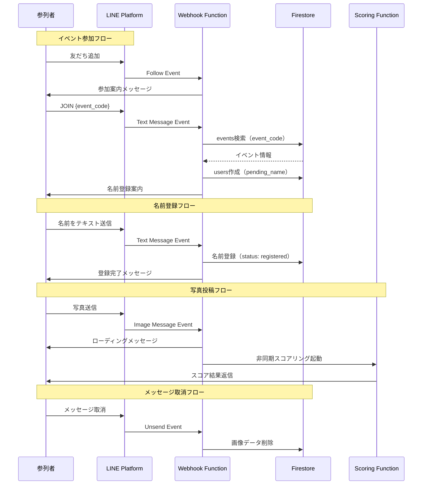

# LINE Bot 設計仕様

## 概要

Wedding Smile CatcherのLINE Botは、参列者が写真を投稿し、スコアを受け取るためのメインインターフェースです。マルチテナント対応により、複数のイベントを同時にサポートします。

## LINE Botの基本情報

### Bot Type
**Messaging API**

### 主要機能
1. イベント参加（JOINコマンド）
2. ユーザー登録（名前の収集）
3. 写真の受信とスコアリング
4. スコア結果の返信
5. ヘルプメッセージの提供
6. メッセージ取消対応（unsend）

## メッセージフロー（マルチテナント対応）



## イベントタイプと処理

### 1. Follow Event（友だち追加）

#### リクエスト例
```json
{
  "type": "follow",
  "timestamp": 1700000000000,
  "source": {
    "type": "user",
    "userId": "U1234567890abcdef"
  },
  "replyToken": "REPLY_TOKEN_EXAMPLE"
}
```

#### 処理内容
1. 参加案内メッセージを送信（JOINコマンドの説明）

#### 返信メッセージ
```
ようこそ！Wedding Smile Catcherへ

イベントに参加するには、主催者から共有された
参加コードを使って
「JOIN 参加コード」と送信してください。

例: JOIN abc12345-6789-...
```

### 2. Text Message Event - JOINコマンド

#### リクエスト例
```json
{
  "type": "message",
  "message": {
    "type": "text",
    "id": "325708",
    "text": "JOIN abc12345-6789-0def-ghij-klmnopqrstuv"
  },
  "timestamp": 1700000000000,
  "source": {
    "type": "user",
    "userId": "U1234567890abcdef"
  },
  "replyToken": "REPLY_TOKEN_EXAMPLE"
}
```

#### 処理内容
1. event_codeでFirestoreのeventsコレクションを検索
2. イベントが見つかり、かつstatus=activeの場合:
   - 他イベントへの参加を解除（複数イベント同時参加防止）
   - usersコレクションにドキュメント作成（ID: `{user_id}_{event_id}`）
   - status: `pending_name`で作成
3. 名前登録案内を送信

#### 返信メッセージ（成功時）
```
🎉 「田中・佐藤結婚式」にご参加いただきありがとうございます！

お名前（フルネーム）をテキストで送信してください。

例: 山田太郎

※お名前はランキング表示に使用されます
※個人情報の取り扱いについてはプライバシーポリシーをご確認ください
```

#### 返信メッセージ（エラー時）
```
参加コードが見つかりません。

コードを確認して、もう一度お試しください。
```

### 3. Text Message Event - 名前登録

`status: pending_name`のユーザーからテキストを受信時

#### リクエスト例
```json
{
  "type": "message",
  "message": {
    "type": "text",
    "id": "325709",
    "text": "山田太郎"
  },
  "timestamp": 1700000000000,
  "source": {
    "type": "user",
    "userId": "U1234567890abcdef"
  },
  "replyToken": "REPLY_TOKEN_EXAMPLE"
}
```

#### 処理内容
1. 名前バリデーション（2-30文字）
2. Firestoreにname保存、status: `registered`に更新
3. consent_timestamp記録（同意タイムスタンプ）
4. 登録完了メッセージ送信

#### 返信メッセージ（登録完了）
```
山田太郎さん、登録完了です！

早速、笑顔の写真を送ってみましょう！

💡 ヒント:
・大人数で写るほど高スコア
・自然な笑顔がポイント
・連写は避けましょう
```

### 4. Image Message Event（画像メッセージ）

#### リクエスト例
```json
{
  "type": "message",
  "message": {
    "type": "image",
    "id": "325710",
    "contentProvider": {
      "type": "line"
    }
  },
  "timestamp": 1700000000000,
  "source": {
    "type": "user",
    "userId": "U1234567890abcdef"
  },
  "replyToken": "REPLY_TOKEN_EXAMPLE"
}
```

#### 処理内容

**未登録ユーザー（registered状態なし）の場合:**
- イベント参加を促すメッセージを送信

**登録済みユーザーの場合:**
1. イベントステータス確認（activeのみ受付）
2. ローディングメッセージ送信
3. LINE Content APIから画像取得
4. Cloud Storageに保存 (`{event_id}/original/{user_id}/{timestamp}_{image_id}.jpg`)
5. 署名付きURL生成
6. Firestoreに画像ドキュメント作成（user_nameデノーマライズ）
7. Scoring Functionを非同期起動

#### 即座の返信（ローディング）
```
📸 画像を受け取りました！

AIが笑顔を分析中...
しばらくお待ちください ⏳
```

### 5. Unsend Event（メッセージ取消）

#### リクエスト例
```json
{
  "type": "unsend",
  "timestamp": 1700000000000,
  "source": {
    "type": "user",
    "userId": "U1234567890abcdef"
  },
  "unsend": {
    "messageId": "325710"
  }
}
```

#### 処理内容
1. `line_message_id`でimagesコレクションを検索
2. 見つかった場合:
   - Cloud Storageから画像削除
   - Firestoreドキュメント削除
   - ユーザー統計更新（best_score再計算）
3. ログ記録

## スコアリング完了後の返信

Scoring Functionが処理完了後、LINE Push Messageで結果を送信。

### 高スコアの場合（300点以上）

```
🎉 素晴らしい笑顔！

総合スコア: 389.3点

😊 5人の笑顔を検出しました！

💬 新郎新婦の目元から溢れる自然な喜びが印象的で、
周囲の参列者との一体感も素晴らしい

「ランキング」と送信すると現在の順位を確認できます！
```

### 通常スコアの場合

```
📸 スコア: 156.2点

😊 2人の笑顔を検出しました！

💬 明るい表情が素敵です

さらに高スコアを目指すには:
・大人数で撮影する
・自然な笑顔を心がける
```

### 類似画像の場合

```
📸 スコア: 28.5点

⚠️ この写真は、以前の投稿と似ています。
連写ではなく、違う構図で撮影してみましょう！

💡 ヒント:
・場所を変える
・メンバーを変える
・ポーズを変える
```

### 顔が検出されない場合

```
❌ 顔が検出できませんでした。

・顔がはっきり写っているか確認
・明るい場所で撮影
・カメラに近づきすぎない

もう一度お試しください！
```

## コマンド一覧

### "ヘルプ" / "help" / "使い方"

使い方ガイドを表示

### "ランキング" / "順位"

現在のトップ3を表示（同一イベント内）

## 環境変数

LINE Bot設定に必要な環境変数:

```bash
LINE_CHANNEL_SECRET=your-channel-secret
LINE_CHANNEL_ACCESS_TOKEN=your-access-token
```

これらはSecret Managerで管理され、Cloud Functionsに自動的に注入。

## レート制限

LINE Messaging APIのレート制限:
- Push Message: 500通/秒
- Reply Message: 無制限（ただしReply Tokenは1回のみ使用可能）

本システムでは主にReply Messageを使用するため、レート制限の心配は不要。

## セキュリティ

### Webhook署名検証

全てのWebhookリクエストはLINE SDKの`WebhookHandler`が自動で署名検証を行う。

### プライバシー保護

- unsend対応: ユーザーがメッセージを取り消すと関連データを完全削除
- 署名付きURL: 画像へのアクセスは期限付きURLでのみ可能
- 同意タイムスタンプ: 名前登録時に記録し、法的要件に対応

## 次のステップ

- [Webhook API仕様](webhook.md)
- [Scoring API仕様](scoring.md)
