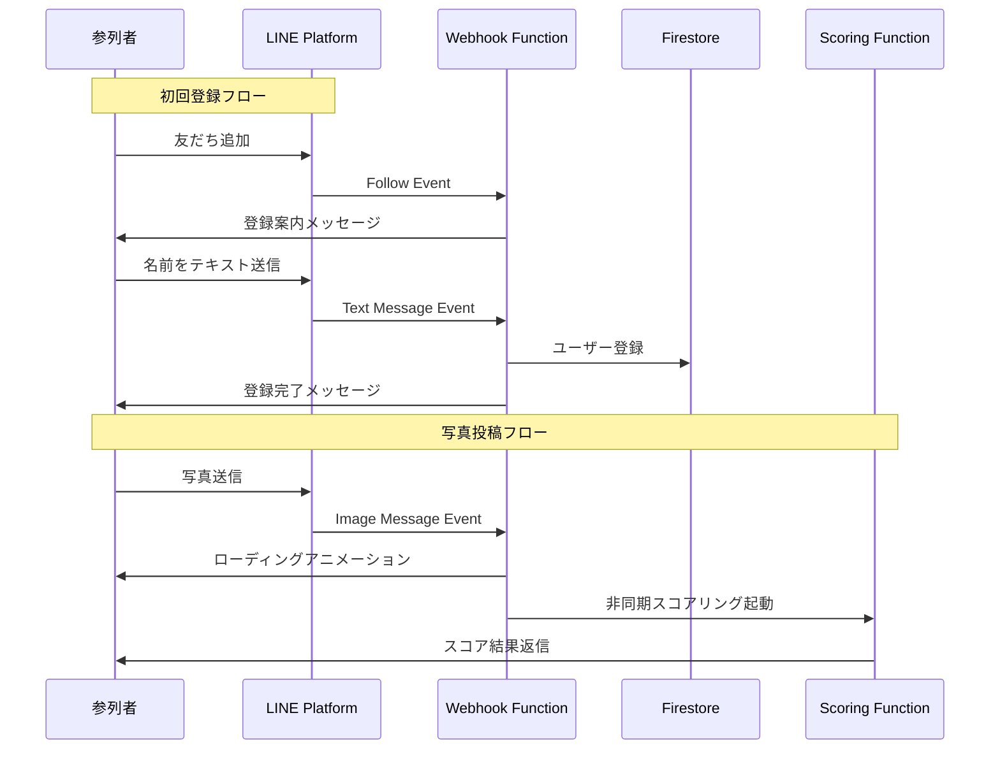

# LINE Bot 設計仕様

## 概要

Wedding Smile CatcherのLINE Botは、参列者が写真を投稿し、スコアを受け取るためのメインインターフェースです。

## LINE Botの基本情報

### Bot Type
**Messaging API**

### 主要機能
1. ユーザー登録（名前の収集）
2. 写真の受信とスコアリング
3. スコア結果の返信
4. ヘルプメッセージの提供

## メッセージフロー



## イベントタイプと処理

### 1. Follow Event（友だち追加）

#### リクエスト例
```json
{
  "type": "follow",
  "timestamp": 1700000000000,
  "source": {
    "type": "user",
    "userId": "U1234567890abcdef"
  },
  "replyToken": "nHuyWiB7yP5Zw52FIkcQobQuGDXCTA"
}
```

#### 処理内容
1. ユーザーIDをFirestoreで検索
2. 未登録の場合、登録案内メッセージを送信

#### 返信メッセージ
```json
{
  "type": "text",
  "text": "ようこそ！Wedding Smile Catcherへ\n\nまずはお名前（フルネーム）をテキストで送信してください。\n例: 山田太郎"
}
```

### 2. Text Message Event（テキストメッセージ）

#### リクエスト例
```json
{
  "type": "message",
  "message": {
    "type": "text",
    "id": "325708",
    "text": "山田太郎"
  },
  "timestamp": 1700000000000,
  "source": {
    "type": "user",
    "userId": "U1234567890abcdef"
  },
  "replyToken": "nHuyWiB7yP5Zw52FIkcQobQuGDXCTA"
}
```

#### 処理内容

**未登録ユーザーの場合:**
1. テキストを名前として登録
2. Firestoreにユーザードキュメント作成
3. 登録完了メッセージを送信

**登録済みユーザーの場合:**
- ヘルプコマンドを判定
  - "ヘルプ", "help", "使い方" → ヘルプメッセージ
  - "ランキング", "順位" → 現在のランキング表示
  - その他 → デフォルトメッセージ

#### 返信メッセージ（登録完了）
```json
{
  "type": "text",
  "text": "山田太郎さん、登録完了です！\n\n早速、笑顔の写真を送ってみましょう！\n\n💡 ヒント:\n・大人数で写るほど高スコア\n・自然な笑顔がポイント\n・連写は避けましょう"
}
```

### 3. Image Message Event（画像メッセージ）

#### リクエスト例
```json
{
  "type": "message",
  "message": {
    "type": "image",
    "id": "325708",
    "contentProvider": {
      "type": "line"
    }
  },
  "timestamp": 1700000000000,
  "source": {
    "type": "user",
    "userId": "U1234567890abcdef"
  },
  "replyToken": "nHuyWiB7yP5Zw52FIkcQobQuGDXCTA"
}
```

#### 処理内容

**未登録ユーザーの場合:**
- 名前登録を促すメッセージを送信

**登録済みユーザーの場合:**
1. ローディングアニメーション送信
2. LINE Content APIから画像取得
3. Cloud Storageに保存
4. Firestoreに画像ドキュメント作成（status: pending）
5. Scoring Functionを非同期起動

#### 即座の返信（ローディング）
```json
{
  "type": "text",
  "text": "📸 画像を受け取りました！\n\nAIが笑顔を分析中...\nしばらくお待ちください ⏳",
  "quickReply": {
    "items": [
      {
        "type": "action",
        "action": {
          "type": "message",
          "label": "ランキングを見る",
          "text": "ランキング"
        }
      }
    ]
  }
}
```

#### スコアリング完了後の返信

**高スコアの場合（300点以上）:**
```json
{
  "type": "flex",
  "altText": "スコア結果",
  "contents": {
    "type": "bubble",
    "header": {
      "type": "box",
      "layout": "vertical",
      "contents": [
        {
          "type": "text",
          "text": "🎉 素晴らしい笑顔！",
          "weight": "bold",
          "size": "xl",
          "color": "#ffffff"
        }
      ],
      "backgroundColor": "#FFD700"
    },
    "body": {
      "type": "box",
      "layout": "vertical",
      "contents": [
        {
          "type": "text",
          "text": "総合スコア",
          "size": "sm",
          "color": "#999999"
        },
        {
          "type": "text",
          "text": "389.3点",
          "size": "xxl",
          "weight": "bold",
          "color": "#FFD700"
        },
        {
          "type": "separator",
          "margin": "md"
        },
        {
          "type": "box",
          "layout": "vertical",
          "margin": "md",
          "contents": [
            {
              "type": "text",
              "text": "AIコメント",
              "size": "xs",
              "color": "#999999"
            },
            {
              "type": "text",
              "text": "新郎新婦の目元から溢れる自然な喜びが印象的で、周囲の参列者との一体感も素晴らしい",
              "wrap": true,
              "margin": "sm"
            }
          ]
        }
      ]
    },
    "footer": {
      "type": "box",
      "layout": "vertical",
      "contents": [
        {
          "type": "button",
          "action": {
            "type": "message",
            "label": "ランキングを見る",
            "text": "ランキング"
          },
          "style": "primary"
        }
      ]
    }
  }
}
```

**類似画像の場合:**
```json
{
  "type": "text",
  "text": "📸 スコア: 28.5点\n\n⚠️ この写真は、以前の投稿と似ています。\n連写ではなく、違う構図で撮影してみましょう！\n\n💡 ヒント:\n・場所を変える\n・メンバーを変える\n・ポーズを変える"
}
```

## ヘルプコマンド

### "ヘルプ" / "help" / "使い方"

```json
{
  "type": "flex",
  "altText": "使い方ガイド",
  "contents": {
    "type": "bubble",
    "header": {
      "type": "box",
      "layout": "vertical",
      "contents": [
        {
          "type": "text",
          "text": "📖 使い方ガイド",
          "weight": "bold",
          "size": "xl",
          "color": "#ffffff"
        }
      ],
      "backgroundColor": "#3B5998"
    },
    "body": {
      "type": "box",
      "layout": "vertical",
      "contents": [
        {
          "type": "text",
          "text": "1️⃣ 笑顔の写真を撮影",
          "weight": "bold",
          "margin": "md"
        },
        {
          "type": "text",
          "text": "大人数で写るほど高スコア！",
          "size": "sm",
          "color": "#999999"
        },
        {
          "type": "text",
          "text": "2️⃣ このBotに送信",
          "weight": "bold",
          "margin": "md"
        },
        {
          "type": "text",
          "text": "AIが笑顔を分析してスコアを返信",
          "size": "sm",
          "color": "#999999"
        },
        {
          "type": "text",
          "text": "3️⃣ ランキング上位を目指そう",
          "weight": "bold",
          "margin": "md"
        },
        {
          "type": "text",
          "text": "式中にスクリーンで発表！",
          "size": "sm",
          "color": "#999999"
        },
        {
          "type": "separator",
          "margin": "lg"
        },
        {
          "type": "text",
          "text": "💡 高スコアのコツ",
          "weight": "bold",
          "margin": "lg"
        },
        {
          "type": "text",
          "text": "・自然な笑顔を心がける\n・大人数で撮影する\n・連写は避ける\n・結婚式らしい雰囲気",
          "size": "sm",
          "wrap": true,
          "margin": "sm"
        }
      ]
    }
  }
}
```

### "ランキング" / "順位"

現在のトップ3を表示（Firestoreから取得）

```json
{
  "type": "flex",
  "altText": "現在のランキング",
  "contents": {
    "type": "bubble",
    "header": {
      "type": "box",
      "layout": "vertical",
      "contents": [
        {
          "type": "text",
          "text": "🏆 現在のランキング",
          "weight": "bold",
          "size": "xl",
          "color": "#ffffff"
        }
      ],
      "backgroundColor": "#FFD700"
    },
    "body": {
      "type": "box",
      "layout": "vertical",
      "contents": [
        {
          "type": "box",
          "layout": "horizontal",
          "contents": [
            {
              "type": "text",
              "text": "🥇",
              "size": "xl",
              "flex": 0
            },
            {
              "type": "box",
              "layout": "vertical",
              "contents": [
                {
                  "type": "text",
                  "text": "山田太郎さん",
                  "weight": "bold"
                },
                {
                  "type": "text",
                  "text": "389.3点",
                  "size": "sm",
                  "color": "#999999"
                }
              ],
              "margin": "sm"
            }
          ]
        }
      ]
    }
  }
}
```

## Webhook署名検証

セキュリティのため、全てのWebhookリクエストはLINEからの正規のリクエストであることを検証する必要があります。

### 検証アルゴリズム（Python）

```python
import hashlib
import hmac
import base64
from flask import Request

def validate_signature(request: Request, channel_secret: str) -> bool:
    """
    Validate LINE webhook signature

    Args:
        request: Flask request object
        channel_secret: LINE Channel Secret

    Returns:
        bool: True if signature is valid
    """
    signature = request.headers.get('X-Line-Signature')
    body = request.get_data(as_text=True)

    hash_digest = hmac.new(
        channel_secret.encode('utf-8'),
        body.encode('utf-8'),
        hashlib.sha256
    ).digest()

    expected_signature = base64.b64encode(hash_digest).decode('utf-8')

    return hmac.compare_digest(signature, expected_signature)
```

## エラーハンドリング

### 画像取得失敗

```json
{
  "type": "text",
  "text": "❌ 画像の取得に失敗しました。\n\nもう一度送信してください。\n\n問題が続く場合はスタッフにお声がけください。"
}
```

### スコアリング失敗

```json
{
  "type": "text",
  "text": "❌ スコアリングに失敗しました。\n\n顔が検出できなかった可能性があります。\n\n・顔がはっきり写っているか確認\n・明るい場所で撮影\n・カメラに近づきすぎない"
}
```

### システムエラー

```json
{
  "type": "text",
  "text": "❌ システムエラーが発生しました。\n\nスタッフに連絡してください。\n\nエラーコード: ERR_500"
}
```

## 環境変数

LINE Bot設定に必要な環境変数（`.env`ファイル）:

```bash
LINE_CHANNEL_SECRET=your-channel-secret
LINE_CHANNEL_ACCESS_TOKEN=your-access-token
```

## レート制限

LINE Messaging APIのレート制限:
- Push Message: 500通/秒
- Reply Message: 無制限（ただしReply Tokenは1回のみ使用可能）

本システムでは主にReply Messageを使用するため、レート制限の心配は不要です。

## テスト方法

### 1. LINE Bot Simulatorを使用
LINE Developersコンソールで提供されるシミュレータでテスト

### 2. ローカルテスト（ngrok使用）
```bash
# ngrokでローカルサーバーを公開
ngrok http 8080

# Webhook URLをngrokのURLに設定
# 例: https://abcd1234.ngrok.io/webhook
```

## 次のステップ

- [Webhook API仕様](webhook.md)
- [Scoring API仕様](scoring.md)
