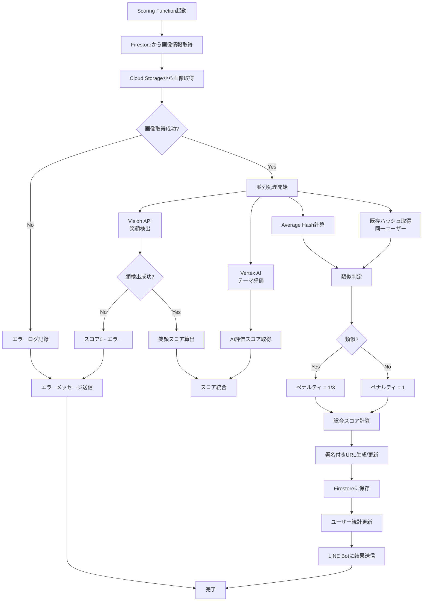

# Scoring API 仕様

## 概要

Scoring APIは、アップロードされた画像を分析し、スコアを算出するCloud Functionです。

## トリガー

### HTTP Trigger

Webhook FunctionからHTTPリクエストで起動

```
POST /scoring
```

## リクエスト

### Headers

| Header | 値 | 必須 |
|--------|------|------|
| `Content-Type` | `application/json` | ✓ |

### Body

```json
{
  "image_id": "uuid-string",
  "user_id": "U1234567890abcdef"
}
```

| フィールド | 型 | 必須 | 説明 |
|----------|------|------|------|
| `image_id` | string | ✓ | 画像ドキュメントID |
| `user_id` | string | ✓ | LINE User ID |

## レスポンス

### 成功時

```json
{
  "status": "success",
  "image_id": "uuid-string",
  "scores": {
    "smile_score": 458.0,
    "ai_score": 85,
    "total_score": 389.3
  },
  "is_similar": false
}
```

### エラー時

```json
{
  "status": "error",
  "error": "No faces detected",
  "image_id": "uuid-string"
}
```

## 処理フロー



## スコアリングアルゴリズム

### 総合スコア計算式

```
Total Score = (Smile Score × AI Score ÷ 100) × Similarity Penalty
```

### 1. 笑顔スコア（Vision API）

Cloud Vision APIで顔検出を行い、各顔の`joy_likelihood`を数値化して合計。

#### joy_likelihoodマッピング

| Likelihood | スコア |
|------------|--------|
| VERY_LIKELY | 95 |
| LIKELY | 75 |
| POSSIBLE | 50 |
| UNLIKELY | 25 |
| VERY_UNLIKELY | 5 |
| UNKNOWN | 0 |

#### 顔サイズ係数

小さい顔（遠景）には係数をかけて調整:

| 顔の面積比率 | 係数 |
|-------------|------|
| 5%以上 | 1.0 |
| 2-5% | 0.7-1.0（補間） |
| 1-2% | 0.4-0.7（補間） |
| 1%未満 | 0.4 |

### 2. AI評価スコア（Vertex AI Gemini）

`gemini-2.5-flash`モデルで画像を評価し、0-100点のスコアとコメントを生成。

#### 評価プロンプト

```
あなたは結婚式写真の専門家です。提供された写真を分析し、
以下の基準に従って評価を行ってください：

## 評価基準（100点満点）
1. 自然さ（30点）- 作り笑いではなく、自然な表情か
2. 幸福度（40点）- 純粋な喜びが表現されているか
3. 周囲との調和（30点）- 周りの人々と笑顔が調和しているか

## 出力形式
JSON形式: {"score": 0-100, "comment": "評価コメント"}
```

### 3. 類似判定（Average Hash）

同一ユーザーの過去画像とAverage Hashで比較し、類似画像を検出。

- ハッシュサイズ: 8x8（64ビット）
- 閾値: ハミング距離 ≤ 8
- ペナルティ: 類似検出時は総合スコア × 1/3

**重要**: 類似判定は同一ユーザー内のみで行う（他ユーザーの画像とは比較しない）

## 実装詳細

### 並列処理

Vision API、Vertex AI、ハッシュ計算をThreadPoolExecutorで並列実行:

```python
from concurrent.futures import ThreadPoolExecutor, as_completed

def score_image(image_id: str, user_id: str):
    # 1. 画像取得
    image_doc = db.collection("images").document(image_id).get()
    storage_path = image_doc.get("storage_path")
    image_bytes = download_image_from_storage(storage_path)

    # 2. 並列処理
    with ThreadPoolExecutor(max_workers=4) as executor:
        futures = {
            executor.submit(generate_scores_with_vision_api, image_bytes): "vision",
            executor.submit(evaluate_theme, image_bytes): "gemini",
            executor.submit(calculate_average_hash, image_bytes): "hash",
            executor.submit(get_existing_hashes_for_user, user_id, event_id): "existing_hashes",
        }

        results = {}
        for future in as_completed(futures):
            key = futures[future]
            results[key] = future.result()

    # 3. 類似判定
    is_similar = is_similar_image(results["hash"], results["existing_hashes"])

    # 4. スコア計算
    smile_score = results["vision"]["smile_score"]
    ai_score = results["gemini"]["score"]
    penalty = 0.33 if is_similar else 1.0
    total_score = (smile_score * ai_score / 100) * penalty

    return {
        "smile_score": smile_score,
        "ai_score": ai_score,
        "total_score": total_score,
        "comment": results["gemini"]["comment"],
        "face_count": results["vision"]["face_count"],
        "is_similar": is_similar,
        "average_hash": results["hash"],
    }
```

### 署名付きURL生成

スコアリング完了時に署名付きURLを生成/更新:

```python
def generate_signed_url(bucket_name: str, storage_path: str) -> tuple[str, datetime]:
    """Generate signed URL for Cloud Storage object."""
    bucket = storage_client.bucket(bucket_name)
    blob = bucket.blob(storage_path)

    expiration_hours = 168  # 7 days
    expiration = timedelta(hours=expiration_hours)
    expiration_time = datetime.utcnow() + expiration

    url = blob.generate_signed_url(
        version="v4",
        expiration=expiration,
        method="GET",
    )
    return url, expiration_time
```

### Firestore更新（トランザクション）

```python
@firestore.transactional
def _update_image_and_user_stats(transaction, image_ref, user_ref, scores, signed_url, expiration):
    """Update image document and user stats atomically."""

    # Update image document
    transaction.update(image_ref, {
        "smile_score": scores["smile_score"],
        "ai_score": scores["ai_score"],
        "total_score": scores["total_score"],
        "comment": scores["comment"],
        "face_count": scores["face_count"],
        "is_similar": scores["is_similar"],
        "average_hash": scores["average_hash"],
        "status": "completed",
        "scored_at": firestore.SERVER_TIMESTAMP,
        "storage_url": signed_url,
        "storage_url_expires_at": expiration,
    })

    # Update user stats
    user_doc = user_ref.get(transaction=transaction)
    current_best = user_doc.get("best_score") or 0.0
    current_uploads = user_doc.get("total_uploads") or 0

    transaction.update(user_ref, {
        "total_uploads": current_uploads + 1,
        "best_score": max(current_best, scores["total_score"]),
    })
```

### LINE結果送信

```python
def send_result_to_line(user_id: str, scores: dict, face_count: int, comment: str):
    """Send scoring result to LINE user."""
    total_score = scores["total_score"]
    is_similar = scores["is_similar"]

    if is_similar:
        text = f"📸 スコア: {total_score:.1f}点\n\n" \
               "⚠️ この写真は以前の投稿と似ています。\n" \
               "連写ではなく、違う構図で撮影してみましょう！"
    elif total_score >= 300:
        text = f"🎉 素晴らしい笑顔！\n\n" \
               f"総合スコア: {total_score:.1f}点\n\n" \
               f"😊 {face_count}人の笑顔を検出しました！\n\n" \
               f"💬 {comment}"
    else:
        text = f"📸 スコア: {total_score:.1f}点\n\n" \
               f"😊 {face_count}人の笑顔を検出しました！\n\n" \
               f"💬 {comment}"

    messaging_api.push_message(
        PushMessageRequest(to=user_id, messages=[TextMessage(text=text)])
    )
```

## エラーハンドリング

### 顔が検出されない場合

```python
if face_count == 0:
    # Update status as error
    image_ref.update({
        "status": "error",
        "error_message": "No faces detected"
    })

    # Send error message to user
    send_error_to_line(
        user_id,
        "❌ 顔が検出できませんでした。\n\n"
        "・顔がはっきり写っているか確認\n"
        "・明るい場所で撮影\n"
        "・カメラに近づきすぎない"
    )
```

### APIエラー（リトライあり）

Vision APIとVertex AIはそれぞれ指数バックオフでリトライ:

```python
@retry(
    stop=stop_after_attempt(3),
    wait=wait_exponential(multiplier=1, min=1, max=10),
    retry=retry_if_exception_type((Exception,))
)
def generate_scores_with_vision_api(image_bytes: bytes) -> dict:
    # Vision API call with retry
    ...
```

## 環境変数

```bash
LINE_CHANNEL_ACCESS_TOKEN=your-access-token
GCP_PROJECT_ID=your-project-id
GCP_REGION=asia-northeast1
STORAGE_BUCKET=wedding-smile-images-{project-id}
```

## デプロイ

GitHub Actionsで自動デプロイ。手動の場合:

```bash
gcloud functions deploy scoring \
  --gen2 \
  --runtime=python311 \
  --region=asia-northeast1 \
  --source=src/functions/scoring \
  --entry-point=scoring \
  --trigger-http \
  --timeout=300s \
  --memory=1GB \
  --service-account=scoring-function@{project-id}.iam.gserviceaccount.com
```

## パフォーマンス

### 処理時間目安

| 処理 | 時間 |
|-----|------|
| 画像ダウンロード | ~100ms |
| Vision API | ~500-1000ms |
| Vertex AI (Gemini) | ~1000-2000ms |
| Average Hash | ~50ms |
| Firestore更新 | ~100ms |
| **合計** | **~2-3秒** |

並列処理により、Vision APIとVertex AIの呼び出しが同時に行われるため、
シーケンシャル実行より約1秒短縮。

## 次のステップ

- [Webhook API仕様](webhook.md)
- [LINE Bot設計](line-bot.md)
