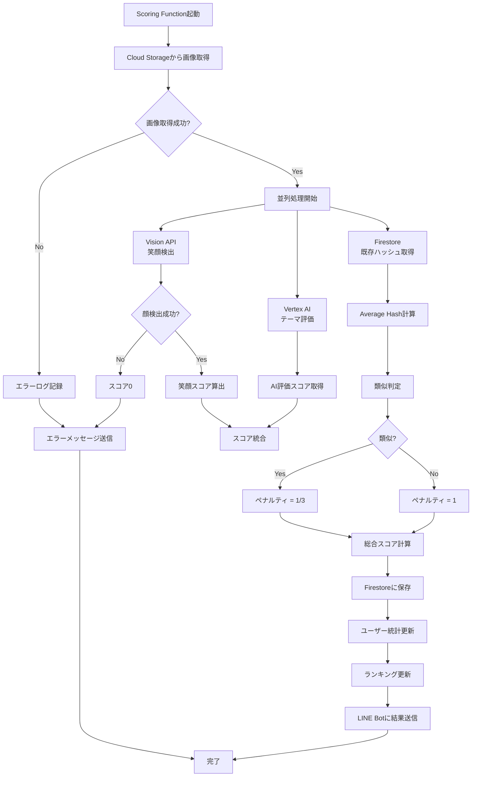

# Scoring API 仕様

## 概要

Scoring APIは、アップロードされた画像を分析し、スコアを算出するCloud Functionです。

## トリガー

### HTTP Trigger（推奨）

Webhook FunctionからHTTPリクエストで起動

```
POST /scoring
```

### Pub/Sub Trigger（代替案）

Cloud Storageイベントまたはメッセージキューからトリガー

## リクエスト

### Headers

| Header | 値 | 必須 |
|--------|------|------|
| `Content-Type` | `application/json` | ✓ |

### Body

```json
{
  "image_id": "uuid-string",
  "user_id": "user_001"
}
```

| フィールド | 型 | 必須 | 説明 |
|----------|------|------|------|
| `image_id` | string | ✓ | 画像ドキュメントID |
| `user_id` | string | ✓ | ユーザーID |

## レスポンス

### 成功時

```json
{
  "status": "success",
  "image_id": "uuid-string",
  "scores": {
    "smile_score": 458.0,
    "ai_score": 85,
    "total_score": 389.3
  },
  "is_similar": false
}
```

### エラー時

```json
{
  "status": "error",
  "error": "No faces detected",
  "image_id": "uuid-string"
}
```

## 処理フロー



## 実装詳細

### 1. 画像取得

```python
from google.cloud import storage

async def get_image_from_storage(storage_path: str) -> bytes:
    """
    Get image from Cloud Storage

    Args:
        storage_path: Path in Cloud Storage

    Returns:
        bytes: Image binary data

    Raises:
        Exception: If image not found
    """
    storage_client = storage.Client()
    bucket = storage_client.bucket(os.environ['STORAGE_BUCKET'])
    blob = bucket.blob(storage_path)

    if not blob.exists():
        raise Exception(f"Image not found: {storage_path}")

    return blob.download_as_bytes()
```

### 2. 笑顔スコア算出

```python
from google.cloud import vision

async def calculate_smile_score(image_bytes: bytes) -> dict:
    """
    Calculate smile score using Cloud Vision API

    Args:
        image_bytes: Image binary data

    Returns:
        dict: {
            'smile_score': float,
            'face_count': int,
            'faces': list
        }

    Raises:
        Exception: If API call fails
    """
    client = vision.ImageAnnotatorClient()
    image = vision.Image(content=image_bytes)

    response = client.face_detection(image=image)

    if response.error.message:
        raise Exception(f"Vision API error: {response.error.message}")

    faces = response.face_annotations
    face_count = len(faces)

    if face_count == 0:
        return {
            'smile_score': 0,
            'face_count': 0,
            'faces': []
        }

    # Likelihood mapping
    likelihood_scores = {
        vision.Likelihood.VERY_LIKELY: 95,
        vision.Likelihood.LIKELY: 75,
        vision.Likelihood.POSSIBLE: 50,
        vision.Likelihood.UNLIKELY: 25,
        vision.Likelihood.VERY_UNLIKELY: 5,
        vision.Likelihood.UNKNOWN: 0
    }

    total_smile_score = 0
    face_details = []

    for face in faces:
        joy_score = likelihood_scores.get(face.joy_likelihood, 0)
        total_smile_score += joy_score

        face_details.append({
            'joy_likelihood': face.joy_likelihood.name,
            'joy_score': joy_score,
            'confidence': face.detection_confidence
        })

    return {
        'smile_score': total_smile_score,
        'face_count': face_count,
        'faces': face_details
    }
```

### 3. AI評価

```python
from vertexai.generative_models import GenerativeModel, Part, Image

THEME_EVALUATION_PROMPT = """
あなたは結婚式写真の専門家です。提供された写真を分析し、以下の基準に従って笑顔の評価を行ってください：

## 分析対象
- 新郎新婦を中心に、写真に写っている全ての人物の表情を評価
- グループショットの場合は、全体的な雰囲気も考慮

## 評価基準（100点満点）
1. 自然さ（30点）
   - 作り笑いではなく、自然な表情かどうか
   - 緊張が感じられず、リラックスしているか

2. 幸福度（40点）
   - 純粋な喜びが表現されているか
   - 目が笑っているか

3. 周囲との調和（30点）
   - 周りの人々と笑顔が調和しているか
   - 場面に相応しい表情の大きさか

## 出力
JSON形式でscoreとcommentのキーで返却する。JSONのみを出力すること。

例:
{
  "score": 85,
  "comment": "新郎新婦の目元から溢れる自然な喜びが印象的で、周囲の参列者との一体感も素晴らしい"
}
"""

async def evaluate_theme(image_bytes: bytes) -> dict:
    """
    Evaluate image theme using Vertex AI

    Args:
        image_bytes: Image binary data

    Returns:
        dict: {
            'score': int,
            'comment': str
        }

    Raises:
        Exception: If API call fails
    """
    import json

    model = GenerativeModel(os.environ.get('VERTEX_AI_MODEL', 'gemini-1.5-flash'))

    image_part = Part.from_data(image_bytes, mime_type='image/jpeg')

    try:
        response = model.generate_content([
            image_part,
            THEME_EVALUATION_PROMPT
        ])

        # Parse JSON response
        result = json.loads(response.text)

        return {
            'score': int(result['score']),
            'comment': str(result['comment'])
        }
    except json.JSONDecodeError as e:
        logging.error(f"Failed to parse Gemini response: {e}")
        # Fallback
        return {
            'score': 50,
            'comment': '評価に失敗しました'
        }
    except Exception as e:
        logging.error(f"Vertex AI error: {e}")
        raise
```

### 4. Average Hash計算と類似判定

```python
from PIL import Image
import imagehash
import io

def calculate_average_hash(image_bytes: bytes) -> str:
    """
    Calculate Average Hash

    Args:
        image_bytes: Image binary data

    Returns:
        str: Hash string (hex)
    """
    img = Image.open(io.BytesIO(image_bytes))
    hash_value = imagehash.average_hash(img, hash_size=8)
    return str(hash_value)


async def is_similar_image(new_hash: str, threshold: int = 8) -> bool:
    """
    Check if image is similar to existing images

    Args:
        new_hash: Hash of new image
        threshold: Hamming distance threshold

    Returns:
        bool: True if similar image exists
    """
    # Get all existing hashes from Firestore
    images_ref = db.collection('images').where('status', '==', 'completed')
    existing_images = images_ref.stream()

    new_hash_obj = imagehash.hex_to_hash(new_hash)

    for doc in existing_images:
        existing_hash_str = doc.get('average_hash')
        if not existing_hash_str:
            continue

        existing_hash_obj = imagehash.hex_to_hash(existing_hash_str)
        hamming_distance = new_hash_obj - existing_hash_obj

        if hamming_distance <= threshold:
            logging.info(f"Similar image found: distance={hamming_distance}")
            return True

    return False
```

### 5. スコア統合

```python
def calculate_total_score(
    smile_score: float,
    ai_score: int,
    is_similar: bool
) -> float:
    """
    Calculate total score

    Formula:
        total_score = (smile_score * ai_score / 100) * penalty

    Args:
        smile_score: Smile score from Vision API
        ai_score: AI evaluation score (0-100)
        is_similar: True if similar image detected

    Returns:
        float: Total score
    """
    penalty = float(os.environ.get('SIMILARITY_PENALTY', '0.33')) if is_similar else 1.0

    total_score = (smile_score * ai_score / 100) * penalty

    return round(total_score, 2)
```

### 6. Firestoreへの保存

```python
async def save_score_to_firestore(
    image_id: str,
    user_id: str,
    smile_score: float,
    ai_score: int,
    total_score: float,
    comment: str,
    average_hash: str,
    is_similar: bool,
    face_count: int
):
    """
    Save score to Firestore

    Args:
        image_id: Image document ID
        user_id: User ID
        smile_score: Smile score
        ai_score: AI evaluation score
        total_score: Total score
        comment: AI comment
        average_hash: Image hash
        is_similar: Similar flag
        face_count: Number of detected faces
    """
    # Update image document
    image_ref = db.collection('images').document(image_id)
    image_ref.update({
        'smile_score': smile_score,
        'ai_score': ai_score,
        'total_score': total_score,
        'comment': comment,
        'average_hash': average_hash,
        'is_similar': is_similar,
        'face_count': face_count,
        'status': 'completed',
        'scored_at': firestore.SERVER_TIMESTAMP
    })

    # Update user statistics
    user_ref = db.collection('users').document(user_id)
    user_doc = user_ref.get()

    if user_doc.exists:
        current_best = user_doc.get('best_score', 0)
        new_best = max(current_best, total_score)

        user_ref.update({
            'total_uploads': firestore.Increment(1),
            'best_score': new_best
        })
```

### 7. LINE Botへの結果送信

```python
from linebot import LineBotApi
from linebot.models import TextSendMessage, FlexSendMessage

async def send_score_result(
    user_id: str,
    total_score: float,
    comment: str,
    is_similar: bool
):
    """
    Send score result to LINE user

    Args:
        user_id: User ID
        total_score: Total score
        comment: AI comment
        is_similar: Similar flag
    """
    line_bot_api = LineBotApi(os.environ['LINE_CHANNEL_ACCESS_TOKEN'])

    # Get user's LINE user ID
    user_ref = db.collection('users').document(user_id)
    user = user_ref.get()

    if not user.exists:
        logging.error(f"User not found: {user_id}")
        return

    line_user_id = user.get('line_user_id')

    if is_similar:
        # Send warning message for similar image
        message = TextSendMessage(
            text=f"📸 スコア: {total_score}点\n\n"
                 f"⚠️ この写真は、以前の投稿と似ています。\n"
                 f"連写ではなく、違う構図で撮影してみましょう！"
        )
    elif total_score >= 300:
        # Send high score with Flex Message
        message = create_high_score_flex_message(total_score, comment)
    else:
        # Send normal score
        message = TextSendMessage(
            text=f"📸 スコア: {total_score}点\n\n"
                 f"💬 {comment}"
        )

    try:
        line_bot_api.push_message(line_user_id, message)
    except Exception as e:
        logging.error(f"Failed to send message: {e}")
```

## 並列処理の実装

Vision API、Vertex AI、ハッシュ取得を並列実行してレイテンシを削減

```python
import asyncio

async def score_image_parallel(image_id: str, user_id: str, image_bytes: bytes):
    """
    Score image with parallel processing

    Args:
        image_id: Image ID
        user_id: User ID
        image_bytes: Image binary data

    Returns:
        dict: Scoring results
    """
    # Run tasks in parallel
    smile_task = asyncio.create_task(calculate_smile_score(image_bytes))
    ai_task = asyncio.create_task(evaluate_theme(image_bytes))
    hash_calc = calculate_average_hash(image_bytes)  # Sync function

    # Wait for all tasks
    smile_result, ai_result = await asyncio.gather(smile_task, ai_task)

    # Check similarity
    is_similar = await is_similar_image(hash_calc)

    # Calculate total score
    total_score = calculate_total_score(
        smile_result['smile_score'],
        ai_result['score'],
        is_similar
    )

    return {
        'smile_score': smile_result['smile_score'],
        'face_count': smile_result['face_count'],
        'ai_score': ai_result['score'],
        'comment': ai_result['comment'],
        'total_score': total_score,
        'average_hash': hash_calc,
        'is_similar': is_similar
    }
```

## エラーハンドリング

### 顔が検出されない場合

```python
if face_count == 0:
    # Update status as error
    image_ref.update({
        'status': 'error',
        'error_message': 'No faces detected'
    })

    # Send error message to user
    await send_error_message(
        user_id,
        "❌ 顔が検出できませんでした。\n\n"
        "・顔がはっきり写っているか確認\n"
        "・明るい場所で撮影\n"
        "・カメラに近づきすぎない"
    )
```

### APIエラー

```python
try:
    response = client.face_detection(image=image)
except Exception as e:
    logging.error(f"Vision API error: {e}")
    # Fallback or retry logic
```

## 環境変数

`.env`ファイルで以下を設定：

```bash
GCP_PROJECT_ID=your-project-id
STORAGE_BUCKET=wedding-smile-images
VERTEX_AI_MODEL=gemini-1.5-flash
SIMILARITY_THRESHOLD=8
SIMILARITY_PENALTY=0.33
LINE_CHANNEL_ACCESS_TOKEN=your-access-token
```

## デプロイ

```bash
gcloud functions deploy scoring \
  --gen2 \
  --runtime=python311 \
  --region=asia-northeast1 \
  --source=. \
  --entry-point=scoring \
  --trigger-http \
  --timeout=300s \
  --memory=1GB \
  --set-env-vars="GCP_PROJECT_ID=${GCP_PROJECT_ID},STORAGE_BUCKET=${STORAGE_BUCKET}"
```

## 次のステップ

- [Frontend API仕様](frontend.md)
- [Webhook API仕様](webhook.md)
