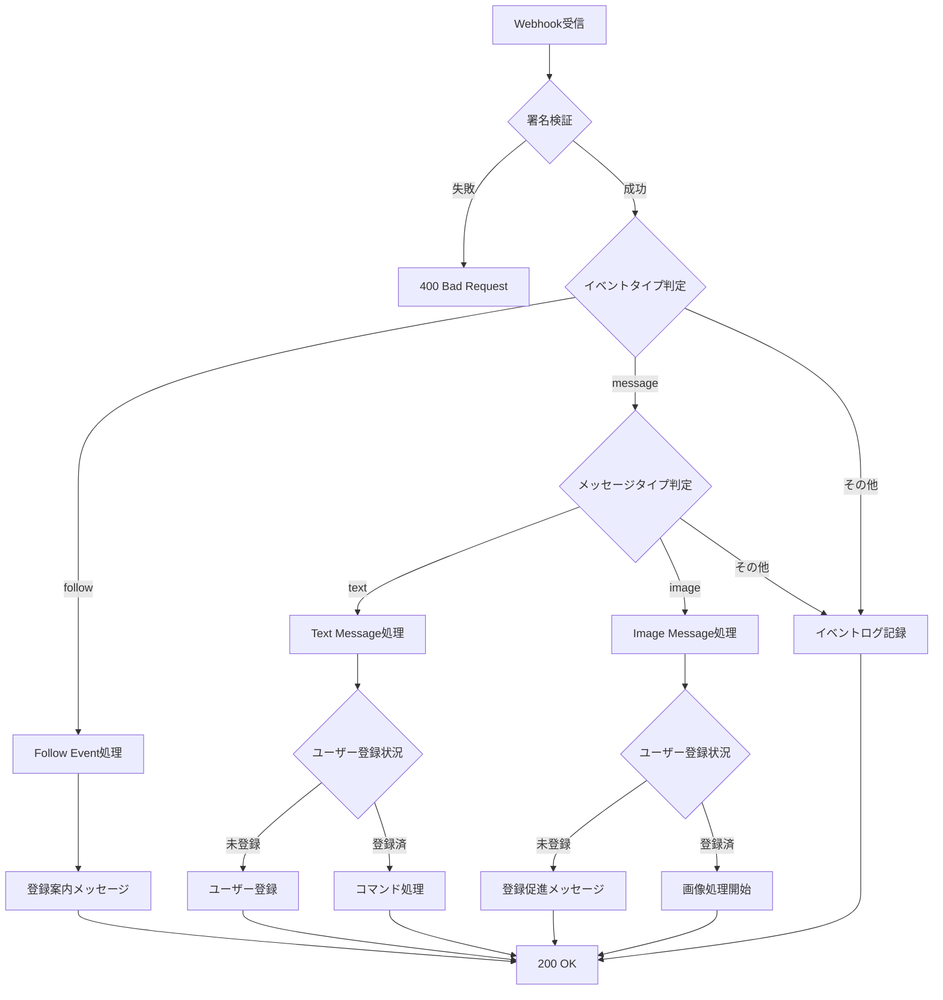
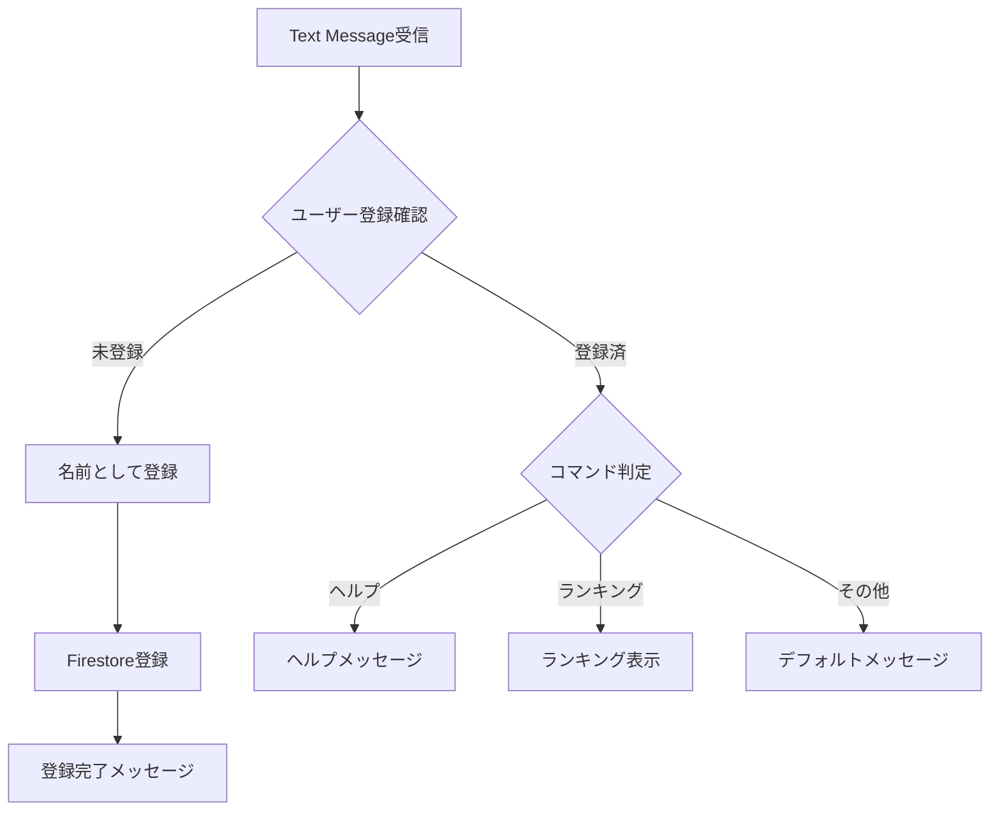
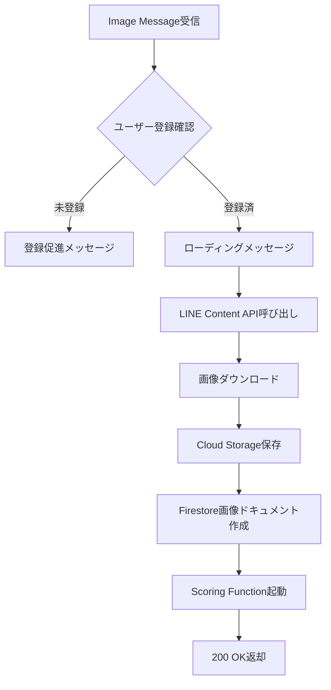

# Webhook API 仕様

## 概要

Webhook APIは、LINE Messaging APIからのイベントを受信し、適切な処理を行うCloud Functionです。

## エンドポイント

```
POST /webhook
```

**Cloud Function URL例:**
```
https://asia-northeast1-{project-id}.cloudfunctions.net/webhook
```

## リクエスト

### Headers

| Header | 値 | 必須 | 説明 |
|--------|------|------|------|
| `Content-Type` | `application/json` | ✓ | JSONフォーマット |
| `X-Line-Signature` | SHA256署名 | ✓ | Webhook検証用 |

### Body

LINE Messaging APIの[Webhook Event Objects](https://developers.line.biz/ja/reference/messaging-api/#webhook-event-objects)に準拠

```json
{
  "destination": "xxxxxxxxxx",
  "events": [
    {
      "type": "message | follow | unfollow | ...",
      "message": {...},
      "timestamp": 1234567890123,
      "source": {
        "type": "user",
        "userId": "U1234567890abcdef"
      },
      "replyToken": "nHuyWiB7yP5Zw52FIkcQobQuGDXCTA"
    }
  ]
}
```

## レスポンス

### 成功時

```
Status: 200 OK
Content-Type: application/json

{
  "status": "ok"
}
```

### エラー時

```
Status: 400 Bad Request
Content-Type: application/json

{
  "error": "Invalid signature"
}
```

## 処理フロー



## イベント別処理詳細

### 1. Follow Event

ユーザーがBotを友だち追加したとき

#### 処理内容

```python
async def handle_follow_event(event):
    """
    Handle follow event

    Args:
        event: LINE follow event object

    Returns:
        None
    """
    user_id = event['source']['userId']

    # Check if user exists in Firestore
    user_ref = db.collection('users').document(user_id)
    user = user_ref.get()

    if not user.exists:
        # Send registration guide
        reply_message(
            event['replyToken'],
            {
                'type': 'text',
                'text': 'ようこそ！Wedding Smile Catcherへ\n\n'
                       'まずはお名前（フルネーム）をテキストで送信してください。\n'
                       '例: 山田太郎'
            }
        )
```

### 2. Text Message Event

テキストメッセージ受信時

#### 処理フロー



#### 実装例

```python
async def handle_text_message(event):
    """
    Handle text message event

    Args:
        event: LINE message event object

    Returns:
        None
    """
    user_id = event['source']['userId']
    text = event['message']['text']
    reply_token = event['replyToken']

    # Check if user is registered
    user_ref = db.collection('users').document(user_id)
    user = user_ref.get()

    if not user.exists:
        # Register user with name
        user_ref.set({
            'name': text,
            'line_user_id': user_id,
            'created_at': firestore.SERVER_TIMESTAMP,
            'total_uploads': 0,
            'best_score': 0
        })

        reply_message(reply_token, {
            'type': 'text',
            'text': f'{text}さん、登録完了です！\n\n'
                   '早速、笑顔の写真を送ってみましょう！'
        })
    else:
        # Handle commands
        if text in ['ヘルプ', 'help', '使い方']:
            reply_message(reply_token, get_help_message())
        elif text in ['ランキング', '順位']:
            reply_message(reply_token, await get_ranking_message())
        else:
            reply_message(reply_token, {
                'type': 'text',
                'text': '写真を送信してスコアを取得しましょう！\n\n'
                       '「ヘルプ」と送信すると使い方を確認できます。'
            })
```

### 3. Image Message Event

画像メッセージ受信時

#### 処理フロー



#### 実装例

```python
import uuid
from google.cloud import storage
from linebot import LineBotApi

async def handle_image_message(event):
    """
    Handle image message event

    Args:
        event: LINE message event object

    Returns:
        None
    """
    user_id = event['source']['userId']
    message_id = event['message']['id']
    reply_token = event['replyToken']

    # Check if user is registered
    user_ref = db.collection('users').document(user_id)
    user = user_ref.get()

    if not user.exists:
        reply_message(reply_token, {
            'type': 'text',
            'text': 'まずはお名前を登録してください。\n\n'
                   'お名前（フルネーム）をテキストで送信してください。'
        })
        return

    # Send loading message
    reply_message(reply_token, {
        'type': 'text',
        'text': '📸 画像を受け取りました！\n\n'
               'AIが笑顔を分析中...\n'
               'しばらくお待ちください ⏳'
    })

    # Download image from LINE
    line_bot_api = LineBotApi(os.environ['LINE_CHANNEL_ACCESS_TOKEN'])
    message_content = line_bot_api.get_message_content(message_id)

    # Generate unique image ID
    image_id = str(uuid.uuid4())
    timestamp = datetime.now().strftime('%Y%m%d_%H%M%S')
    storage_path = f"original/{user_id}/{timestamp}_{image_id}.jpg"

    # Upload to Cloud Storage
    storage_client = storage.Client()
    bucket = storage_client.bucket(os.environ['STORAGE_BUCKET'])
    blob = bucket.blob(storage_path)

    blob.upload_from_string(
        message_content.content,
        content_type='image/jpeg'
    )

    # Create Firestore document
    image_ref = db.collection('images').document(image_id)
    image_ref.set({
        'user_id': user_id,
        'storage_path': storage_path,
        'upload_timestamp': firestore.SERVER_TIMESTAMP,
        'status': 'pending',
        'line_message_id': message_id
    })

    # Trigger scoring function (asynchronously)
    await trigger_scoring_function(image_id, user_id)

    # Note: Score result will be sent by scoring function
```

## LINE Content API呼び出し

### エンドポイント

```
GET https://api-data.line.me/v2/bot/message/{messageId}/content
```

### Headers

```
Authorization: Bearer {channel access token}
```

### Python実装例

```python
from linebot import LineBotApi
from linebot.exceptions import LineBotApiError

def download_line_image(message_id: str) -> bytes:
    """
    Download image from LINE

    Args:
        message_id: LINE message ID

    Returns:
        bytes: Image binary data

    Raises:
        LineBotApiError: If download fails
    """
    line_bot_api = LineBotApi(os.environ['LINE_CHANNEL_ACCESS_TOKEN'])

    try:
        message_content = line_bot_api.get_message_content(message_id)
        return message_content.content
    except LineBotApiError as e:
        logging.error(f"Failed to download image: {e}")
        raise
```

## Reply API呼び出し

### エンドポイント

```
POST https://api.line.me/v2/bot/message/reply
```

### Headers

```
Content-Type: application/json
Authorization: Bearer {channel access token}
```

### Body

```json
{
  "replyToken": "nHuyWiB7yP5Zw52FIkcQobQuGDXCTA",
  "messages": [
    {
      "type": "text",
      "text": "Hello, user"
    }
  ]
}
```

### Python実装例

```python
from linebot import LineBotApi
from linebot.models import TextSendMessage

def reply_message(reply_token: str, message: dict):
    """
    Reply to LINE user

    Args:
        reply_token: Reply token from webhook event
        message: Message object

    Returns:
        None
    """
    line_bot_api = LineBotApi(os.environ['LINE_CHANNEL_ACCESS_TOKEN'])

    try:
        if message['type'] == 'text':
            line_bot_api.reply_message(
                reply_token,
                TextSendMessage(text=message['text'])
            )
        elif message['type'] == 'flex':
            line_bot_api.reply_message(
                reply_token,
                FlexSendMessage(
                    alt_text=message['altText'],
                    contents=message['contents']
                )
            )
    except LineBotApiError as e:
        logging.error(f"Failed to reply message: {e}")
```

## エラーハンドリング

### 署名検証失敗

```python
if not validate_signature(request, os.environ['LINE_CHANNEL_SECRET']):
    logging.warning("Invalid signature")
    return {'error': 'Invalid signature'}, 400
```

### LINE API エラー

```python
try:
    line_bot_api.reply_message(reply_token, messages)
except LineBotApiError as e:
    logging.error(f"LINE API error: {e.status_code} {e.message}")
    # Don't return error to LINE (already consumed reply token)
```

### Cloud Storage エラー

```python
try:
    blob.upload_from_string(image_bytes)
except Exception as e:
    logging.error(f"Storage upload failed: {e}")
    # Send error message to user
    reply_message(reply_token, {
        'type': 'text',
        'text': '❌ 画像の保存に失敗しました。\n\nもう一度お試しください。'
    })
```

## ロギング

Cloud Loggingに以下の情報を記録：

```python
import logging
from google.cloud import logging as cloud_logging

# Initialize logging
logging_client = cloud_logging.Client()
logging_client.setup_logging()

# Log examples
logging.info(f"Received follow event from user: {user_id}")
logging.info(f"User registered: {user_id} - {name}")
logging.info(f"Image uploaded: {image_id} by {user_id}")
logging.error(f"Failed to process image: {image_id} - {str(e)}")
```

## 環境変数

`.env`ファイルで以下を設定：

```bash
LINE_CHANNEL_SECRET=your-channel-secret
LINE_CHANNEL_ACCESS_TOKEN=your-access-token
GCP_PROJECT_ID=your-project-id
STORAGE_BUCKET=wedding-smile-images
```

## デプロイ

```bash
gcloud functions deploy webhook \
  --gen2 \
  --runtime=python311 \
  --region=asia-northeast1 \
  --source=. \
  --entry-point=webhook \
  --trigger-http \
  --allow-unauthenticated \
  --set-env-vars="LINE_CHANNEL_SECRET=${LINE_CHANNEL_SECRET},LINE_CHANNEL_ACCESS_TOKEN=${LINE_CHANNEL_ACCESS_TOKEN}"
```

## 次のステップ

- [Scoring API仕様](scoring.md)
- [LINE Bot設計](line-bot.md)
