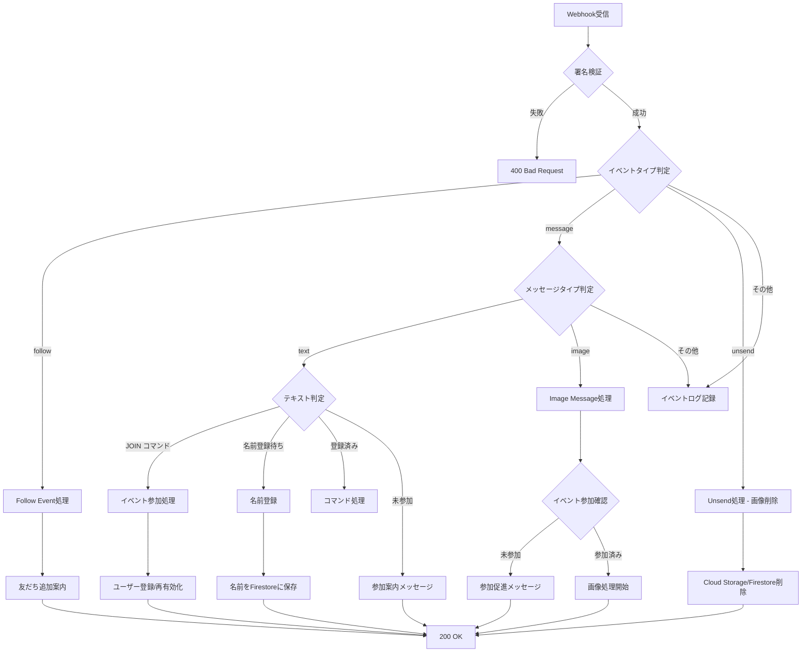
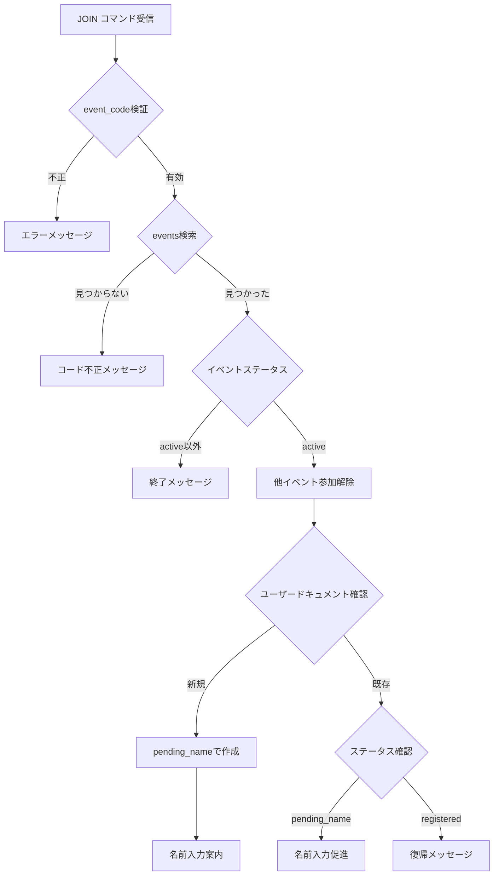
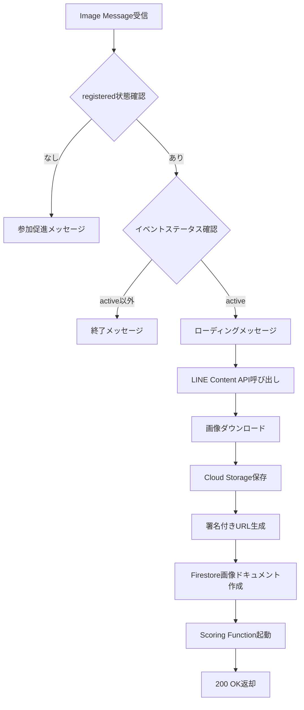

# Webhook API 仕様

## 概要

Webhook APIは、LINE Messaging APIからのイベントを受信し、適切な処理を行うCloud Functionです。

## エンドポイント

```
POST /webhook
```

**Cloud Function URL例:**
```
https://asia-northeast1-{project-id}.cloudfunctions.net/webhook
```

## リクエスト

### Headers

| Header | 値 | 必須 | 説明 |
|--------|------|------|------|
| `Content-Type` | `application/json` | ✓ | JSONフォーマット |
| `X-Line-Signature` | SHA256署名 | ✓ | Webhook検証用 |

### Body

LINE Messaging APIの[Webhook Event Objects](https://developers.line.biz/ja/reference/messaging-api/#webhook-event-objects)に準拠

```json
{
  "destination": "xxxxxxxxxx",
  "events": [
    {
      "type": "message | follow | unfollow | unsend | ...",
      "message": {...},
      "timestamp": 1234567890123,
      "source": {
        "type": "user",
        "userId": "U1234567890abcdef"
      },
      "replyToken": "nHuyWiB7yP5Zw52FIkcQobQuGDXCTA"
    }
  ]
}
```

## レスポンス

### 成功時

```
Status: 200 OK
Content-Type: application/json

{
  "status": "ok"
}
```

### エラー時

```
Status: 400 Bad Request
Content-Type: application/json

{
  "error": "Invalid signature"
}
```

## 処理フロー（マルチテナント対応）



## イベント別処理詳細

### 1. Follow Event

ユーザーがBotを友だち追加したとき

#### 処理内容

友だち追加時は参加案内メッセージを送信。実際のイベント参加は `JOIN {event_code}` コマンドで行う。

#### 返信メッセージ

```
ようこそ！Wedding Smile Catcherへ

イベントに参加するには、主催者から共有された
参加コードを使って
「JOIN 参加コード」と送信してください。

例: JOIN abc12345-6789-...
```

### 2. Text Message Event - JOINコマンド

`JOIN {event_code}` 形式のテキストを受信時（マルチテナントの核心）

#### 処理フロー



#### Firestoreドキュメント構造

ユーザードキュメントのIDは複合キー: `{line_user_id}_{event_id}`

```python
# users/{line_user_id}_{event_id}
{
    "line_user_id": "U1234567890abcdef",
    "event_id": "event_uuid",
    "name": "山田太郎",  # 名前登録後に設定
    "status": "pending_name" | "registered",
    "created_at": timestamp,
    "name_registered_at": timestamp,
    "consent_timestamp": timestamp  # 名前登録時の同意タイムスタンプ
}
```

### 3. Text Message Event - 名前登録

`status: pending_name` のユーザーからテキストを受信時

#### 処理内容

1. 名前のバリデーション（2-30文字）
2. Firestoreに名前を保存、`status: registered` に更新
3. 同意タイムスタンプ (`consent_timestamp`) を記録
4. 登録完了メッセージを送信

#### 返信メッセージ（登録完了）
```
山田太郎さん、登録完了です！

早速、笑顔の写真を送ってみましょう！

💡 ヒント:
・大人数で写るほど高スコア
・自然な笑顔がポイント
・連写は避けましょう
```

### 4. Image Message Event

画像メッセージ受信時

#### 処理フロー



#### Cloud Storage保存パス

```
{event_id}/original/{user_id}/{timestamp}_{image_id}.jpg
```

例: `abc12345-6789.../original/U1234.../20260130_123456_uuid.jpg`

#### Firestore画像ドキュメント

```python
# images/{image_id}
{
    "user_id": "U1234567890abcdef",
    "user_name": "山田太郎",  # デノーマライズ（フロントエンド用）
    "event_id": "event_uuid",
    "storage_path": "event_uuid/original/U1234.../20260130_123456_uuid.jpg",
    "storage_url": "https://storage.googleapis.com/...(signed)",  # 署名付きURL
    "storage_url_expires_at": timestamp,  # 有効期限
    "upload_timestamp": timestamp,
    "status": "pending",
    "line_message_id": "12345678901234"
}
```

### 5. Unsend Event（メッセージ取消）

ユーザーがLINE上でメッセージを取り消した場合

#### 処理内容

1. `line_message_id` でFirestore画像ドキュメントを検索
2. Cloud Storageから画像を削除
3. Firestoreドキュメントを削除
4. ユーザー統計を更新（total_uploads, best_score）

#### プライバシー保護

ゲストの「忘れられる権利」を実現。取り消し操作で関連データを完全削除。

## 署名付きURL生成

画像アップロード時に署名付きURLを生成し、Firestoreに保存。

```python
def generate_signed_url(bucket_name: str, storage_path: str) -> tuple[str, datetime]:
    """
    Generate signed URL for Cloud Storage object.

    Args:
        bucket_name: GCS bucket name
        storage_path: Path to the object

    Returns:
        tuple[str, datetime]: (signed_url, expiration_time)
    """
    from google.cloud import storage
    from datetime import datetime, timedelta

    storage_client = storage.Client()
    bucket = storage_client.bucket(bucket_name)
    blob = bucket.blob(storage_path)

    expiration_hours = 168  # 7 days
    expiration = timedelta(hours=expiration_hours)
    expiration_time = datetime.utcnow() + expiration

    url = blob.generate_signed_url(
        version="v4",
        expiration=expiration,
        method="GET",
    )
    return url, expiration_time
```

## エラーハンドリング

### 署名検証失敗

```python
# LINE SDKのWebhookHandlerが自動で検証
# 失敗時は400を返却
```

### LINE API エラー

```python
try:
    messaging_api.reply_message(request)
except ApiException as e:
    logger.error(f"LINE API error: {e.status} {e.reason}")
```

### Cloud Storage エラー

```python
try:
    blob.upload_from_string(image_bytes)
except Exception as e:
    logger.error(f"Storage upload failed: {e}")
    # Push messageでユーザーに通知
```

## 環境変数

Cloud Functions環境変数（Secret Managerから取得）:

```bash
LINE_CHANNEL_SECRET=your-channel-secret
LINE_CHANNEL_ACCESS_TOKEN=your-access-token
GCP_PROJECT_ID=your-project-id
STORAGE_BUCKET=wedding-smile-images-{project-id}
SCORING_FUNCTION_URL=https://asia-northeast1-{project-id}.cloudfunctions.net/scoring
```

## デプロイ

GitHub Actionsで自動デプロイ。手動の場合:

```bash
gcloud functions deploy webhook \
  --gen2 \
  --runtime=python311 \
  --region=asia-northeast1 \
  --source=src/functions/webhook \
  --entry-point=webhook \
  --trigger-http \
  --allow-unauthenticated \
  --service-account=webhook-function@{project-id}.iam.gserviceaccount.com
```

## 次のステップ

- [Scoring API仕様](scoring.md)
- [LINE Bot設計](line-bot.md)
