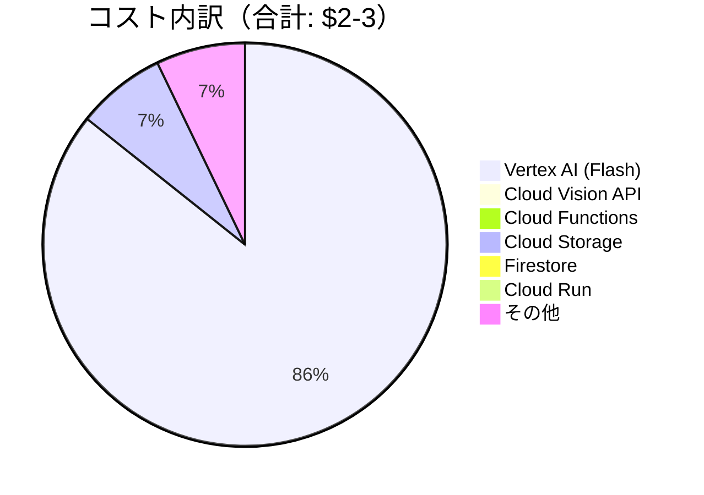

# コスト試算

## 概要

Wedding Smile Catcherの運用コストを、複数のシナリオで試算します。

**注意**:
- 以下は2025年1月時点の価格に基づく概算です。実際のコストは使用量や為替レートにより変動します。
- フロントエンドは当初Cloud Run + Next.jsを計画していましたが、Firebase Hosting + Vanilla JSに変更されました（コスト無料）。
- AIモデルは`gemini-2.5-flash`を使用しています。

## 前提条件

### 無料枠（毎月リセット）

| サービス | 無料枠 |
|---------|--------|
| Cloud Functions | 200万リクエスト、400,000GB秒 |
| Cloud Vision API | 1,000リクエスト/月 |
| Firestore | 読み取り: 50,000/日、書き込み: 20,000/日 |
| Cloud Storage | 5GB（Standard）、5,000 Class A操作 |
| Cloud Run | 180,000 vCPU秒、360,000 GiB秒、200万リクエスト |

### 価格（東京リージョン）

| サービス | 単価 |
|---------|------|
| Cloud Functions | $0.40 / 100万リクエスト、$0.0000025 / GB秒 |
| Cloud Vision API (Face Detection) | $1.50 / 1,000リクエスト（1,000超過分） |
| Vertex AI (Gemini 1.5 Flash) | ~$0.004 / リクエスト |
| Vertex AI (Gemini 1.5 Pro) | ~$0.025 / リクエスト |
| Cloud Storage (Standard) | $0.023 / GB/月 |
| Cloud Storage (Nearline) | $0.010 / GB/月 |
| Firestore | 読み取り: $0.036 / 10万、書き込み: $0.108 / 10万 |
| Cloud Run | $0.00002400 / vCPU秒、$0.00000250 / GiB秒 |

## シナリオ別コスト試算

### シナリオ1: 小規模結婚式（300枚投稿）

**参列者**: 50-70人
**投稿数**: 300枚
**式の時間**: 3時間

#### サービス別コスト



| サービス | 使用量 | コスト |
|---------|--------|--------|
| **Cloud Functions - Webhook** | 300回 | $0（無料枠内） |
| **Cloud Functions - Scoring** | 300回、平均15秒 | $0（無料枠内） |
| **Cloud Vision API** | 300リクエスト | $0（無料枠内） |
| **Vertex AI (Gemini Flash)** | 300リクエスト | $1.20 |
| **Cloud Storage** | 600MB（300枚×2MB） | $0.10 |
| **Firestore** | 読: 5,000、書: 1,000 | $0（無料枠内） |
| **Cloud Run** | 3時間稼働 | $0（無料枠内） |
| **Cloud CDN** | 転送量6GB | $0.05 |
| **Cloud Logging** | 標準ログ | $0（無料枠内） |

**合計**: **約$1.35-2.00**

### シナリオ2: 中規模結婚式（500枚投稿）

**参列者**: 80-100人
**投稿数**: 500枚
**式の時間**: 4時間

#### サービス別コスト

| サービス | 使用量 | コスト |
|---------|--------|--------|
| **Cloud Functions - Webhook** | 500回 | $0（無料枠内） |
| **Cloud Functions - Scoring** | 500回、平均15秒 | $0（無料枠内） |
| **Cloud Vision API** | 500リクエスト | $0（無料枠内） |
| **Vertex AI (Gemini Flash)** | 500リクエスト | $2.00 |
| **Cloud Storage** | 1GB（500枚×2MB） | $0.15 |
| **Firestore** | 読: 8,000、書: 1,500 | $0（無料枠内） |
| **Cloud Run** | 4時間稼働 | $0（無料枠内） |
| **Cloud CDN** | 転送量10GB | $0.10 |
| **Cloud Logging** | 標準ログ | $0（無料枠内） |

**合計**: **約$2.25-3.00**

### シナリオ3: 大規模結婚式（1,000枚投稿）

**参列者**: 150-200人
**投稿数**: 1,000枚
**式の時間**: 5時間

#### サービス別コスト

| サービス | 使用量 | コスト |
|---------|--------|--------|
| **Cloud Functions - Webhook** | 1,000回 | $0（無料枠内） |
| **Cloud Functions - Scoring** | 1,000回、平均15秒 | $0（無料枠内） |
| **Cloud Vision API** | 1,000リクエスト | $0（無料枠内） |
| **Vertex AI (Gemini Flash)** | 1,000リクエスト | $4.00 |
| **Cloud Storage** | 2GB（1,000枚×2MB） | $0.30 |
| **Firestore** | 読: 15,000、書: 3,000 | $0（無料枠内） |
| **Cloud Run** | 5時間稼働 | $0（無料枠内） |
| **Cloud CDN** | 転送量20GB | $0.20 |
| **Cloud Logging** | 標準ログ | $0（無料枠内） |

**合計**: **約$4.50-6.00**

### シナリオ4: 高精度AI使用（Gemini Pro）

500枚投稿、Gemini 1.5 Proを使用

| サービス | 使用量 | コスト |
|---------|--------|--------|
| **Vertex AI (Gemini Pro)** | 500リクエスト | $12.50 |
| **その他サービス** | - | $0.35 |

**合計**: **約$12.85**

**差額**: Flashと比較して約+$10

## 開発・テスト期間のコスト

### 1ヶ月の開発期間

**想定**:
- 毎日10回のテスト投稿 × 30日 = 300回
- Gemini Flashを使用
- Cloud Runの起動・停止を繰り返し

| サービス | 使用量 | コスト |
|---------|--------|--------|
| **Cloud Functions** | 600回（Webhook + Scoring） | $0（無料枠内） |
| **Cloud Vision API** | 300リクエスト | $0（無料枠内） |
| **Vertex AI (Gemini Flash)** | 300リクエスト | $1.20 |
| **Cloud Storage** | 600MB | $0.10 |
| **Firestore** | 開発用クエリ多数 | $0-1.00 |
| **Cloud Run** | 開発中の起動時間 | $0（無料枠内） |

**合計**: **約$1.30-2.50 / 月**

### 総開発コスト（3ヶ月想定）

```
開発期間: 3ヶ月 × $2.50 = $7.50
本番テスト: 2回 × $3.00 = $6.00

合計: 約$13.50
```

## 年間複数回使用する場合

### ケース1: 年間10件の結婚式

**想定**: 各500枚投稿

```
イベントコスト: $3.00 × 10回 = $30.00
保守費用: $5.00 / 年
データ保存（1年後削除）: $10.00 / 年

合計: 約$45.00 / 年
```

**1件あたり**: $4.50

### ケース2: 商用サービス化（年間50件）

**想定**: 各500枚投稿、専用インフラ

```
イベントコスト: $3.00 × 50回 = $150.00
Cloud Run常時稼働: $20.00 / 年
データバックアップ: $30.00 / 年
モニタリング強化: $10.00 / 年

合計: 約$210.00 / 年
```

**1件あたり**: $4.20

## コスト最適化の方法

### 1. Gemini Flashを使用

```
Flash: $2.00 / 500枚
Pro:   $12.50 / 500枚

節約: $10.50 / イベント
```

**推奨**: テストでFlashの精度を確認し、問題なければFlashを採用

### 2. Cloud Vision APIの無料枠を活用

```
無料枠: 1,000リクエスト/月
想定使用: 500リクエスト/イベント

節約: $0.75 / イベント（月2回まで無料）
```

### 3. Cloud Storageのライフサイクル管理

```
30日後 → Nearline: $0.023 → $0.010 / GB
365日後 → 自動削除

節約: 約$0.10 / イベント
```

設定例:
```json
{
  "lifecycle": {
    "rule": [
      {
        "action": {"type": "SetStorageClass", "storageClass": "NEARLINE"},
        "condition": {"age": 30}
      },
      {
        "action": {"type": "Delete"},
        "condition": {"age": 365}
      }
    ]
  }
}
```

### 4. Firestoreのインデックス最小化

```
不要なインデックス削除で書き込みコスト削減
節約: 微小だが、スケール時に効果
```

### 5. Cloud Runの最小インスタンス数=0

```
コールドスタート許容で常時稼働コストを削減
節約: 式中の3-5時間のみ稼働（$0 vs $0.50）
```

## コスト監視とアラート

### Cloud Billingアラートの設定

```bash
# 予算アラート設定（$10/月）
gcloud billing budgets create \
  --billing-account=BILLING_ACCOUNT_ID \
  --display-name="Wedding Smile Catcher Budget" \
  --budget-amount=10USD \
  --threshold-rule=percent=50 \
  --threshold-rule=percent=90 \
  --threshold-rule=percent=100
```

### コスト異常検知

- Cloud Loggingで高頻度API呼び出しを検知
- Cloud Monitoringでリクエスト数の急増をアラート

## コスト比較: AWS版 vs GCP版

### 元システム（AWS版）の推定コスト

| サービス | コスト（500枚） |
|---------|--------------|
| Lambda | $0（無料枠内） |
| Rekognition | $0.50 |
| Bedrock (Nova) | $1.50 |
| DynamoDB | $0（無料枠内） |
| S3 | $0.15 |
| CloudFront | $0.10 |

**AWS合計**: 約$2.25

### GCP版との比較

```
AWS: $2.25
GCP: $2.50-3.00（Gemini Flash使用）

差額: +$0.25-0.75 / イベント
```

**結論**: ほぼ同等のコスト。GCPの方が若干高いが、Firestoreのリアルタイム同期などの利便性を考慮すると許容範囲。

## まとめ

### 結婚式1回あたりの想定コスト

| 規模 | 投稿数 | コスト |
|-----|--------|--------|
| 小規模 | 300枚 | **$1.35-2.00** |
| 中規模 | 500枚 | **$2.25-3.00** |
| 大規模 | 1,000枚 | **$4.50-6.00** |

### 開発コスト

```
開発期間（3ヶ月）: $13.50
本番準備: $6.00

合計: 約$20.00
```

### 総コスト見積もり

```
開発: $20.00
本番1回: $3.00

初回総コスト: 約$23.00（≈ ¥3,500）
2回目以降: 約$3.00/回（≈ ¥450/回）
```

**結論**: 非常に低コストで運用可能。商用サービス化も十分検討できる価格帯。

## 次のステップ

- [GCPサービス詳細](gcp-services.md)
- [セットアップガイド](../setup/gcp-setup.md)
