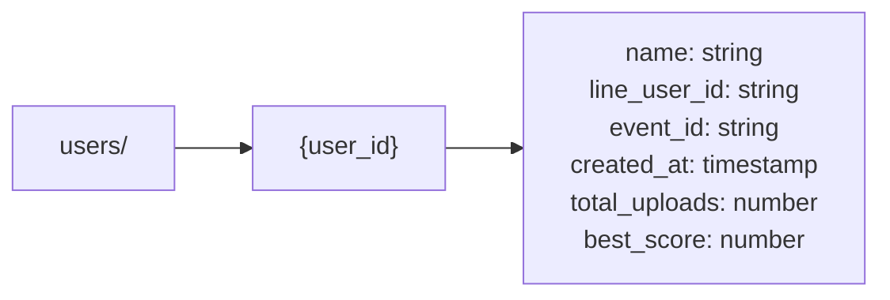
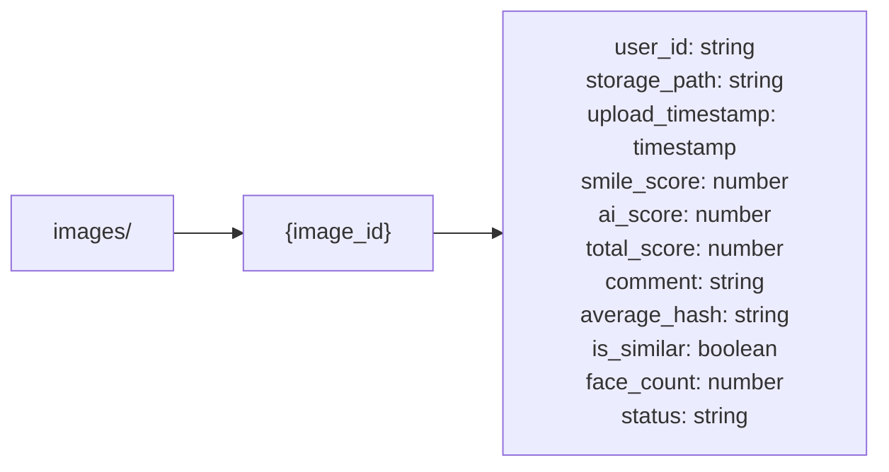
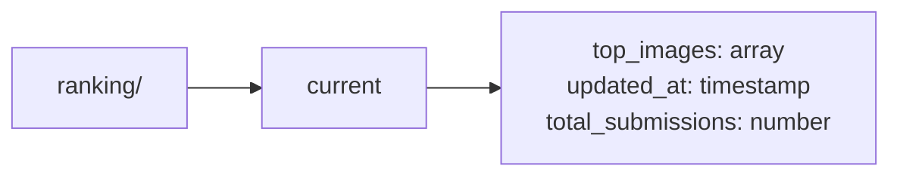
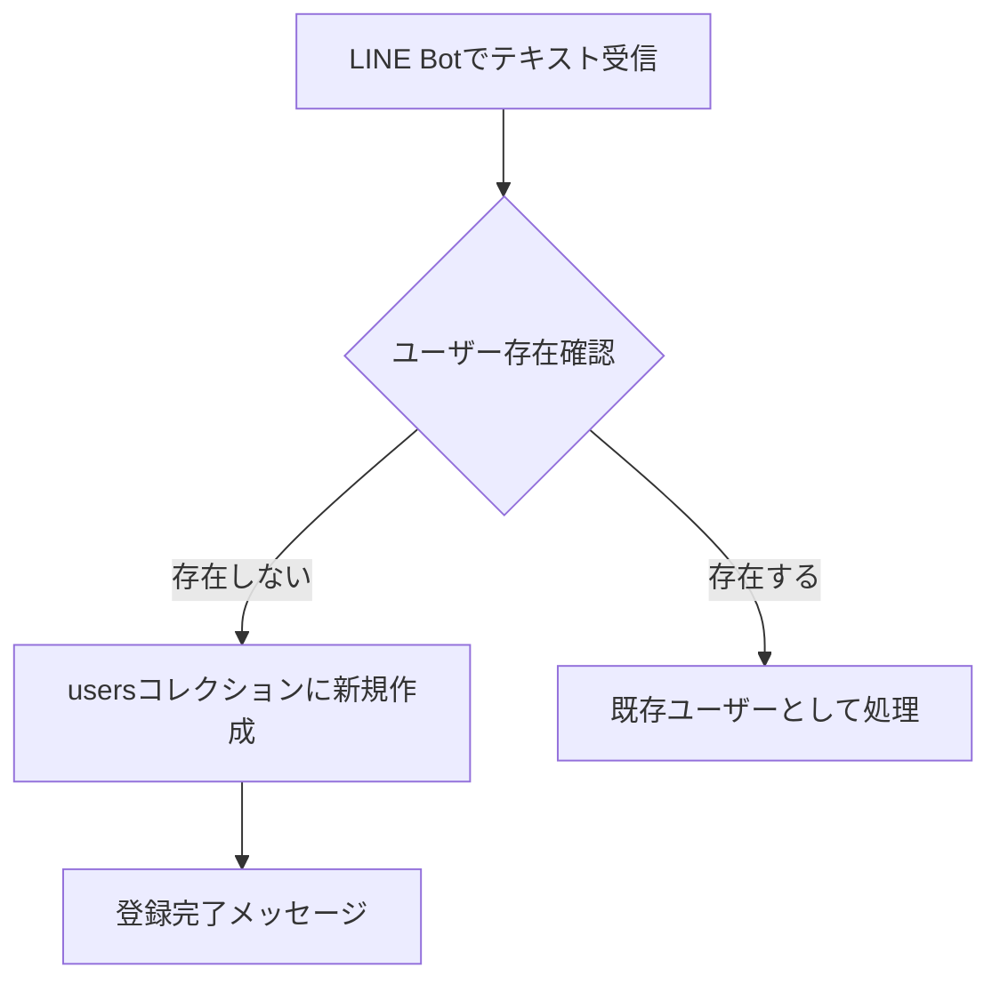
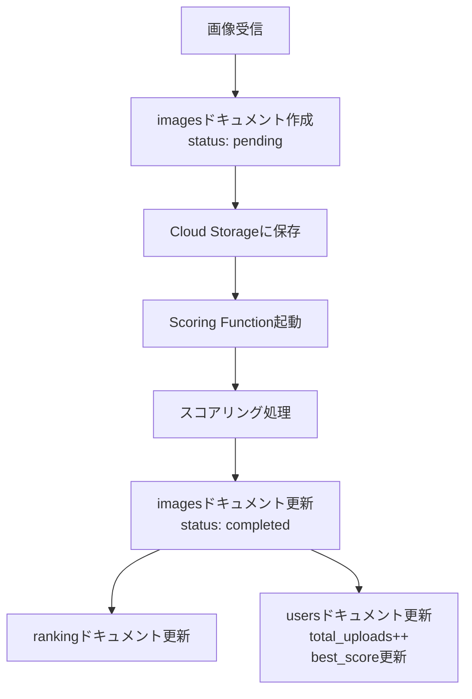

<!-- markdownlint-disable MD024 -->
# データベース設計

> **注意**: 本ドキュメントは初期設計時のものです。以下の変更については各参照先を確認してください：
> - **マルチテナント対応**: `accounts`コレクション追加、`events`/`users`フィールド追加、Firestore Security Rules変更 → `docs/planning/multi-tenant-design.md`
> - **署名付きURL**: `images`コレクションに`storage_url`、`storage_url_expires_at`フィールド追加
> - **同意タイムスタンプ**: `users`コレクションに`consent_timestamp`フィールド追加
> - **ユーザー名デノーマライズ**: `images`コレクションに`user_name`フィールド追加（フロントエンド用）

## 概要

このシステムでは、Google Cloud Firestoreをメインデータベースとして使用します。Firestoreは以下の特徴により、このプロジェクトに最適です：

- **リアルタイム同期**: フロントエンドでの即座な更新表示
- **スケーラビリティ**: 自動シャーディングによる高負荷対応
- **NoSQL**: 柔軟なスキーマ設計
- **オフライン対応**: クライアントSDKの強力なキャッシング機能

## Firestoreコレクション設計

### 1. users コレクション

ユーザー（参列者）の基本情報を管理



#### フィールド定義

| フィールド名 | 型 | 説明 | 必須 | インデックス |
|------------|------|------|------|------------|
| `name` | string | ユーザーのフルネーム | ✓ | - |
| `line_user_id` | string | LINE User ID | ✓ | ✓ (unique) |
| `event_id` | string | イベントID（イベント分離用） | ✓ | ✓ |
| `created_at` | timestamp | ユーザー登録日時 | ✓ | - |
| `total_uploads` | number | 総投稿数 | ✓ | ✓ |
| `best_score` | number | 最高スコア | ✓ | ✓ |

#### サンプルドキュメント

```json
{
  "name": "山田太郎",
  "line_user_id": "U1234567890abcdef",
  "event_id": "wedding_20250315_tanaka",
  "created_at": "2025-11-18T10:30:00Z",
  "total_uploads": 5,
  "best_score": 389.3
}
```

### 2. images コレクション

投稿された画像のメタデータとスコアを管理



#### フィールド定義

| フィールド名 | 型 | 説明 | 必須 | インデックス |
|------------|------|------|------|------------|
| `user_id` | string | 投稿者のユーザーID | ✓ | ✓ |
| `event_id` | string | イベントID（イベント分離用） | ✓ | ✓ |
| `storage_path` | string | Cloud Storageのパス | ✓ | - |
| `upload_timestamp` | timestamp | 投稿日時 | ✓ | ✓ |
| `smile_score` | number | 笑顔スコア（0～∞） | ✓ | ✓ |
| `ai_score` | number | AI評価スコア（0-100） | ✓ | ✓ |
| `total_score` | number | 総合スコア | ✓ | ✓ (降順) |
| `comment` | string | AIが生成したコメント | ✓ | - |
| `average_hash` | string | 画像のAverage Hash（16進数） | ✓ | - |
| `is_similar` | boolean | 類似画像かどうか | ✓ | ✓ |
| `face_count` | number | 検出された顔の数 | ✓ | ✓ |
| `status` | string | 処理状態（pending/completed/error） | ✓ | ✓ |

#### サンプルドキュメント

```json
{
  "user_id": "user_001",
  "event_id": "wedding_20250315_tanaka",
  "storage_path": "wedding_20250315_tanaka/original/user_001/20251118_103000_img001.jpg",
  "upload_timestamp": "2025-11-18T10:30:00Z",
  "smile_score": 458.0,
  "ai_score": 85,
  "total_score": 389.3,
  "comment": "新郎新婦の目元から溢れる自然な喜びが印象的で、周囲の参列者との一体感も素晴らしい",
  "average_hash": "a1b2c3d4e5f67890",
  "is_similar": false,
  "face_count": 5,
  "status": "completed"
}
```

### 3. ranking コレクション

> **注意**: 本コレクションは設計のみで、現時点では未実装です。フロントエンドは `images` コレクションを直接クエリしてランキングを表示しています。パフォーマンス最適化が必要になった段階で実装を検討します。

リアルタイム表示用のランキング情報を管理



#### フィールド定義

| フィールド名 | 型 | 説明 | 必須 |
|------------|------|------|------|
| `top_images` | array | トップ100画像のID配列 | ✓ |
| `updated_at` | timestamp | 最終更新日時 | ✓ |
| `total_submissions` | number | 総投稿数 | ✓ |

#### top_images 配列の要素

各要素は以下の構造を持つオブジェクト：

```typescript
{
  image_id: string;      // 画像ID
  user_id: string;       // ユーザーID
  total_score: number;   // 総合スコア
  rank: number;          // 順位
}
```

#### サンプルドキュメント

```json
{
  "top_images": [
    {
      "image_id": "img_001",
      "user_id": "user_001",
      "total_score": 389.3,
      "rank": 1
    },
    {
      "image_id": "img_045",
      "user_id": "user_012",
      "total_score": 367.8,
      "rank": 2
    }
  ],
  "updated_at": "2025-11-18T10:30:00Z",
  "total_submissions": 152
}
```

## インデックス設計

### 複合インデックス

Firestoreで効率的にクエリを実行するための複合インデックス：

#### 1. images コレクション - イベント別スコア順取得（重要）

```
Collection: images
Fields:
  - event_id (Ascending)
  - status (Ascending)
  - total_score (Descending)
```

**用途**: 特定イベントでステータスが`completed`の画像をスコア順で取得（ランキング表示）

#### 2. images コレクション - イベント&ユーザー別類似判定用

```
Collection: images
Fields:
  - event_id (Ascending)
  - user_id (Ascending)
  - status (Ascending)
```

**用途**: 特定イベント内の特定ユーザーの完了済み画像を取得（類似画像判定用）

#### 3. images コレクション - ユーザー別投稿取得

```
Collection: images
Fields:
  - user_id (Ascending)
  - upload_timestamp (Descending)
```

**用途**: 特定ユーザーの投稿を新しい順で取得（全イベント横断）

#### 4. users コレクション - イベント別総投稿数順

```
Collection: users
Fields:
  - event_id (Ascending)
  - total_uploads (Descending)
```

**用途**: 特定イベント内で最も投稿したユーザーのランキング

## クエリパターン

### 1. トップN画像の取得（ユーザー重複なし、イベント別）

```python
from google.cloud import firestore
import os

db = firestore.Client()
event_id = "your_event_id"  # ユーザーの event_id から動的に取得

# Step 1: 特定イベントのトップ100画像を取得
top_images = (
    db.collection('images')
    .where('event_id', '==', event_id)
    .where('status', '==', 'completed')
    .order_by('total_score', direction=firestore.Query.DESCENDING)
    .limit(100)
    .get()
)

# Step 2: ユーザー重複を除外してトップ3を選出
seen_users = set()
top_3 = []

for doc in top_images:
    user_id = doc.get('user_id')
    if user_id not in seen_users:
        top_3.append(doc)
        seen_users.add(user_id)
        if len(top_3) == 3:
            break
```

### 2. 特定ユーザーの全投稿を取得

```python
user_images = (
    db.collection('images')
    .where('user_id', '==', user_id)
    .order_by('upload_timestamp', direction=firestore.Query.DESCENDING)
    .get()
)
```

### 3. 既存のAverage Hash一覧を取得（類似判定用、イベント別）

```python
# 特定イベント&ユーザーの画像ハッシュを取得（類似判定のため）
def get_existing_hashes_for_user(user_id: str, event_id: str):
    images = (
        db.collection('images')
        .where('event_id', '==', event_id)
        .where('user_id', '==', user_id)
        .where('status', '==', 'completed')
        .stream()
    )

    hashes = []
    for doc in images:
        hashes.append(doc.get('average_hash'))

    return hashes
```

### 4. ランキング更新（イベント別）

```python
def update_ranking(event_id: str):
    # 特定イベントのトップ100を取得
    top_images = (
        db.collection('images')
        .where('event_id', '==', event_id)
        .where('status', '==', 'completed')
        .order_by('total_score', direction=firestore.Query.DESCENDING)
        .limit(100)
        .get()
    )

    # ランキング配列を構築
    ranking_data = []
    for idx, doc in enumerate(top_images, 1):
        ranking_data.append({
            'image_id': doc.id,
            'user_id': doc.get('user_id'),
            'total_score': doc.get('total_score'),
            'rank': idx
        })

    # 総投稿数を取得（特定イベントのみ）
    total_count = (
        db.collection('images')
        .where('event_id', '==', event_id)
        .where('status', '==', 'completed')
        .count()
        .get()[0][0].value
    )

    # rankingコレクションをイベント別に更新
    db.collection('ranking').document(event_id).set({
        'top_images': ranking_data,
        'updated_at': firestore.SERVER_TIMESTAMP,
        'total_submissions': total_count
    })
```

## Firestoreセキュリティルール

```javascript
rules_version = '2';
service cloud.firestore {
  match /databases/{database}/documents {

    // users コレクション: 読み取り可能、書き込みは認証済みのみ
    match /users/{userId} {
      allow read: if true;
      allow write: if request.auth != null;
    }

    // images コレクション: 読み取り可能、書き込みは認証済みのみ
    match /images/{imageId} {
      allow read: if true;
      allow write: if request.auth != null;

      // バリデーション
      allow create: if request.resource.data.keys().hasAll([
        'user_id', 'storage_path', 'upload_timestamp', 'status'
      ]);
    }

    // ranking コレクション: 読み取り可能、書き込みは認証済みのみ
    match /ranking/{doc} {
      allow read: if true;
      allow write: if request.auth != null;
    }
  }
}
```

**注意**: 本番環境では、Cloud Functionsからのアクセスにサービスアカウント認証を使用し、より厳格なルールを設定することを推奨します。

## データライフサイクル

### 1. ユーザー登録フロー



### 2. 画像投稿フロー



### 3. データ保持期間

- **images**: イベント終了後30日間保持（Cloud Storageと連動）
- **users**: イベント終了後30日間保持
- **ranking**: イベント期間中のみ（未実装）

## パフォーマンス最適化

### 1. 読み取り最適化

- ランキング情報を`ranking/current`に集約（毎回クエリせずキャッシュ活用）
- フロントエンドでFirestoreリアルタイムリスナーを使用
- 画像URLはCloud Storageの署名付きURLを使用（Firestore負荷軽減）

### 2. 書き込み最適化

- バッチ書き込みを活用（ユーザー情報と画像情報を同時更新）
- トランザクションでランキング更新の整合性を保証

### 3. コスト最適化

- 読み取り回数を削減するため、リアルタイムリスナーのみ使用
- 不要なインデックスは作成しない
- TTL（Time To Live）を設定してデータ自動削除

## 移行・バックアップ戦略

### バックアップ

```bash
# Firestoreエクスポート（毎日実行）
gcloud firestore export gs://wedding-smile-backup/$(date +%Y%m%d)
```

### リストア

```bash
# 特定の日付からリストア
gcloud firestore import gs://wedding-smile-backup/20251118
```

## 次のステップ

- [GCP技術選定詳細](gcp-services.md)
- [API仕様書](../api/)
