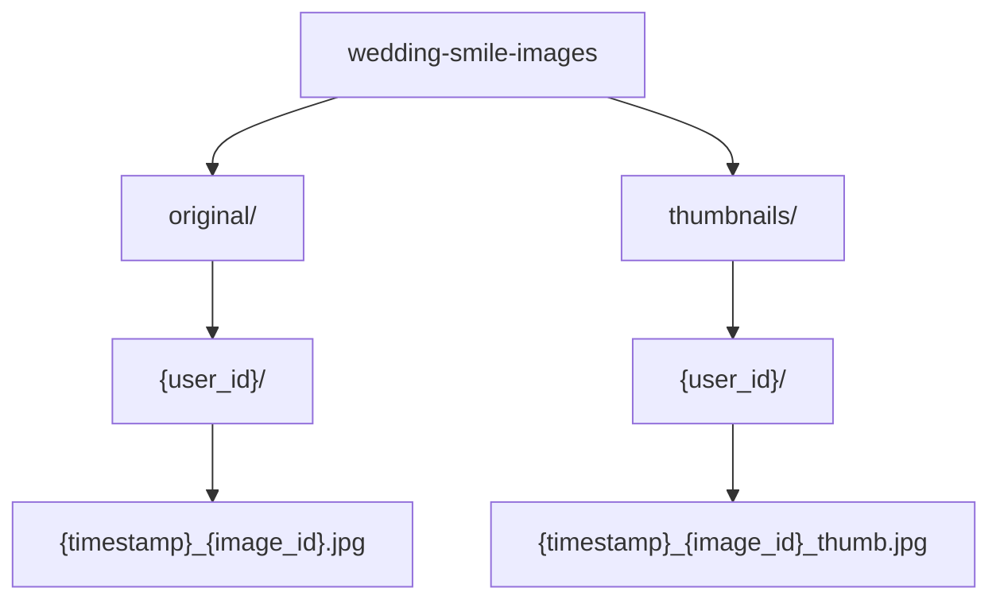

# GCPサービス詳細

## 概要

このドキュメントでは、Wedding Smile Catcherで使用する各GCPサービスの選定理由、設定、コスト見積もりを詳しく説明します。

## AWS → GCP マッピング完全版

| 機能 | AWS（元システム） | GCP（本プロジェクト） | 移行の難易度 |
|------|------------------|---------------------|------------|
| サーバーレス実行環境 | AWS Lambda | **Cloud Functions / Cloud Run** | 低 |
| 笑顔検出API | Amazon Rekognition | **Cloud Vision API** | 低 |
| 生成AIモデル | Amazon Bedrock (Nova) | **Vertex AI (Gemini)** | 低 |
| オブジェクトストレージ | Amazon S3 | **Cloud Storage** | 低 |
| NoSQLデータベース | Amazon DynamoDB | **Firestore** | 中 |
| CDN | Amazon CloudFront | **Cloud CDN** | 低 |
| IaC | Terraform | **Terraform** | なし |
| モニタリング | CloudWatch | **Cloud Logging / Monitoring** | 低 |
| API Gateway | API Gateway | **Cloud Endpoints (オプション)** | 低 |

## 使用するGCPサービス

### 1. Cloud Functions（第2世代）

#### 役割
- LINE Webhook受信処理
- 画像スコアリング処理

#### 選定理由
- **イベントドリブン**: HTTP、Cloud Storage、Pub/Subトリガーに対応
- **自動スケーリング**: 同時実行数に応じて自動的にインスタンスが増減
- **コスト効率**: 実行時間のみ課金、アイドル時は無料

#### 仕様

| 項目 | 設定値 |
|------|--------|
| ランタイム | Python 3.11 または Node.js 20 |
| メモリ | 512MB（Webhook）/ 1GB（Scoring） |
| タイムアウト | 60秒（Webhook）/ 300秒（Scoring） |
| 最大インスタンス数 | 100 |
| 最小インスタンス数 | 0（コールドスタート許容） |

#### コスト見積もり（結婚式1回）

想定：500回の投稿、平均実行時間2秒

```
Webhook Function:
  - 実行回数: 500回
  - メモリ: 512MB
  - 実行時間: 2秒/回
  - コスト: 無料枠内

Scoring Function:
  - 実行回数: 500回
  - メモリ: 1GB
  - 実行時間: 15秒/回（AI処理含む）
  - コスト: 無料枠内
```

**月間無料枠**: 200万リクエスト、400,000GB秒の実行時間

### 2. Cloud Vision API

#### 役割
顔検出と笑顔信頼度の取得

#### 選定理由
- **高精度**: Googleの機械学習技術
- **簡単な統合**: クライアントライブラリが充実
- **日本語ドキュメント**: 学習コストが低い

#### 使用機能

**Face Detection**
- 顔の位置（bounding box）
- 感情分析（joyLikelihood, sorrowLikelihood, etc.）
- 顔のランドマーク（目、鼻、口の位置）

#### API レスポンス例

```json
{
  "faceAnnotations": [
    {
      "joyLikelihood": "VERY_LIKELY",
      "sorrowLikelihood": "VERY_UNLIKELY",
      "angerLikelihood": "VERY_UNLIKELY",
      "surpriseLikelihood": "VERY_UNLIKELY",
      "boundingPoly": {
        "vertices": [
          {"x": 120, "y": 80},
          {"x": 280, "y": 80},
          {"x": 280, "y": 280},
          {"x": 120, "y": 280}
        ]
      },
      "detectionConfidence": 0.9987
    }
  ]
}
```

#### Likelihood 値のマッピング

| Likelihood | 数値化 | 説明 |
|-----------|--------|------|
| VERY_LIKELY | 95 | 非常に高い確率 |
| LIKELY | 75 | 高い確率 |
| POSSIBLE | 50 | 可能性あり |
| UNLIKELY | 25 | 低い確率 |
| VERY_UNLIKELY | 5 | 非常に低い確率 |

#### コスト見積もり

```
Face Detection:
  - 500回のリクエスト
  - 月間無料枠: 1,000回
  - コスト: 無料
```

**超過時の料金**: 1,000回あたり$1.50

### 3. Vertex AI (Gemini)

#### 役割
画像のテーマ関連性評価とコメント生成

#### 選定理由
- **マルチモーダル**: 画像とテキストを同時に処理
- **高精度**: 結婚式テーマの評価に適している
- **無関係画像への厳格さ**: GPT-4oと異なり、無関係な画像に0点をつける

#### 使用モデル

**gemini-2.5-flash**（本番採用）

| モデル | 速度 | 精度 | コスト |
|-------|------|------|--------|
| gemini-2.5-flash | 速い | 高い | 低い |

**採用理由**: 高速かつ十分な精度でコストパフォーマンスが最も良い

#### プロンプト設計

```python
THEME_EVALUATION_PROMPT = """
あなたは結婚式写真の専門家です。提供された写真を分析し、以下の基準に従って笑顔の評価を行ってください：

## 分析対象
- 新郎新婦を中心に、写真に写っている全ての人物の表情を評価
- グループショットの場合は、全体的な雰囲気も考慮

## 評価基準（100点満点）
1. 自然さ（30点）
   - 作り笑いではなく、自然な表情かどうか
   - 緊張が感じられず、リラックスしているか

2. 幸福度（40点）
   - 純粋な喜びが表現されているか
   - 目が笑っているか

3. 周囲との調和（30点）
   - 周りの人々と笑顔が調和しているか
   - 場面に相応しい表情の大きさか

## 出力
JSON形式でscoreとcommentのキーで返却する。JSONのみを出力すること。

例:
{
  "score": 85,
  "comment": "新郎新婦の目元から溢れる自然な喜びが印象的で、周囲の参列者との一体感も素晴らしい"
}
"""
```

#### コスト見積もり

```
gemini-1.5-flash:
  - 500回のリクエスト
  - 入力: ~200トークン/回（プロンプト + 画像）
  - 出力: ~50トークン/回（JSON応答）
  - コスト: 約$2-3

gemini-1.5-pro:
  - 500回のリクエスト
  - コスト: 約$10-15
```

### 4. Cloud Storage

#### 役割
画像ファイルの永続化ストレージ

#### 選定理由
- **スケーラブル**: 容量無制限
- **高可用性**: 99.99%の稼働率
- **ライフサイクル管理**: 自動削除・アーカイブ

#### バケット設計



#### ストレージクラス

**Standard Storage**
- 頻繁にアクセスされるデータ向け
- 結婚式当日〜1週間後まで

#### ライフサイクルポリシー

```json
{
  "lifecycle": {
    "rule": [
      {
        "action": {
          "type": "SetStorageClass",
          "storageClass": "NEARLINE"
        },
        "condition": {
          "age": 30
        }
      },
      {
        "action": {
          "type": "Delete"
        },
        "condition": {
          "age": 365
        }
      }
    ]
  }
}
```

#### コスト見積もり

```
Standard Storage:
  - 500枚 × 2MB/枚 = 1GB
  - 1ヶ月保存
  - コスト: $0.02

Nearline Storage（30日後）:
  - 1GB × 11ヶ月
  - コスト: $0.11

合計: ~$0.15
```

### 5. Firestore

#### 役割
メタデータ、スコア、ユーザー情報の管理

#### 選定理由
- **リアルタイム同期**: フロントエンドとの自動同期
- **スケーラブル**: 自動シャーディング
- **強力なクエリ**: 複雑な条件での検索が可能
- **オフライン対応**: モバイル対応が容易

#### データモデル

詳細は [database.md](database.md) を参照

#### コスト見積もり

```
想定：
  - ドキュメント数: 600（users: 100, images: 500, ranking: 1）
  - 読み取り: 10,000回（リアルタイムリスナー含む）
  - 書き込み: 1,500回（投稿 + 更新）

月間無料枠:
  - 読み取り: 50,000回
  - 書き込み: 20,000回
  - 削除: 20,000回

コスト: 無料枠内
```

### 6. Firebase Hosting（変更: Cloud Run → Firebase Hosting）

> **注意**: 当初Cloud Run + Next.jsを計画していましたが、シンプルさと保守性を重視しFirebase Hosting + Vanilla JSに変更しました。

#### 役割
ランキング表示・管理画面のホスティング

#### 選定理由
- **シンプル**: ビルドプロセス不要、即座にデプロイ
- **Firebase統合**: Firestore、Auth との相性が良い
- **無料枠**: 十分な無料枠
- **CDN**: グローバルCDNでの配信

#### 構成

| ファイル | 役割 |
|---------|------|
| `index.html` | ランキング表示画面 |
| `admin.html` | 管理画面（イベント管理、統計） |
| `legal.html` | 法的ページ（利用規約、プライバシーポリシー） |
| `js/app.js` | ランキング表示ロジック（~1,900行） |
| `js/admin.js` | 管理画面ロジック（~1,900行） |

#### コスト見積もり

```
Firebase Hosting:
  - ストレージ: 10GB無料
  - 転送量: 360MB/日無料
  - 想定使用量: 無料枠内

コスト: 無料
```

### 7. Cloud CDN

#### 役割
静的コンテンツの配信高速化

#### 選定理由
- **低レイテンシ**: グローバルエッジロケーション
- **コスト削減**: オリジンへのリクエストを削減

#### 設定

- **キャッシュモード**: CACHE_ALL_STATIC
- **TTL**: 3600秒（1時間）
- **対象**: 画像、CSS、JS

#### コスト見積もり

```
想定：
  - キャッシュヒット率: 90%
  - 転送量: 10GB（画像配信）

コスト: ~$0.10
```

### 8. Cloud Logging & Monitoring

#### 役割
ログ収集、メトリクス監視、アラート

#### 主要機能

**Cloud Logging**
- すべてのCloud Functionsログを自動収集
- エラーログのフィルタリング
- ログベースのメトリクス作成

**Cloud Monitoring**
- CPU、メモリ、リクエスト数の監視
- カスタムメトリクス（スコアリング時間など）
- アラート設定（エラー率、レイテンシ）

**Error Reporting**
- 自動的にエラーを集約
- スタックトレースの可視化

#### コスト見積もり

```
月間無料枠:
  - ログ取り込み: 50GB
  - ログ保存: 30日間

コスト: 無料枠内
```

## 総合コスト見積もり

### 結婚式1回あたり（500枚投稿想定）

| サービス | コスト |
|---------|--------|
| Cloud Functions | $0（無料枠内） |
| Cloud Vision API | $0（無料枠内） |
| Vertex AI (Gemini Flash) | $2-3 |
| Cloud Storage | $0.15 |
| Firestore | $0（無料枠内） |
| Cloud Run | $0（無料枠内） |
| Cloud CDN | $0.10 |
| Cloud Logging | $0（無料枠内） |

**合計**: **約$3-5 / イベント**

### 開発・テスト期間（1ヶ月）

| サービス | コスト |
|---------|--------|
| すべてのサービス | $10-20 |

**注意**: Vertex AIのテストは無料枠を超える可能性があるため、gemini-1.5-flashの使用を推奨

## 必要なAPI有効化

GCPプロジェクトで以下のAPIを有効化する必要があります：

```bash
gcloud services enable \
  cloudfunctions.googleapis.com \
  run.googleapis.com \
  vision.googleapis.com \
  aiplatform.googleapis.com \
  storage.googleapis.com \
  firestore.googleapis.com \
  cloudscheduler.googleapis.com \
  logging.googleapis.com \
  monitoring.googleapis.com
```

## セキュリティ設定

### IAMロール設計

| サービスアカウント | ロール | 用途 |
|-----------------|-------|------|
| webhook-function-sa | - Storage Object Creator<br/>- Firestore User | Webhook処理 |
| scoring-function-sa | - Vision API User<br/>- Vertex AI User<br/>- Firestore User<br/>- Storage Object Viewer | スコアリング処理 |
| frontend-sa | - Firestore Viewer<br/>- Storage Object Viewer | フロントエンド |

### シークレット管理

**Secret Manager** を使用して以下を管理：
- LINE Channel Secret
- LINE Channel Access Token

```bash
# シークレット作成
echo -n "YOUR_LINE_CHANNEL_SECRET" | \
  gcloud secrets create line-channel-secret --data-file=-

echo -n "YOUR_LINE_CHANNEL_ACCESS_TOKEN" | \
  gcloud secrets create line-channel-access-token --data-file=-
```

## 次のステップ

- [セットアップガイド](../setup/gcp-setup.md)
- [API仕様](../api/)
