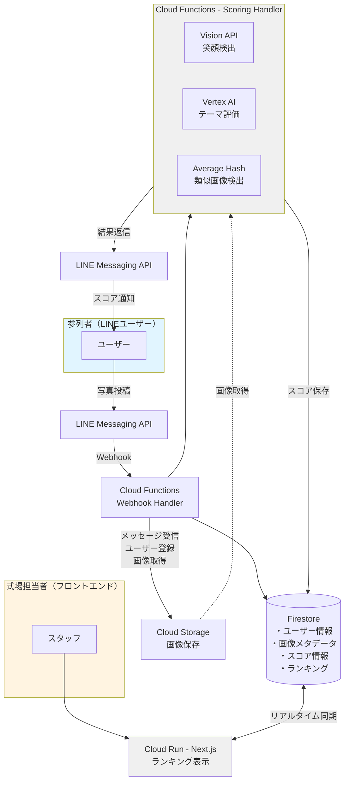
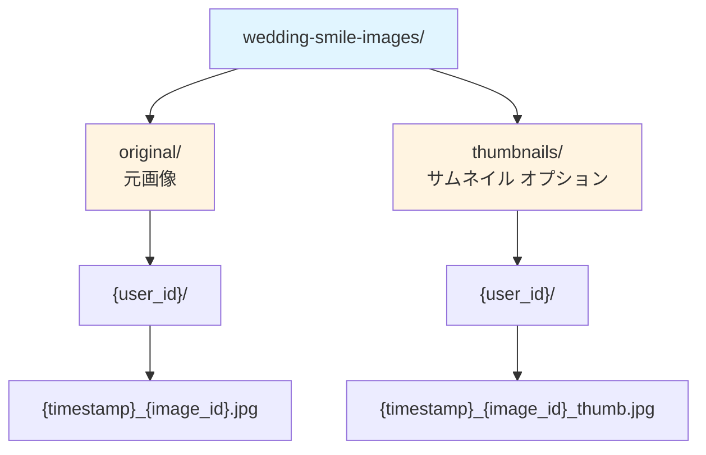
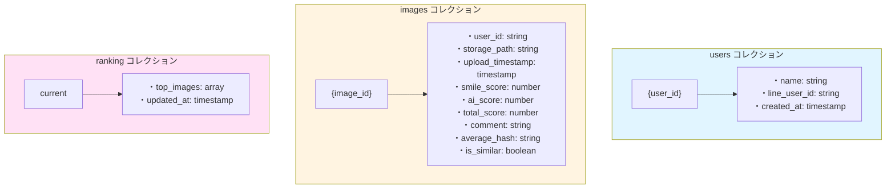
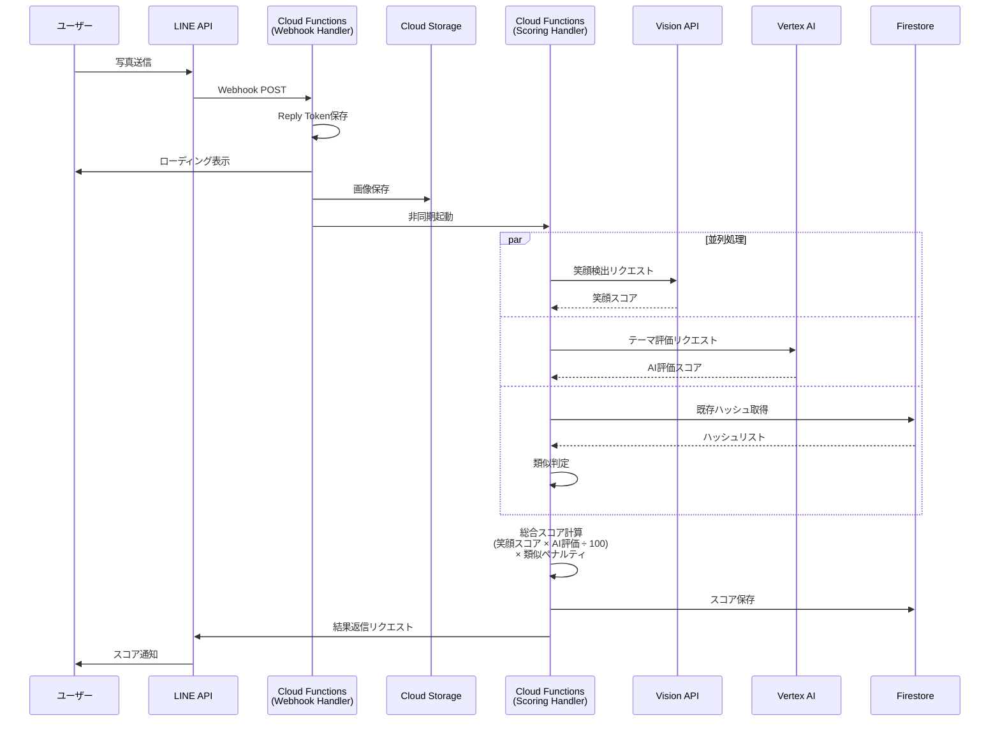
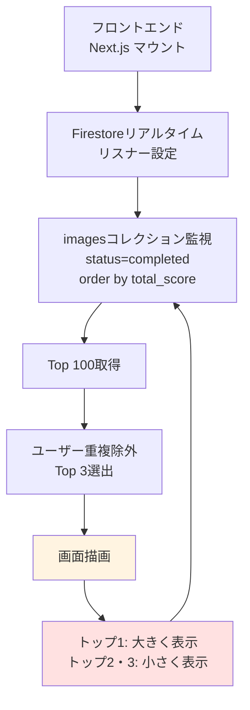

# アーキテクチャ概要

## システムアーキテクチャ図

## コンポーネント説明

### 1. LINE Bot（フロントエンド）

**役割**: ユーザーインターフェース

- 参列者が写真を投稿
- 名前の登録（初回のみ）
- スコア結果の受信

**技術**: LINE Messaging API

### 2. Cloud Functions - Webhook Handler

**役割**: LINE Botからのメッセージ受信・処理

**処理フロー**:
1. LINE Webhookリクエストを受信
2. メッセージタイプを判定（テキスト/画像）
3. テキスト: ユーザー名をFirestoreに保存
4. 画像: Cloud Storageに保存 → Scoring Handlerをトリガー

**実装言語**: Python または Node.js

**主な機能**:
- Webhook検証（署名チェック）
- ユーザー管理
- 画像ダウンロード
- ローディングインジケーター表示

### 3. Cloud Functions - Scoring Handler

**役割**: 画像の分析・スコアリング

**処理フロー**:
1. Cloud Storageから画像取得
2. Cloud Vision APIで笑顔検出
3. Vertex AI (Gemini)でテーマ評価
4. Average Hashで類似画像判定
5. 総合スコア計算
6. Firestoreにスコア保存
7. LINE Botにスコア結果を返信

**実装言語**: Python

**主な機能**:
- 笑顔検出（Vision API）
- 画像評価（Vertex AI）
- 類似画像判定（Average Hash）
- スコア計算ロジック

### 4. Cloud Vision API

**役割**: 顔検出・笑顔検出

**処理内容**:
- 画像から顔を検出
- 各顔の笑顔信頼度（0-100%）を取得
- 笑顔スコアの算出

**入力**: 画像バイト列
**出力**: 顔情報（位置、笑顔信頼度、感情など）

### 5. Vertex AI (Gemini)

**役割**: 画像のテーマ関連性評価

**処理内容**:
- 画像が結婚式に関連しているかを判定
- 0-100点で評価
- コメント生成

**入力**: 画像 + プロンプト
**出力**: スコア + コメント（JSON形式）

### 6. Average Hash（自前実装）

**役割**: 類似画像検出

**処理内容**:
1. 画像をグレースケール化
2. 8x8にリサイズ
3. 平均輝度で2値化
4. 64bitハッシュ生成
5. ハミング距離で類似判定（閾値: 8）

**目的**: 連写された写真にペナルティを課す

### 7. Cloud Storage

**役割**: 画像の永続化ストレージ

**バケット構成**:

### 8. Firestore

**役割**: メタデータ・スコア・ユーザー情報の保存

**コレクション構成**:

### 9. Cloud Run (Next.js)

**役割**: 式中のスクリーン表示用フロントエンド

**画面表示**:
- **ランキング表示**: トップ3をリアルタイム表示
  - トップ1: 大きく表示（メイン表示）
  - トップ2・3: 小さく並べて表示（サブ表示）
- **自動更新**: Firestoreリアルタイムリスナーで即座に反映

**実装**:
- Next.js (App Router)
- Firestoreリアルタイムリスナー
- TailwindCSS
- レスポンシブデザイン

**デプロイ先**: Cloud Run

## データフロー

### 写真投稿フロー

### ランキング表示フロー

## スケーラビリティ

### 同時アクセス対策

- **Cloud Functions**: 自動スケーリング（最大1000インスタンス）
- **Firestore**: 読み取り/書き込みの自動シャーディング
- **Cloud Storage**: 無制限のスループット
- **Cloud Vision API**: リクエストクォータ管理

### コスト最適化

- Cloud Functions: 実行時間課金（アイドル時は無料）
- Firestore: 読み取り/書き込み回数課金
- Vision API: 月1000リクエストまで無料
- Vertex AI: 従量課金

### 想定規模

- 参列者: 50-100人
- 投稿数: 300-500枚
- ピーク時同時投稿: 50件/分
- 式の期間: 3-4時間

## セキュリティ

### 認証・認可

- LINE Webhook: 署名検証必須
- Cloud Functions: 環境変数で秘密情報管理
- Firestore: セキュリティルール設定

### データ保護

- 画像: Cloud Storageの非公開バケット
- 個人情報: Firestoreの暗号化（デフォルト）
- アクセス制御: IAMロールベース

## モニタリング

- **Cloud Logging**: 全ての関数ログ
- **Cloud Monitoring**: メトリクス・アラート
- **Error Reporting**: エラー集約
- **Cloud Trace**: リクエストトレーシング

## 次のステップ

1. [スコアリングアルゴリズム詳細](scoring.md)
2. [データベース設計](database.md)
3. [API仕様](../api/)
