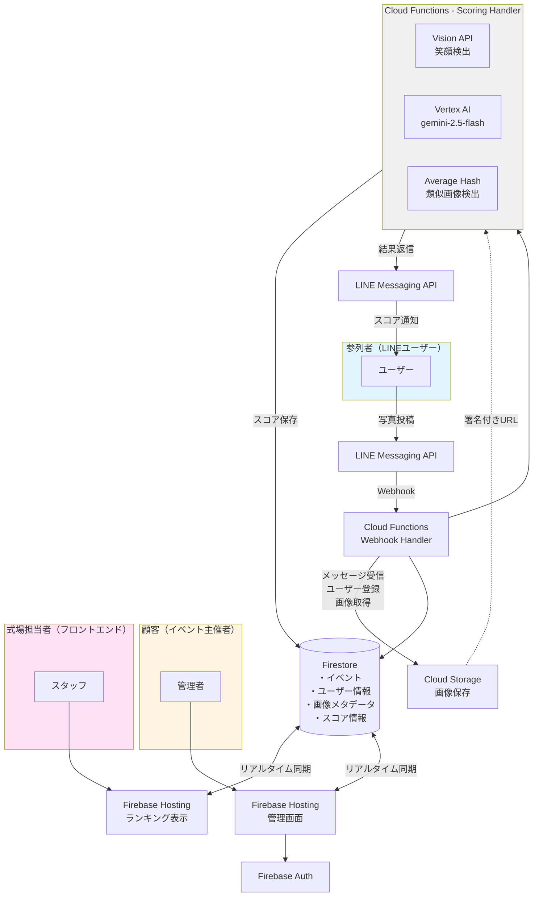
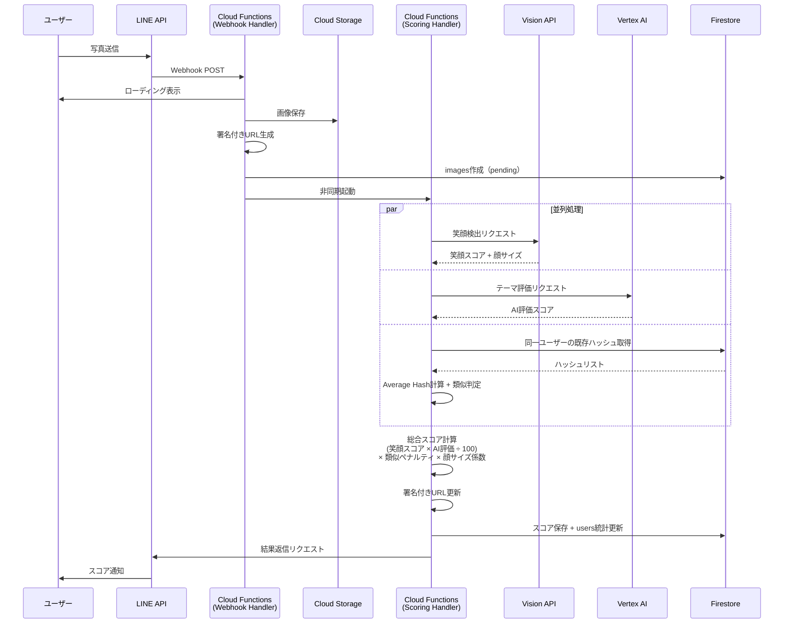
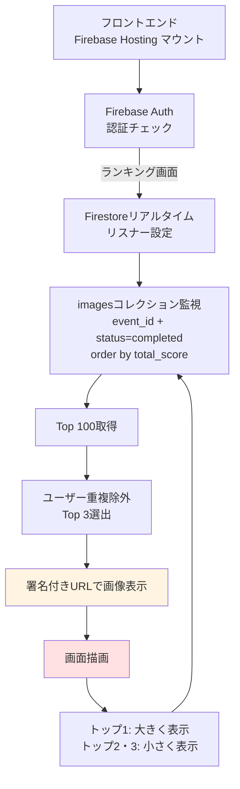

# アーキテクチャ概要

## システムアーキテクチャ図



## マルチテナント対応

本システムはマルチテナントアーキテクチャを採用し、単一デプロイで複数のイベントを同時にサポートします。

### イベント参加フロー

1. 顧客（イベント主催者）がFirebase Authでログインし、管理画面でイベントを作成
2. イベント作成時に一意の`event_code`が生成される
3. ゲストはLINE Botに`JOIN {event_code}`を送信してイベントに参加
4. 名前登録後、写真投稿が可能になる

### データ分離

- `users`コレクション: ドキュメントID = `{line_user_id}_{event_id}`（複合キー）
- `images`コレクション: `event_id`フィールドで分離
- `events`コレクション: `account_id`で顧客に紐付け

## コンポーネント説明

### 1. LINE Bot（ユーザーインターフェース）

**役割**: ゲストが写真を投稿するためのインターフェース

- イベント参加（JOINコマンド）
- 名前の登録
- 写真投稿
- スコア結果の受信

**技術**: LINE Messaging API

### 2. Cloud Functions - Webhook Handler

**役割**: LINE Botからのメッセージ受信・処理

**処理フロー**:
1. LINE Webhookリクエストを受信・署名検証
2. イベントタイプを判定（follow/text/image/unsend）
3. JOINコマンド: イベント参加処理
4. テキスト: 名前登録またはコマンド処理
5. 画像: Cloud Storageに保存 → 署名付きURL生成 → Scoring Handlerをトリガー
6. unsend: 画像データ削除（プライバシー保護）

**実装言語**: Python 3.11

**主な機能**:
- Webhook検証（署名チェック）
- マルチテナント対応（JOINフロー）
- 画像ダウンロード・保存
- 署名付きURL生成
- メッセージ取消対応（unsend）

### 3. Cloud Functions - Scoring Handler

**役割**: 画像の分析・スコアリング

**処理フロー**:
1. Cloud Storageから画像取得
2. 並列処理:
   - Cloud Vision APIで笑顔検出（顔サイズ係数適用）
   - Vertex AI (Gemini)でテーマ評価
   - Average Hashで同一ユーザーの類似画像判定
3. 総合スコア計算
4. 署名付きURL生成/更新
5. Firestoreにスコア保存（トランザクション）
6. LINE Botにスコア結果を返信

**実装言語**: Python 3.11

**主な機能**:
- 笑顔検出（Vision API）
- 画像評価（Vertex AI gemini-2.5-flash）
- 類似画像判定（Average Hash、同一ユーザー内のみ）
- 顔サイズ係数による調整
- スコア計算ロジック

### 4. Cloud Vision API

**役割**: 顔検出・笑顔検出

**処理内容**:
- 画像から顔を検出
- 各顔の笑顔信頼度（joy_likelihood）を取得
- 顔の位置・サイズ情報を取得（顔サイズ係数計算用）
- 笑顔スコアの算出

**入力**: 画像バイト列
**出力**: 顔情報（位置、笑顔信頼度、サイズなど）

### 5. Vertex AI (Gemini)

**役割**: 画像のテーマ関連性評価

**使用モデル**: `gemini-2.5-flash`

**処理内容**:
- 画像が結婚式に関連しているかを判定
- 0-100点で評価
- コメント生成

**入力**: 画像 + プロンプト
**出力**: スコア + コメント（JSON形式）

### 6. Average Hash（自前実装）

**役割**: 類似画像検出

**処理内容**:
1. 画像をグレースケール化
2. 8x8にリサイズ
3. 平均輝度で2値化
4. 64bitハッシュ生成
5. ハミング距離で類似判定（閾値: 8）

**目的**: 連写された写真にペナルティを課す（同一ユーザー内のみ）

### 7. Cloud Storage

**役割**: 画像の永続化ストレージ

**バケット構成**:
```
wedding-smile-images-{project-id}/
└── {event_id}/
    └── original/
        └── {user_id}/
            └── {timestamp}_{image_id}.jpg
```

**セキュリティ**:
- バケットは非公開設定
- 署名付きURLでのみアクセス可能（7日間有効）
- Cloud Storage Lifecycle Policyで自動削除（30日後）

### 8. Firestore

**役割**: メタデータ・スコア・ユーザー情報の保存

**コレクション構成**:
```
accounts/          # 顧客アカウント（Firebase Auth連携）
events/            # イベント情報（event_code, status, account_id）
users/             # ゲスト情報（{line_user_id}_{event_id}）
images/            # 画像メタデータ・スコア・署名付きURL
```

詳細は [database.md](database.md) および `docs/planning/multi-tenant-design.md` を参照

### 9. Firebase Hosting（フロントエンド）

**役割**: 式中のスクリーン表示・管理画面

**画面構成**:
- **ランキング表示** (`index.html`): Firestoreリアルタイムリスナーでトップ3を表示
  - トップ1: 大きく表示（メイン表示）
  - トップ2・3: 小さく並べて表示（サブ表示）
  - スライドショーモード対応
- **管理画面** (`admin.html`): イベント管理、統計ダッシュボード、QRコード生成
- **法的ページ** (`legal.html`): 利用規約、プライバシーポリシー、特定商取引法表記

**実装**:
- Vanilla JavaScript + Firebase SDK
- リアルタイムリスナーでの自動更新
- Firebase Auth（顧客認証）
- レスポンシブデザイン

**デプロイ先**: Firebase Hosting

## データフロー

### 写真投稿フロー



### ランキング表示フロー



## スケーラビリティ

### 同時アクセス対策

- **Cloud Functions**: 自動スケーリング（最大1000インスタンス）
- **Firestore**: 読み取り/書き込みの自動シャーディング
- **Cloud Storage**: 無制限のスループット
- **Cloud Vision API**: リクエストクォータ管理

### コスト最適化

- Cloud Functions: 実行時間課金（アイドル時は無料）
- Firestore: 読み取り/書き込み回数課金
- Vision API: 月1000リクエストまで無料
- Vertex AI: 従量課金
- Firebase Hosting: 無料枠内で十分

### 想定規模

- 参列者: 50-100人
- 投稿数: 300-500枚
- ピーク時同時投稿: 50件/分
- 式の期間: 3-4時間

## セキュリティ

### 認証・認可

- LINE Webhook: 署名検証必須
- Cloud Functions: Secret Managerで秘密情報管理
- Firestore: セキュリティルール設定（イベント単位のアクセス制御）
- Firebase Auth: 顧客（イベント主催者）認証

### データ保護

- 画像: 署名付きURL（7日間有効）でのみアクセス可能
- 個人情報: Firestoreの暗号化（デフォルト）
- アクセス制御: IAMロールベース
- unsend対応: ユーザーがメッセージを取り消すと関連データを完全削除
- 自動削除: Cloud Storage Lifecycle Policy（30日後に画像削除）

### プライバシー保護

- 同意タイムスタンプ（consent_timestamp）を名前登録時に記録
- 法的ページ（利用規約、プライバシーポリシー）を提供
- 画像は顔写真（生体データ）として適切に保護

## モニタリング

- **Cloud Logging**: 全ての関数ログ
- **Cloud Monitoring**: メトリクス・アラート（webhook/scoringエラー率監視）
- **Error Reporting**: エラー集約
- **Cloud Trace**: リクエストトレーシング

## 次のステップ

1. [スコアリングアルゴリズム詳細](scoring.md)
2. [データベース設計](database.md)
3. [マルチテナント設計](../planning/multi-tenant-design.md)
4. [API仕様](../api/)
