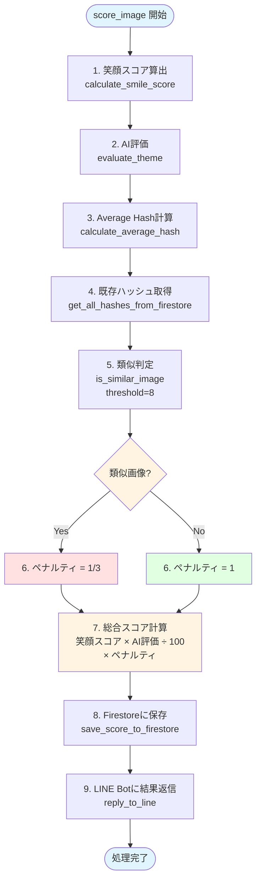

<!-- markdownlint-disable MD024 -->
# スコアリングアルゴリズム

## 概要

このシステムでは、投稿された写真に対して以下の3つの要素からスコアを算出します：

1. **笑顔スコア**: Cloud Vision APIによる笑顔検出
2. **テーマ評価**: Vertex AI (Gemini)による結婚式テーマ関連性評価
3. **類似ペナルティ**: Average Hashによる連写検出

## スコア計算式

### 最終スコア

```
総合スコア = (笑顔スコア × テーマ評価スコア ÷ 100) × 類似ペナルティ
```

### 各要素の詳細

## 1. 笑顔スコア

### 算出方法

Cloud Vision APIの `DetectFaces` 機能を使用し、画像内の全ての顔に対して笑顔の信頼度を取得します。

```python
def calculate_smile_score(image_bytes):
    """
    笑顔スコアを計算

    Returns:
        float: 全ての笑顔の信頼度の合計（0～∞）
    """
    vision_client = vision.ImageAnnotatorClient()
    image = vision.Image(content=image_bytes)
    response = vision_client.face_detection(image=image)

    total_smile_score = 0.0

    for face in response.face_annotations:
        # joyLikelihood を数値化
        # VERY_LIKELY: 0.95
        # LIKELY: 0.75
        # POSSIBLE: 0.5
        # UNLIKELY: 0.25
        # VERY_UNLIKELY: 0.05

        if face.joy_likelihood >= likelihood.LIKELY:
            # 笑顔の場合、信頼度を加算（例: 95.0）
            confidence = get_likelihood_score(face.joy_likelihood)
            total_smile_score += confidence

    return total_smile_score
```

### 特徴

- **人数が多いほど有利**: 複数人が写っている写真ほど高スコア
- **狙い**: グループ間の交流を促進
- **例**:
  - 1人の満面の笑み: 95点
  - 5人の笑顔: 95 × 5 = 475点

### Vision API レスポンス例

```json
{
  "faceAnnotations": [
    {
      "joyLikelihood": "VERY_LIKELY",
      "sorrowLikelihood": "VERY_UNLIKELY",
      "angerLikelihood": "VERY_UNLIKELY",
      "surpriseLikelihood": "VERY_UNLIKELY",
      "boundingPoly": {...},
      "fdBoundingPoly": {...},
      "landmarks": [...]
    }
  ]
}
```

## 2. テーマ評価スコア（AI評価）

### 目的

結婚式と無関係な画像（例: 料理の写真、風景など）を除外し、テーマに沿った写真を評価します。

### 実装

Vertex AI (Gemini) のマルチモーダル機能を使用し、画像とプロンプトを送信して評価を取得します。

```python
def evaluate_theme(image_bytes):
    """
    画像のテーマ関連性を評価

    Returns:
        dict: {"score": int (0-100), "comment": str}
    """
    prompt = """
あなたは結婚式写真の専門家です。提供された写真を分析し、以下の基準に従って笑顔の評価を行ってください：

## 分析対象
- 新郎新婦を中心に、写真に写っている全ての人物の表情を評価
- グループショットの場合は、全体的な雰囲気も考慮

## 評価基準（100点満点）
1. 自然さ（30点）
   - 作り笑いではなく、自然な表情かどうか
   - 緊張が感じられず、リラックスしているか
   - 目元の表情が自然か

2. 幸福度（40点）
   - 純粋な喜びが表現されているか
   - 目が笑っているか（クローズドスマイル）
   - 歯が見える程度の適度な笑顔か

3. 周囲との調和（30点）
   - 周りの人々と笑顔が調和しているか
   - 場面に相応しい表情の大きさか
   - グループ全体で統一感のある雰囲気が出ているか

## 採点方法
コメントについて：
- 具体的な改善点があれば提案
- 特に優れている点は強調

## 注意事項
- 文化的背景や結婚式のスタイルを考慮
- 否定的な表現は避け、建設的なフィードバックを心がける
- プライバシーに配慮した表現を使用

## 出力
JSON形式でscoreとcommentのキーで返却する。JSONのみを出力すること。

例:
{
  "score": 85,
  "comment": "新郎新婦の目元から溢れる自然な喜びが印象的で、周囲の参列者との一体感も素晴らしい"
}
"""

    model = GenerativeModel("gemini-2.5-flash")
    response = model.generate_content([
        Part.from_image(Image.from_bytes(image_bytes)),
        prompt
    ])

    result = json.loads(response.text)
    return result
```

### スコアの意味

| スコア範囲 | 意味 | 例 |
|-----------|------|-----|
| 0点 | 結婚式と無関係 | 料理の写真、風景、物 |
| 1-50点 | テーマから外れている | 表情が硬い、テーマ不一致 |
| 51-75点 | まあまあ良い | 普通の笑顔、雰囲気良好 |
| 76-90点 | 素晴らしい | 自然な笑顔、調和が取れている |
| 91-100点 | 完璧 | 満面の笑み、全体的に幸福感溢れる |

### モデル選択の重要性

**注意**: OpenAI GPT-4o など一部のモデルは「人間に忖度」する傾向があり、無関係な画像にも70点以上をつけることがあります。

**推奨モデル**: Amazon Nova や Gemini は、無関係な画像に対して適切に0点をつける傾向があります。

## 3. 類似ペナルティ

### 目的

連写された写真や類似した構図の写真が大量投稿されるのを防ぎ、多様な写真を収集します。

### Average Hash アルゴリズム

```python
from PIL import Image
import imagehash

def calculate_average_hash(image_bytes):
    """
    Average Hashを計算

    Returns:
        str: 64bitハッシュ値（16進数文字列）
    """
    img = Image.open(io.BytesIO(image_bytes))
    hash_value = imagehash.average_hash(img, hash_size=8)
    return str(hash_value)

def is_similar_image(new_hash, existing_hashes, threshold=8):
    """
    類似画像かどうか判定

    Args:
        new_hash: 新しい画像のハッシュ
        existing_hashes: 既存画像のハッシュリスト
        threshold: ハミング距離の閾値（デフォルト: 8）

    Returns:
        bool: 類似画像が存在する場合True
    """
    new_hash_obj = imagehash.hex_to_hash(new_hash)

    for existing_hash in existing_hashes:
        existing_hash_obj = imagehash.hex_to_hash(existing_hash)
        hamming_distance = new_hash_obj - existing_hash_obj

        if hamming_distance <= threshold:
            return True

    return False
```

### Average Hash の仕組み

1. **グレースケール化**: 画像をグレースケールに変換
2. **リサイズ**: 8×8ピクセルに縮小
3. **平均輝度計算**: 64ピクセルの平均輝度を算出
4. **2値化**: 各ピクセルが平均より明るければ1、暗ければ0
5. **ハッシュ生成**: 64ビットのハッシュ値を生成

### ハミング距離

2つのハッシュ値を比較し、異なるビットの数をカウント。

```
Hash A: 0100011001...
Hash B: 0100010001...
         ↑↑↑↑↑
ハミング距離 = 2
```

**閾値**: 8以下なら類似画像と判定

### ペナルティ適用

```python
similarity_penalty = 1/3 if is_similar else 1

total_score = (smile_score * ai_score / 100) * similarity_penalty
```

類似画像の場合、スコアを **1/3 に減点** します。

### 類似判定の例

| ケース | ハミング距離 | 判定 |
|--------|------------|------|
| 同じ画像 | 0 | 類似 |
| 連写（微妙に違う） | 3-5 | 類似 |
| 同じ場所、違うポーズ | 8-12 | 非類似 |
| 全く別の写真 | 20+ | 非類似 |

## スコアリング処理フロー



**処理の詳細（Python実装例）:**
```python
async def score_image(image_id, image_bytes, user_id):
    """
    画像をスコアリング
    """
    # 1. 笑顔スコア算出
    smile_score = await calculate_smile_score(image_bytes)

    # 2. AI評価
    ai_result = await evaluate_theme(image_bytes)
    ai_score = ai_result["score"]
    comment = ai_result["comment"]

    # 3. Average Hash計算
    new_hash = calculate_average_hash(image_bytes)

    # 4. 既存ハッシュ取得
    existing_hashes = await get_all_hashes_from_firestore()

    # 5. 類似判定
    is_similar = is_similar_image(new_hash, existing_hashes, threshold=8)

    # 6. ペナルティ計算
    penalty = 1/3 if is_similar else 1

    # 7. 総合スコア
    total_score = (smile_score * ai_score / 100) * penalty

    # 8. Firestoreに保存
    await save_score_to_firestore(
        image_id=image_id,
        user_id=user_id,
        smile_score=smile_score,
        ai_score=ai_score,
        total_score=total_score,
        comment=comment,
        average_hash=new_hash,
        is_similar=is_similar
    )

    # 9. LINE Botに結果返信
    await reply_to_line(user_id, total_score, comment, is_similar)
```

## スコア例

### 例1: 満面の笑顔（5人グループ）

```
笑顔スコア: 95 + 90 + 92 + 88 + 93 = 458
AI評価: 85点
類似: なし（ペナルティ = 1）

総合スコア = (458 × 85 ÷ 100) × 1 = 389.3
```

### 例2: 1人の笑顔（類似画像）

```
笑顔スコア: 95
AI評価: 90点
類似: あり（ペナルティ = 1/3）

総合スコア = (95 × 90 ÷ 100) × (1/3) = 28.5
```

### 例3: 料理の写真

```
笑顔スコア: 0（人が写っていない）
AI評価: 0点（結婚式と無関係）

総合スコア = (0 × 0 ÷ 100) × 1 = 0
```

## フォールバック設計（API障害時）

外部APIの障害時にもシステム全体が機能し続けるよう、グレースフルデグラデーション方式を採用する。
生存している方の実測値 + 乱数で自然なばらつきを持たせる。

### フォールバックマトリクス

| Vision API | Gemini | smile_score | ai_score | similarity_penalty |
|-----------|--------|-------------|----------|--------------------|
| ✅ 正常 | ✅ 正常 | 実測値 | 実測値 | 実測値 |
| ✅ 正常 | ❌ 障害 | 実測値 | `random(60, 85)` | 実測値 |
| ❌ 障害 | ✅ 正常 | `random(50, 150)` | 実測値 | 実測値 |
| ❌ 障害 | ❌ 障害 | `random(50, 150)` | `random(60, 85)` | 実測値 |

### 乱数レンジの根拠

- **ai_score: 60-85** — Geminiの実際の採点分布の中央寄り。極端な高スコアや低スコアを避ける
- **smile_score: 50-150** — 1〜2人の笑顔相当。人数が不明のため控えめに設定し、ランキング上位を独占しないようにする
- **similarity_penalty** — Average Hashはローカル計算（PIL/imagehash）のため、外部API障害時も常に実測値を使用

### ユーザーへの通知

障害時はスコア結果メッセージに警告を付与する（既存実装と同様）:
```
⚠️ AI評価でエラーが発生しました。推定値を使用しています。
```

### 設計方針

- 「外部障害 = サービス停止」ではなく「外部障害 = 品質は下がるが動き続ける」
- フォールバックスコアは控えめに設定し、実測スコアの公平性を維持する
- 障害発生はログに記録し、Cloud Monitoringでアラート通知する

---

## チューニングポイント

### 調整可能なパラメータ

1. **類似判定閾値**: デフォルト8（厳しくするなら5、緩くするなら12）
2. **類似ペナルティ**: デフォルト1/3（もっと厳しくするなら1/5）
3. **AI評価の重み**: 現在は100%反映（50%にするなど調整可能）

### 本番調整の注意

結婚式は **一度きり** なので、事前に十分テストすることが重要です。

## 次のステップ

- [データベース設計](database.md)
- [API仕様](../api/scoring.md)
