# Frontend API 仕様

## 概要

Wedding Smile CatcherのフロントエンドはNext.jsで構築され、Cloud Runにデプロイされます。Firestoreのリアルタイムリスナーを使用して、投稿された写真とランキングを式中のスクリーンに表示します。

## アーキテクチャ

```mermaid
graph LR
    A[Cloud Run<br/>Next.js] --> B[Firestore<br/>リアルタイム同期]
    A --> C[Cloud Storage<br/>画像取得]
    B --> D[imagesコレクション]
    B --> E[rankingコレクション]
    A --> F[式場スクリーン]
```



## 画面モード

### ランキングモード

トップ3を表示（ユーザー重複なし）

**表示形式**:
- トップ1: 大きく表示（メイン）
- トップ2・3: 小さく表示（サブ）

**用途**: 式中のスクリーン表示（常時表示）

**URL**: `/` または `/ranking`

## Firestoreとの接続

### セットアップ

```typescript
// lib/firebase.ts
import { initializeApp } from 'firebase/app';
import { getFirestore } from 'firebase/firestore';

const firebaseConfig = {
  apiKey: process.env.NEXT_PUBLIC_FIREBASE_API_KEY,
  authDomain: process.env.NEXT_PUBLIC_FIREBASE_AUTH_DOMAIN,
  projectId: process.env.NEXT_PUBLIC_FIREBASE_PROJECT_ID,
  storageBucket: process.env.NEXT_PUBLIC_FIREBASE_STORAGE_BUCKET,
};

const app = initializeApp(firebaseConfig);
export const db = getFirestore(app);
```

### リアルタイムリスナー

```typescript
// hooks/useRealTimeRanking.ts
import { useState, useEffect } from 'react';
import { collection, query, orderBy, limit, onSnapshot, where } from 'firebase/firestore';
import { db } from '@/lib/firebase';

export interface Image {
  id: string;
  user_id: string;
  total_score: number;
  upload_timestamp: Date;
  storage_path: string;
  comment: string;
  face_count: number;
  is_similar: boolean;
}

export interface RankedImage extends Image {
  userName: string;
  rank: number;
}

export function useRealTimeRanking(topN: number = 3) {
  const [ranking, setRanking] = useState<RankedImage[]>([]);
  const [loading, setLoading] = useState(true);
  const [error, setError] = useState<Error | null>(null);

  useEffect(() => {
    // imagesコレクションをリアルタイムで監視
    const imagesQuery = query(
      collection(db, 'images'),
      where('status', '==', 'completed'),
      orderBy('total_score', 'desc'),
      limit(100)
    );

    const unsubscribe = onSnapshot(
      imagesQuery,
      async (snapshot) => {
        try {
          const seenUsers = new Set<string>();
          const topRanked: RankedImage[] = [];

          for (const doc of snapshot.docs) {
            const data = doc.data();
            const userId = data.user_id;

            if (seenUsers.has(userId)) continue;

            // ユーザー名を取得
            const userDoc = await db.collection('users').doc(userId).get();
            const userName = userDoc.data()?.name || '名無し';

            topRanked.push({
              id: doc.id,
              user_id: userId,
              userName,
              total_score: data.total_score,
              upload_timestamp: data.upload_timestamp?.toDate(),
              storage_path: data.storage_path,
              comment: data.comment,
              face_count: data.face_count,
              is_similar: data.is_similar,
              rank: topRanked.length + 1,
            });

            seenUsers.add(userId);

            if (topRanked.length === topN) break;
          }

          setRanking(topRanked);
          setLoading(false);
        } catch (err) {
          setError(err as Error);
          setLoading(false);
        }
      },
      (err) => {
        setError(err);
        setLoading(false);
      }
    );

    return () => unsubscribe();
  }, [topN]);

  return { ranking, loading, error };
}
```

## ランキングモード実装

### ランキングページ

```typescript
// app/page.tsx (メインページ)
'use client';

import { useRealTimeRanking } from '@/hooks/useRealTimeRanking';
import RankingDisplay from '@/components/RankingDisplay';

export default function HomePage() {
  const { ranking, loading, error } = useRealTimeRanking(3);

  if (loading) {
    return (
      <div className="flex items-center justify-center h-screen bg-gradient-to-br from-yellow-50 to-orange-50">
        <div className="text-3xl font-bold">Loading...</div>
      </div>
    );
  }

  if (error) {
    return (
      <div className="flex items-center justify-center h-screen bg-gradient-to-br from-yellow-50 to-orange-50">
        <div className="text-3xl font-bold text-red-500">Error: {error.message}</div>
      </div>
    );
  }

  if (ranking.length === 0) {
    return (
      <div className="flex items-center justify-center h-screen bg-gradient-to-br from-yellow-50 to-orange-50">
        <div className="text-center">
          <div className="text-5xl mb-4">📸</div>
          <div className="text-3xl font-bold">投稿をお待ちしています...</div>
        </div>
      </div>
    );
  }

  return (
    <div className="min-h-screen bg-gradient-to-br from-yellow-50 to-orange-50 p-8">
      <div className="max-w-7xl mx-auto">
        <h1 className="text-6xl font-bold text-center mb-12 text-yellow-700">
          🏆 ランキング 🏆
        </h1>
        <RankingDisplay ranking={ranking} />
      </div>
    </div>
  );
}
```

### ランキング表示コンポーネント

```typescript
// components/RankingDisplay.tsx
import Image from 'next/image';
import { RankedImage } from '@/hooks/useRealTimeRanking';
import { getImageUrl } from '@/lib/storage';

interface Props {
  ranking: RankedImage[];
}

const RANK_MEDALS = ['🥇', '🥈', '🥉'];

export default function RankingDisplay({ ranking }: Props) {
  const [first, second, third] = ranking;

  return (
    <div className="space-y-8">
      {/* トップ1 - 大きく表示 */}
      {first && (
        <div className="bg-gradient-to-r from-yellow-400 to-yellow-600 rounded-2xl shadow-2xl p-2">
          <div className="bg-white rounded-xl p-8">
            <div className="flex items-center justify-center mb-6">
              <div className="text-8xl">{RANK_MEDALS[0]}</div>
              <div className="ml-6">
                <div className="text-4xl font-bold">{first.userName}</div>
                <div className="text-6xl font-bold text-yellow-600 mt-2">
                  {first.total_score.toFixed(1)}点
                </div>
              </div>
            </div>

            <div className="relative aspect-video rounded-xl overflow-hidden shadow-lg">
              <Image
                src={getImageUrl(first.storage_path)}
                alt="1位"
                fill
                className="object-cover"
              />
            </div>

            <div className="mt-6 bg-yellow-50 rounded-lg p-6">
              <p className="text-2xl text-gray-700 text-center">{first.comment}</p>
            </div>

            <div className="mt-4 flex justify-center items-center space-x-4">
              <span className="text-3xl">😊</span>
              <span className="text-2xl font-semibold">{first.face_count}人</span>
            </div>
          </div>
        </div>
      )}

      {/* トップ2・3 - 小さく並べて表示 */}
      <div className="grid grid-cols-2 gap-6">
        {/* トップ2 */}
        {second && (
          <div className="bg-gradient-to-r from-gray-300 to-gray-500 rounded-xl shadow-xl p-1.5">
            <div className="bg-white rounded-lg p-6">
              <div className="flex items-center mb-4">
                <div className="text-5xl">{RANK_MEDALS[1]}</div>
                <div className="ml-4">
                  <div className="text-2xl font-bold">{second.userName}</div>
                  <div className="text-4xl font-bold text-gray-600">
                    {second.total_score.toFixed(1)}点
                  </div>
                </div>
              </div>

              <div className="relative aspect-video rounded-lg overflow-hidden">
                <Image
                  src={getImageUrl(second.storage_path)}
                  alt="2位"
                  fill
                  className="object-cover"
                />
              </div>

              <div className="mt-4 bg-gray-50 rounded p-3">
                <p className="text-sm text-gray-700">{second.comment}</p>
              </div>

              <div className="mt-3 flex items-center space-x-2">
                <span className="text-xl">😊</span>
                <span className="text-lg font-semibold">{second.face_count}人</span>
              </div>
            </div>
          </div>
        )}

        {/* トップ3 */}
        {third && (
          <div className="bg-gradient-to-r from-orange-400 to-orange-600 rounded-xl shadow-xl p-1.5">
            <div className="bg-white rounded-lg p-6">
              <div className="flex items-center mb-4">
                <div className="text-5xl">{RANK_MEDALS[2]}</div>
                <div className="ml-4">
                  <div className="text-2xl font-bold">{third.userName}</div>
                  <div className="text-4xl font-bold text-orange-600">
                    {third.total_score.toFixed(1)}点
                  </div>
                </div>
              </div>

              <div className="relative aspect-video rounded-lg overflow-hidden">
                <Image
                  src={getImageUrl(third.storage_path)}
                  alt="3位"
                  fill
                  className="object-cover"
                />
              </div>

              <div className="mt-4 bg-orange-50 rounded p-3">
                <p className="text-sm text-gray-700">{third.comment}</p>
              </div>

              <div className="mt-3 flex items-center space-x-2">
                <span className="text-xl">😊</span>
                <span className="text-lg font-semibold">{third.face_count}人</span>
              </div>
            </div>
          </div>
        )}
      </div>
    </div>
  );
}
```

## Cloud Storage画像URL取得

```typescript
// lib/storage.ts
export function getImageUrl(storagePath: string): string {
  const bucket = process.env.NEXT_PUBLIC_STORAGE_BUCKET;
  const projectId = process.env.NEXT_PUBLIC_FIREBASE_PROJECT_ID;

  // Public URL (バケットが公開設定の場合)
  return `https://storage.googleapis.com/${bucket}/${storagePath}`;

  // または署名付きURL（サーバーサイドで生成）
  // return `/api/images/${encodeURIComponent(storagePath)}`;
}
```

### 署名付きURL API（オプション）

```typescript
// app/api/images/[...path]/route.ts
import { NextRequest, NextResponse } from 'next/server';
import { Storage } from '@google-cloud/storage';

const storage = new Storage();

export async function GET(
  request: NextRequest,
  { params }: { params: { path: string[] } }
) {
  const storagePath = params.path.join('/');
  const bucket = storage.bucket(process.env.STORAGE_BUCKET!);
  const file = bucket.file(storagePath);

  try {
    const [url] = await file.getSignedUrl({
      version: 'v4',
      action: 'read',
      expires: Date.now() + 15 * 60 * 1000, // 15 minutes
    });

    return NextResponse.redirect(url);
  } catch (error) {
    return NextResponse.json(
      { error: 'Image not found' },
      { status: 404 }
    );
  }
}
```

## 環境変数

`.env.local`ファイル:

```bash
NEXT_PUBLIC_FIREBASE_API_KEY=your-api-key
NEXT_PUBLIC_FIREBASE_AUTH_DOMAIN=your-project.firebaseapp.com
NEXT_PUBLIC_FIREBASE_PROJECT_ID=your-project-id
NEXT_PUBLIC_FIREBASE_STORAGE_BUCKET=your-bucket.appspot.com
NEXT_PUBLIC_STORAGE_BUCKET=wedding-smile-images
```

## デプロイ

### Dockerfileの作成

```dockerfile
FROM node:20-alpine AS base

# Dependencies
FROM base AS deps
WORKDIR /app
COPY package*.json ./
RUN npm ci

# Build
FROM base AS builder
WORKDIR /app
COPY --from=deps /app/node_modules ./node_modules
COPY . .
RUN npm run build

# Production
FROM base AS runner
WORKDIR /app

ENV NODE_ENV=production
ENV PORT=8080

RUN addgroup --system --gid 1001 nodejs
RUN adduser --system --uid 1001 nextjs

COPY --from=builder /app/public ./public
COPY --from=builder --chown=nextjs:nodejs /app/.next/standalone ./
COPY --from=builder --chown=nextjs:nodejs /app/.next/static ./.next/static

USER nextjs

EXPOSE 8080

CMD ["node", "server.js"]
```

### Cloud Runへのデプロイ

```bash
# ビルド
gcloud builds submit --tag gcr.io/${PROJECT_ID}/wedding-smile-frontend

# デプロイ
gcloud run deploy wedding-smile-frontend \
  --image gcr.io/${PROJECT_ID}/wedding-smile-frontend \
  --platform managed \
  --region asia-northeast1 \
  --allow-unauthenticated \
  --set-env-vars="NEXT_PUBLIC_FIREBASE_PROJECT_ID=${PROJECT_ID}"
```

## パフォーマンス最適化

### 画像の最適化

```typescript
// next.config.js
module.exports = {
  images: {
    domains: ['storage.googleapis.com'],
    formats: ['image/avif', 'image/webp'],
  },
};
```

### キャッシング

```typescript
// Firestoreクエリのキャッシュ
import { enableIndexedDbPersistence } from 'firebase/firestore';

try {
  await enableIndexedDbPersistence(db);
} catch (err) {
  console.error('Persistence failed:', err);
}
```

## 次のステップ

- [セットアップガイド](../setup/gcp-setup.md)
- [ローカル開発環境](../setup/local-dev.md)
