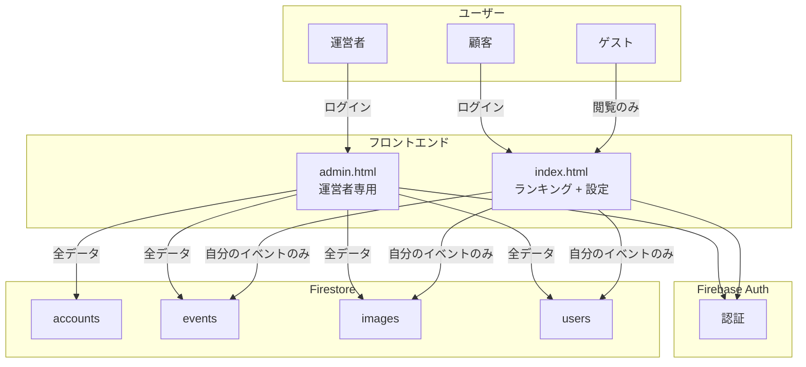
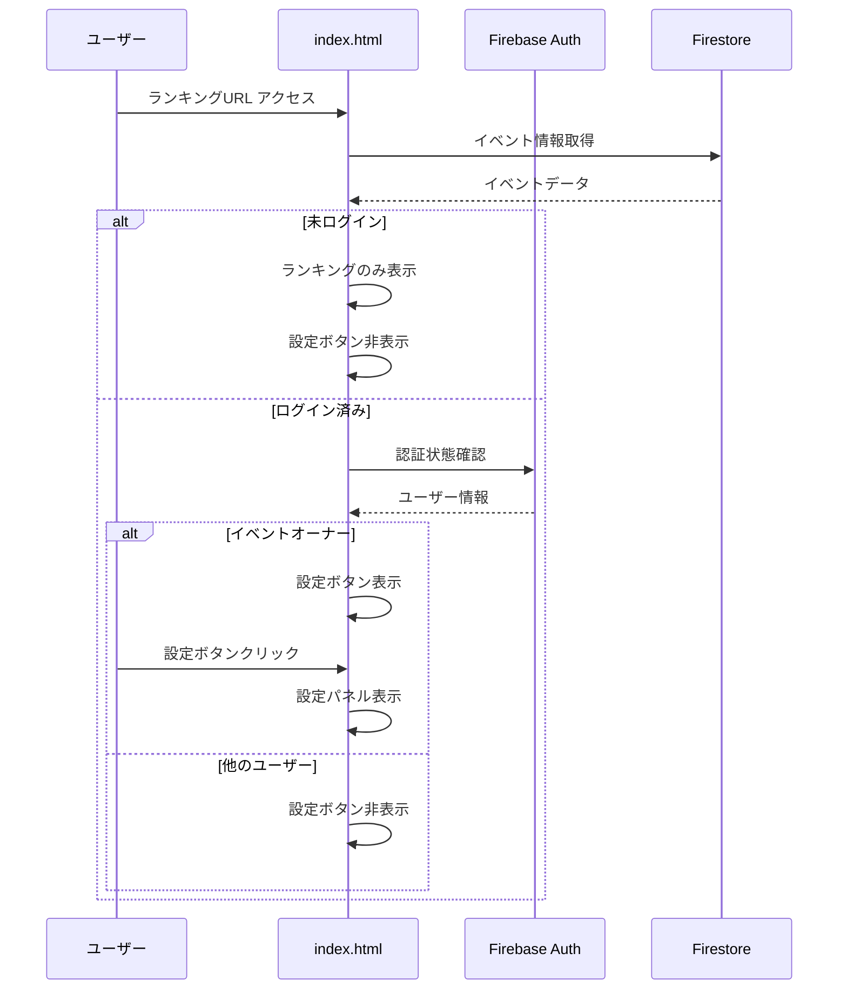
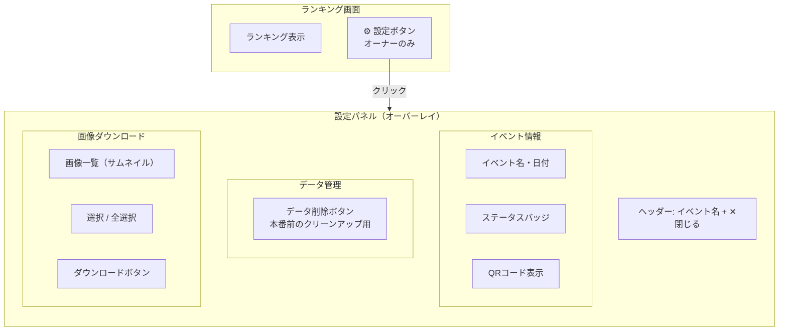
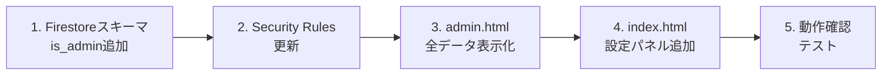

# 管理者ページと顧客設定ページのリアーキテクチャ 設計書

最終更新: 2026-01-29

---

## Overview

管理画面（admin.html）を運営者専用に変更し、顧客向けには最小限の設定機能のみをランキング画面（index.html）に提供する。

**変更前:**

```
admin.html → 顧客 + 運営者が共用（イベント作成、ステータス管理など）
```

**変更後:**

```
admin.html  → 運営者専用（イベント作成、ステータス管理、全データ管理）
index.html  → 顧客向け（ランキング表示 + QRコード・画像ダウンロードのみ）
```

---

## Purpose

### なぜこの変更が必要か

1. **顧客体験のシンプル化**
   - 顧客は「ランキングが表示されれば使える」状態が理想
   - イベント作成やステータス管理は運営者に任せる
   - 顧客が必要な機能はQRコード取得と画像ダウンロードのみ

2. **運営者の利便性**
   - 全イベント・全顧客のデータを俯瞰できる
   - イベント作成からステータス管理まで一元管理

3. **明確な責務分離**
   - 管理画面: システム管理 + イベント管理（運営者）
   - ランキング画面: イベント閲覧 + 最小限の設定（顧客）

### 代替案

| 案 | メリット | デメリット |
|----|----------|------------|
| **A. 現状維持（1つのadmin.html）** | 実装済み、変更不要 | 顧客UXが悪い、運営者が全データを見づらい |
| **B. admin.html + customer.html** | 明確な分離 | 新規ページ追加、URLが増える |
| **C. admin.html + index.html統合（採用）** | ランキングURLを活用、自然なUX | index.htmlの複雑化 |

### 採用案: C. admin.html + index.html統合

理由:
- ランキングURLは既に顧客に共有される（QRコードにも記載）
- 顧客は新しいURLを覚える必要がない
- 設定パネルはオーナーのみに表示されるため、ゲストには影響なし

---

## What to Do

### 機能要件

#### admin.html（運営者専用）

| 機能 | 変更 | 説明 |
|------|------|------|
| 認証 | 変更 | 運営者アカウントのみログイン可能 |
| イベント一覧 | 変更 | 全イベント表示（account_idフィルタ削除） |
| 画像一覧 | 変更 | 全画像表示 |
| ユーザー一覧 | 変更 | 全ユーザー表示 |
| 統計 | 変更 | 全体統計 + イベント別フィルタ |
| アカウント一覧 | 新規 | 顧客アカウント一覧・管理 |

#### index.html（ランキング + 顧客設定）

| 機能 | 変更 | 説明 |
|------|------|------|
| ランキング表示 | 維持 | 既存機能そのまま |
| スライドショー | 維持 | 既存機能そのまま |
| 設定ボタン | 新規 | オーナーのみ表示、クリックで設定パネル表示 |
| 設定パネル | 新規 | イベント管理機能（後述） |

#### 設定パネルの機能（顧客向け・最小限）

| 機能 | 説明 |
|------|------|
| イベント情報表示 | イベント名、日付、ステータス（読み取り専用） |
| QRコード表示 | ゲスト配布用QRコード |
| データ削除 | 本番前のテストデータ削除（論理削除） |
| 画像ダウンロード | 選択またはすべての画像をZIPダウンロード |

**運営者が担当する機能（admin.htmlで実施）:**
- イベント作成
- ステータス変更（draft → active → archived）
- 全データ管理（物理削除・復元を含む）

### 論理削除の設計

誤削除時の復旧を可能にするため、顧客による削除は論理削除とする。

```
images/{image_id}
  - deleted_at: timestamp | null  ← 削除日時（nullなら有効）

users/{user_id}
  - deleted_at: timestamp | null  ← 削除日時（nullなら有効）
```

| 操作 | 実行者 | 方式 | 説明 |
|------|--------|------|------|
| データ削除 | 顧客 | 論理削除 | `deleted_at` に現在時刻を設定 |
| データ復元 | 運営者 | 論理削除解除 | `deleted_at` を null に設定 |
| 完全削除 | 運営者 | 物理削除 | ドキュメント自体を削除 |

**表示時のフィルタ:**
- ランキング画面: `deleted_at == null` のデータのみ表示
- 管理画面: 全データ表示（削除済みも含む、フィルタ切り替え可能）

### 非機能要件

| 要件 | 値 |
|------|-----|
| 認証方式 | Firebase Authentication |
| 認可方式 | Firestoreルール + フロントエンドチェック |
| レスポンシブ | スマホ対応（設定パネル） |
| パフォーマンス | 設定パネルは遅延ロード |

---

## How to Do It

### システムアーキテクチャ



### 認証・認可フロー



### 設定パネルUI設計（顧客向け）



**UI構成:** シンプルな1画面。イベント情報 + QRコード + データ削除 + 画像ダウンロード

### データ構造

#### Firestoreコレクション（変更なし）

既存のスキーマをそのまま使用:

```
accounts/{account_id}
  - email: string
  - display_name: string
  - is_admin: boolean  ← 新規追加（運営者フラグ）
  - created_at: timestamp

events/{event_id}
  - account_id: string  ← オーナー識別に使用
  - event_name: string
  - event_code: string
  - status: string
  - ...

images/{image_id}
  - event_id: string
  - ...

users/{user_id}
  - event_id: string
  - ...
```

#### accountsコレクションへの追加フィールド

| フィールド | 型 | 説明 |
|-----------|-----|------|
| `is_admin` | boolean | true: 運営者、false/未設定: 顧客 |

### Firestore Security Rules 変更

```javascript
rules_version = '2';
service cloud.firestore {
  match /databases/{database}/documents {

    // 運営者かどうかを判定
    function isAdmin() {
      return request.auth != null &&
        get(/databases/$(database)/documents/accounts/$(request.auth.uid)).data.is_admin == true;
    }

    // イベントオーナーかどうかを判定
    function isEventOwner(eventId) {
      return request.auth != null &&
        get(/databases/$(database)/documents/events/$(eventId)).data.account_id == request.auth.uid;
    }

    // accounts: 運営者は全件、顧客は自分のみ
    match /accounts/{accountId} {
      allow read: if request.auth != null && (isAdmin() || request.auth.uid == accountId);
      allow write: if isAdmin();
    }

    // events: 運営者は全件、顧客は自分のイベントのみ、activeはゲストも閲覧可
    match /events/{eventId} {
      allow read: if isAdmin() || isEventOwner(eventId) ||
        resource.data.status == 'active';
      allow create: if request.auth != null;
      allow update, delete: if isAdmin() || isEventOwner(eventId);
    }

    // images: 公開読み取り、書き込みは運営者またはオーナー
    match /images/{imageId} {
      allow read: if true;
      allow write: if isAdmin() ||
        isEventOwner(resource.data.event_id);
    }

    // users: 公開読み取り、書き込みは運営者またはオーナー
    match /users/{odcId} {
      allow read: if true;
      allow write: if isAdmin() ||
        isEventOwner(resource.data.event_id);
    }
  }
}
```

### 変更ファイル一覧

| ファイル | 変更内容 |
|----------|----------|
| `src/frontend/js/admin.js` | account_idフィルタ削除、全データ表示、アカウント管理タブ追加 |
| `src/frontend/admin.html` | アカウント管理タブUI追加 |
| `src/frontend/js/app.js` | 設定パネル機能追加、認証連携 |
| `src/frontend/index.html` | 設定ボタン・パネルUI追加 |
| `src/frontend/css/app.css` | 設定パネルスタイル追加 |
| `firestore.rules` | is_admin判定、認可ルール更新 |

### 実装順序



#### Phase 1: バックエンド準備

1. accountsコレクションに `is_admin` フィールド追加（運営者アカウントのみ true）
2. Firestore Security Rules 更新

#### Phase 2: admin.html 変更

1. `account_id` フィルタを削除し、全データ表示
2. アカウント管理タブを追加（運営者向け）

#### Phase 3: index.html 設定パネル追加

1. 認証機能追加（ログイン/ログアウト）
2. 設定ボタン追加（オーナーのみ表示）
3. 設定パネルUI実装
4. 各機能（QR表示、ダウンロード）を移植

---

## What We Won't Do

| 除外項目 | 理由 |
|----------|------|
| customer.html 新規作成 | index.htmlへの統合で対応 |
| 複数イベント切り替えUI | 顧客は通常1イベントのみ運用。URLで切り替え |
| 運営者のイベント作成UI | 顧客がセルフサービスで作成。運営者は直接Firestore操作可 |
| ロールベースアクセス制御（RBAC） | is_adminのみで十分。細かい権限分けは不要 |

---

## Concerns

### 懸念事項と対策

| 懸念 | リスク | 対策 |
|------|--------|------|
| index.htmlの複雑化 | 中 | 設定パネルを別ファイル（settings-panel.js）に分離 |
| 認証状態の管理 | 低 | Firebase Auth の onAuthStateChanged で一元管理 |
| モバイル対応 | 中 | 設定パネルをフルスクリーンモーダルで表示 |
| 既存機能への影響 | 中 | ランキング表示ロジックには手を加えない |

### 未解決の論点

1. **顧客のログイン導線**
   - 選択肢A: ランキング画面に「ログイン」ボタンを常時表示
   - 選択肢B: URLパラメータ `?settings=1` でログイン画面を表示
   - 選択肢C: 設定ボタンクリック時にログインを促す
   - **推奨: C**（ゲストに余計なUIを見せない）

2. **運営者アカウントの作成方法**
   - 選択肢A: 手動でFirestoreに `is_admin: true` を設定
   - 選択肢B: 特定メールドメインを運営者として扱う
   - **推奨: A**（シンプル、運営者は少数）

3. **顧客アカウントの作成方法**
   - 運営者がadmin.htmlでイベント作成時に顧客アカウントも作成
   - 顧客にはメール + 初期パスワードを通知
   - 顧客はランキング画面からログインして設定パネルにアクセス

---

## Reference Materials/Information

- 既存設計: `docs/planning/mvp-features.md`
- マルチテナント設計: `docs/planning/multi-tenant-design.md`
- セキュリティ要件: `docs/planning/security-requirements.md`
- Firebase Auth ドキュメント: <https://firebase.google.com/docs/auth>
- Firestore Security Rules: <https://firebase.google.com/docs/firestore/security/get-started>

---

## 実装チェックリスト

```
Phase 1: バックエンド準備
□ 運営者アカウントに is_admin: true を設定
□ Firestore Security Rules 更新・デプロイ

Phase 2: admin.html 変更
□ ownedEventIds フィルタロジック削除
□ 全イベント・全データ表示に変更
□ アカウント管理タブ追加
□ 顧客アカウント作成機能（運営者がイベントと共に作成）

Phase 3: index.html 設定パネル追加
□ Firebase Auth 連携追加
□ 設定ボタンUI追加（オーナーのみ表示）
□ 設定パネルUI実装
□ イベント情報・QRコード表示
□ 画像ダウンロード機能

Phase 4: テスト
□ 運営者でadmin.htmlにアクセス → 全データ表示確認
□ 顧客でindex.htmlにアクセス → 設定パネル表示確認
□ ゲストでindex.htmlにアクセス → 設定ボタン非表示確認
□ Security Rules が正しく動作することを確認
```
