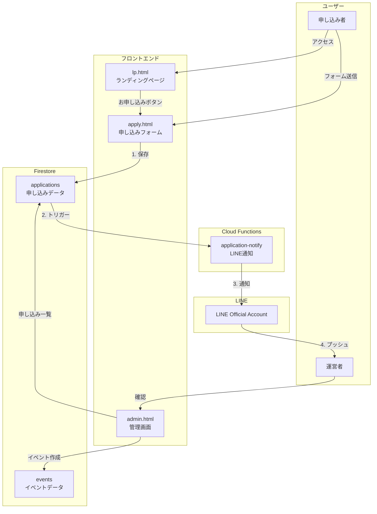
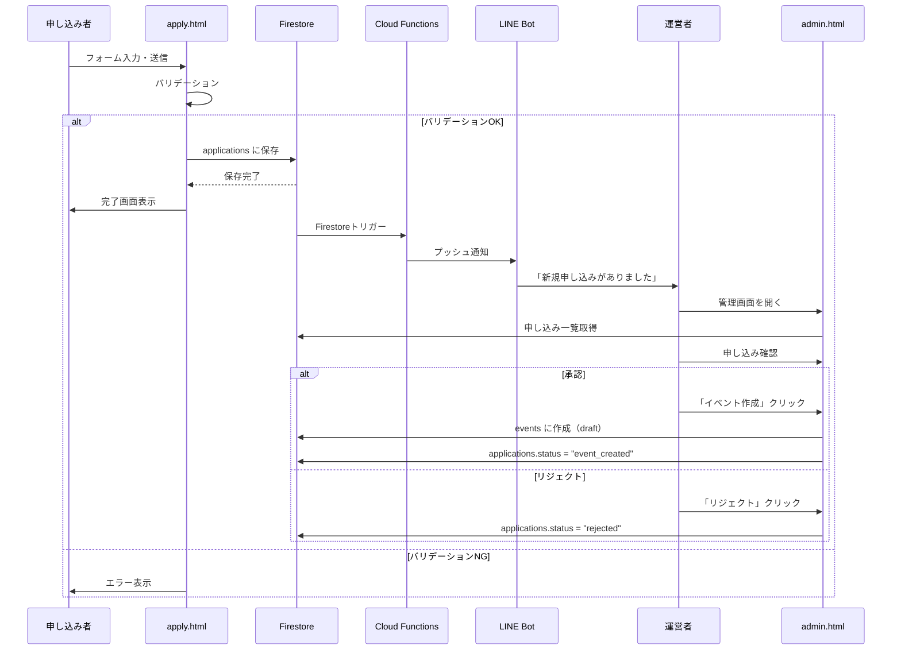
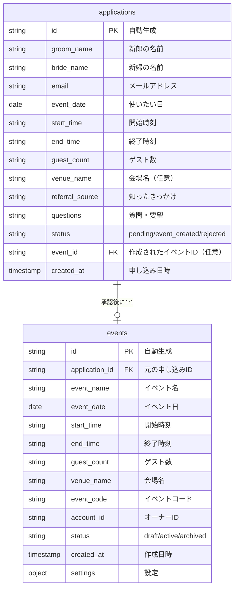
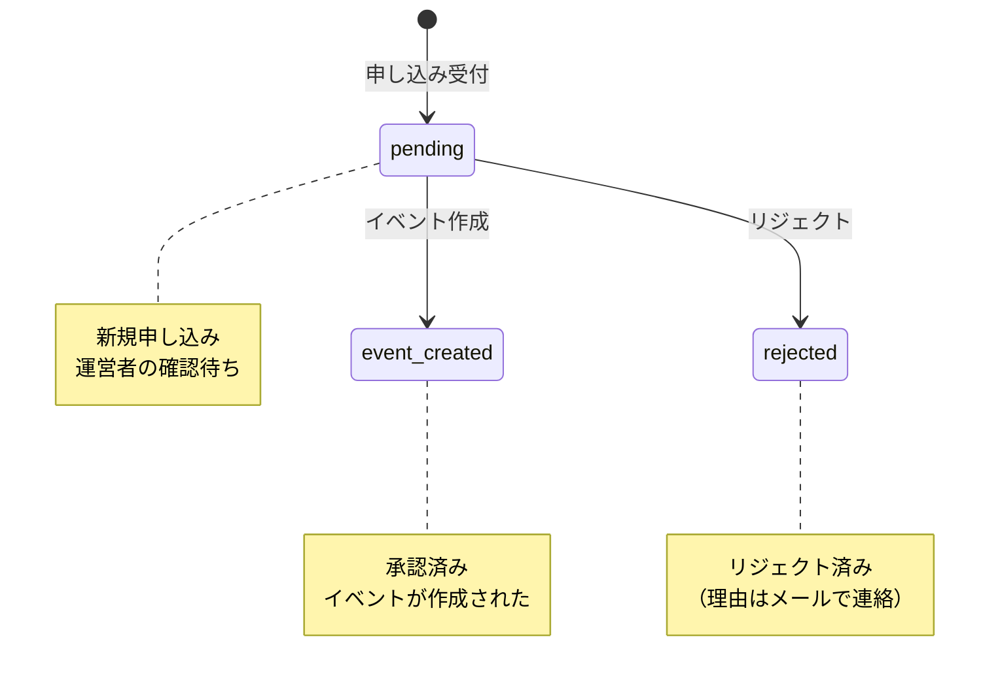
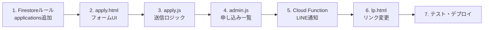

# 申し込みフォーム 設計書

最終更新: 2026-02-02

---

## Overview

Google Formsの代わりに自作の申し込みフォームを作成する。
申し込みは一旦保存され、運営者が確認後にイベントを作成する。

**現状:**

```
Google Forms → メール通知 → 手動でイベント作成
```

**変更後:**

```
自作フォーム → Firestore保存 → LINE通知 → 管理画面で確認 → イベント作成
```

---

## Purpose

### なぜこの変更が必要か

1. **管理の簡素化**
   - 申し込みとイベントの関係が明確（承認後に1:1対応）
   - 管理画面で申し込み確認からイベント作成まで完結

2. **入力項目の柔軟性**
   - Google Formsでは日付+時間範囲の入力が難しい
   - 新郎新婦の名前を2つに分けるなど、カスタマイズが自由

3. **既存資産の活用**
   - Firebase Hosting、Firestore、Cloud Functionsは既に構築済み
   - LINE通知も既存のLINE Official Accountを活用
   - LPと統一したデザインで違和感なし

### 代替案

| 案 | メリット | デメリット |
|----|----------|------------|
| **A. Google Forms継続** | 実装不要 | 項目の柔軟性低、手動連携必要 |
| **B. 自作フォーム（採用）** | 自動連携、柔軟なUI | 実装が必要 |
| **C. 外部SaaS（Typeform等）** | UIが洗練 | 有料、連携開発が必要 |

### 採用案: B. 自作フォーム

理由:
- 既存のFirebase基盤を活用できる
- 申し込み管理→イベント作成の流れが自然
- 追加コストなし

---

## What to Do

### 機能要件

#### 申し込みフォーム（apply.html）

| 項目 | 必須 | 入力形式 | 説明 |
|------|------|----------|------|
| 新郎のお名前 | ✓ | テキスト | イベント名・メッセージのカスタマイズに使用 |
| 新婦のお名前 | ✓ | テキスト | イベント名・メッセージのカスタマイズに使用 |
| メールアドレス | ✓ | メール | 連絡用 |
| 使いたい日 | ✓ | 日付 | イベント日 |
| 開始時刻 | ✓ | 時刻選択 | 30分刻みのプルダウン |
| 終了時刻 | ✓ | 時刻選択 | 30分刻みのプルダウン |
| ゲスト数 | ✓ | 選択 | ~50人/51~100人/101~150人/150人~ |
| 会場名 | | テキスト | 任意 |
| 知ったきっかけ | | 選択 | ネット検索/友人の紹介/SNS/過去に参加した/その他 |
| ご質問・ご要望 | | テキストエリア | 任意 |

#### 申し込み完了時の動作

1. Firestoreに申し込みデータを保存
2. 運営者にLINE通知（Cloud Functions経由）
3. 完了画面を表示

#### 管理画面（admin.html）での機能

| 機能 | 説明 |
|------|------|
| 申し込み一覧タブ | 新規タブとして追加 |
| 申し込み詳細確認 | 連絡先、時刻、ゲスト数などを確認可能 |
| イベント作成ボタン | 申し込みからイベントを作成（draft状態） |
| 申し込みステータス | pending / event_created / rejected |

### 非機能要件

| 要件 | 値 |
|------|-----|
| レスポンシブ | スマホ・PC両対応必須（UX重視） |
| バリデーション | フロントエンド + Firestoreルール |
| デザイン | LPと統一したスタイル |
| 多重送信防止 | 送信ボタンのdisable + ローディング表示 |

---

## How to Do It

### システムアーキテクチャ



### データフロー



### データ構造

#### ER図



#### Firestoreコレクション

##### applications（新規）

```javascript
applications/{application_id}
{
  // 申し込み者情報
  groom_name: string,        // 新郎の名前
  bride_name: string,        // 新婦の名前
  email: string,             // メールアドレス

  // イベント情報
  event_date: string,        // "2026-03-15"
  start_time: string,        // "14:00"
  end_time: string,          // "17:00"
  guest_count: string,       // "51~100人"
  venue_name: string,        // "○○ホテル"（任意）

  // マーケティング情報
  referral_source: string,   // "友人の紹介"
  questions: string,         // 自由記述

  // ステータス管理
  status: string,            // "pending" | "event_created" | "rejected"
  event_id: string | null,   // 作成されたイベントID

  // システム情報
  created_at: timestamp,
}
```

##### events（拡張）

```javascript
events/{event_id}
{
  // 既存フィールド
  event_name: string,        // "太郎 & 花子 Wedding"（申し込みから自動生成）
  event_date: string,
  event_code: string,
  account_id: string,
  status: string,            // "draft" | "active" | "archived"
  created_at: timestamp,
  settings: object,

  // 新規フィールド（申し込みから引き継ぎ）
  application_id: string,    // 元の申し込みID
  start_time: string,        // "14:00"
  end_time: string,          // "17:00"
  guest_count: string,       // "51~100人"
  venue_name: string,        // "○○ホテル"
}
```

### 申し込みステータス



| ステータス | 説明 |
|-----------|------|
| pending | 申し込み受付済み、確認待ち |
| event_created | イベント作成済み（承認） |
| rejected | リジェクト済み |

### UI設計

#### 申し込みフォーム画面（スマホ）

```
┌─────────────────────────────────┐
│  AI笑顔写真コンテスト           │
│  お申し込み                     │
├─────────────────────────────────┤
│                                 │
│  新郎新婦のお名前               │
│  ┌─────────────────────────┐   │
│  │ 新郎（例: 太郎）         │   │
│  └─────────────────────────┘   │
│  ┌─────────────────────────┐   │
│  │ 新婦（例: 花子）         │   │
│  └─────────────────────────┘   │
│                                 │
│  メールアドレス                 │
│  ┌─────────────────────────┐   │
│  │ example@email.com       │   │
│  └─────────────────────────┘   │
│                                 │
│  ご利用日時                     │
│  ┌─────────────────────────┐   │
│  │ 2026年3月15日      📅    │   │
│  └─────────────────────────┘   │
│  ┌──────────┐ 〜 ┌──────────┐  │
│  │ 14:00 ▼  │    │ 17:00 ▼  │  │
│  └──────────┘    └──────────┘  │
│                                 │
│  ゲスト数                       │
│  ┌─────────────────────────┐   │
│  │ 51〜100人           ▼   │   │
│  └─────────────────────────┘   │
│                                 │
│  会場名（任意）                 │
│  ┌─────────────────────────┐   │
│  │                         │   │
│  └─────────────────────────┘   │
│                                 │
│  知ったきっかけ                 │
│  ┌─────────────────────────┐   │
│  │ 選択してください     ▼   │   │
│  └─────────────────────────┘   │
│                                 │
│  ご質問・ご要望（任意）         │
│  ┌─────────────────────────┐   │
│  │                         │   │
│  │                         │   │
│  └─────────────────────────┘   │
│                                 │
│  ┌─────────────────────────┐   │
│  │      お申し込み          │   │
│  └─────────────────────────┘   │
│                                 │
└─────────────────────────────────┘
```

#### 申し込みフォーム画面（PC）

```
┌────────────────────────────────────────────────────────────────┐
│                    AI笑顔写真コンテスト                         │
│                      お申し込み                                │
├────────────────────────────────────────────────────────────────┤
│                                                                │
│  新郎新婦のお名前                                              │
│  ┌────────────────────────┐  ┌────────────────────────┐       │
│  │ 新郎（例: 太郎）        │  │ 新婦（例: 花子）        │       │
│  └────────────────────────┘  └────────────────────────┘       │
│                                                                │
│  メールアドレス                                                │
│  ┌─────────────────────────────────────────────────────┐      │
│  │ example@email.com                                   │      │
│  └─────────────────────────────────────────────────────┘      │
│                                                                │
│  ご利用日時                                                    │
│  ┌────────────────────────┐  ┌──────────┐ 〜 ┌──────────┐     │
│  │ 2026年3月15日      📅   │  │ 14:00 ▼  │    │ 17:00 ▼  │     │
│  └────────────────────────┘  └──────────┘    └──────────┘     │
│                                                                │
│  ゲスト数                        会場名（任意）                │
│  ┌────────────────────────┐  ┌────────────────────────┐       │
│  │ 51〜100人           ▼   │  │                        │       │
│  └────────────────────────┘  └────────────────────────┘       │
│                                                                │
│  知ったきっかけ                                                │
│  ┌─────────────────────────────────────────────────────┐      │
│  │ 選択してください                                 ▼   │      │
│  └─────────────────────────────────────────────────────┘      │
│                                                                │
│  ご質問・ご要望（任意）                                        │
│  ┌─────────────────────────────────────────────────────┐      │
│  │                                                     │      │
│  │                                                     │      │
│  └─────────────────────────────────────────────────────┘      │
│                                                                │
│                    ┌─────────────────────┐                     │
│                    │     お申し込み       │                     │
│                    └─────────────────────┘                     │
│                                                                │
└────────────────────────────────────────────────────────────────┘
```

#### 管理画面：申し込み一覧タブ

```
┌─────────────────────────────────────────────────────────────────────────┐
│  申し込み一覧                                                           │
├─────────────────────────────────────────────────────────────────────────┤
│ ┌─────────┬────────────┬───────────┬──────────┬─────────┬────────────┐ │
│ │ 状態    │ 新郎新婦    │ 日付      │ ゲスト数 │ 申込日   │ 操作       │ │
│ ├─────────┼────────────┼───────────┼──────────┼─────────┼────────────┤ │
│ │ Pending │ 太郎 & 花子 │ 2026/3/15 │ 51~100人 │ 2/1     │ [詳細] [✓] │ │
│ │ Pending │ 次郎 & 美咲 │ 2026/4/20 │ ~50人    │ 2/1     │ [詳細] [✓] │ │
│ │ Created │ 三郎 & 恵子 │ 2026/5/10 │ 101~150人│ 1/28    │ [詳細]     │ │
│ │Rejected │ 四郎 & 由美 │ 2026/6/1  │ 150人~   │ 1/25    │ [詳細]     │ │
│ └─────────┴────────────┴───────────┴──────────┴─────────┴────────────┘ │
└─────────────────────────────────────────────────────────────────────────┘

[✓] = イベント作成ボタン（pendingの場合のみ表示）
```

### LINE通知

#### Cloud Function: application-notify

```
トリガー: Firestore onCreate (applications コレクション)

通知内容:
┌─────────────────────────────┐
│ 📩 新規申し込み             │
│                             │
│ 新郎新婦: 太郎 & 花子       │
│ 日付: 2026/3/15             │
│ 時間: 14:00〜17:00          │
│ ゲスト数: 51~100人          │
│                             │
│ 管理画面で確認してください  │
│ https://example.com/admin   │
└─────────────────────────────┘
```

#### 実装

既存の LINE Messaging API を使用:
- `LINE_CHANNEL_ACCESS_TOKEN`: Secret Manager に保存済み
- `ADMIN_LINE_USER_ID`: 環境変数で設定（運営者のLINE user_id）
- プッシュメッセージで通知

### 変更ファイル一覧

| ファイル | 変更内容 |
|----------|----------|
| `src/frontend/apply.html` | 新規：申し込みフォームページ |
| `src/frontend/js/apply.js` | 新規：フォーム送信ロジック |
| `src/frontend/css/input.css` | 追加：フォーム用スタイル |
| `src/frontend/lp.html` | 変更：申し込みボタンのリンク先変更 |
| `src/frontend/js/admin.js` | 変更：申し込み一覧タブ追加 |
| `src/frontend/admin.html` | 変更：申し込み一覧UI追加 |
| `firestore.rules` | 変更：applicationsコレクションのルール追加 |
| `src/functions/application-notify/` | 新規：LINE通知Cloud Function |

### 実装順序



#### Phase 1: データ層

1. Firestore Security Rules に applications コレクションのルールを追加

#### Phase 2: フォーム実装

1. apply.html 作成（LPと統一したデザイン、スマホ・PC両対応）
2. apply.js 実装（バリデーション、送信処理）
3. 完了画面の実装
4. CSSビルド

#### Phase 3: 管理画面対応

1. admin.html に申し込み一覧タブ追加
2. admin.js に申し込み一覧・詳細・イベント作成機能追加
3. 申し込みからイベント作成ロジック

#### Phase 4: 通知

1. Cloud Function (application-notify) 作成
2. LINE通知実装
3. デプロイ

#### Phase 5: 連携

1. lp.html のリンク先を apply.html に変更
2. 全体デプロイ・動作確認

---

## What We Won't Do

| 除外項目 | 理由 |
|----------|------|
| 申し込み者へのメール自動返信 | 当面は手動対応で十分 |
| 決済連携 | 無料期間中は不要 |
| 申し込みの編集機能 | 問い合わせベースで対応 |
| 申し込みのキャンセル機能（申し込み者側） | 問い合わせベースで対応 |
| reCAPTCHA | スパムが発生してから導入検討 |

---

## Concerns

### 懸念事項と対策

| 懸念 | リスク | 対策 |
|------|--------|------|
| スパム申し込み | 中 | 様子見、必要ならreCAPTCHA導入 |
| 重複申し込み | 低 | 同一メールアドレスの重複チェック検討 |
| 終了時刻 < 開始時刻 | 低 | フロントエンドでバリデーション |
| LINE通知の見逃し | 低 | メール通知も将来追加可能 |

### 決定事項

1. **運営者のLINE user_id**
   - 環境変数 `ADMIN_LINE_USER_ID` として設定
   - 運営者がLINE Botに友だち追加してuser_idを取得

### 未解決の論点

1. **申し込み詳細の表示方法**
   - 選択肢A: モーダルで表示
   - 選択肢B: 別ページで表示
   - **推奨: A**（イベント詳細と同じUX）

---

## Reference Materials/Information

- 既存設計: `docs/design/admin-settings-rearchitecture.md`
- LINE Messaging API: <https://developers.line.biz/ja/docs/messaging-api/>
- プロジェクト構造: `docs/architecture/overview.md`
- Firebase Firestore: <https://firebase.google.com/docs/firestore>
- Tailwind CSS: <https://tailwindcss.com/docs>

---

## 実装チェックリスト

```
Phase 1: データ層
□ Firestore Security Rules 更新（applications追加）

Phase 2: フォーム実装
□ apply.html 作成
  □ スマホ対応UI
  □ PC対応UI
□ apply.js 実装
  □ バリデーション（終了時刻 > 開始時刻など）
  □ Firestore保存（applications）
  □ 完了画面表示
□ CSS追加（input.css）
□ CSSビルド（output.css）

Phase 3: 管理画面対応
□ admin.html に申し込み一覧タブ追加
□ admin.js 実装
  □ 申し込み一覧表示
  □ 申し込み詳細モーダル
  □ イベント作成ボタン
  □ リジェクトボタン
  □ ステータスバッジ

Phase 4: 通知
□ Cloud Function (application-notify) 作成
  □ Firestore onCreate トリガー
  □ LINE Messaging API 連携
  □ 運営者へのプッシュ通知
□ 環境変数 ADMIN_LINE_USER_ID 設定
□ デプロイ

Phase 5: 連携・デプロイ
□ lp.html のリンク先変更
□ Firebase Hostingデプロイ
□ 動作確認
  □ 申し込み送信 → Firestore保存
  □ LINE通知受信
  □ 管理画面で一覧表示
  □ イベント作成
```
