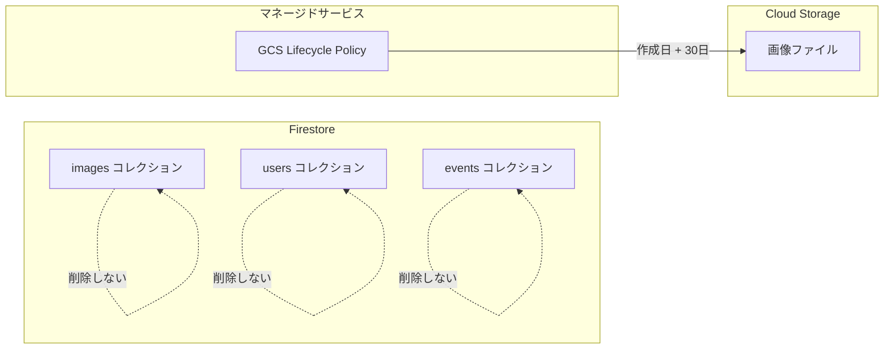

# 設計書: 自動データ削除（Cloud Storageのみ）

## 概要

Cloud Storage Lifecycle Policy を使用して、画像ファイルを自動削除する。Firestoreデータは保持する。

## 目的

### ビジネス目的

1. **プライバシー保護**: 結婚式の写真（顔写真）は個人情報であり、必要以上に保持しない
2. **ストレージコスト削減**: Cloud Storageの課金を抑える
3. **運用負荷ゼロ**: マネージドサービスに任せて人手を介さない

### 運用フロー想定

```
本番1週間前: テスト投稿開始
    ↓
本番当日: ゲスト投稿
    ↓
数日後: 新郎新婦・ゲストがダウンロード完了
    ↓
30日後: 画像ファイル自動削除（Firestoreデータは残る）
```

## やること（機能要件）

### 削除対象と方式

| 対象 | 方式 | 削除タイミング |
|------|------|--------------|
| Cloud Storage | Lifecycle Policy | アップロード後30日 |
| Firestore `images` | **削除しない** | 統計・ランキング用に保持 |
| Firestore `users` | **削除しない** | 統計用に保持 |
| Firestore `events` | **削除しない** | 統計・履歴用に保持 |

### 保持期間の設定

| 環境 | 設定値 | 理由 |
|------|--------|------|
| 開発/テスト | **3日** | テスト用に短期間で削除を確認 |
| 本番 | **30日** | 十分な猶予期間 |

## やり方（実装設計）

### アーキテクチャ



### Cloud Storage Lifecycle Policy 設定

#### Terraform 設定

```hcl
resource "google_storage_bucket" "main" {
  name     = var.storage_bucket_name
  location = var.region
  project  = var.project_id

  # 既存の設定...

  lifecycle_rule {
    condition {
      age = var.data_retention_days  # 3日 or 30日
    }
    action {
      type = "Delete"
    }
  }
}
```

#### 変数定義

```hcl
# terraform/variables.tf
variable "data_retention_days" {
  description = "Number of days to retain data before auto-deletion"
  type        = number
  default     = 30
}
```

#### 環境別設定

```hcl
# terraform.tfvars (本番)
data_retention_days = 30

# terraform.tfvars (テスト)
data_retention_days = 3
```

### 変更ファイル一覧

| ファイル | 操作 | 内容 |
|---------|------|------|
| `terraform/modules/storage/main.tf` | 変更 | Lifecycle Policy 追加 |
| `terraform/modules/storage/variables.tf` | 変更 | `data_retention_days` 変数追加 |
| `terraform/variables.tf` | 変更 | ルート変数追加 |
| `terraform/main.tf` | 変更 | 変数をモジュールに渡す |

## やらないこと

| 項目 | 理由 |
|------|------|
| Firestore TTL | 統計・ランキングを保持するため不要 |
| `delete_at` フィールド | Firestore削除しないので不要 |
| Cloud Function での削除処理 | マネージドサービスで代替 |
| Cloud Scheduler | 不要 |
| 削除前の通知 | 自動で透過的に処理 |

## 削除後の影響

### 管理画面

| 機能 | 削除後の挙動 |
|------|------------|
| 画像一覧 | サムネイル表示不可（署名付きURL期限切れ or 404） |
| ランキング | スコア・コメントは表示可、画像は表示不可 |
| 統計 | 正常に表示（Firestoreデータから集計） |
| ダウンロード | 不可（画像ファイルなし） |

### フロントエンド（ランキング画面）

- 画像は表示されない（プレースホルダーまたは非表示）
- スコアやユーザー名は表示可能

## Firestoreを削除しない理由

1. **統計・履歴の保持**: 累計ユーザー数、画像数を常に参照可能
2. **コスト**: Firestoreは6,000イベント程度まで無料枠内
3. **セキュリティ**: LINE user IDは単体では低リスク（Access Tokenが必要）
4. **シンプルさ**: `delete_at`フィールドや複雑なTTL設定が不要

## 懸念事項

### 1. 署名付きURLの期限切れ

**懸念**: 画像ファイル削除前でも署名付きURLが期限切れになる可能性

**対策**:
- 現状の署名付きURL更新機能で対応済み
- 削除後はどのみち表示不可なので問題なし

### 2. Lifecycle Policyの実行タイミング

**懸念**: Lifecycle Policyは1日1回程度の実行で、即座には削除されない

**対策**:
- 許容範囲（厳密な30日である必要はない）
- 最大1日程度の遅延は問題なし

## 参考資料

- [Cloud Storage Lifecycle Policy](https://cloud.google.com/storage/docs/lifecycle)
- [Terraform google_storage_bucket](https://registry.terraform.io/providers/hashicorp/google/latest/docs/resources/storage_bucket)
