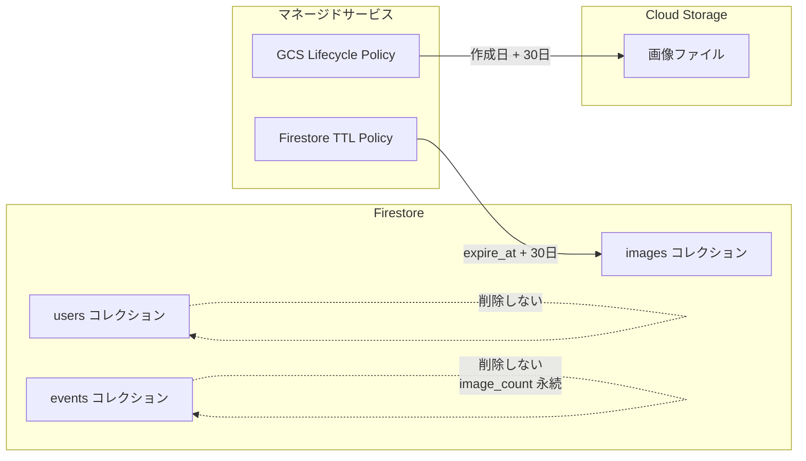

# 設計書: 自動データ削除（Cloud Storage + Firestore）

## 概要

Cloud Storage Lifecycle Policy で画像ファイルを自動削除し、Firestore TTL Policy で画像ドキュメントも自動削除する。イベント単位のアップロード枚数は `events` ドキュメントに永続化する。

## 目的

### ビジネス目的

1. **プライバシー保護**: 結婚式の写真（顔写真）は個人情報であり、必要以上に保持しない
2. **ストレージコスト削減**: Cloud Storageの課金を抑える
3. **運用負荷ゼロ**: マネージドサービスに任せて人手を介さない

### 運用フロー想定

```
本番1週間前: テスト投稿開始
    ↓
本番当日: ゲスト投稿
    ↓
数日後: 新郎新婦・ゲストがダウンロード完了
    ↓
30日後: 画像ファイル自動削除（Firestoreデータは残る）
```

## やること（機能要件）

### 削除対象と方式

| 対象 | 方式 | 削除タイミング |
|------|------|--------------|
| Cloud Storage | Lifecycle Policy | アップロード後30日 |
| Firestore `images` | TTL Policy (`expire_at`) | アップロード後30日（±1日） |
| Firestore `users` | **削除しない** | 統計用に保持 |
| Firestore `events` | **削除しない** | 統計・履歴用に保持（`image_count`を永続化） |

### 保持期間の設定

| 環境 | 設定値 | 理由 |
|------|--------|------|
| 開発/テスト | **3日** | テスト用に短期間で削除を確認 |
| 本番 | **30日** | 十分な猶予期間 |

## やり方（実装設計）

### アーキテクチャ


```mermaid
flowchart LR
    subgraph Firestore
        images[images コレクション]
        users[users コレクション]
        events[events コレクション]
    end

    subgraph GCS[Cloud Storage]
        bucket[画像ファイル]
    end

    subgraph Managed[マネージドサービス]
        lifecycle[GCS Lifecycle Policy]
        ttl[Firestore TTL Policy]
    end

    lifecycle -->|作成日 + 30日| bucket
    ttl -->|expire_at + 30日| images
    users -.->|削除しない| users
    events -.->|削除しない\nimage_count 永続| events
```

### Cloud Storage Lifecycle Policy 設定

#### Terraform 設定

```hcl
resource "google_storage_bucket" "main" {
  name     = var.storage_bucket_name
  location = var.region
  project  = var.project_id

  # 既存の設定...

  lifecycle_rule {
    condition {
      age = var.data_retention_days  # 3日 or 30日
    }
    action {
      type = "Delete"
    }
  }
}
```

#### 変数定義

```hcl
# terraform/variables.tf
variable "data_retention_days" {
  description = "Number of days to retain data before auto-deletion"
  type        = number
  default     = 30
}
```

#### 環境別設定

```hcl
# terraform.tfvars (本番)
data_retention_days = 30

# terraform.tfvars (テスト)
data_retention_days = 3
```

### 変更ファイル一覧

| ファイル | 操作 | 内容 |
|---------|------|------|
| `terraform/modules/storage/main.tf` | 変更 | Lifecycle Policy 追加 |
| `terraform/modules/storage/variables.tf` | 変更 | `data_retention_days` 変数追加 |
| `terraform/variables.tf` | 変更 | ルート変数追加 |
| `terraform/main.tf` | 変更 | 変数をモジュールに渡す + Firestore TTL Policy追加 |
| `terraform/terraform.tfvars` | 変更 | `data_retention_days = 30` |
| `terraform/modules/functions/main.tf` | 変更 | `DATA_RETENTION_DAYS` 環境変数追加 |
| `terraform/modules/functions/variables.tf` | 変更 | `data_retention_days` 変数追加 |
| `src/functions/webhook/main.py` | 変更 | `expire_at` フィールド + `image_count` インクリメント |
| `src/frontend/js/admin/images.js` | 変更 | 期限切れ画像フィルタ + onerror |
| `src/frontend/js/admin/statistics.js` | 変更 | 同上 |
| `src/frontend/js/app.js` | 変更 | 同上（ランキング・スライドショー） |

## やらないこと

| 項目 | 理由 |
|------|------|
| Cloud Function での削除処理 | マネージドサービス（TTL Policy）で代替 |
| Cloud Scheduler | 不要 |
| 削除前の通知 | 自動で透過的に処理 |
| Signed URL再生成 | 7日以降はUI非表示で許容 |

## 削除後の影響

### タイムライン

| 期間 | 管理画面 | ランキング画面 |
|------|---------|-------------|
| Day 0-7 | 画像正常表示 | 画像正常表示 |
| Day 7-30 | `storage_url_expires_at`フィルタで非表示 | 同様にフィルタで非表示 |
| Day 30+ | Firestore TTL削除でデータ消滅 | 同上 |
| 永続 | `events.image_count`で枚数参照可能 | — |

## Firestoreの削除方針

### `images` コレクション: TTL Policyで30日後に自動削除

- アップロード時に `expire_at` フィールドを設定
- Firestore TTL Policyが `expire_at` を過ぎたドキュメントを自動削除
- 削除前にイベントの `image_count` をアップロード時にインクリメント済み

### `users`/`events` コレクション: 削除しない

1. **統計・履歴の保持**: `events.image_count` で累計アップロード枚数を永続参照
2. **コスト**: Firestoreは無料枠内
3. **セキュリティ**: LINE user IDは単体では低リスク

## 懸念事項

### 1. 署名付きURLの期限切れ（7日）

**懸念**: GCS V4 Signed URLの仕様上限が7日。30日保持期間中に23日間は画像表示不可。

**対策**:
- フロントエンドで `storage_url_expires_at` を基にフィルタし、期限切れ画像はUI上から非表示
- onerrorハンドラで予期しないURL失効もカバー

### 2. Lifecycle Policyの実行タイミング

**懸念**: Lifecycle Policyは1日1回程度の実行で、即座には削除されない

**対策**:
- 許容範囲（厳密な30日である必要はない）
- 最大1日程度の遅延は問題なし

## 参考資料

- [Cloud Storage Lifecycle Policy](https://cloud.google.com/storage/docs/lifecycle)
- [Terraform google_storage_bucket](https://registry.terraform.io/providers/hashicorp/google/latest/docs/resources/storage_bucket)
