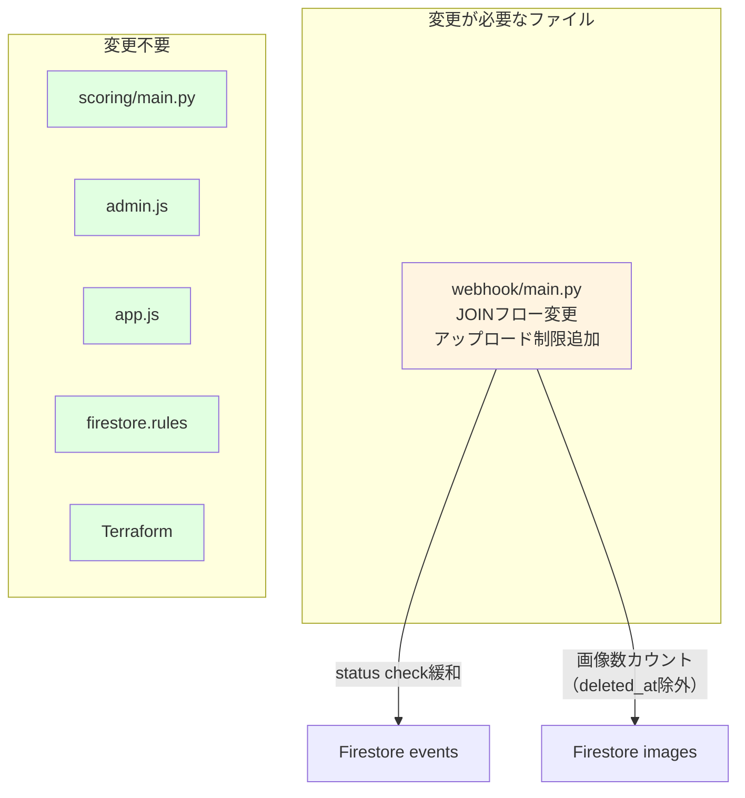
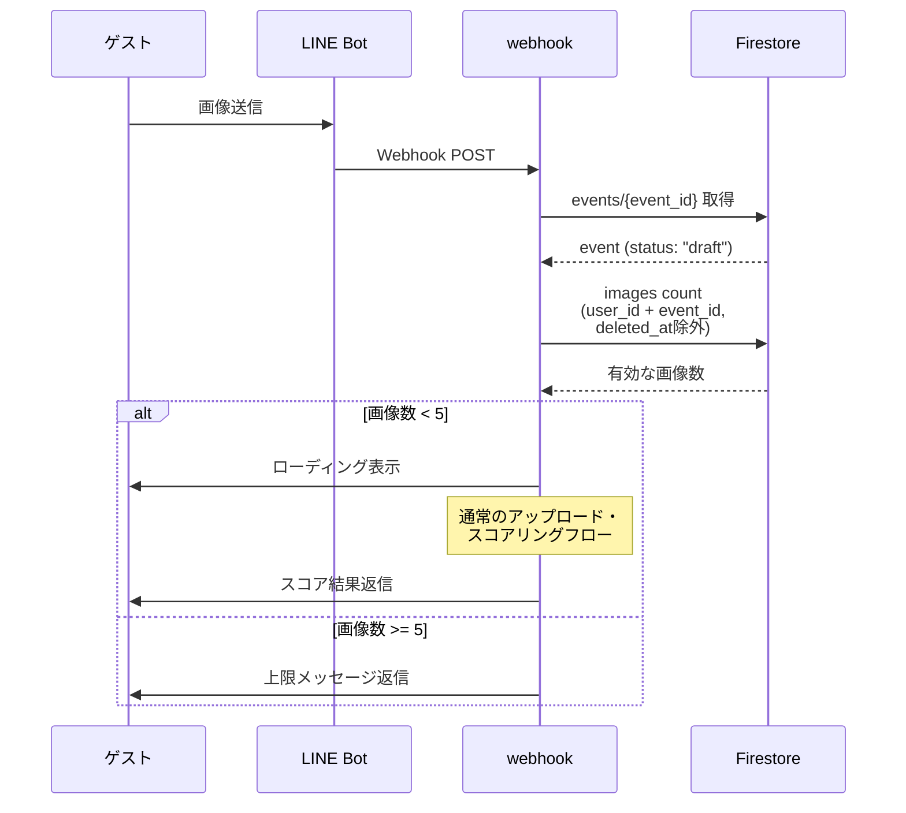
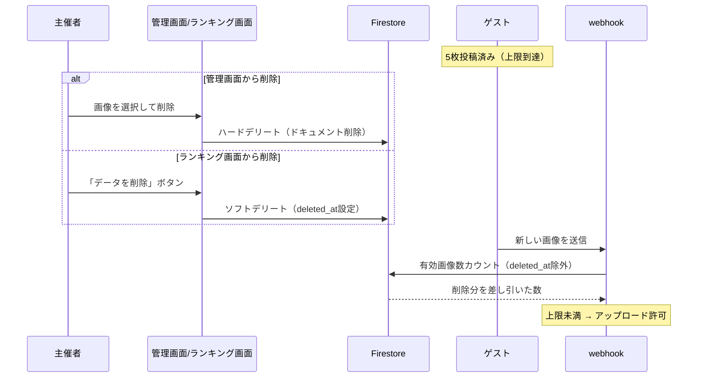

# 設計書: DRAFTイベントお試しアップロード機能

## Overview

DRAFTステータスのイベントに対して、ゲストが最大5枚まで画像をアップロードできる「お試し機能」を追加する。
管理画面またはランキング画面から画像を削除した場合、削除分だけ再度アップロードが可能になる。

## Purpose

現在、DRAFTステータスのイベントではゲストのJOIN・画像投稿が完全にブロックされている。
お客さん（イベント主催者）が本番前にシステムの動作を体験できるよう、制限付きのお試し利用を提供したい。

**期待される効果**:
- お客さんがサービスの価値を実感してから本番利用を決定できる
- 営業・デモ時に実際の動作を見せられる
- 本番前のテスト運用としても活用可能

## What to Do

### 機能要件

1. **DRAFTイベントへのJOIN許可**
   - ゲストが `JOIN {event_code}` でDRAFTイベントに参加できるようにする
   - 参加フロー（名前登録等）はactiveイベントと同一

2. **画像アップロード上限（5枚）**
   - DRAFTイベントでは1ユーザーあたり最大5枚まで画像投稿可能
   - 上限に達した場合、わかりやすいメッセージで通知
   - スコアリングはactiveイベントと同一（Vision API, Gemini, Average Hash全て動作）

3. **削除による枠の復活**
   - **管理画面から削除**（ハードデリート）→ 枠が復活する
   - **ランキング画面から削除**（ソフトデリート: `deleted_at`設定）→ 枠が復活する
   - 例: 5枚投稿 → 2枚削除 → 残り2枚アップロード可能

4. **ランキング表示**
   - DRAFTイベントでもランキング表示は通常通り動作する（デモ用途）

### 非機能要件

1. **パフォーマンス**: アップロード上限チェックは画像投稿フローに追加のFirestoreクエリ1回で済むこと
2. **整合性**: 同時投稿時にも上限を超えないこと（ベストエフォート）
3. **設定可能性**: 上限枚数は定数として管理し、将来的に変更しやすくする

## How to Do It

### 現状の削除方式の違い（重要）

現在、画像削除は2箇所で異なる方式で実装されている:

| 削除元 | 方式 | 詳細 |
|---|---|---|
| **管理画面** (`admin.js`) | ハードデリート | Firestoreドキュメント自体を削除 |
| **ランキング画面** (`app.js`) | ソフトデリート | `deleted_at`タイムスタンプを設定（ドキュメントは残る） |

この違いにより、画像数カウント時に**両方の削除方式を考慮する必要がある**。

### 影響範囲の全体図



### 変更箇所の詳細

#### 1. `src/functions/webhook/main.py`

##### 1-1. JOINフローの変更（`handle_join_event`）

**現状** (382-387行付近):
```python
# activeイベントのみ取得
.where(filter=firestore.FieldFilter("status", "==", "active"))
```

**変更後**:
```python
# activeまたはdraftイベントを取得
.where(filter=firestore.FieldFilter("status", "in", ["active", "draft"]))
```

##### 1-2. 画像アップロード制限の追加（`handle_image_message`）

**現状** (574-587行付近):
```python
event_status = event_doc.to_dict().get("status")
if event_status != "active":
    # 画像投稿を拒否
```

**変更後**:
```python
DRAFT_UPLOAD_LIMIT = 5

event_status = event_doc.to_dict().get("status")
if event_status == "draft":
    # DRAFTイベント: アップロード上限チェック
    current_count = _count_user_images(user_id, event_id)
    if current_count >= DRAFT_UPLOAD_LIMIT:
        reply_message(reply_token, TextMessage(
            text=f"📸 お試し版では{DRAFT_UPLOAD_LIMIT}枚まで投稿できます。\n\n"
                 f"現在 {current_count}/{DRAFT_UPLOAD_LIMIT} 枚です。\n"
                 "画像を削除すると、再度投稿できます。"
        ))
        return
    # 上限未満: 通常のアップロードフローへ続行
elif event_status != "active":
    # archived等: 従来通り拒否
```

##### 1-3. 新規ヘルパー関数の追加

```python
def _count_user_images(user_id: str, event_id: str) -> int:
    """DRAFTイベントにおけるユーザーの有効な画像数をカウント

    ハードデリート（ドキュメント削除）とソフトデリート（deleted_at設定）の
    両方を考慮し、有効な画像のみをカウントする。
    """
    images_ref = db.collection("images")
    query = images_ref.where(
        filter=firestore.FieldFilter("user_id", "==", user_id)
    ).where(
        filter=firestore.FieldFilter("event_id", "==", event_id)
    ).select(["deleted_at"])

    count = 0
    for doc in query.stream():
        if not doc.to_dict().get("deleted_at"):
            count += 1
    return count
```

> **なぜ`select([])`ではなく`select(["deleted_at"])`か**:
> ランキング画面のソフトデリート（`deleted_at`を設定）された画像はドキュメントとして残っているため、`deleted_at`フィールドを読んで除外する必要がある。

##### 1-4. LIFF JOINの変更（`liff_join`）

`liff_join`内のイベント検索クエリも同様に変更:
```python
# 現状
.where(filter=firestore.FieldFilter("status", "==", "active"))
# 変更後
.where(filter=firestore.FieldFilter("status", "in", ["active", "draft"]))
```

##### 1-5. DRAFTイベントJOIN時のメッセージ

JOIN成功時、イベントがdraftの場合はお試し版である旨を追記:
```python
if event_status == "draft":
    message += f"\n\n📌 お試し版です（最大{DRAFT_UPLOAD_LIMIT}枚まで投稿可能）"
```

### データフロー（画像投稿時）



### 枠復活フロー



### 変更が不要な理由

| コンポーネント | 理由 |
|---|---|
| `scoring/main.py` | Scoringはimage_idベースで処理。イベントステータスに依存しない |
| `admin.js` | 既存のハードデリートがそのまま枠復活の仕組みとして機能する |
| `app.js` | 既存のソフトデリート（`deleted_at`設定）がそのまま枠復活として機能する。ランキング画面は既に`deleted_at`のある画像をフィルタアウトしている |
| `firestore.rules` | ランキング画面からの`deleted_at`更新は既に許可済み（70行目: `hasOnly(['deleted_at'])`） |
| Terraform | インフラ変更なし |

### Firestoreセキュリティルール（変更不要の確認）

ランキング画面（未認証ユーザー）からの`deleted_at`更新は既に許可されている:
```javascript
// firestore.rules 68-70行
allow update: if (request.auth != null &&
  (isAdmin() || isEventOwner(resource.data.event_id)))
  || request.resource.data.diff(resource.data).affectedKeys().hasOnly(['deleted_at']);
```

## What We Won't Do

1. **DRAFTイベントごとの上限枚数カスタマイズ**: MVPでは全DRAFTイベント一律5枚。将来的にeventsコレクションに`draft_upload_limit`フィールドを追加することは可能
2. **お試し期間の自動期限切れ**: DRAFTイベントに有効期限は設けない
3. **お試し用の簡易スコアリング**: スコアリングはactiveと完全に同じ（API費用が発生するが、お試しは少数枚なので許容）
4. **ゲスト側の残り枚数表示（常時）**: 上限到達時のみ通知。毎回の投稿後に「残りX枚」を表示する機能は含めない
5. **total_uploadsカウンターの修正**: 既存の課題（削除時にデクリメントされない）は今回のスコープ外。画像数カウントは実際のドキュメント数ベースで行うため影響なし
6. **ランキング画面の個別画像削除UI**: 現在ランキング画面には「全画像一括ソフトデリート」のみ。個別画像の削除UIは今回のスコープ外

## Concerns

### 1. ランキング画面の削除が「全画像一括」である点

**現状**: ランキング画面の「データを削除」ボタンは、イベント内の**全画像を一括ソフトデリート**する（`app.js` 1714行 `softDeleteEventData()`）。個別画像の削除UIは存在しない。

**影響**: お試しユーザーが「1枚だけ削除して撮り直したい」場合、ランキング画面からは全画像を削除するしかない。個別削除は管理画面からのみ可能。

**対応方針**: MVPではこのまま許容する。お試し用途では全削除→再投稿でも十分。個別削除UIが必要であれば別タスクとして対応。

### 2. ソフトデリートされた画像のCloud Storageファイル

**現状**: ランキング画面のソフトデリートは`deleted_at`を設定するだけで、Cloud Storageのファイルは削除しない。管理画面のハードデリートもFirestoreドキュメントのみ削除し、Cloud Storageファイルは残る。

**影響**: DRAFTのお試し利用でも画像ファイルはCloud Storageに残り続ける（ライフサイクルポリシーで30日後に自動削除）。

**対応方針**: 既存動作と同じなので問題なし。30日ライフサイクルで十分。

### 3. 同時投稿時のレースコンディション

**懸念**: ユーザーが高速で連続投稿した場合、カウントチェックと画像保存の間にタイムラグがあり、6枚目が保存される可能性がある。

**対応方針**: ベストエフォートで許容する。DRAFTは体験用途であり厳密な制限は不要。

### 4. LIFF経由のJOIN

**懸念**: `liff_join`関数（911行〜）にも同様のstatus変更が必要。

**対応方針**: 必要。変更箇所1-4に記載済み。

### 5. API費用

**懸念**: お試しでもVision API + Vertex AIの費用が発生する。

**対応方針**: 5枚×少数のお試しユーザーであれば費用は無視できるレベル（$0.1未満/ユーザー）。問題なし。

### 6. `pending`ステータスの画像カウント

**懸念**: `_count_user_images`はスコアリング完了前（status: "pending"）の画像もカウントするか？

**対応方針**: カウントする。ドキュメントが存在する = アップロード済みなので、pendingも含めて正しい。

### 7. DRAFTイベントのJOINメッセージ

**対応方針**: JOIN成功時のメッセージに「お試し版（最大5枚）」である旨を追記する。

### 8. DRAFTからactiveに変更した場合

**懸念**: お試し中にアップロードした画像はactiveになったらどうなるか？

**対応方針**: そのまま残る。activeになれば上限チェックは行われないので、お試し中の画像もそのままランキングに反映される。これは望ましい動作（お試し→本番への自然な移行）。

## Reference Materials/Information

- 現在のWebhook実装: `src/functions/webhook/main.py`（JOINフロー: 356-416行、画像アップロード: 538-657行、LIFF JOIN: 911-1052行）
- 現在のAdmin削除実装: `src/frontend/js/admin.js`（ハードデリート: 1152-1201行）
- ランキング画面の削除実装: `src/frontend/js/app.js`（ソフトデリート: 1714-1772行）
- Firestoreセキュリティルール: `firestore.rules`（images update: 68-70行）
- マルチテナント設計: `docs/planning/multi-tenant-design.md`（ステータス遷移: 90-99行）
- Firestoreインデックス: `firestore.indexes.json`

## 工数見積もり

| 作業 | 見積もり |
|---|---|
| webhook/main.py 変更（JOIN + アップロード制限 + LIFF） | 小（30-60分） |
| ユニットテスト追加・修正 | 小-中（30-60分） |
| 手動テスト（LINE Botでのe2e確認） | 小（15-30分） |
| **合計** | **1.5-2.5時間** |

**難易度**: 低。変更箇所が`webhook/main.py`の1ファイルにほぼ集中しており、既存のアーキテクチャを壊さない追加的な変更。
