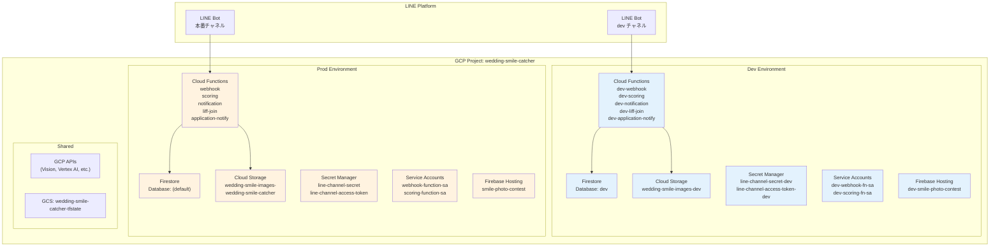
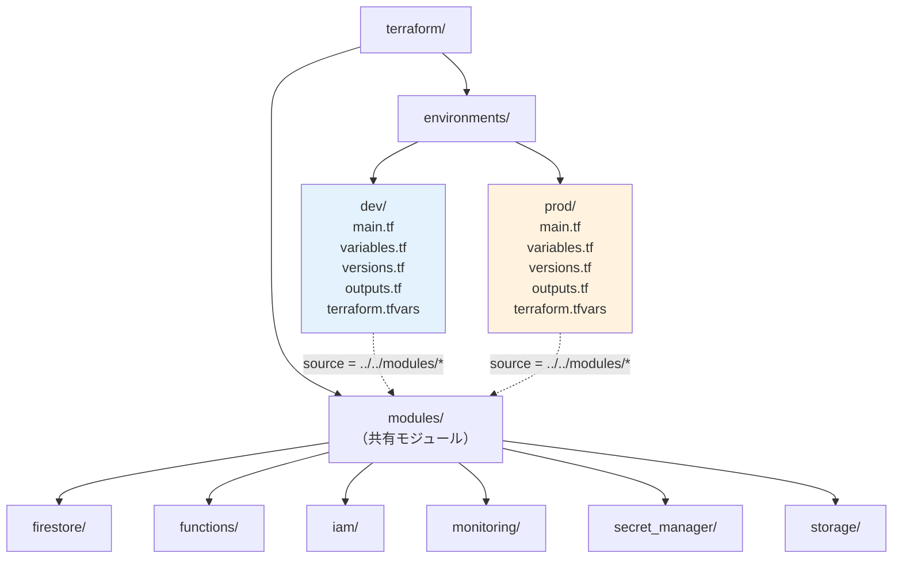
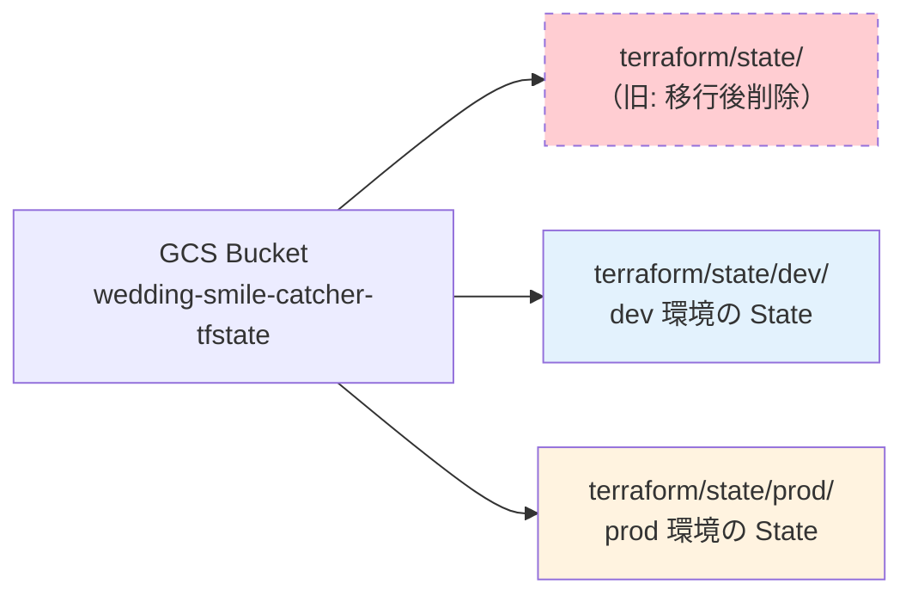
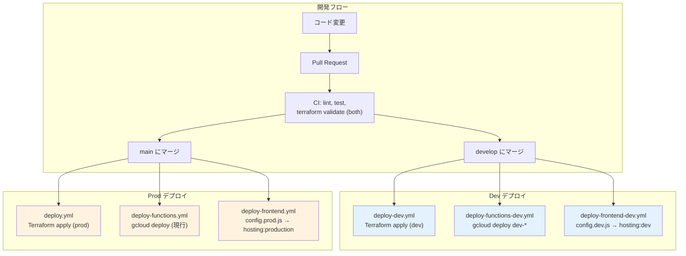
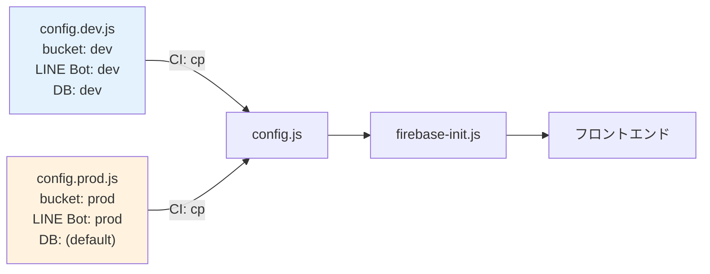
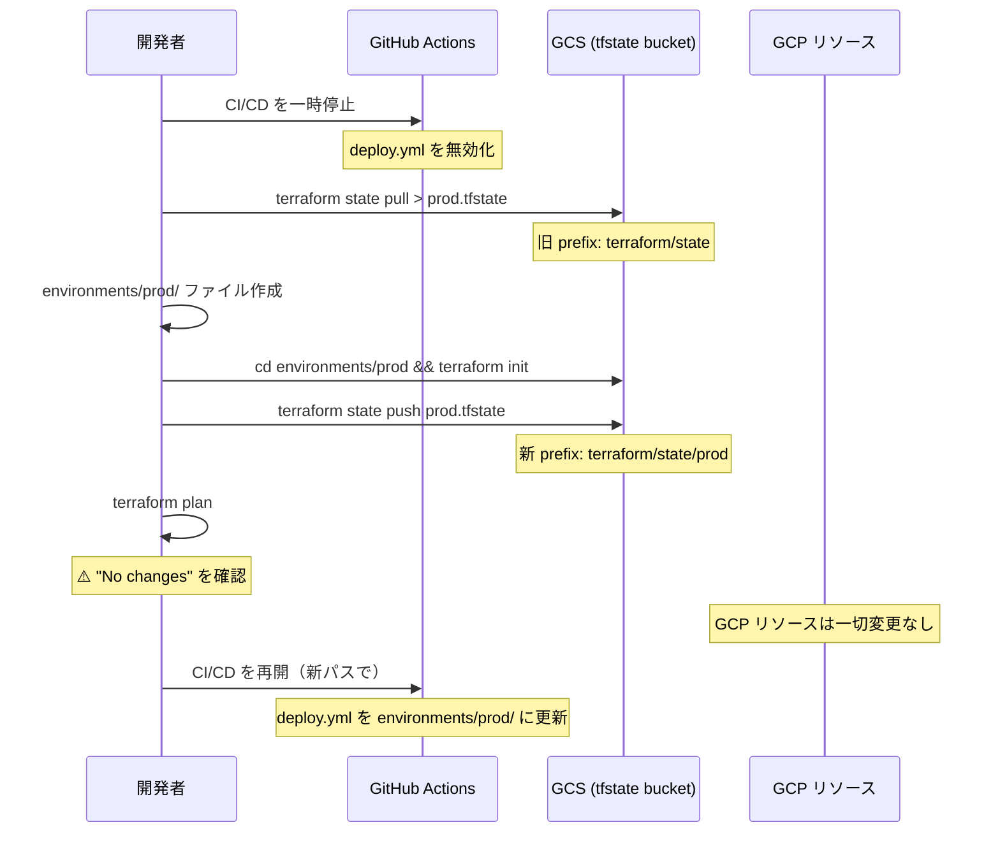

# Dev/Prod 環境分離 設計書

## 概要

Wedding Smile Catcher の現行インフラを、単一環境（本番のみ）から dev/prod の2環境構成に分離する。同一 GCP プロジェクト（`wedding-smile-catcher`）内でリソース名プレフィックスにより環境を区別し、Terraform はディレクトリベースで分離する。LINE Bot は環境ごとに別チャネルを使用する。

## 目的

### 解決したい課題

1. **本番環境しかない**: 現在はコードやインフラの変更を直接本番に反映するしかなく、デグレや障害のリスクがある
2. **テスト環境の不在**: Cloud Functions のロジック変更や Firestore のスキーマ変更を安全に検証できる場所がない
3. **結婚式は一度きり**: 本番当日のトラブルは取り返しがつかず、事前に動作確認できる環境が必要

### 期待される効果

- 開発中の変更を dev 環境で安全に検証してから本番に反映できる
- `develop` ブランチへの push で dev 環境に自動デプロイ、`main` への push で本番にデプロイという CI/CD フロー
- 本番データを汚染せずに機能テストが可能

## 実現すること

### 機能要件

#### FR-1: Terraform ディレクトリベース環境分離

- `terraform/environments/dev/` と `terraform/environments/prod/` で各環境のエントリポイントを分離
- 共有モジュール（`terraform/modules/`）は変更なし（パラメータで環境差異を吸収）
- 各環境で独立した Terraform State を管理

#### FR-2: GCP リソースの環境別作成

同一 GCP プロジェクト内に、以下のリソースを環境別に作成する:

| リソース | dev | prod |
|---------|-----|------|
| Firestore DB | `dev`（named DB） | `(default)` |
| Cloud Storage | `wedding-smile-images-dev` | `wedding-smile-images-wedding-smile-catcher` |
| Cloud Functions | `dev-webhook`, `dev-scoring` 等 | `webhook`, `scoring` 等 |
| Service Accounts | `dev-webhook-fn-sa`, `dev-scoring-fn-sa` | `webhook-function-sa`, `scoring-function-sa` |
| Secret Manager | `line-channel-secret-dev` 等 | `line-channel-secret` 等 |
| Firebase Hosting | `dev-smile-photo-contest` サイト | `smile-photo-contest` サイト |
| Monitoring | なし | 現行4ポリシー |

#### FR-3: LINE Bot 環境分離

- dev 環境用に別の LINE Bot チャネルを用意
- 各チャネルの webhook URL がそれぞれの環境の Cloud Function を指す
- Secret Manager で環境別に LINE Bot クレデンシャルを管理

#### FR-4: フロントエンド環境設定分離

- `config.dev.js` / `config.prod.js` でバケット名・LINE Bot ID・関数 URL 等を環境別に定義
- Firebase Hosting マルチサイトにより、dev/prod を独立してデプロイ

#### FR-5: CI/CD パイプライン分離

- `develop` ブランチ push → dev 環境にデプロイ
- `main` ブランチ push → prod 環境にデプロイ
- PR 時の CI は両環境の Terraform を validate

### 非機能要件

#### NFR-1: 本番への影響ゼロ

- 全変更は後方互換で実施し、本番サービスのダウンタイムを発生させない
- Terraform State 移行は GCP リソースに変更を加えず完了する

#### NFR-2: dev 環境のコスト最適化

- Cloud Functions の max_instances を 10 に制限（prod: 100）
- Cloud Storage の data_retention_days を 1 日（prod: 30 日）
- Monitoring アラートは dev では無効化

#### NFR-3: 運用の一貫性

- Makefile で `ENV=dev` / `ENV=prod` を指定して操作できる
- GitHub Actions ワークフローのトリガーが明確に分離されている

## 実現方法

### 全体アーキテクチャ



### Terraform ディレクトリ構成



### Terraform State 分離



### CI/CD フロー



### モジュールリファクタリング詳細

各モジュールに `environment` 変数を追加し、リソース名にプレフィックスをつける。

#### modules/iam

```hcl
# locals で prefix を導出
locals {
  prefix = var.environment == "prod" ? "" : "${var.environment}-"
}

# prod は既存名を維持、dev はプレフィックス付き
resource "google_service_account" "webhook_function" {
  account_id = var.environment == "prod" ? "webhook-function-sa" : "${local.prefix}webhook-fn-sa"
}
```

SA ID の30文字制限: `dev-webhook-fn-sa` = 17文字、`dev-scoring-fn-sa` = 17文字で問題なし。

#### modules/secret_manager

```hcl
locals {
  suffix = var.environment == "prod" ? "" : "-${var.environment}"
}

resource "google_secret_manager_secret" "line_channel_secret" {
  secret_id = "line-channel-secret${local.suffix}"
}
```

#### modules/functions

最も変更が多いモジュール:

- 関数名に `local.prefix` を付与
- `project_root` 変数で相対パスを解決（`environments/dev/` からの相対パスが変わるため）
- `firestore_database_name` 変数で `FIRESTORE_DATABASE` 環境変数を設定
- `max_instance_count` 変数でインスタンス数を制御
- webhook の `SCORING_FUNCTION_URL` にプレフィックスを反映

#### modules/monitoring

```hcl
variable "enabled" {
  type    = bool
  default = true
}

# 全リソースに count を追加
resource "google_monitoring_alert_policy" "webhook_errors" {
  count = var.enabled ? 1 : 0
  # ...
}
```

### Python 関数の変更

全 Cloud Function の Firestore クライアント初期化を環境変数対応にする:

```python
# Before
db = firestore.Client()

# After
import os
db = firestore.Client(database=os.environ.get("FIRESTORE_DATABASE", "(default)"))
```

prod では `FIRESTORE_DATABASE` 未設定 or `(default)` → 動作は変わらない。

### フロントエンド設定分離



`firebase-init.js` で named database に対応:

```javascript
const dbName = window.FIRESTORE_DATABASE || "(default)";
export const db = dbName === "(default)"
  ? getFirestore(app)
  : getFirestore(app, dbName);
```

### State 移行フロー



### 実装順序

```mermaid
gantt
    title 環境分離 実装ステップ
    dateFormat X
    axisFormat %s

    section Phase 0: 前提タスク
    Step 0: application-notify を Terraform 管理に追加  :s0, 0, 1

    section Phase 1: 後方互換変更
    Step 1: モジュールリファクタリング    :s1, after s0, 1
    Step 2: Python 関数の DB 環境変数対応  :s2, after s0, 1

    section Phase 2: Prod 移行
    Step 3: environments/prod/ 作成 + State 移行  :s3, after s1, 1

    section Phase 3: Dev 構築
    Step 4: environments/dev/ 作成 + デプロイ     :s4, after s3, 1

    section Phase 4: フロントエンド & CI/CD
    Step 5: フロントエンド config 分離            :s5, after s4, 1
    Step 6: GitHub Actions ワークフロー変更       :s6, after s4, 1

    section Phase 5: クリーンアップ
    Step 7: Makefile 更新                         :s7, after s6, 1
    Step 8: 旧ファイル削除                        :s8, after s7, 1
```



| Step | 内容 | 本番ダウンタイム | 備考 |
|------|------|:---:|------|
| 0 | `application-notify` を Terraform 管理に追加 | なし | `terraform import` で既存リソース取り込み |
| 1 | Terraform モジュールに `environment` 変数追加 | なし | `default = "prod"` で後方互換 |
| 2 | Python 関数に `FIRESTORE_DATABASE` env var 対応 | なし | デフォルト `(default)` で後方互換 |
| 3 | `environments/prod/` 作成 + State 移行 | なし | CI/CD 一時停止が必要（数分） |
| 4 | `environments/dev/` 作成 + dev リソースデプロイ | なし | 新規リソース作成のみ |
| 5 | フロントエンド config 分離 + Firebase マルチサイト | なし | `config.prod.js` は現行 `config.js` と同一 |
| 6 | GitHub Actions ワークフロー追加・変更 | なし | ワークフローファイルの変更のみ |
| 7 | Makefile 更新 | なし | ビルドツールの変更 |
| 8 | 旧 Terraform ファイル削除 | なし | 移行完了確認後 |

### Step 0 詳細: application-notify の Terraform 管理追加

環境分離の前提として、全 Cloud Functions を Terraform 管理下に統一する。

**追加するリソース** (`terraform/modules/functions/main.tf`):
- `data "archive_file" "application_notify_source"` — ソースコード ZIP
- `google_storage_bucket_object "application_notify_source"` — ZIP アップロード
- `google_cloudfunctions2_function "application_notify"` — 関数定義
- `google_cloudfunctions2_function_iam_member "application_notify_invoker"` — allUsers
- `google_cloud_run_service_iam_member "application_notify_run_invoker"` — allUsers

**関数設定** (GitHub Actions の既存デプロイ設定に合わせる):
- Runtime: Python 3.11
- Entry point: `application_notify`
- Memory: 256M
- Timeout: 60s
- Max instances: 10
- SA: webhook-function-sa（既存と同じ）
- Env vars: `GCP_PROJECT_ID`, `ADMIN_LINE_USER_ID`, `ADMIN_EMAIL`, `SMTP_EMAIL`
- Secrets: `LINE_CHANNEL_ACCESS_TOKEN`, `SMTP_PASSWORD`

**追加の Secret Manager シークレット**:
`smtp-password` を `secret_manager` モジュール or ルートの `main.tf` で管理する必要がある。
ただし `ADMIN_LINE_USER_ID`, `ADMIN_EMAIL`, `SMTP_EMAIL` は Secret Manager ではなく環境変数として設定されているため、`terraform/main.tf` の module 呼び出しで渡す。

**既存リソースの import**:
```bash
cd terraform
terraform import 'module.functions.google_cloudfunctions2_function.application_notify' \
  projects/wedding-smile-catcher/locations/asia-northeast1/functions/application-notify
```

**outputs.tf 追加**:
- `application_notify_function_url`
- `application_notify_function_name`

**検証**: `terraform plan` で既存の `application-notify` 関数に対して差分が出ないことを確認

### 検証方法

- **Step 0 完了後**: `terraform plan` → `application-notify` に差分なし（import 成功）
- **Step 1 完了後**: 既存ルートで `terraform plan` → **No changes**
- **Step 3 完了後**: `environments/prod/` で `terraform plan` → **No changes**
- **Step 4 完了後**: GCP コンソールで dev リソース（`dev-webhook` 等）の存在確認
- **Step 5 完了後**: `https://dev-smile-photo-contest.web.app` にアクセスして dev config で動作確認
- **Step 6 完了後**: `develop` ブランチへの push で dev 環境のみデプロイされることを確認

## 実現しないこと

- **GCP プロジェクト分離**: 同一プロジェクト内での分離とし、別プロジェクト作成は行わない
- **staging 環境**: 今回は dev/prod の2環境のみ。3環境目は将来の必要に応じて検討
- **dev 環境の Monitoring アラート**: dev 環境ではアラートポリシーを作成しない
- **Firestore セキュリティルールの環境別管理**: Firebase のセキュリティルールはプロジェクト単位で適用され、named database にも同じルールが適用される。環境別のルール分離は行わない
- **dev 環境の本番相当負荷テスト**: dev は機能検証用であり、負荷テスト用の環境ではない
- **既存 Terraform モジュールの大規模リファクタリング**: `environment` 変数追加と名前プレフィックスに留め、モジュール構成自体の見直しは行わない

## 懸念事項

### C-1: Firestore named database の制限

Firestore の named database は比較的新しい機能。Firebase SDK v10.7.1（現在使用中）は named database をサポートしているが、`getFirestore(app, databaseId)` の形式で呼び出す必要がある。フロントエンドの `firebase-init.js` と `apply.html`（Firebase compat SDK 使用箇所）の両方で対応が必要。

**対策**: Firebase SDK のドキュメントで named database のサポート状況を確認済み。v10.x では問題なくサポートされている。

### C-2: 同一プロジェクト内の IAM 権限

dev と prod の Service Account が同一プロジェクト内に共存するため、`roles/datastore.user` のようなプロジェクトレベルの IAM ロールは**両方のデータベースにアクセスできてしまう**。

**対策**: dev SA が prod データに書き込むリスクは、Cloud Functions の環境変数（`FIRESTORE_DATABASE`）で論理的に分離する。意図的な操作以外でクロス環境アクセスは発生しない。完全分離が必要になった場合は GCP プロジェクト分離を検討する。

### C-3: Terraform State 移行の安全性

旧 State prefix（`terraform/state`）から新 prefix（`terraform/state/prod`）への移行中に `terraform apply` が走ると、リソースの二重管理やデータ消失のリスクがある。

**対策**: 移行中は GitHub Actions の deploy.yml を無効化する。移行後に `terraform plan` で No changes を確認してから CI/CD を再開する。

### C-4: `config.js` の管理

`config.js` を `.gitignore` に追加すると、ローカル開発時に手動でコピーが必要になる。

**対策**: Makefile に `make config-dev` / `make config-prod` ターゲットを追加し、ローカル開発時のコピーを簡単にする。また、`config.js` が存在しない場合にわかりやすいエラーメッセージを表示する仕組みを検討する。

### C-5: GitHub Actions の Secrets 管理

dev と prod で異なる `STORAGE_BUCKET`、`CURRENT_EVENT_ID` 等の値が必要。現在は GitHub Secrets で一律管理している。

**対策**: GitHub Environments 機能（`dev` / `prod`）を活用して環境別の Secrets を管理するか、dev 用ワークフローでは値をハードコードする（セキュアでない値のみ）。

### C-6: application-notify 関数の Terraform 管理 → 解消済み

環境分離の前提タスク（Step 0）として `application-notify` を Terraform 管理に追加する方針に決定。全 Cloud Functions が Terraform 管理下に統一される。

## 手動作業（Terraform 外）

環境分離の実装に際し、以下の手動作業が必要:

1. **LINE Developers Console** で dev 用 LINE Bot チャネルを作成
2. **Secret Manager** に dev 用シークレット値を手動登録（LINE Bot クレデンシャル）
3. **Firebase CLI** で `firebase hosting:sites:create dev-smile-photo-contest` を実行
4. **GitHub** で `develop` ブランチを作成（未存在の場合）
5. **GitHub Settings** で GitHub Environments（`dev` / `prod`）を設定し、環境別の Secrets を登録

## 参考資料

- [Terraform Backend Configuration - GCS](https://developer.hashicorp.com/terraform/language/settings/backends/gcs)
- [Firebase Hosting - Multiple Sites](https://firebase.google.com/docs/hosting/multisites)
- [Firestore Named Databases](https://firebase.google.com/docs/firestore/manage-databases)
- [Firebase JS SDK - Multiple Databases](https://firebase.google.com/docs/firestore/manage-databases#web)
- [GitHub Environments](https://docs.github.com/en/actions/deployment/targeting-different-environments/using-environments-for-deployment)
- 現行プロジェクトドキュメント:
  - `docs/architecture/overview.md` — システムアーキテクチャ
  - `docs/reference/context.md` — プロジェクト背景
