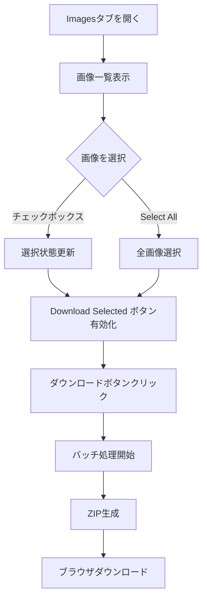
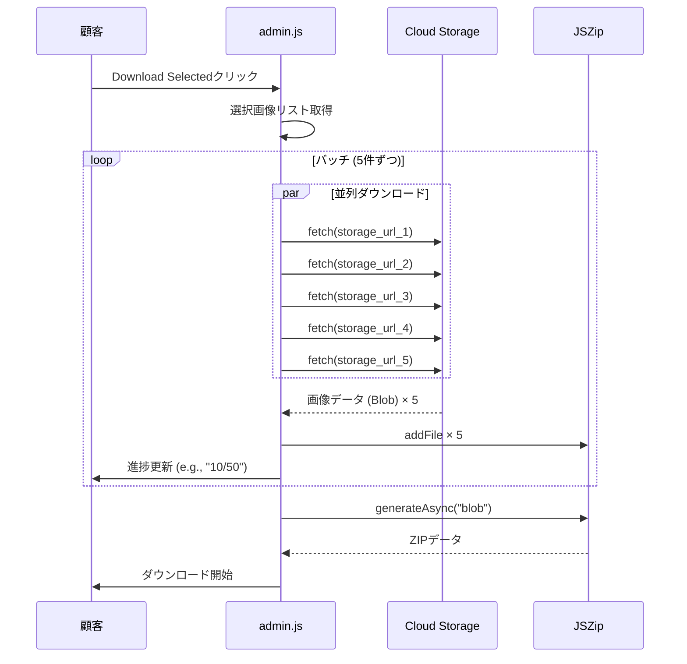

# 一括画像ダウンロード機能 設計書

最終更新: 2026-01-29

---

## Overview

管理画面（admin.html）のImagesタブから選択した画像をZIPファイルとしてダウンロードできる機能を実装する。

現状はshell script (`scripts/download_event_images.sh`) + gsutil による運営者向けの実装のみ存在し、顧客がセルフサービスで利用できるUI化が必要。

---

## Purpose

### なぜこの開発が必要か

1. **顧客のセルフサービス化**: 現状は運営者がCLIでダウンロードして納品する必要がある
2. **利用規約との整合性**: 「イベント終了後30日以内にデータをダウンロードしてください」と記載しているが、顧客がダウンロードする手段がない
3. **運営コスト削減**: 手動納品作業をなくす

### 代替案

| 案 | メリット | デメリット |
|----|----------|------------|
| **A. クライアントサイドZIP生成（バッチ処理）** | サーバー変更不要、GCS負荷分散 | 実装やや複雑 |
| B. Cloud Function でZIP生成 | 大量画像に対応可能 | 追加インフラ、一時ストレージ必要 |
| C. 署名付きURL一覧をCSV出力 | 実装が簡単 | 顧客がURL個別ダウンロード必要 |

### 採用案: クライアントサイドZIP生成 + バッチ処理

理由:
- イベントあたり最大500枚程度（想定100-300枚）なので、ブラウザで十分処理可能
- バッチ処理でGCSへの同時アクセスを制限
- サーバー側変更不要で迅速に実装可能
- JSZipライブラリは実績があり安定

---

## What to Do

### 機能要件

| 要件 | 説明 |
|------|------|
| 選択ダウンロード | Imagesタブで選択した画像をダウンロード |
| 全選択機能 | 表示中の画像を一括選択するボタン |
| ダウンロードボタン | 選択中の画像数を表示、クリックでZIPダウンロード |
| ZIP形式 | 選択画像を1つのZIPファイルにまとめる |
| ファイル名 | `images_{YYYYMMDD_HHmmss}.zip` |
| 画像ファイル名 | `{user_name}_{score}_{image_id}.jpg` |
| メタデータ | `metadata.json` を同梱（スコア、ユーザー名、タイムスタンプ） |
| 進捗表示 | ダウンロード中の進捗をUI表示 |
| バッチ処理 | GCS負荷軽減のため5件ずつ並列ダウンロード |

### 非機能要件

| 要件 | 値 |
|------|-----|
| 最大画像数 | 500枚（Firestoreクエリ上限） |
| バッチサイズ | 5件（同時リクエスト数） |
| タイムアウト | なし（進捗表示で対応） |
| ブラウザ対応 | Chrome, Safari, Edge（モダンブラウザ） |
| エラーハンドリング | 個別画像の取得失敗時はスキップして続行 |

---

## How to Do It

### UIフロー



### システムフロー（バッチ処理）



### データ構造

#### Firestoreから取得するデータ

```typescript
interface ImageDoc {
  id: string;
  storage_url: string;      // 署名付きURL
  user_name: string;
  total_score: number;
  created_at: Timestamp;
  event_id: string;
}
```

#### ZIPファイル構造

```
{event_name}_{YYYYMMDD}.zip
├── images/
│   ├── 001_山田太郎_428.50.jpg
│   ├── 002_佐藤花子_395.20.jpg
│   ├── 003_鈴木次郎_378.90.jpg
│   └── ...
└── metadata.json
```

#### metadata.json

```json
{
  "event_id": "abc123",
  "event_name": "田中太郎 & 花子 結婚式",
  "event_date": "2025-03-15",
  "downloaded_at": "2025-03-16T10:30:00Z",
  "total_images": 287,
  "images": [
    {
      "filename": "001_山田太郎_428.50.jpg",
      "user_name": "山田太郎",
      "score": 428.50,
      "created_at": "2025-03-15T14:30:00Z"
    }
  ]
}
```

### 実装詳細

#### 1. admin.html への JSZip 追加

```html
<script src="https://cdn.jsdelivr.net/npm/jszip@3.10.1/dist/jszip.min.js"></script>
```

#### 2. Imagesタブにダウンロードボタン追加

既存の「Delete Selected」ボタンの横に「Download Selected」ボタンを追加。

```html
<!-- bulk-actions セクション -->
<button id="downloadSelectedImages" class="btn-primary" disabled>
  Download Selected (0)
</button>
```

#### 3. 選択状態の管理

既存の `selectedItems.images` Set を活用。選択数変更時にボタンテキストを更新。

```javascript
function updateDownloadButton() {
  const btn = document.getElementById("downloadSelectedImages");
  const count = selectedItems.images.size;
  btn.textContent = `Download Selected (${count})`;
  btn.disabled = count === 0;
}
```

#### 4. バッチ処理ユーティリティ

```javascript
const BATCH_SIZE = 5;

async function processBatches(items, processor, onProgress) {
  const results = [];
  for (let i = 0; i < items.length; i += BATCH_SIZE) {
    const batch = items.slice(i, i + BATCH_SIZE);
    const batchResults = await Promise.all(
      batch.map(item => processor(item).catch(err => {
        console.warn("Batch item failed:", err);
        return null;
      }))
    );
    results.push(...batchResults.filter(r => r !== null));
    if (onProgress) {
      onProgress(Math.min(i + BATCH_SIZE, items.length), items.length);
    }
  }
  return results;
}
```

#### 5. ダウンロード関数

```javascript
async function downloadSelectedImages() {
  const btn = document.getElementById("downloadSelectedImages");
  const originalText = btn.textContent;

  if (selectedItems.images.size === 0) {
    alert("Please select images to download.");
    return;
  }

  try {
    btn.disabled = true;
    btn.textContent = "Preparing...";

    // 1. 選択された画像のメタデータを取得（キャッシュから）
    const selectedImages = Array.from(selectedItems.images)
      .map(id => imagesDataCache.get(id))
      .filter(img => img && img.storage_url);

    if (selectedImages.length === 0) {
      alert("No valid images to download.");
      return;
    }

    const zip = new JSZip();
    const imagesFolder = zip.folder("images");
    const metadata = {
      downloaded_at: new Date().toISOString(),
      total_images: 0,
      images: []
    };

    // 2. バッチ処理で画像をダウンロード
    const downloadImage = async (img) => {
      const response = await fetch(img.storage_url);
      if (!response.ok) throw new Error(`HTTP ${response.status}`);
      const blob = await response.blob();

      const score = (img.total_score || 0).toFixed(2);
      const userName = sanitizeFilename(img.user_name || "unknown");
      const filename = `${userName}_${score}_${img.id}.jpg`;

      return { filename, blob, img };
    };

    const results = await processBatches(
      selectedImages,
      downloadImage,
      (completed, total) => {
        btn.textContent = `Downloading ${completed}/${total}...`;
      }
    );

    // 3. ZIPに追加
    for (const { filename, blob, img } of results) {
      imagesFolder.file(filename, blob);
      metadata.images.push({
        filename,
        user_name: img.user_name,
        score: img.total_score,
        event_id: img.event_id,
        created_at: img.created_at
      });
    }

    metadata.total_images = metadata.images.length;

    // 4. メタデータJSON追加
    zip.file("metadata.json", JSON.stringify(metadata, null, 2));

    // 5. ZIP生成してダウンロード
    btn.textContent = "Creating ZIP...";
    const content = await zip.generateAsync({ type: "blob" });

    const timestamp = new Date().toISOString()
      .replace(/[-:]/g, "").replace("T", "_").slice(0, 15);
    const zipFilename = `images_${timestamp}.zip`;

    const link = document.createElement("a");
    link.href = URL.createObjectURL(content);
    link.download = zipFilename;
    link.click();
    URL.revokeObjectURL(link.href);

    alert(`Downloaded ${metadata.total_images} images successfully.`);

  } catch (error) {
    console.error("Download failed:", error);
    alert("Download failed: " + error.message);
  } finally {
    btn.disabled = false;
    btn.textContent = originalText;
  }
}

function sanitizeFilename(name) {
  return name.replace(/[<>:"/\\|?*]/g, "_").substring(0, 50);
}
```

### CORSについて

署名付きURLはCloud Storageから直接取得するため、CORSが必要。

現在のCORS設定（terraform/modules/storage/main.tf）:
```hcl
cors_origins = [
  "https://wedding-smile-catcher.web.app",
  "https://wedding-smile-catcher.firebaseapp.com"
]
```

これで問題なくfetch可能。

---

## What We Won't Do

| 除外項目 | 理由 |
|----------|------|
| サーバーサイドZIP生成 | 現時点では不要（500枚まで対応可能） |
| 画像のリサイズ/圧縮 | オリジナル画質を保持するため |
| バックグラウンドダウンロード | Service Workerの複雑さを避ける |
| ダウンロード履歴の保存 | MVPでは不要 |
| 部分選択ダウンロード | 全画像ダウンロードのみ対応 |

---

## Concerns

### 懸念事項

| 懸念 | リスク | 対策 |
|------|--------|------|
| 大量画像時のメモリ不足 | 中 | 500枚制限、エラー時は警告表示 |
| 署名付きURL期限切れ | 低 | 7日間有効のため問題なし |
| ネットワーク切断 | 中 | 個別画像失敗時はスキップして続行 |
| ファイル名の文字化け | 低 | sanitizeFilename関数で対応 |

### 未解決の論点

なし（シンプルな実装のため）

---

## Reference Materials/Information

- [JSZip Documentation](https://stuk.github.io/jszip/)
- [Fetch API - MDN](https://developer.mozilla.org/en-US/docs/Web/API/Fetch_API)
- 既存実装: `scripts/download_event_images.sh`
- MVP機能定義: `docs/planning/mvp-features.md` セクション 2.5
- release-todo.md タスク 7.4

---

## 実装ファイル

| ファイル | 変更内容 |
|----------|----------|
| `src/frontend/admin.html` | JSZip CDN追加、Download Selectedボタン追加 |
| `src/frontend/js/admin.js` | downloadSelectedImages関数、processBatches関数、選択状態更新ロジック |

---

## テスト計画

1. [ ] 画像未選択でダウンロードボタン → ボタンがdisabled状態
2. [ ] 画像1件選択でダウンロード → 正常にZIP生成
3. [ ] 画像10件以上選択でダウンロード → 進捗表示確認（バッチ処理）
4. [ ] 画像50件選択でダウンロード → GCSへの同時リクエストが5件以下であること（DevTools Network確認）
5. [ ] metadata.jsonの内容が正しいことを確認
6. [ ] 日本語ユーザー名が正しくファイル名に含まれることを確認
7. [ ] 一部画像の取得失敗時 → スキップして他の画像はダウンロード成功
