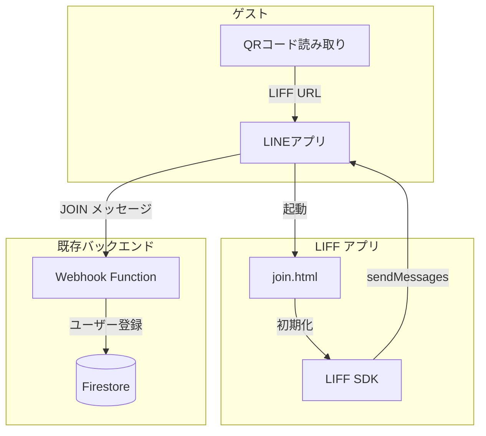
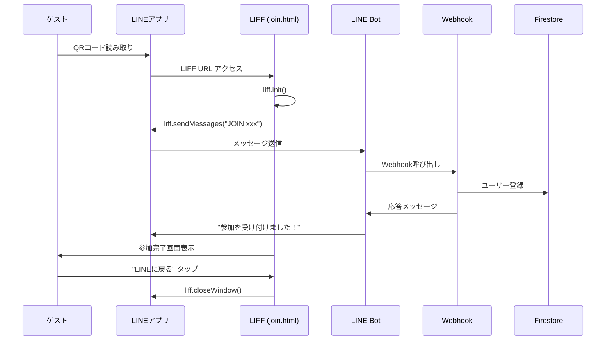
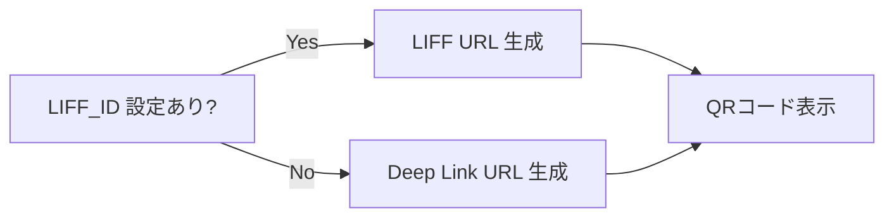
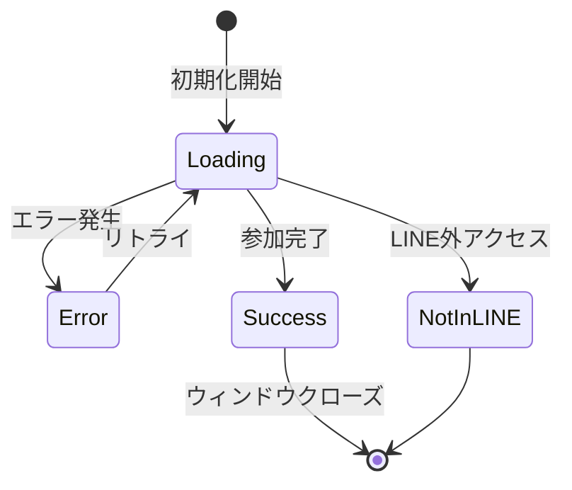

# LIFF自動参加機能 設計書

## 概要

LINE Front-end Framework (LIFF) を導入し、ゲストがQRコードを読み取った際に自動でイベントに参加できる機能を実装する。

現状、ゲストは QR コードを読み取った後「JOIN xxx」という意味不明な文字列を手動で送信する必要があり、UX 上の課題がある。LIFF を使用することで、この送信処理を自動化し、シームレスな参加体験を提供する。

## 目的

### 解決したい課題

1. **UX の問題**: 「JOIN abc123」のような暗号的なメッセージを送信することへのユーザーの心理的抵抗
2. **操作の煩雑さ**: QR 読み取り後に「送信」ボタンを押す追加アクションが必要
3. **離脱リスク**: 何を送信するのかわからず、参加を諦めるゲストの存在

### 期待される効果

- ゲストの参加率向上
- 参加フローの簡素化（QR 読み取り → 自動完了）
- 年配のゲストでも迷わず参加可能

## 実現すること

### 機能要件

#### FR-1: LIFF アプリによる自動参加
- QR コード読み取りで LIFF アプリが起動
- ユーザー操作なしで JOIN メッセージを自動送信
- 参加完了画面を表示

#### FR-2: イベント情報の表示
- 参加完了画面にイベント名を表示
- 次のステップ（名前入力）を案内

#### FR-3: フォールバック対応
- LIFF ID 未設定時は従来の deep link 方式にフォールバック
- 段階的な移行が可能

### 非機能要件

#### NFR-1: パフォーマンス
- LIFF 初期化から参加完了まで 3 秒以内

#### NFR-2: 可用性
- LINE アプリ外からのアクセス時は適切なエラー表示
- ネットワークエラー時のリトライ機能

#### NFR-3: コスト
- 追加費用なし（LIFF は無料）

## 実現方法

### システム構成



### シーケンス図



### ファイル構成

```
src/frontend/
├── liff/
│   └── join.html          # LIFF アプリ本体
├── js/
│   ├── config.js          # LIFF_ID 設定追加
│   └── app.js             # QRコード生成ロジック更新
docs/
└── setup/
    └── liff-setup.md      # セットアップガイド
```

### データフロー

#### QR コード URL 生成



**LIFF URL 形式:**
```
https://liff.line.me/{LIFF_ID}?event={event_code}&name={event_name}
```

**Deep Link URL 形式（フォールバック）:**
```
https://line.me/R/oaMessage/{BOT_ID}/?JOIN%20{event_code}
```

### LIFF アプリ状態遷移



### 主要コンポーネント

#### 1. join.html

LIFF アプリのエントリーポイント。以下の機能を持つ：

- URL パラメータから event_code を取得
- LIFF SDK を初期化
- 自動で JOIN メッセージを送信
- 状態に応じた UI を表示（ローディング / 成功 / エラー）

#### 2. config.js への追加

```javascript
// LIFF ID for automatic event joining
window.LIFF_ID = "1234567890-xxxxxxxx";
```

#### 3. app.js の更新

QR コード生成時に LIFF URL を使用するよう変更：

```javascript
function generateJoinUrl(eventCode, eventName) {
  if (window.LIFF_ID) {
    return `https://liff.line.me/${window.LIFF_ID}?event=${eventCode}&name=${encodeURIComponent(eventName)}`;
  }
  // フォールバック
  return `https://line.me/R/oaMessage/${window.LINE_BOT_ID}/?JOIN%20${eventCode}`;
}
```

### LINE Developers 設定

| 項目 | 値 |
|------|-----|
| チャネルタイプ | LINE ログイン |
| LIFF サイズ | Full |
| エンドポイント URL | `https://smile-photo-contest.web.app/liff/join.html` |
| Scope | profile |
| ボットリンク機能 | On (Aggressive) |
| Scan QR | On |

## 実現しないこと

### MVP から除外

1. **LIFF 内での名前入力**
   - 現状は LINE トーク画面で名前を入力
   - LIFF 内で完結させる拡張は将来検討

2. **複数イベント選択 UI**
   - 1 つの QR コード = 1 つのイベント
   - イベント一覧からの選択機能は不要

3. **オフライン対応**
   - ネットワーク必須
   - オフラインキャッシュは対象外

4. **プッシュ通知**
   - 参加完了の通知は LINE Bot からのメッセージで代替

## 懸念事項

### 技術的懸念

| 懸念 | リスク | 対策 |
|------|--------|------|
| LIFF 初期化の遅延 | 中 | ローディング UI を表示して体感速度を改善 |
| sendMessages の権限エラー | 低 | ボットリンク機能を Aggressive に設定 |
| LINE アプリ外からのアクセス | 低 | 適切なエラー画面を表示 |

### 運用上の懸念

| 懸念 | リスク | 対策 |
|------|--------|------|
| LIFF 設定の複雑さ | 中 | 詳細なセットアップガイドを作成 |
| 既存 QR コードとの互換性 | 低 | LIFF_ID 未設定時はフォールバック |

### 未解決事項

- [ ] LINE Developers でのチャネル作成（手動作業）
- [ ] LIFF ID の取得と config.js への設定
- [ ] 本番環境での動作確認

## 参考資料

- [LIFF ドキュメント](https://developers.line.biz/ja/docs/liff/)
- [liff.sendMessages() API](https://developers.line.biz/ja/reference/liff/#send-messages)
- [LIFF v2 SDK](https://developers.line.biz/ja/docs/liff/developing-liff-apps/)
