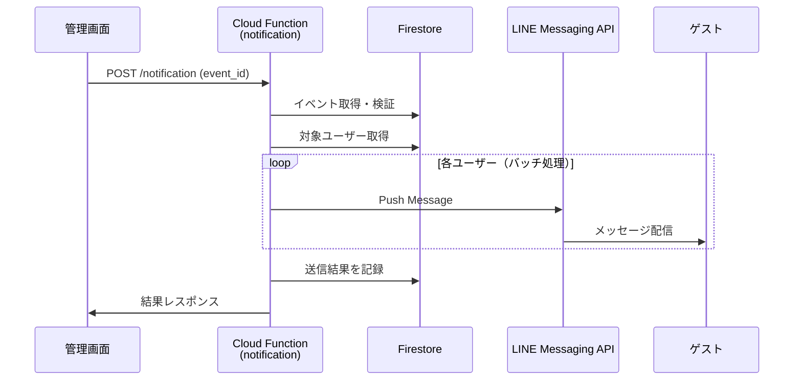
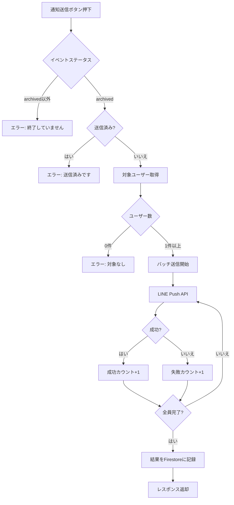

# 設計書: イベント終了後LINE通知

## 概要

イベント（結婚式）終了後に、参加ゲストへLINEメッセージを送信し、サービスの認知度向上と新規顧客獲得につなげるバイラル施策。

## 目的

### ビジネス目的

結婚式に参加したゲストの中には、近い将来自分の結婚式を控えている人がいる可能性が高い。イベント終了後にサービス紹介メッセージを送ることで、低コストで新規顧客を獲得する。

### なぜこの施策が有効か

1. **ターゲット精度が高い**: 結婚式参加者は同世代の友人・同僚であり、自身も結婚を控えている可能性が高い
2. **体験後のアプローチ**: 実際にサービスを体験した直後なので、価値が伝わりやすい
3. **コストゼロ**: LINE Messaging API の無料枠内で実施可能
4. **自然な導線**: 楽しい体験の直後に自然な流れで紹介できる

### 代替手段との比較

| 施策 | メリット | デメリット |
|------|---------|-----------|
| **イベント後LINE通知（本施策）** | 体験直後でインパクト大、コストゼロ | オプトアウトはブロックのみ |
| ランキング画面にロゴ表示 | 会場全員に認知される | 行動喚起が弱い |
| イベント後アルバムページ | ゲストが自発的にアクセス | 開発コスト高、Phase 3以降 |
| 紹介割引コード | インセンティブあり | 管理が複雑、Phase 3以降 |

## やること（機能要件）

### 基本機能

| # | 機能 | 詳細 |
|---|------|------|
| 1 | 通知トリガー | 管理画面から手動で実行（イベントが `archived` 状態のとき） |
| 2 | 通知対象 | 当該イベントの登録済みユーザー（`join_status: registered`） |
| 3 | メッセージ内容 | 感謝 + サービス紹介 + 問い合わせ先 |
| 4 | 送信ログ | 送信成功/失敗をFirestoreに記録 |
| 5 | 冪等性 | 同じイベントに対して複数回実行しても1回のみ送信 |

### 非機能要件

| # | 要件 | 詳細 |
|---|------|------|
| 1 | エラーハンドリング | 一部ユーザーへの送信失敗が全体を止めない |
| 2 | レート制限対応 | LINE API のレート制限（1000件/分）を考慮したバッチ処理 |
| 3 | オプトアウト | ゲストはBotブロックでオプトアウト可能（既存の仕組み） |

### メッセージ内容

```
🎉 本日はおめでとうございました！

「笑顔写真コンテスト」にご参加いただき
ありがとうございました 📸

━━━━━━━━━━━━━━━━━

このアプリはご自身の結婚式でもお使いいただけます！
簡単に使えるので、ぜひ結婚式を盛り上げましょう！

ご興味があればお気軽にお問い合わせください 👇
nakayamaryo0731@gmail.com
```

## やり方（実装設計）

### アーキテクチャ



### トリガー方式

採用: 管理画面から手動トリガー

| 方式 | 採用 | 理由 |
|------|------|------|
| 管理画面から手動 | ✅ | 任意のタイミングで実行可能、誤送信リスク低 |
| Firestore onUpdate | ✗ | 深夜送信のリスク |
| Cloud Scheduler | ✗ | 設定が複雑 |

手動トリガーの利点:
- イベント終了のタイミングは顧客によって異なる（披露宴直後、二次会後、翌日など）
- 運営者が適切なタイミングを判断して送信できる
- 実装がシンプル

### データ構造

#### events コレクション（追加フィールド）

| フィールド | 型 | 説明 |
|-----------|-----|------|
| `notification_sent_at` | timestamp \| null | 通知送信完了日時 |
| `notification_sent_count` | number | 送信成功件数 |
| `notification_failed_count` | number | 送信失敗件数 |

#### users コレクション（追加フィールド）

| フィールド | 型 | 説明 |
|-----------|-----|------|
| `post_event_notification_sent_at` | timestamp \| null | 通知送信日時 |

### API設計

#### Cloud Function: `send_post_event_notification`

**エンドポイント**: `POST /notification`

**リクエスト**:
```json
{
  "event_id": "xxx"
}
```

**レスポンス（成功）**:
```json
{
  "success": true,
  "sent_count": 45,
  "failed_count": 2
}
```

**エラーレスポンス**:

| ステータス | 条件 |
|-----------|------|
| 400 | イベントが `archived` でない |
| 400 | 既に通知送信済み |
| 400 | 対象ユーザーが0件 |
| 401 | 認証エラー |
| 404 | イベントが存在しない |

### 処理フロー



### 管理画面UI

```
┌──────────────────────────────────────────┐
│  田中太郎 & 花子 結婚式                    │
│  Status: Archived                        │
│                                          │
│  [QR Code] [Ranking URL] [ゲストへ通知]   │
│                                          │
│  📬 通知ステータス                         │
│  ✅ 2026-03-16 21:30 送信完了             │
│     成功: 45件 / 失敗: 2件                │
└──────────────────────────────────────────┘
```

- 「ゲストへ通知」ボタンは `archived` 状態かつ未送信のときのみ有効
- 送信済みの場合は送信日時と結果を表示

### 変更ファイル一覧

| ファイル | 操作 | 内容 |
|---------|------|------|
| `src/functions/notification/main.py` | 新規 | 通知送信Cloud Function |
| `src/functions/notification/requirements.txt` | 新規 | 依存関係 |
| `src/frontend/js/admin.js` | 変更 | 通知送信ボタン・ステータス表示 |
| `terraform/modules/functions/main.tf` | 変更 | notification関数デプロイ |
| `terraform/modules/iam/main.tf` | 変更 | サービスアカウント権限 |

### LINE Messaging API

- **API**: Push Message API (`POST /v2/bot/message/push`)
- **レート制限**: 1000リクエスト/分
- **実装**: 100件ごとに処理、必要に応じてスリープ

## やらないこと

| 項目 | 理由 |
|------|------|
| 送信時間のスケジュール機能 | 手動トリガーで十分 |
| メッセージのカスタマイズ | 固定メッセージで開始、需要があれば Phase 2 |
| 送信前プレビュー | Phase 2以降 |
| 通知再送信機能 | 失敗時はFirestoreリセットで対応 |
| 自動トリガー（archived変更時） | 深夜送信リスク回避のため |

## 懸念事項

### 1. スパム認定リスク

**懸念**: 宣伝メッセージがLINEポリシーに抵触しないか

**対策**:
- メッセージは1イベントにつき1回のみ
- 感謝がメインで宣伝は控えめ
- オプトアウト方法（ブロック）を明記

### 2. 送信失敗時の扱い

**懸念**: 一部ユーザーへの送信が失敗した場合

**対策**:
- 失敗はログに記録し、全体処理は継続
- 管理画面に失敗件数を表示
- 個別再送信は Phase 2 で検討

### 3. コスト

**懸念**: LINE Messaging API の月間無料枠（200通）超過

**対策**:
- 1イベント50名 × 4イベント/月 = 200通
- 超過月はライトプラン（5,000円/月）にアップグレード
- 既存コスト計画に含まれている

### 4. ゲストの期待との乖離

**懸念**: 「宣伝が来るとは思わなかった」という不満

**対策**:
- メッセージ内容を押し付けがましくしない
- 将来的にLINE Bot参加時の同意文言に追記を検討

## 参考資料

- [LINE Messaging API ドキュメント](https://developers.line.biz/ja/docs/messaging-api/)
- [docs/planning/public-release-roadmap.md](../planning/public-release-roadmap.md) - バイラル施策の方針
- [docs/planning/mvp-features.md](../planning/mvp-features.md) - MVP機能定義
