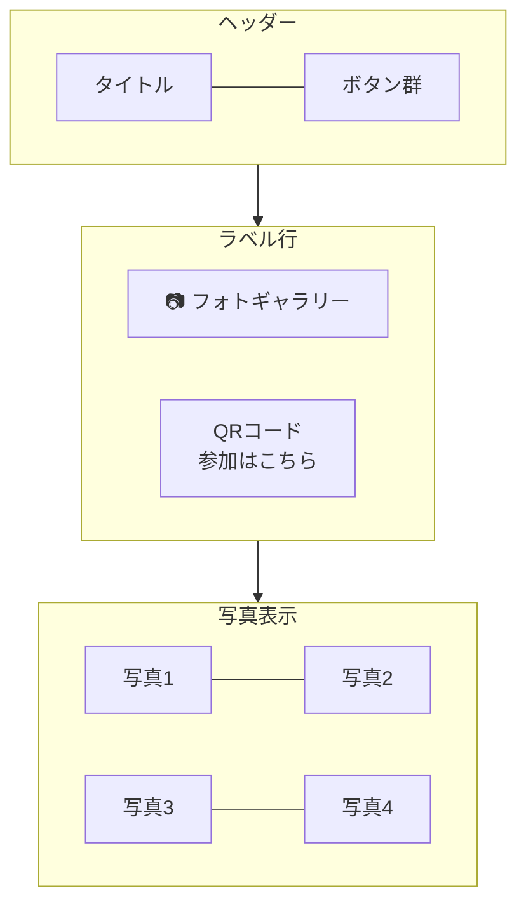
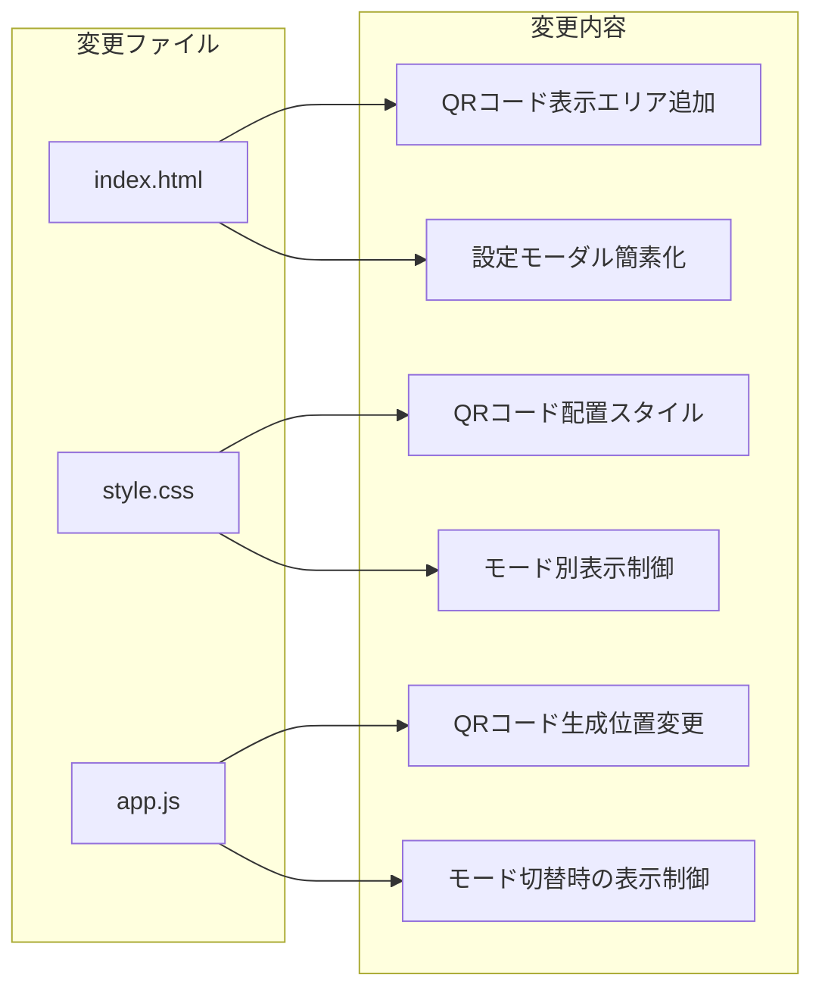

# ランキング画面QRコード常時表示 設計書

最終更新: 2026-01-30

---

## Overview

ランキング画面にQRコードを常時表示し、ゲストがいつでもスマートフォンで読み取って参加できるようにする。
併せて、QRコードを設定モーダルから移動した後の設定モーダルの役割を再定義する。

---

## Purpose

### なぜこの変更が必要か

1. **ゲスト参加の導線改善**
   - 現状: 設定モーダルを開かないとQRコードが見えない
   - 課題: プロジェクター投影時、運営者が設定モーダルを開く必要がある
   - 目標: ゲストが常にQRコードをスキャンできる状態にする

2. **結婚式での運用シナリオ**
   ```
   現状のフロー:
   ゲスト → 「QRコードどこ？」 → 運営者が設定を開く → QR表示 → スキャン

   理想のフロー:
   ゲスト → 画面を見る → QRコードをスキャン → 参加完了
   ```

3. **プロジェクター常時投影の前提**
   - ランキング画面は披露宴中ずっと投影される
   - スライドショーとランキングが自動切り替え
   - どのモードでもQRコードが見える必要がある

### 代替案の検討

| 案 | メリット | デメリット |
|----|----------|------------|
| A. 設定モーダルに維持 | 実装済み、変更不要 | ゲスト導線が悪い |
| B. 紙のQRコードを配布 | 画面変更不要 | 印刷コスト、忘れる人がいる |
| C. ランキング画面に常時表示（採用） | 最も自然な導線 | UI再設計が必要 |
| D. ヘッダーにQRコード表示 | 実装が簡単 | 小さすぎて読み取りづらい |

### 採用案: C. ランキング画面に常時表示

---

## What to Do

### 機能要件

#### 1. QRコード常時表示

| 要件 | 詳細 |
|------|------|
| 表示位置 | ランキング画面の右下または左下 |
| サイズ | 100-120px（プロジェクター距離を考慮） |
| 表示モード | ランキングモード・スライドショーモード両方で表示 |
| ラベル | 「参加はこちら」などの簡潔な案内テキスト |

#### 2. 設定モーダルの役割再定義

QRコードを移動した後、設定モーダルに残す機能:

| 機能 | 必要性 | 理由 |
|------|--------|------|
| イベント情報表示 | ○ | 現在のイベント確認用 |
| QRコードダウンロード | ○ | 印刷用途（紙配布の補助） |
| 画像一括ダウンロード | ○ | イベント後の写真取得 |
| テストデータ削除 | ○ | 本番前のクリーンアップ |

#### 3. 表示/非表示の制御

| 状態 | QRコード表示 |
|------|--------------|
| ランキングモード | ○ 表示 |
| スライドショーモード | ○ 表示 |
| 最終結果モード | △ 非表示（発表に集中） |
| イベント終了後 | × 非表示 |

### 非機能要件

| 要件 | 値 |
|------|-----|
| QRコード読み取り成功率 | 3m距離から95%以上 |
| レスポンシブ対応 | PC/タブレット表示時のみQR表示 |
| アニメーション | フェードイン/アウト（モード切替時） |

---

## How to Do It

### QRコード配置案の比較

#### 案1: 右下固定表示

```
┌─────────────────────────────────────────────┐
│ Header: 笑顔写真コンテスト     [ボタン] [⚙️] │
├─────────────────────────────────────────────┤
│                                             │
│    ┌─────────────────┐                      │
│    │                 │                      │
│    │    1位 画像     │    2位    3位        │
│    │                 │                      │
│    └─────────────────┘                      │
│                                             │
│                                    ┌─────┐  │
│                                    │ QR  │  │
│                                    │参加 │  │
│                                    └─────┘  │
└─────────────────────────────────────────────┘
```

**メリット**: 視線の流れを邪魔しない、一般的な配置
**デメリット**: 2位・3位カードと重なる可能性

#### 案2: 左下固定表示

```
┌─────────────────────────────────────────────┐
│ Header: 笑顔写真コンテスト     [ボタン] [⚙️] │
├─────────────────────────────────────────────┤
│                                             │
│    ┌─────────────────┐                      │
│    │                 │                      │
│    │    1位 画像     │    2位    3位        │
│    │                 │                      │
│    └─────────────────┘                      │
│                                             │
│  ┌─────┐                                    │
│  │ QR  │                                    │
│  │参加 │                                    │
│  └─────┘                                    │
└─────────────────────────────────────────────┘
```

**メリット**: 2位・3位との重なりを回避
**デメリット**: 左端は目立ちにくい

#### 案3: ランキングラベル横に配置（推奨）

```
┌─────────────────────────────────────────────┐
│ Header: 笑顔写真コンテスト     [ボタン] [⚙️] │
├─────────────────────────────────────────────┤
│  📸 直近15枚のランキング      ┌─────┐       │
│                               │ QR  │       │
│    ┌─────────────────┐        │参加 │       │
│    │                 │        └─────┘       │
│    │    1位 画像     │    2位    3位        │
│    │                 │                      │
│    └─────────────────┘                      │
│                                             │
└─────────────────────────────────────────────┘
```

**メリット**:
- ラベルと同じ視線の高さで自然
- メインコンテンツ（1位画像）を邪魔しない
- スライドショーモードでも同じ位置に表示可能

**デメリット**:
- ラベル行の高さが増える

### 推奨案: 案3（ランキングラベル横）

理由:
1. ゲストの視線がまずヘッダー下に行く
2. 「ランキング」という文脈とQRコードが近い
3. メインコンテンツ（写真）の邪魔にならない

### UIレイアウト詳細

#### ランキングモード

```mermaid
flowchart TD
    subgraph Header["ヘッダー"]
        T[タイトル] --- B[ボタン群]
    end

    subgraph LabelRow["ラベル行"]
        L[📸 直近15枚のランキング]
        QR[QRコード<br/>参加はこちら]
    end

    subgraph Ranking["ランキング表示"]
        R1[1位<br/>大きく表示]
        R23[2位 | 3位<br/>横並び]
    end

    Header --> LabelRow
    LabelRow --> Ranking
```

#### スライドショーモード



### QRコードコンポーネント設計

```
┌──────────────────────┐
│  ┌────────────────┐  │
│  │                │  │
│  │   QRコード     │  │
│  │   100x100px    │  │
│  │                │  │
│  └────────────────┘  │
│    参加はこちら →    │
└──────────────────────┘
```

- 背景: 白（QR読み取りのため）
- パディング: 8px
- 角丸: 8px
- ラベル: 下部に小さく表示
- LINE緑のアクセント（オプション）

### 設定モーダル再設計

QRコードを外に出した後の設定モーダル:

```
┌────────────────────────────┐
│                          ✕ │
│  イベント名                 │
│  2026-01-30  [公開中]      │
├────────────────────────────┤
│  ┌─────────┐  ┌─────────┐  │
│  │📥 画像  │  │🗑️ 削除  │  │
│  │ダウン   │  │         │  │
│  │ロード   │  │         │  │
│  └─────────┘  └─────────┘  │
├────────────────────────────┤
│  QRコード印刷用            │
│  [ダウンロード]            │
└────────────────────────────┘
```

**構成:**
1. イベント情報（名前、日付、ステータス）
2. データ管理ボタン（横並び）
3. QRコードダウンロード（印刷用途のみ）

### 実装変更箇所



### データ構造

変更なし。既存の `events` コレクションから `event_code` を取得してQRコードを生成。

### 実装手順

1. **Phase 1: QRコード常時表示**
   - index.html にQRコード表示エリア追加
   - style.css に配置スタイル追加
   - app.js でページ読み込み時にQRコード生成

2. **Phase 2: モード別表示制御**
   - ランキングモード: 表示
   - スライドショーモード: 表示
   - 最終結果モード: 非表示

3. **Phase 3: 設定モーダル簡素化**
   - QRコードセクションを「印刷用ダウンロード」に変更
   - レイアウト調整

---

## What We Won't Do

| 除外項目 | 理由 |
|----------|------|
| QRコードのアニメーション | シンプルさを優先、読み取りやすさを確保 |
| 複数QRコード表示 | 混乱を避ける、1つで十分 |
| QRコードサイズの動的調整 | 固定サイズで十分（100-120px） |
| モバイル画面でのQRコード表示 | プロジェクター投影が前提、モバイルは対象外 |

---

## Concerns

### 懸念事項と対策

| 懸念 | リスク | 対策 |
|------|--------|------|
| QRコードが小さすぎて読めない | 中 | 100px以上を確保、プロジェクターテストで検証 |
| ランキング表示と重なる | 低 | ラベル行に配置することで回避 |
| スライドショーモードでの配置 | 中 | 同じ位置（右上）に固定表示 |
| 最終結果発表時の邪魔 | 低 | 最終結果モードでは非表示にする |

### 未解決の論点

1. **QRコードの正確なサイズ**
   - 100px vs 120px
   - → 実際のプロジェクター投影でテストして決定

2. **「参加はこちら」のラベル文言**
   - 「参加はこちら」
   - 「QRで参加」
   - 「スマホで読み取り」
   - → シンプルな「参加」で十分か検討

3. **LINE緑のアクセントを入れるか**
   - LINEブランドカラー（#06C755）を使うと認知しやすい
   - ただしデザインの統一感との兼ね合い

---

## Reference Materials/Information

- 現行ランキング画面: `src/frontend/index.html`
- 設定モーダル設計: `docs/design/admin-settings-rearchitecture.md`
- QRCode.js ライブラリ: <https://github.com/davidshimjs/qrcodejs>
- LINE ディープリンク仕様: <https://developers.line.biz/ja/docs/line-login/using-line-url-scheme/>

---

## 実装チェックリスト

```
Phase 1: QRコード常時表示
□ index.html: ラベル行にQRコード表示エリア追加
□ style.css: QRコード配置スタイル追加
□ app.js: init()でQRコード生成（設定モーダルとは別）

Phase 2: モード別表示制御
□ ランキングモード: QRコード表示
□ スライドショーモード: QRコード表示
□ 最終結果モード: QRコード非表示
□ イベント終了後: QRコード非表示

Phase 3: 設定モーダル簡素化
□ QRコードセクション → 「印刷用ダウンロード」ボタンのみ
□ レイアウト調整（よりコンパクトに）
□ 不要なコード削除

Phase 4: テスト
□ プロジェクター投影でQRコード読み取りテスト
□ 各モードでの表示確認
□ 設定モーダルの動作確認
```
