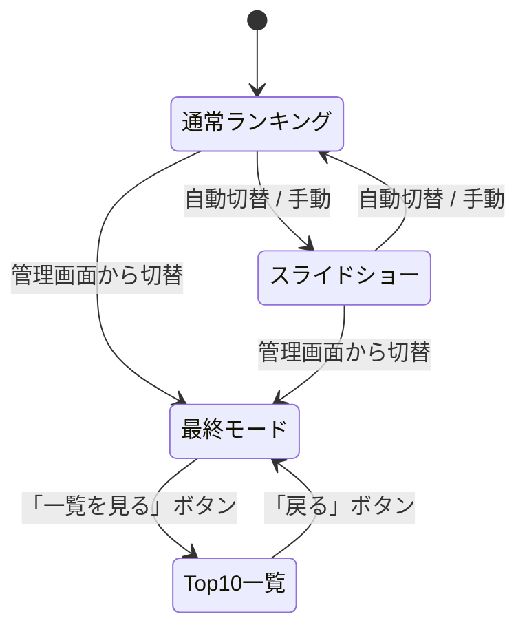

# Overview

ランキング表示の改善。主に2つの機能を追加する：
1. **Top10一覧ページ**: 最終モードから遷移できる、1-10位を1画面で一覧表示するページ
2. **AI評価コメントの表示拡張**: 通常モードのTop3、スライドショーモード、Top10一覧の全順位にAI評価を表示

## Purpose

写真コンテストの順位を「引き出物マルシェへ進む順番」として活用するため、1-10位を一覧できる機能が必要。
また、AI評価の演出が好評であり、1位以外にも表示を拡張することでゲスト体験を向上させる。

## What to Do

### 1. Top10一覧ページ

- 最終モードの画面に「一覧を見る」ボタンを追加
- ボタン押下で、1-10位を統一リスト形式で1画面表示するビューに遷移
- 各順位の表示項目: 順位、サムネイル画像、投稿者名、スコア、AI評価コメント
- ユニークユーザー制約あり（同一ユーザーは最高スコアの1件のみ）
- スクロール不要で1画面に収まるレイアウト

### 2. AI評価コメントの表示拡張

| モード | 対象順位 | 現状 | 変更後 |
|--------|----------|------|--------|
| 通常ランキング | 1位 | AI評価あり | AI評価あり（変更なし） |
| 通常ランキング | 2-3位 | AI評価なし | AI評価あり |
| スライドショー | 各写真 | AI評価なし | AI評価あり |
| Top10一覧 | 1-10位 | (新規) | AI評価あり |

### 非機能要件

- Top10一覧は1920x1080のディスプレイで1画面に収まること（会場スクリーン想定）
- スライドショーのAI評価は写真の視認性を損なわないこと

## How to Do It

### ページ構成

Top10一覧は既存の`ranking.html`内に新しいビュー（`#top10-list-content`）として追加する。別HTMLファイルにはしない。理由：Firestoreリスナーやイベント設定など既存のインフラをそのまま利用できるため。



### 変更対象ファイル

| ファイル | 変更内容 |
|----------|----------|
| `src/frontend/ranking.html` | Top10一覧ビューのHTML追加、2-3位カードにAI評価欄追加 |
| `src/frontend/js/app.js` | Top10一覧の表示/非表示ロジック、AI評価レンダリング拡張 |
| `src/frontend/css/input.css` | Top10一覧のスタイル、2-3位AI評価のスタイル、スライドショーAI評価のスタイル |

### 1. Top10一覧ビュー

`ranking.html`に新しいセクションを追加：

```html
<!-- Top 10 List View (shown from final mode) -->
<div id="top10-list-content" class="top10-list-content hidden">
    <div class="top10-header">
        <button id="top10-back-btn" class="top10-back-btn">← 戻る</button>
        <h2 class="top10-title">ランキング TOP 10</h2>
    </div>
    <div id="top10-list" class="top10-list">
        <!-- Dynamically generated -->
    </div>
</div>
```

各アイテムのHTML構造：

```html
<div class="top10-item">
    <div class="top10-rank">1</div>
    <div class="top10-image-container">
        
    </div>
    <div class="top10-details">
        <div class="top10-name-score">
            <span class="top10-name">山田太郎</span>
            <span class="top10-score">485</span>
        </div>
        <p class="top10-comment">笑顔が素晴らしい一枚です。...</p>
    </div>
</div>
```

レイアウト方針：
- 1画面に10件収めるため、各アイテムの高さを約80-90pxに制限
- AI評価コメントは1行に切り詰め（`text-overflow: ellipsis`）
- サムネイルは60x60px程度
- フォントサイズは通常ランキングより小さめ

### 2. 通常ランキングモードのRank 2-3にAI評価追加

`ranking.html`のRank 2-3カードに以下を追加：

```html
<h3 class="ai-comment-title">AI評価</h3>
<p id="rank-2-comment" class="ai-comment">-</p>
```

Rank 2-3はカードが小さいため、コメントのフォントサイズをRank 1より小さくする（1.1rem程度）。
コメントは2行までに制限し、超過分は省略表示。

`app.js`の`updateRankCard`関数を修正し、rank 2-3でもコメントを設定するよう変更。現在rank 1のみハードコードされているコメント設定処理を全rankに適用する。

### 3. スライドショーモードのAI評価追加

`createPhotoElement`関数を修正し、写真アイテムにAI評価コメントのオーバーレイを追加：

```html
<div class="photo-item">
    
    <div class="photo-comment-overlay">
        <p class="photo-comment">笑顔が素晴らしい...</p>
    </div>
</div>
```

スタイル方針：
- 写真下部に半透明背景のオーバーレイとして表示
- コメントは1行、はみ出しは省略
- フォントサイズは小さめ（0.8rem程度）
- 写真の視認性を優先し、控えめな表示

### 4. app.js の主要変更

```javascript
// Top10一覧の表示
function showTop10ListView() {
    // ranking-content, slideshow-content を hidden
    // top10-list-content を表示
    // renderTop10List() で描画
}

function renderTop10List(images) {
    // 既存の fetchAllTimeRankings() で取得済みのデータを利用
    // 1-10位を統一フォーマットで描画
}

// 最終モードに「一覧を見る」ボタン表示
// → 既存の startFinalPresentation() 内で表示制御

// updateRankCard() の修正
// → rank 2, 3 でも card.comment にAI評価を設定
```

## What We Won't Do

- 通常ランキングモードでの4-10位表示（最終モード限定とする）
- Top10一覧のリアルタイム更新（最終モード時はFirestoreリスナーの更新をスキップしており、一覧も同様に静的表示）
- Top10一覧の印刷機能やエクスポート機能
- 11位以降の表示

## Alternatives Considered

### Top10一覧を別HTMLファイルとして作成する案

遷移先を`top10.html`として独立ページにする案。
不採用理由：Firebase初期化、イベントID取得、Firestoreクエリ、テーマ設定など多くのコードを重複させる必要があり、保守コストが増大するため。

### 最終モードのレイアウト自体を変更してTop3+リストを1画面に収める案

現行の最終モード表示をそのまま改良し、スクロール不要にする案。
不採用理由：Top3カードのサイズを大幅に縮小する必要があり、結果発表の演出感が損なわれる。ボタン遷移による分離の方が、演出と一覧性を両立できる。

## Concerns

### スライドショーでのAI評価表示の視認性

写真が回転して配置されるスライドショーモードで、AI評価テキストの可読性が低くなる可能性がある。
→ 実装後にテスト画面で確認し、必要に応じてフォントサイズ・背景透過度を調整する。視認性が悪い場合は、スライドショーのAI評価表示をスコープから外すことも検討。

### 1画面に10件 + AI評価を収める情報密度

1920x1080で10件のAI評価付きリストを表示すると、情報密度が高くなりすぎる可能性がある。
→ コメントを1行に制限し、フォントサイズを調整して対応。実装後にレイアウトを確認する。

## Reference Materials/Information

- 現行ランキング表示実装: `src/frontend/ranking.html`, `src/frontend/js/app.js`, `src/frontend/css/input.css`
- 現行4-10位リスト: `app.js` L175-206 `renderRankingList()`
- 現行最終モード: `app.js` L390-431 `fetchAllTimeRankings()`
- スライドショー写真要素: `app.js` L1118-1150 `createPhotoElement()`
