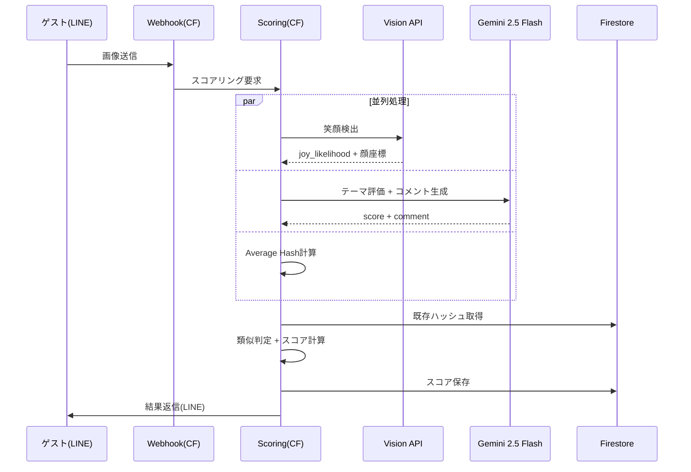
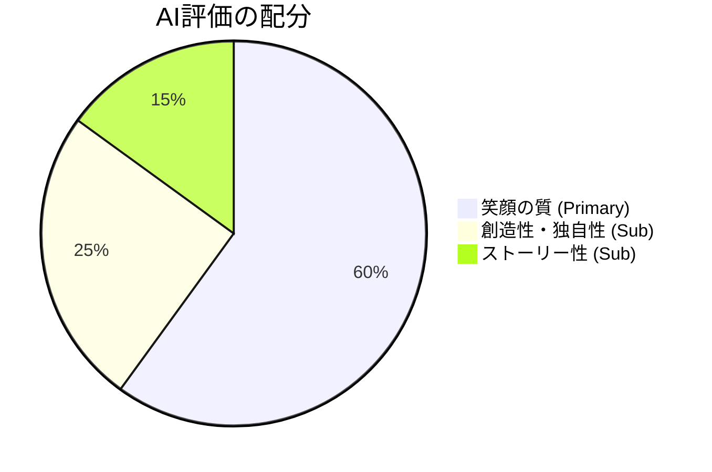

# 採点ロジックとAIコメントの改善 設計書

最終更新: 2026-02-15

---

## 概要

現行の採点ロジック（笑顔スコア × テーマ評価 ÷ 100 × 類似ペナルティ）とAIコメント生成を改善する。
実際の結婚式運用（80名規模、150枚超、参加率70%超）で得られたフィードバックを基に、
**ゲスト体験の向上**と**ゲーミフィケーションの強化**を目的とした再設計を行う。

---

## 目的

### 現状の課題

#### 1. AIコメントが「ありきたり」

現行のGeminiプロンプトは、笑顔を評価する専門家という立場で真面目なコメントを返す設計になっている。
結果として、以下のような**似たようなコメント**が繰り返される：

```
「全員の目元から溢れる自然な喜びが印象的です。グループ全体の一体感も素晴らしく、幸せな瞬間が伝わってきます」
「自然な笑顔とリラックスした雰囲気が素晴らしいです。幸福度がとても高い写真です」
```

**問題**: 何枚送っても同じ雰囲気の返答になり、次の写真を撮るモチベーションにつながりにくい。

#### 2. テーマ評価（ai_score）と笑顔スコアの役割が重複

現行のGeminiプロンプトは「自然さ(30) + 幸福度(40) + 周囲との調和(30)」で笑顔を評価している。
しかし、笑顔の程度はVision APIのjoy_likelihoodで既に計測済み。
**2つのAPIが同じ「笑顔」を評価している**ため、差別化が弱い。

#### 3. スコアのスケールが直感的でない

- 1人の笑顔: 約91点
- 5人の笑顔: 約266点
- 10人の笑顔: 約380点（顔サイズ係数で減衰）

上限がなく、数字の大きさの意味がゲストに伝わりにくい。

#### 4. グループ写真が有利すぎる

「人数が多いほど高スコア」は現行のコアコンセプトだが、これにより**友人が多いグループの集合写真がランキング上位を独占**する懸念がある。
コンテストとしての公平性を考えると、**1人1人の笑顔の質**をより重視すべき。

### この改善で達成したいこと

1. **AIコメントを「面白い・ユニーク・また撮りたくなる」ものに変える**
2. **テーマ評価の役割を「笑顔」から「写真の独自性・面白さ」に明確に分離する**
3. **1人1人の笑顔の質を重視する設計にし、グループ写真の過剰な優位性を抑える**
4. **結婚式以外のイベント（パーティ等）にも対応できる汎用的な設計にする**

---

## やること（要件）

### 機能要件

#### F-1: AIコメントの改善

- 写真ごとに**ユニークで面白いコメント**を生成する
- コメントの雰囲気: **パーティのMC（司会者）が盛り上げるような明るいトーン**
- 写真の具体的な要素（人数、ポーズ、場所、小物など）に言及する
- コメントのバリエーション: 同じスコア帯でも異なる表現を使う
- 低スコアでも**ポジティブかつユーモラス**に

#### F-2: テーマ評価の役割再定義

- **笑顔の評価をやめ、「写真としての面白さ・独自性」を評価する**（サブ指標として）
- 評価軸を以下に変更:
  - **笑顔の質**（メイン）: 自然で生き生きとした笑顔かどうか
  - **創造性**（サブ）: 面白いポーズ、構図、アイデアがあるか
  - **ストーリー性**（サブ）: 写真から場面や感情が伝わるか
- **人物が写っていない写真には0点をつける**ゲート機能は維持
- 特定のイベント種別（結婚式等）に依存しない汎用的な評価基準にする

#### F-3: 顔サイズ係数の維持

- 現行の顔サイズ係数（0.5〜1.2）は維持する
- **1人1人の笑顔の大きさ（＝顔が大きく写っている＝近距離で撮っている）**を重視する設計を維持
- グループ写真のインセンティブを過度に強化しない

#### F-4: プロンプトの英語化

- Geminiプロンプト本体を英語で記述し、出力のみ日本語を指定する
- 英語プロンプトの方が指示遵守率・バリエーション生成の精度が高い傾向があるため

### 非機能要件

- **レイテンシ**: 現行と同等（プロンプト変更のみなので影響なし）
- **コスト**: 現行と同等（Gemini呼び出し回数は変わらず）
- **後方互換性**: 既存のイベントデータには影響しない（新規イベントから適用）
- **テスト**: テスト画像10枚以上で新旧の採点結果を比較し、改善を確認

---

## やり方（設計）

### 現行アーキテクチャ（変更なし）



**処理フローの変更はなし。** 変更はプロンプト、メッセージフォーマットに限定。

### 変更1: Geminiプロンプトの刷新

#### 現行プロンプト（概要）

```
あなたは結婚式写真の専門家です。（日本語）
評価基準: 自然さ(30点) + 幸福度(40点) + 周囲との調和(30点) = 100点
出力: { "score": 85, "comment": "..." }（comment 100文字以内）
```

#### 新プロンプト案

```
You are an AI photo judge for a smile photo contest at a party/event.
Guests submit photos via LINE, and you score them and write a fun, unique comment.

## Your Personality
- Energetic, witty, and entertaining — like a party MC
- Praise effort and creativity generously
- Never use cliché phrases. Every comment must be different and specific to what you see.

## Scoring Criteria (100 points total)

### Primary: Smile Quality (60 points)
- Are the smiles genuine and natural (not forced)?
- Are the eyes smiling too (Duchenne smile)?
- How expressive and joyful are the faces?
- Rate the QUALITY of smiles, not the quantity of people.

### Secondary: Creativity & Originality (25 points)
- Unique poses, interesting compositions, or creative ideas?
- Is there action, movement, or a fun moment captured?
- Goes beyond a standard "stand and smile" photo?

### Secondary: Story & Emotion (15 points)
- Does the photo tell a story or capture a moment?
- Can you feel the energy/emotion of the scene?
- Would someone looking at this photo say "I love this!"?

## Gate Rule
- If NO people are visible in the photo (e.g., food only, scenery only, objects only),
  return score: 0 regardless of other criteria.

## Comment Rules
- Output the comment in **Japanese** (日本語で出力すること)
- **80 characters or fewer** in Japanese
- Reference **specific visible elements** in the photo (number of people, poses, setting, props, clothing, etc.)
- Start with a **different opening phrase each time** (avoid repeating the same first word/phrase)
- Maintain a **positive, playful tone** even for low scores
- **BANNED phrases** (never use these): 「自然な笑顔」「幸福感」「一体感」「印象的」「素晴らしい瞬間」「溢れる」

## Output
Output JSON only. Comment must be in Japanese, 80 chars or fewer.

Example outputs (showing variety):
{"score": 88, "comment": "ピースサインの角度が全員バラバラなのがリアルで最高！目元のシワが本気の笑い"}
{"score": 52, "comment": "おっ、ちょっと緊張気味？カメラ慣れしてないのも逆に味がある一枚"}
{"score": 91, "comment": "この爆笑の瞬間、何があったか気になる！全員つられ笑いしてるのがツボ"}
{"score": 35, "comment": "クールな表情もカッコいいけど、このコンテストは笑顔が命！もう一枚いってみよう"}
{"score": 0, "comment": "美味しそう！でも笑顔写真コンテストなので、お料理と一緒にニッコリお願いします"}
```

#### プロンプト変更のポイント

| 項目 | 現行 | 改善後 |
|------|------|--------|
| プロンプト言語 | 日本語 | 英語（出力のみ日本語指定） |
| AIの役割 | 結婚式写真の専門家 | パーティのAI写真審査員 |
| イベント種別 | 結婚式固定 | パーティ/イベント汎用 |
| 評価の主軸 | 笑顔の自然さ・幸福度（Vision APIと重複） | 笑顔の質(60) + 創造性(25) + ストーリー性(15) |
| コメントのトーン | 真面目・専門的 | 明るい・ユーモラス・具体的 |
| コメント長 | 100文字以内 | 80文字以内（より簡潔に） |
| バリエーション対策 | なし | 定型表現を具体的に禁止リスト化 |

#### 評価軸の設計意図



- **笑顔の質（60点）**: Vision APIのjoy_likelihoodは「笑っているかどうか」の2値的判定。
  Geminiは**笑顔の「質」**（自然さ、目元の表情、Duchenne smile等）を評価する。
  → Vision APIとの役割は「検出 vs 質の評価」で分離される。
- **創造性（25点）**: ゲストが「面白い写真を撮ろう」と工夫するインセンティブ。
  ゲーミフィケーションの深みを増す。
- **ストーリー性（15点）**: 記念写真としての価値を付与。「いい写真」が高く評価される。

### 変更2: 顔サイズ係数

**変更なし。** 現行のまま維持する。

```python
# 現行（維持）
# face_size_multiplier: 0.5〜1.2
if relative_size >= 0.08:
    return 1.2                    # アップ（1-2人）
elif relative_size >= 0.05:
    return 0.9 + ...              # 少人数（3-4人）
elif relative_size >= 0.02:
    return 0.6 + ...              # 中グループ（5-8人）
elif relative_size >= 0.01:
    return 0.5 + ...              # 大グループ（10+人）
else:
    return 0.5                    # 遠景
```

#### 設計根拠

グループ写真が有利すぎる問題を解消するため、顔サイズ係数は現行を維持する。
**アップで大きく映った笑顔（＝1人1人の笑顔の質）を重視する**方針。

#### スコアシミュレーション（現行維持）

**条件**: 全員 joy=VERY_LIKELY（95点）、ai_score=80、類似なし

| 人数 | 顔サイズ係数(平均) | smile_score | 総合スコア | 1人あたりのスコア寄与 |
|------|-------------------|-------------|-----------|---------------------|
| 1人（アップ） | 1.2 | 114 | **91** | 91 |
| 3人（中距離） | 0.9 | 257 | **205** | 68 |
| 5人（中グループ） | 0.7 | 333 | **266** | 53 |
| 10人（大グループ） | 0.5 | 475 | **380** | 38 |

→ 人数が増えるとスコアは上がるが、**1人あたりの寄与は下がる（逓減）**。
「10人集めて380点」vs「1人の最高の笑顔で91点」のバランス。
ランキング上位は大グループが有利だが、**圧倒的に有利ではない**。

### 変更3: LINE返信メッセージの改善

#### 現行フォーマット

```
🎉 採点完了！

【最終スコア】389点

😊 笑顔スコア: 458点（5人）
🤖 AIテーマ評価: 85点
💬 全員の目元から溢れる自然な喜びが印象的です...
```

#### 改善フォーマット

```
🎉 389点！

😊 笑顔: 458点（5人が笑顔！）
🎨 AI評価: 85点
💬 ピースサインの角度が全員バラバラなのがリアルで最高！目元のシワが本気の笑い
```

#### 変更点

- 最終スコアを冒頭に大きく表示（数字のインパクト）
- 「AIテーマ評価」→「AI評価」に簡略化
- 「採点完了！」の行を削除（スコアだけでわかる）
- コメントが主役になるよう余分なテキストを削減

#### 類似画像の場合

```
📸 68点（類似写真ペナルティ）

前の写真と似てるかも！違う構図で撮ってみよう💡

😊 笑顔: 95点（1人）
🎨 AI評価: 72点
💬 クールな表情もカッコいいけど、このコンテストは笑顔が命！もう一枚いってみよう
```

### 変更箇所の一覧

| # | ファイル | 関数/箇所 | 変更内容 |
|---|---------|-----------|---------|
| 1 | `src/functions/scoring/main.py` | `evaluate_theme()` | Geminiプロンプトの差し替え（英語化 + 評価軸変更） |
| 2 | `src/functions/scoring/main.py` | `send_result_to_line()` | メッセージフォーマットの改善 |
| 3 | `docs/architecture/scoring.md` | 全体 | ドキュメントを新仕様に更新 |

**`get_face_size_multiplier()` は変更なし。**

---

## やらないこと（MVPスコープ外）

| 項目 | 理由 |
|------|------|
| スコアの正規化（0-100表示） | ランキングの面白さが減る。大きな数字の方がゲーム的に楽しい |
| ランキング情報をコメントに含める | Geminiにランキングデータを渡す必要があり、アーキテクチャ変更が大きい |
| ユーザー名をコメントに含める | Geminiに名前を渡す必要があり、プライバシー懸念 |
| 計算式の根本変更（加算式等） | 現行の乗算式は「笑顔×テーマ」の掛け合わせで直感的。大きな変更リスクを避ける |
| 表情の多様化（怒り顔、驚き顔のスコア化） | 「笑顔コンテスト」のコンセプトからブレる |
| 次のアクションを促す一言 | 余計なお世話になりやすい。コメント自体の面白さに集中する |
| ミッション機能（AIがお題を出す） | 差別化アイデアとして有力だが、別設計として切り出す |
| AIエンドロール自動生成 | 差別化アイデアとして有力だが、スコープが大きい |
| イベント種別に応じたプロンプト切り替え | 将来対応。現時点では汎用プロンプトで十分 |

---

## 懸念事項

### C-1: Geminiのコメントバリエーション

**懸念**: プロンプトで定型表現を禁止しても、数百枚の写真に対して本当にバリエーション豊かなコメントが維持できるか。

**対策案**:
- temperatureパラメータを高めに設定（0.9〜1.0）してランダム性を増す
- 実際に50枚程度テストしてバリエーションを確認
- 必要なら、プロンプトにBANNEDリストを拡充

### C-2: 英語プロンプト × 日本語出力の品質

**懸念**: 英語プロンプトで日本語コメントを生成した場合、日本語のニュアンス（敬語レベル、カジュアルさ）が不自然にならないか。

**対策案**:
- テスト画像で日本語出力の自然さを確認
- 必要なら、コメントのトーン指示部分のみ日本語で補足
- 最悪の場合、プロンプト全体を日本語に戻すフォールバックプラン

### C-3: ai_scoreの分布変化

**懸念**: 評価軸を「笑顔の自然さ・幸福度」から「笑顔の質・創造性・ストーリー性」に変えることで、ai_scoreの平均値が変わり、トータルスコアの分布に影響する可能性。

**対策案**:
- テスト画像で新旧プロンプトのスコア分布を比較
- 必要なら計算式の係数を調整
- 新規イベントからのみ適用し、既存イベントには影響させない

### C-4: 笑顔の「質」評価がVision APIと本当に分離できるか

**懸念**: Geminiに「笑顔の質」を評価させると、結局Vision APIと同じ「笑っているか」を見てしまうのでは？

**対策案**:
- プロンプトで明確に「Vision APIが既に笑顔の有無を検出している」ことは示さないが、
  評価基準を「Duchenne smile（目元の笑い）」「表情の豊かさ」等、Vision APIでは検出できない要素に寄せている
- テストで実際にVision API高スコア × Gemini低スコア（作り笑い写真等）のケースが出ることを確認

### C-5: 既存ドキュメントとの整合性

**懸念**: `docs/architecture/scoring.md` にある現行仕様と乖離する。

**対策**: 実装と同時にドキュメントも更新する（変更箇所一覧の#3）。

---

## 参考情報

### 実際の結婚式運用からの学び

- **80名規模、150枚超、参加率70%超、ゼロダウンタイム**
- ゲストがAI採点のハックを試みた（様々なパターンの写真をアップ）→ **ゲーミフィケーションが機能している証拠**
- AIコメントが「ありきたり」だったという反省 → **今回の改善の直接的な動機**
- 昔の思い出写真もアップされた → 「人物が写っていない写真を0点にする」ゲート機能の重要性を確認

### 競合サービスの動向

| サービス | 写真評価方式 | コメント |
|---------|------------|---------|
| フォトシュシュ | 手動投票 | ゲストが投票（AI未使用） |
| 猫の風船 | 手動投票 | ゲストが投票（AI未使用） |
| スマイルメモリー | 手動投票 | ベストフォトアワード形式 |

**→ AI自動採点 + ユニークなコメントは当サービスだけの差別化ポイント。ここを磨くことが競争優位につながる。**

### プロンプト言語の選択根拠

| 項目 | 日本語プロンプト | 英語プロンプト |
|------|----------------|---------------|
| 指示理解の精度 | 良い | より高い（学習データ量の差） |
| 制約指示の遵守率 | 普通 | 高い（BANリスト等の遵守） |
| 日本語出力の自然さ | 自然 | 概ね自然（要テスト） |
| 保守性 | 日本語話者が読みやすい | 英語が必要 |

→ **英語プロンプト + 日本語出力のハイブリッド方式を採用。** テスト結果次第で日本語に戻すフォールバックあり。

### 関連ドキュメント

- [現行スコアリングアルゴリズム](../architecture/scoring.md)
- [差別化アイデア](../planning/differentiation-ideas.md)
- [マーケティング戦略](../planning/marketing-strategy.md)

### コード参照

- `src/functions/scoring/main.py`
  - `evaluate_theme()` (L584-729): Geminiプロンプト＋テーマ評価
  - `calculate_smile_score()` (L342-451): Vision APIによる笑顔検出
  - `get_face_size_multiplier()` (L280-322): 顔サイズ係数
  - `get_joy_likelihood_score()` (L249-277): joy_likelihood→数値変換
  - `send_result_to_line()` (L1117-1158): LINE返信メッセージ
  - `generate_scores_with_vision_api()` (L732-918): 採点メインロジック
