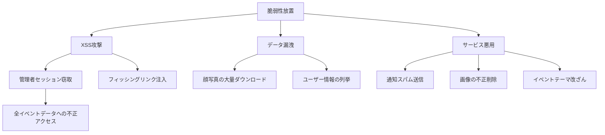
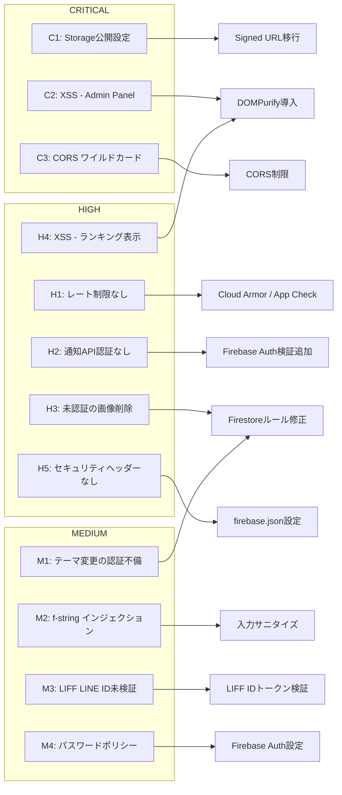
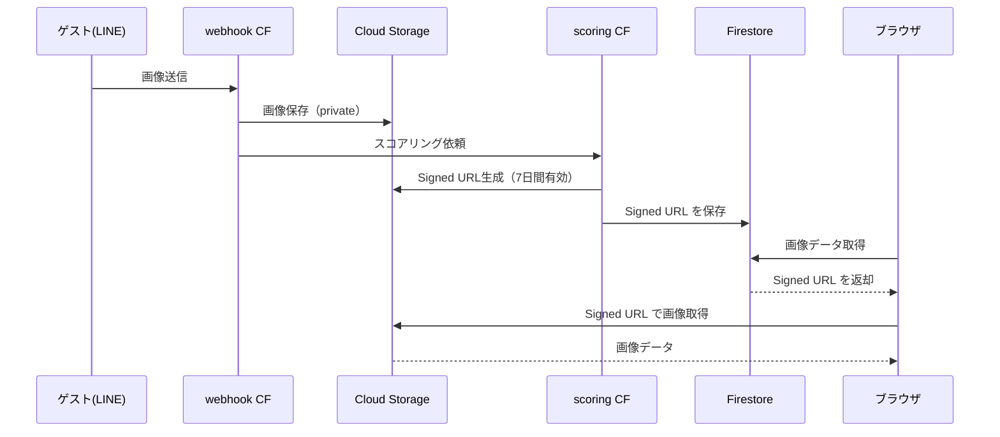
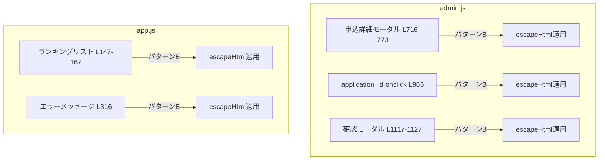
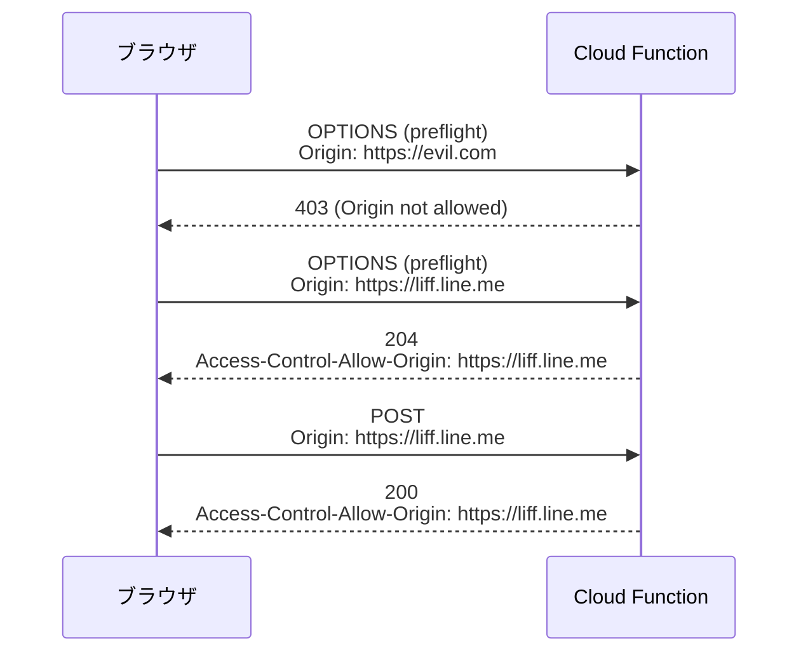
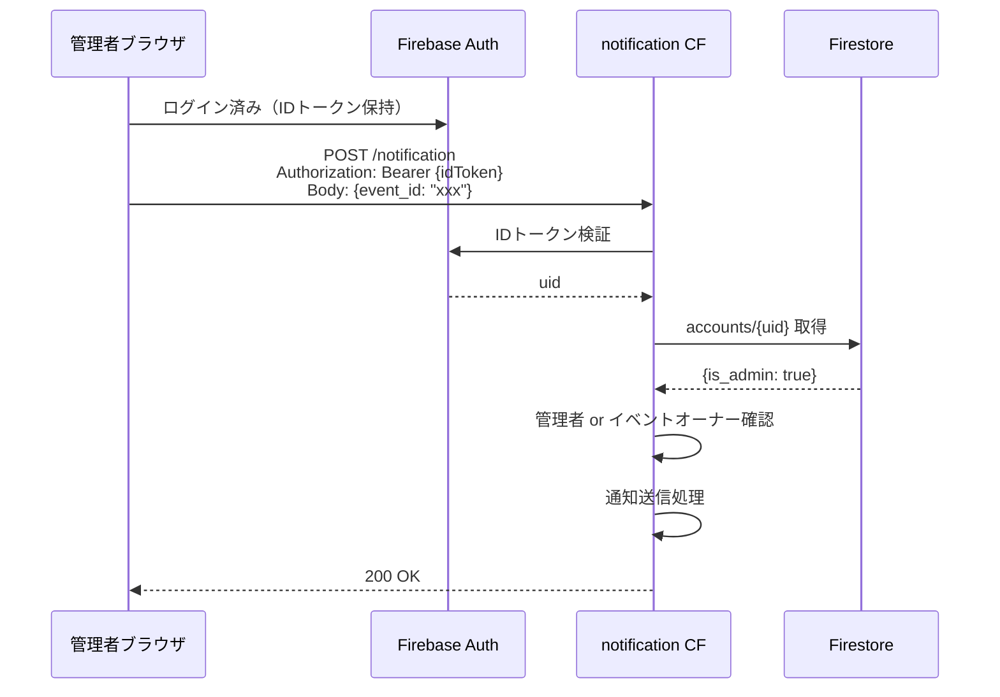
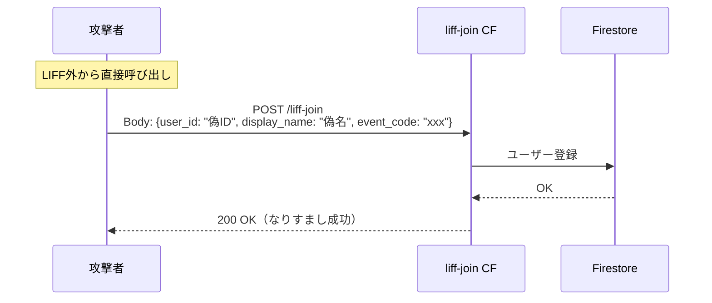
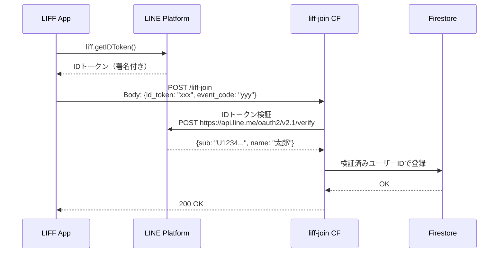

# 設計書: Shannon セキュリティスキャンにより発覚した脆弱性対策

**作成日**: 2026-02-13
**ステータス**: Draft
**関連**: Shannon AI Penetration Testing レポート (`audit-logs/host-docker-internal_shannon-1770952331705/`)

---

## Overview

AI 自律型ペネトレーションテストツール「Shannon」によるセキュリティスキャンの結果、本アプリケーションにおいて **CRITICAL 3件、HIGH 5件、MEDIUM 4件** の脆弱性が検出された。本設計書は、これらの脆弱性に対する対策を体系的に定義し、プロダクション環境での運用に耐えうるセキュリティレベルを達成することを目的とする。

---

## Purpose

### なぜこの対応が必要か

- 結婚式の写真（顔画像=生体データ）を扱うサービスであり、**個人情報保護の観点**から高いセキュリティが求められる
- 管理画面のXSS脆弱性により、**管理者アカウントのセッションハイジャック**が可能な状態にある
- 公開エンドポイントの認証不備により、**第三者によるLINEメッセージの一斉送信**が可能
- Cloud Storageバケットが公開設定のため、**ゲストの顔写真が認証なしで閲覧可能**

### 対策を行わない場合のリスク



---

## What to Do

### 脆弱性一覧と対策方針



---

### Phase 1: CRITICAL（即座に対応）

#### C1: Cloud Storage バケットの公開アクセス削除

**現状**: `allUsers` に `roles/storage.objectViewer` が付与されており、バケット内の全画像が認証なしでアクセス可能。

**対策**: 公開IAMバインディングを削除し、Signed URL のみでアクセスさせる。既にSigned URL生成ロジックは実装済み（`scoring/main.py`）のため、Terraform設定の変更が主な作業。

#### C2: XSS 脆弱性の修正（Admin Panel + ランキング表示）

**現状**: `innerHTML` でユーザー入力を直接レンダリングしている箇所が複数存在。

**対象箇所**:

| ファイル | 行 | コンテキスト | 入力源 |
|---------|-----|------------|--------|
| `admin.js` | 716-770 | 申込詳細モーダル | 申込フォーム（未認証） |
| `admin.js` | 965 | イベントカード application_id | Firestore ID |
| `admin.js` | 1117-1127 | 確認モーダル | 内部メッセージ |
| `app.js` | 147-167 | ランキングリスト | LINEユーザー名 |
| `app.js` | 316 | エラーメッセージ | error.message |

**対策**: 2つのアプローチを組み合わせる。

1. **textContent への置換**: HTMLレンダリングが不要な箇所は `textContent` / `createElement` に変更
2. **エスケープ関数の導入**: HTMLが必要な箇所にはエスケープユーティリティを適用

#### C3: CORS ワイルドカードの制限

**現状**: `liff-join`, `notification`, `application-notify` の3つのCloud Functionsで `Access-Control-Allow-Origin: *` が設定されている。

**対策**: 許可するオリジンを明示的に制限する。

---

### Phase 2: HIGH（早期に対応）

#### H1: レート制限の実装

**対策**: Firebase App Check の導入を検討。Cloud Armor は Cloud Functions Gen2 では直接適用が難しいため、アプリケーションレベルでの制御を実装。

#### H2: 通知エンドポイントの認証追加（概要）

**現状**: `/notification` エンドポイントは認証なしで誰でもPOST可能。event_id を知っていれば第三者がゲスト全員にLINEメッセージを送信できる。

**対策**: Firebase Auth IDトークンによる認証を追加し、管理者またはイベントオーナーのみ実行可能にする。

#### H3: 未認証の画像ソフトデリート制限

**現状**: Firestoreルールで `deleted_at` フィールドのみの更新が未認証で許可されている。これにより、第三者が任意のイベントの画像を非表示にできる。

**対策**: `deleted_at` の更新にもイベント参加者の検証を追加する。ただし、LINE ユーザーは Firebase Auth を持たないため、代替手段を検討する必要がある。

#### H4: セキュリティヘッダーの追加

**現状**: `firebase.json` にセキュリティヘッダーが一切設定されていない。

**対策**: CSP, X-Frame-Options, HSTS等を追加。

---

### Phase 3: MEDIUM（計画的に対応）

#### M1: イベントテーマ変更の認証要求

**現状**: Firestoreルールで `theme` フィールドは未認証でも更新可能（ランキングページのテーマ切り替え機能のため）。

**対策**: テーマ変更にイベントコードの検証を追加する方法を検討。

#### M2: application-notify の入力サニタイズ

**現状**: f-string でユーザー入力を直接展開しており、改行注入によるメッセージ改ざんが可能。

**対策**: 入力値の改行除去・長さ制限をサーバー側で実施。

#### M3: LIFF エンドポイントの LINE ID トークン検証

**現状**: liff-join エンドポイントはクライアントが提供する `user_id` をそのまま信頼している。

**対策**: LIFF IDトークンのサーバー側検証を追加。

#### M4: パスワードポリシーの強化

**現状**: Firebaseデフォルトの最低6文字。

**対策**: フロントエンドでの追加バリデーション（12文字以上等）。

---

## How to Do It

### C1: Cloud Storage 公開アクセスの削除

#### 変更対象

**`terraform/modules/storage/main.tf`**

```diff
- # Public read access for image objects
- # TODO: Replace with signed URLs (release-todo.md #5.2)
- resource "google_storage_bucket_iam_member" "public_read" {
-   bucket = google_storage_bucket.images.name
-   role   = "roles/storage.objectViewer"
-   member = "allUsers"
- }
```

#### 影響範囲

Signed URL は既に実装済みで、ランキング表示・管理画面ともに Signed URL 経由で画像を表示している。公開アクセスを削除しても **既存の動作に影響なし**。



#### 注意事項

- `terraform apply` 前に既存の Signed URL が正常に機能していることを確認する
- Signed URL の有効期限（168時間=7日）がイベント期間をカバーしていることを確認する

---

### C2: XSS 脆弱性の修正

#### 方針

エスケープユーティリティ関数を `config.js` もしくは新規ユーティリティファイルに定義し、各所で利用する。

#### エスケープ関数

```javascript
function escapeHtml(str) {
  if (str == null) return "";
  return String(str)
    .replace(/&/g, "&amp;")
    .replace(/</g, "&lt;")
    .replace(/>/g, "&gt;")
    .replace(/"/g, "&quot;")
    .replace(/'/g, "&#039;");
}
```

#### 修正パターン

##### パターン A: textContent 置換（HTML構造が不要な場合）

```javascript
// Before
element.innerHTML = `<span>${userName}</span>`;

// After
const span = document.createElement("span");
span.textContent = userName;
element.appendChild(span);
```

##### パターン B: エスケープ適用（テンプレートリテラル内）

```javascript
// Before
detail.innerHTML = `<span>${app.groom_name} & ${app.bride_name}</span>`;

// After
detail.innerHTML = `<span>${escapeHtml(app.groom_name)} & ${escapeHtml(app.bride_name)}</span>`;
```

#### 修正箇所マッピング



#### 各箇所の具体的な修正内容

##### admin.js L716-770: 申込詳細モーダル

全てのユーザー入力フィールドに `escapeHtml()` を適用:
- `app.groom_name`, `app.bride_name`, `app.email`, `app.event_date`
- `app.start_time`, `app.end_time`, `app.guest_count`
- `app.venue_name`, `app.referral_source`, `app.questions`
- `app.event_id`

`mailto:` リンクの email にもエスケープを適用（属性コンテキスト）。

##### admin.js L965: application_id の onclick

`data.application_id` をエスケープし、JavaScript コンテキストでのインジェクションを防止。Firestore ドキュメント ID は通常安全だが、防御的にエスケープする。

##### app.js L147-167: ランキングリスト

`userName` と `imageUrl` にエスケープを適用。特に `userName` は LINE ユーザーが自由に設定可能なため、XSS ペイロードが混入するリスクが高い。`alt` 属性内の `userName` も属性コンテキストでエスケープが必要。

##### app.js L316: エラーメッセージ

`error.message` をエスケープ。エラーオブジェクトは通常安全だが、外部APIのエラーメッセージに悪意あるHTMLが含まれる可能性を排除する。

---

### C3: CORS 制限

#### 変更対象と許可オリジン

| エンドポイント | 現状 | 許可するオリジン |
|-------------|------|----------------|
| `liff-join` | `*` | `https://liff.line.me` |
| `notification` | `*` | `https://smile-photo-contest.web.app`, `https://wedding-smile-catcher.web.app` |
| `application-notify` | `*` | `https://smile-photo-contest.web.app`, `https://wedding-smile-catcher.web.app` |

#### CORS 実装方法

各 Cloud Function の CORS ヘッダー設定を、環境変数ベースの許可リストに変更する。

```python
ALLOWED_ORIGINS = os.environ.get("ALLOWED_ORIGINS", "").split(",")

def get_cors_headers(request):
    origin = request.headers.get("Origin", "")
    if origin in ALLOWED_ORIGINS:
        return {"Access-Control-Allow-Origin": origin, "Vary": "Origin"}
    return {}
```



---

### H2: 通知エンドポイントの認証追加（詳細設計）

#### 認証フロー



#### 認証の実装方法

`notification/main.py` に Firebase Admin SDK を追加し、リクエストヘッダーから IDトークンを検証する。

```python
from firebase_admin import auth as firebase_auth

def verify_admin_or_owner(request, event_id):
    """Verify the requester is admin or event owner."""
    auth_header = request.headers.get("Authorization", "")
    if not auth_header.startswith("Bearer "):
        return None, "Authorization header required"

    id_token = auth_header.split("Bearer ")[1]
    decoded = firebase_auth.verify_id_token(id_token)
    uid = decoded["uid"]

    # Check admin or event owner
    account = db.collection("accounts").document(uid).get()
    if account.exists and account.to_dict().get("is_admin"):
        return uid, None

    event = db.collection("events").document(event_id).get()
    if event.exists and event.to_dict().get("account_id") == uid:
        return uid, None

    return None, "Insufficient permissions"
```

#### フロントエンド側の変更

`admin.js` の通知送信処理にIDトークンを含める:

```javascript
const user = auth.currentUser;
const idToken = await user.getIdToken();

const response = await fetch(notificationUrl, {
  method: "POST",
  headers: {
    "Content-Type": "application/json",
    "Authorization": `Bearer ${idToken}`,
  },
  body: JSON.stringify({ event_id: eventId }),
});
```

---

### H3: Firestore ルール修正（画像ソフトデリート + テーマ変更）

#### Firestore ルールの現状の問題

```
// 現状: 誰でも任意の画像の deleted_at を設定可能
allow update: if ...
  || request.resource.data.diff(resource.data).affectedKeys().hasOnly(['deleted_at']);

// 現状: 誰でも任意のイベントの theme を変更可能
allow update: if ...
  || request.resource.data.diff(resource.data).affectedKeys().hasOnly(['theme']);
```

#### 対策案

**画像ソフトデリート**: ランキング表示ページからの画像非表示機能は、不特定の来場者が操作するため Firebase Auth を要求できない。しかし、現状では **イベントをまたいで** 他のイベントの画像を削除可能な点が問題。

**案 A**: ソフトデリート機能自体を削除し、管理者のみが画像を非表示にできるようにする
**案 B**: ソフトデリートに `event_id` の検証を追加する（リクエストに `event_id` を含め、画像の `event_id` と一致するか確認）

```javascript
// 案 B: event_id 検証付きソフトデリート
allow update: if request.resource.data.diff(resource.data).affectedKeys().hasOnly(['deleted_at'])
  && request.resource.data.event_id == resource.data.event_id;
```

> **懸念**: Firestore ルールでは `request.resource.data` は更新後のドキュメント全体を表す。
> クライアントが `event_id` を含めて送信する必要があるが、正しい `event_id` をクライアントが知っている前提になるため、
> 抑止効果は限定的。案 A（管理者限定）が最もシンプルで安全。

**テーマ変更**: ランキングページのテーマ選択機能は UX 上の意図的な設計。ただし、イベントをまたいだ変更は防ぐべき。

**推奨**: テーマ変更は現状維持とし、影響が軽微であることを受容する。もしくはランキングページ側でテーマ選択をローカルストレージベースに変更し、Firestore への書き込みを不要にする。

---

### H5: セキュリティヘッダーの追加

#### firebase.json への追加内容

```json
{
  "hosting": {
    "headers": [
      {
        "source": "**",
        "headers": [
          {
            "key": "X-Frame-Options",
            "value": "DENY"
          },
          {
            "key": "X-Content-Type-Options",
            "value": "nosniff"
          },
          {
            "key": "Referrer-Policy",
            "value": "strict-origin-when-cross-origin"
          },
          {
            "key": "Permissions-Policy",
            "value": "camera=(), microphone=(), geolocation=()"
          },
          {
            "key": "Strict-Transport-Security",
            "value": "max-age=63072000; includeSubDomains; preload"
          },
          {
            "key": "Content-Security-Policy",
            "value": "default-src 'self'; script-src 'self' https://www.gstatic.com https://cdn.jsdelivr.net; style-src 'self' 'unsafe-inline'; img-src 'self' https://storage.googleapis.com https://firebasestorage.googleapis.com data: blob:; connect-src 'self' https://firestore.googleapis.com https://identitytoolkit.googleapis.com https://*.cloudfunctions.net wss://firestore.googleapis.com; font-src 'self' https://fonts.gstatic.com; frame-src 'self' https://liff.line.me"
          }
        ]
      }
    ]
  }
}
```

> **注意**: CSP の `script-src` に含める外部ドメインは、実際に使用している CDN（Firebase SDK, Chart.js, Tabulator 等）に応じて調整が必要。`'unsafe-inline'` は Tailwind CSS の動的スタイルのために `style-src` でのみ許可。

---

### M2: application-notify 入力サニタイズ

#### 修正内容

`application-notify/main.py` の `format_notification_message` 関数で入力値をサニタイズ:

```python
def sanitize_input(value: str, max_length: int = 100) -> str:
    """Remove control characters and limit length."""
    if not value:
        return ""
    sanitized = value.replace("\n", " ").replace("\r", " ")
    return sanitized[:max_length].strip()
```

```python
def format_notification_message(data: dict) -> str:
    groom_name = sanitize_input(data.get("groom_name", ""), 50)
    bride_name = sanitize_input(data.get("bride_name", ""), 50)
    event_date = sanitize_input(data.get("event_date", ""), 20)
    start_time = sanitize_input(data.get("start_time", ""), 10)
    end_time = sanitize_input(data.get("end_time", ""), 10)
    guest_count = sanitize_input(data.get("guest_count", ""), 10)
    # ... rest of function
```

---

### M3: LIFF エンドポイント LINE IDトークン検証

#### LIFF エンドポイントの現状の問題



#### 対策後のフロー



#### 実装

- フロントエンド（`liff/join.html`）: `liff.getIDToken()` でIDトークンを取得し、`user_id` の代わりに送信
- バックエンド（`webhook/main.py` の `liff_join`）: LINE の ID トークン検証 API を呼び出して `user_id` と `display_name` を取得

---

## What We Won't Do

本対策の範囲外とする項目:

| 項目 | 理由 |
|------|------|
| **Firebase App Check の導入** | 効果は高いが、LINE Bot との統合が複雑になるため、将来の改善として扱う |
| **Cloud Armor / WAF の導入** | Cloud Functions Gen2 への直接適用が難しく、コスト対効果が低い |
| **MFA（多要素認証）の導入** | 管理者は限定メンバーであり、現時点では過剰。将来的に検討 |
| **Firestore カスタムクレームへの移行** | `is_admin` を Firestore から Firebase Auth Custom Claims に移行する案。メリットはあるが既存ロジックへの影響が大きく、別タスクとして扱う |
| **依存パッケージの完全ピンニング** | `requirements.txt` のバージョン固定。セキュリティ対策としては重要だが、本設計の範囲外 |
| **ログ長期保存の設定** | Cloud Logging の 30 日超保存。運用改善として別途対応 |
| **accounts フィールドレベルバリデーション** | Firestore ルールで `is_admin` フィールドの書き込みを制限する。Shannonで指摘されたが、現状のルールでは自身のアカウントのみ更新可能であり、`is_admin` の書き込みも自身に限られる。Firestore ルール側でフィールドレベル検証を追加すべきだが、影響範囲が広いため別設計書で扱う |

---

## Concerns

### 1. ソフトデリート機能の削除による UX 影響

**懸念**: ランキング表示ページから来場者が不適切な画像を非表示にする機能を削除すると、管理者が常にモニタリングする必要が生じる。結婚式当日は管理者が忙しい可能性がある。

**対応案**:
- 案 A: ソフトデリートを管理者限定にし、管理者にリアルタイム通知を送る
- 案 B: イベントコード（URL パラメータの `event_id`）をリクエストに含めることで、そのイベントの画像のみ操作可能にする
- **推奨**: 案 A。管理者のみに制限しつつ、管理画面からの操作を容易にする

### 2. CSP によるフロントエンド機能の破損リスク

**懸念**: Content Security Policy を厳格に設定すると、CDN から読み込んでいるライブラリ（Chart.js, Tabulator, QRCode.js 等）がブロックされる可能性がある。

**対応**: 段階的に導入する。
1. まず `Content-Security-Policy-Report-Only` でテスト
2. 問題がないことを確認後、本番適用

### 3. CORS 制限による LIFF 動作への影響

**懸念**: `liff-join` の CORS を `https://liff.line.me` に制限した場合、LINE アプリ内ブラウザの Origin ヘッダーが `https://liff.line.me` であるかの確認が必要。

**対応**: LINE LIFF ドキュメントを確認し、動作検証を行う。LINE アプリ内ブラウザから `liff.line.me` オリジンでリクエストされることを確認済みであれば問題ない。

### 4. テーマ変更のローカルストレージ化

**懸念**: テーマ選択を Firestore ではなくブラウザの localStorage で管理する方式に変更した場合、会場の表示端末（メインスクリーン）でのテーマ設定が URL パラメータ経由のみになる。

**対応**: `?theme=xxx` の URL パラメータは既に実装済みのため、会場スクリーンでは URL で指定する運用で問題ない。

### 5. Signed URL 有効期限とイベント期間の整合性

**懸念**: 現在の Signed URL 有効期限は 168 時間（7日）。イベント終了後にランキングページを閲覧する場合、画像が表示されなくなる可能性がある。

**対応**: イベントアーカイブ時に Signed URL を再生成するバッチ処理を別途実装することを検討。ただし、本設計の範囲外とする。

---

## Reference Materials/Information

### Shannon レポート

- コード分析レポート: `audit-logs/host-docker-internal_shannon-1770952331705/deliverables/code_analysis_deliverable.md`
- 偵察レポート: `audit-logs/host-docker-internal_shannon-1770952331705/deliverables/recon_deliverable.md`

### 外部リソース

- [Shannon GitHub リポジトリ](https://github.com/KeygraphHQ/shannon)
- [紹介記事: AIにコードのセキュリティを攻撃してもらった話](https://zenn.dev/smartvain/articles/ai-attacked-my-code-security-mostly-placebo)
- [Firebase Security Headers](https://firebase.google.com/docs/hosting/full-config#headers)
- [LIFF IDトークン検証](https://developers.line.biz/ja/docs/liff/using-user-profile/#verify-id-token)
- [OWASP XSS Prevention Cheat Sheet](https://cheatsheetseries.owasp.org/cheatsheets/Cross-Site_Scripting_Prevention_Cheat_Sheet.html)
- [Cloud Storage Signed URLs](https://cloud.google.com/storage/docs/access-control/signed-urls)

### 既存設計書

- `docs/design/signed-url-design.md` - Signed URL 設計（C1 関連）
- `docs/design/liff-auto-join.md` - LIFF 自動参加設計（M3 関連）
- `docs/design/post-event-notification.md` - イベント後通知設計（H2 関連）

---

## 実装優先度とタイムライン

```mermaid
gantt
    title セキュリティ対策 実装スケジュール
    dateFormat  YYYY-MM-DD
    axisFormat  %m/%d

    section Phase 1 - CRITICAL
    C1: Storage 公開アクセス削除    :crit, c1, 2026-02-14, 1d
    C2: XSS 修正 (admin.js)         :crit, c2, 2026-02-14, 2d
    C2: XSS 修正 (app.js)           :crit, c2b, after c2, 1d
    C3: CORS 制限                   :crit, c3, 2026-02-14, 1d

    section Phase 2 - HIGH
    H2: 通知API認証追加             :h2, after c1, 2d
    H3: Firestoreルール修正         :h3, after c1, 1d
    H5: セキュリティヘッダー追加     :h5, after c3, 1d

    section Phase 3 - MEDIUM
    M2: 入力サニタイズ              :m2, after h2, 1d
    M3: LIFF IDトークン検証         :m3, after m2, 2d
    M1: テーマ変更方式見直し         :m1, after h3, 1d
    M4: パスワードポリシー           :m4, after m1, 1d
```
