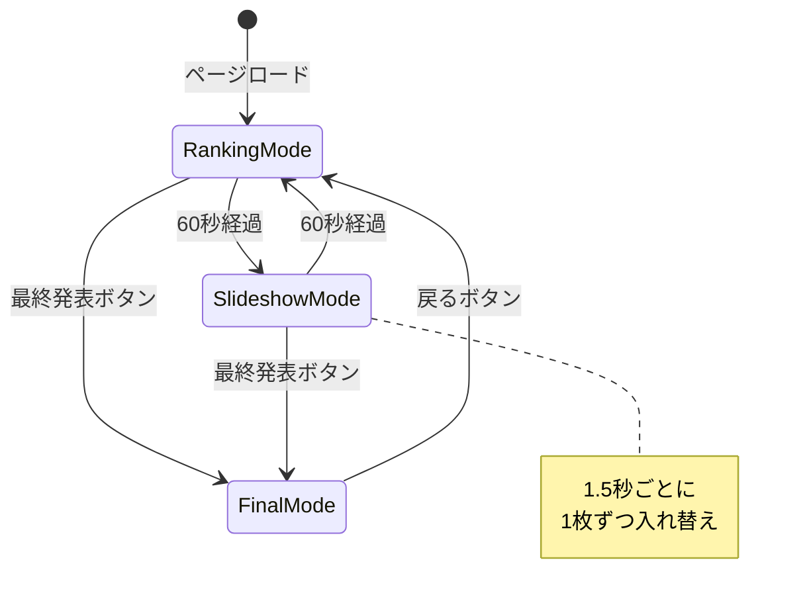
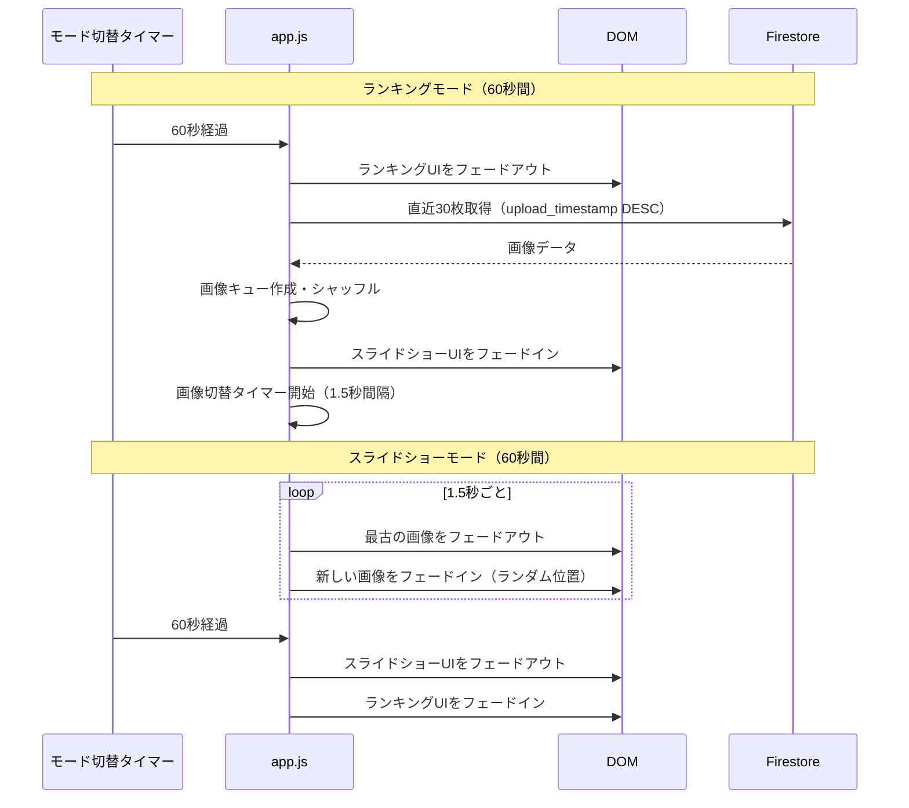
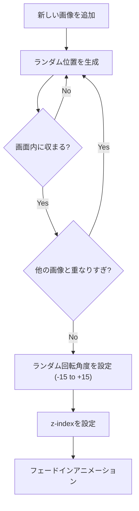
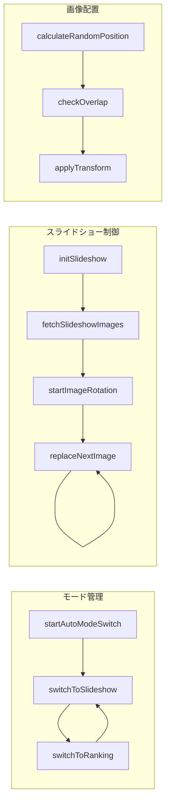
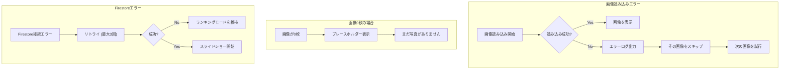

# スライドショーモード設計書

## 概要

ランキング表示とは別に、投稿された写真をスコアに関係なくスライドショー形式で表示する機能を追加する。1分ごとにランキングモードとスライドショーモードが自動的に切り替わり、参加者全員の写真が画面に表示される機会を提供する。

## 目的

### 解決したい課題

現状、スコアが低い写真は画面に表示されないため、投稿した参加者のモチベーション低下につながる可能性がある。

### 期待する効果

1. **参加者全員の写真が表示される**: スコアに関係なく直近の投稿が画面に流れる
2. **会場の一体感向上**: 自分の写真が表示されることで、より多くの参加者が楽しめる
3. **投稿モチベーション維持**: 「投稿すれば画面に映る」という期待感
4. **視覚的な演出効果**: フォトウォール風の表示で結婚式らしい華やかさを演出

## What to Do（やること）

### 機能要件

| 項目 | 仕様 |
|------|------|
| モード切り替え | ランキングモード ⇔ スライドショーモード を1分ごとに自動切り替え |
| 対象画像 | 直近30枚の投稿画像（スコア・ステータスに関係なく時系列順） |
| 同時表示枚数 | 5〜6枚 |
| レイアウト | ランダムな位置・角度で散らばるフォトウォール風 |
| 画像切り替え | 1.5秒ごとに1枚ずつ順番に入れ替わる（常に動きがある） |
| 表示内容 | 投稿者名のみ（スコアは非表示） |
| トランジション | フェードイン/フェードアウトでスムーズに切り替え |

### 非機能要件

| 項目 | 仕様 |
|------|------|
| パフォーマンス | 60fps維持、GPU最適化（CSS transform使用） |
| レスポンシブ | 式場スクリーン（16:9想定）に最適化 |
| エラー耐性 | 画像読み込み失敗時はスキップして次の画像を表示 |

## How to Do（実装方法）

### システムフロー



### モード切り替えシーケンス



### スライドショー画像配置アルゴリズム



### 画像配置の詳細ロジック

```javascript
// 配置パラメータ
const LAYOUT_CONFIG = {
  // 画像サイズ（画面幅に対する割合）
  imageWidthRatio: 0.25,  // 画面幅の25%
  imageHeightRatio: 0.35, // 画面高さの35%

  // 配置可能エリア（マージン）
  margin: {
    top: 0.1,    // 上10%
    bottom: 0.1, // 下10%
    left: 0.05,  // 左5%
    right: 0.05  // 右5%
  },

  // 回転角度範囲
  rotationRange: {
    min: -15,
    max: 15
  },

  // 重なり許容度（0-1、低いほど重なりを避ける）
  overlapTolerance: 0.3
};
```

### DOM構造

```html
<!-- 既存のランキングコンテンツ -->
<div id="ranking-content" class="ranking-content">
  <!-- 既存のランキングUI -->
</div>

<!-- 新規：スライドショーコンテンツ -->
<div id="slideshow-content" class="slideshow-content hidden">
  <!-- モードインジケーター -->
  <div class="slideshow-indicator">
    <span class="indicator-icon">📷</span>
    <span class="indicator-text">みんなの写真</span>
  </div>

  <!-- フォトウォールコンテナ -->
  <div id="photo-wall" class="photo-wall">
    <!-- 画像は動的に追加される -->
    <!--
    <div class="photo-item" style="transform: translate(x, y) rotate(deg)">
      
      <span class="photo-name">投稿者名</span>
    </div>
    -->
  </div>
</div>
```

### CSS設計

```css
/* スライドショーコンテナ */
.slideshow-content {
  position: fixed;
  top: 0;
  left: 0;
  width: 100vw;
  height: 100vh;
  background: linear-gradient(135deg, #1a1a2e 0%, #16213e 100%);
  opacity: 1;
  transition: opacity 0.8s ease-in-out;
}

.slideshow-content.hidden {
  opacity: 0;
  pointer-events: none;
}

/* フォトウォール */
.photo-wall {
  position: relative;
  width: 100%;
  height: 100%;
  overflow: hidden;
}

/* 個別の写真アイテム */
.photo-item {
  position: absolute;
  width: 25vw;
  max-width: 400px;
  background: white;
  padding: 8px;
  box-shadow: 0 10px 30px rgba(0, 0, 0, 0.3);
  border-radius: 4px;
  opacity: 0;
  transition: opacity 0.6s ease-in-out, transform 0.6s ease-out;
}

.photo-item.visible {
  opacity: 1;
}

.photo-item.exiting {
  opacity: 0;
  transform: scale(0.8);
}

.photo-item img {
  width: 100%;
  height: auto;
  aspect-ratio: 4/3;
  object-fit: cover;
  border-radius: 2px;
}

.photo-name {
  display: block;
  text-align: center;
  padding: 8px 4px 4px;
  font-size: 0.9rem;
  color: #333;
  font-family: 'Noto Sans JP', sans-serif;
}

/* モードインジケーター */
.slideshow-indicator {
  position: absolute;
  top: 20px;
  left: 50%;
  transform: translateX(-50%);
  background: rgba(255, 255, 255, 0.9);
  padding: 8px 24px;
  border-radius: 20px;
  z-index: 100;
  display: flex;
  align-items: center;
  gap: 8px;
}
```

### 状態管理

```javascript
// アプリケーション状態
const state = {
  // 現在のモード: 'ranking' | 'slideshow' | 'final'
  currentMode: 'ranking',

  // モード切替タイマーID
  modeTimerId: null,

  // スライドショー画像切替タイマーID
  imageTimerId: null,

  // スライドショー用画像キュー（直近30枚）
  imageQueue: [],

  // 現在表示中の画像（5-6枚）
  displayedImages: [],

  // 次に入れ替える画像のインデックス
  nextReplaceIndex: 0,

  // 画像キュー内の次の画像インデックス
  nextImageIndex: 0,

  // 自動モード切り替えが有効か
  autoModeSwitch: true
};

// 設定
const CONFIG = {
  MODE_SWITCH_INTERVAL: 60 * 1000,  // 1分
  IMAGE_SWITCH_INTERVAL: 1500,       // 1.5秒
  DISPLAY_COUNT: 6,                  // 同時表示枚数
  FADE_DURATION: 600,                // フェード時間（ms）
  IMAGE_LIMIT: 30                    // 取得する画像数
};
```

### 主要関数



### Firestore クエリ

```javascript
/**
 * スライドショー用の直近30枚を取得
 * - スコアに関係なく、upload_timestamp降順で取得
 * - status が 'completed' のもののみ（スコアリング完了済み）
 */
async function fetchSlideshowImages() {
  const currentEventId = getCurrentEventId();

  const imagesRef = collection(window.db, 'images');
  const q = query(
    imagesRef,
    where('event_id', '==', currentEventId),
    where('status', '==', 'completed'),
    orderBy('upload_timestamp', 'desc'),
    limit(CONFIG.IMAGE_LIMIT)
  );

  const snapshot = await getDocs(q);

  return snapshot.docs.map(doc => ({
    id: doc.id,
    ...doc.data()
  }));
}
```

### エラーハンドリング



## What We Won't Do（やらないこと）

### MVP（初期リリース）で対象外とする機能

| 機能 | 理由 |
|------|------|
| 手動モード切り替えボタン | 自動切り替えで十分。必要なら後で追加 |
| スライドショー一時停止 | 結婚式中は常に動いている方が良い |
| 画像のタッチ/クリック拡大 | 式場スクリーンでは不要 |
| BGM連動 | 実装複雑度が高い。音響は式場に任せる |
| 画像エフェクト（フィルター等） | シンプルな表示で十分 |
| いいね/リアクション機能 | スコープ外、別機能として検討 |

### 将来的に検討する機能

| 機能 | 優先度 |
|------|--------|
| モード切り替え間隔の設定（管理画面から） | 中 |
| スライドショーのテーマ切り替え（色調等） | 低 |
| 特定ユーザーの写真を優先表示 | 低 |

## Concerns（懸念事項）

### 技術的懸念

| 懸念 | 対策 |
|------|------|
| 画像読み込み遅延 | 表示前に次の画像をプリロード。読み込み完了まで前の画像を維持 |
| メモリリーク | 表示から外れた画像のDOM要素は再利用、不要なイベントリスナーは解除 |
| Firestoreリスナーの競合 | ランキングモードとスライドショーモードで同じリスナーを共有 |

### UX懸念

| 懸念 | 対策 |
|------|------|
| モード切り替えが唐突 | 0.8秒のフェードトランジションでスムーズに切り替え |
| ランキング発表のタイミング | 最終発表モードは手動トリガーのまま維持。自動切り替えより優先 |
| 同じ画像が何度も表示される | 30枚を一巡するまで同じ画像は表示しない |

### 運用懸念

| 懸念 | 対策 |
|------|------|
| 投稿数が少ない序盤 | 5枚未満の場合は、ある分だけを間隔を空けて表示 |
| 不適切な画像の表示 | 現状のスコアリングでAI評価0点の画像は除外可能（オプション） |

## Reference（参考資料）

### 類似UI/UX参考

- **Apple Photos メモリー機能**: ランダム配置のフォトコラージュ
- **Google Photos アルバム表示**: 自然な写真の散らばり
- **Pinterest ピンボード**: 不規則なグリッドレイアウト

### 技術参考

- [CSS Transform - MDN](https://developer.mozilla.org/ja/docs/Web/CSS/transform)
- [Firestore Real-time Listeners - Firebase](https://firebase.google.com/docs/firestore/query-data/listen)

### 既存実装

- 現在のランキング表示: `src/frontend/js/app.js`
- 現在のCSS: `src/frontend/css/style.css`

---

## 実装計画

### Phase 1: 基本実装

1. HTML構造の追加（スライドショーコンテナ）
2. CSS スタイリング（フォトウォールレイアウト）
3. 状態管理の拡張
4. モード切り替えロジック
5. 画像ランダム配置アルゴリズム

### Phase 2: アニメーション・UX

1. フェードイン/アウトトランジション
2. 画像プリロード
3. エラーハンドリング

### Phase 3: 統合・テスト

1. 既存機能との統合テスト
2. 最終発表モードとの併存確認
3. パフォーマンス最適化

---

**作成日**: 2024-12-14
**作成者**: Claude Code
**ステータス**: レビュー待ち
