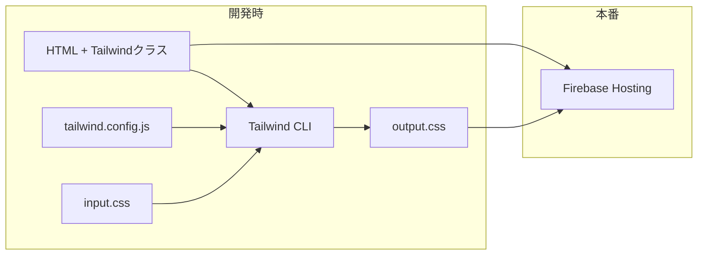
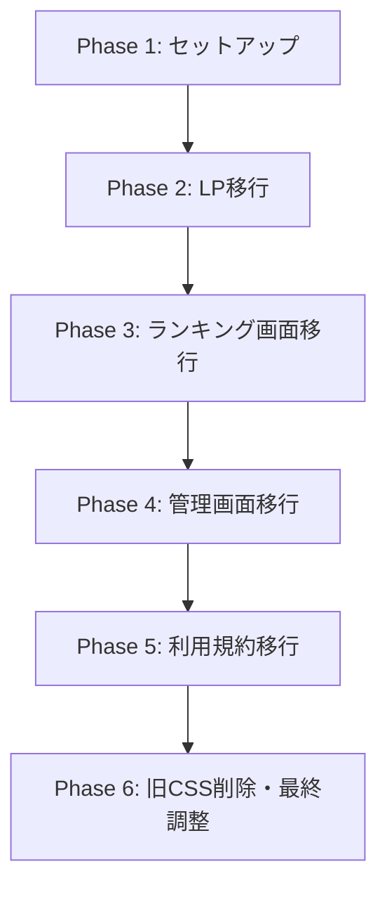
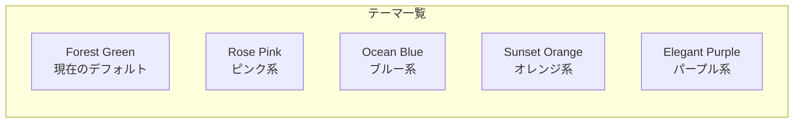
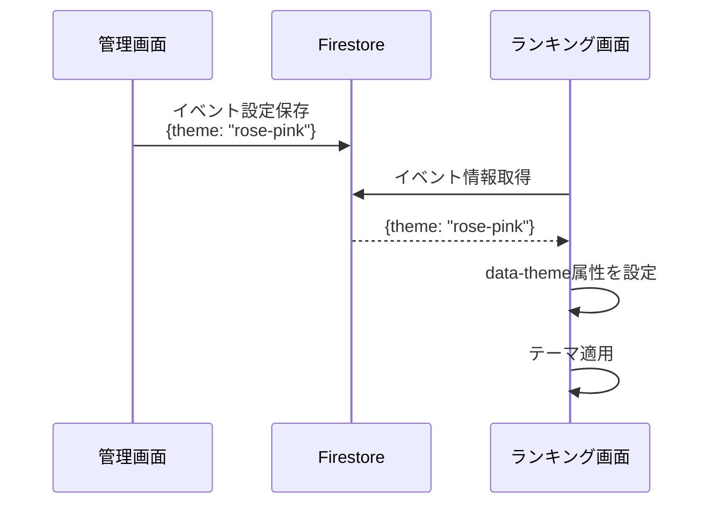

# Tailwind CSS 導入設計書

最終更新: 2026-01-31

---

## 概要

現在のVanilla CSSをTailwind CSSに置き換え、フロントエンドのデザインをモダン化する。
フレームワーク（React等）への移行は行わず、既存のVanilla JS構成を維持したままCSSのみを刷新する。

---

## 目的

### 背景
- 現在のデザインに「素人感」があり、モダンで洗練された見た目にしたい
- React等へのフレームワーク移行は、現時点では機能追加予定が不明確なため過剰投資と判断
- CSSのみの改善でデザイン品質を向上させる

### 期待効果
| 効果 | 説明 |
|------|------|
| デザインの一貫性 | Tailwindのデザイントークン（色、余白、角丸等）で統一 |
| モダンな見た目 | ユーティリティクラスで洗練されたUIを実現 |
| 開発効率向上 | HTMLを見るだけでスタイルが把握可能 |
| メンテナンス性 | 未使用CSSの自動削除（PurgeCSS）でファイルサイズ最適化 |

### 代替案の検討

| 案 | メリット | デメリット | 判断 |
|----|----------|------------|------|
| Tailwind CSS導入 | モダン、エコシステム豊富 | ビルドプロセス必要 | **採用** |
| Bootstrap 5 | 導入簡単、コンポーネント豊富 | 見た目がBootstrap感 | 不採用 |
| 既存CSS改善のみ | 変更最小 | 根本的改善にならない | 不採用 |
| React + shadcn/ui | UIコンポーネント最高峰 | 移行コスト大、過剰投資 | 不採用 |

---

## やること

### 機能要件

1. **Tailwind CSSの導入**
   - ビルドプロセス（Tailwind CLI）のセットアップ
   - 既存4画面のCSS置き換え

2. **デザイン刷新**
   - 既存カラーパレット・フォントを維持しつつモダン化
   - コンポーネントデザインの洗練

3. **カラーテーマ選択機能**
   - ユーザー（イベント主催者）が好みに合わせてカラーパレットを選択可能に
   - 複数のプリセットテーマを用意

4. **レスポンシブ対応の維持**
   - 既存のレスポンシブ動作を維持

### 非機能要件

| 項目 | 要件 |
|------|------|
| パフォーマンス | 本番CSSサイズは50KB以下（現在: style.css 約60KB） |
| ブラウザ対応 | Chrome, Safari, Edge（最新2バージョン） |
| ビルド時間 | 開発時のホットリロードは2秒以内 |

### 対象画面

| 画面 | ファイル | CSS行数 | 優先度 |
|------|----------|---------|--------|
| ランキング表示 | index.html + style.css | 1,880行 | 高 |
| 管理画面 | admin.html + admin.css | 1,109行 | 中 |
| ランディングページ | lp.html + lp.css | 711行 | 高（新規作成中） |
| 利用規約 | legal.html + legal.css | 313行 | 低 |

---

## やり方

### アーキテクチャ



### ディレクトリ構成（変更後）

```
src/frontend/
├── index.html
├── admin.html
├── lp.html
├── legal.html
├── css/
│   ├── input.css          # Tailwind入力ファイル（@tailwind directives）
│   └── output.css          # ビルド後のCSS（git管理しない）
├── js/
│   └── (変更なし)
├── package.json            # 新規作成
├── tailwind.config.js      # 新規作成
└── postcss.config.js       # 新規作成
```

### Tailwind設定ファイル

```javascript
// tailwind.config.js
/** @type {import('tailwindcss').Config} */
module.exports = {
  content: [
    "./*.html",
    "./js/**/*.js"
  ],
  theme: {
    extend: {
      colors: {
        // ブランドカラー（要デザイン決定）
        primary: {
          50: '#f0fdf4',
          500: '#22c55e',
          600: '#16a34a',
          700: '#15803d',
        },
        accent: {
          gold: '#ffd700',
        }
      },
      fontFamily: {
        sans: ['Noto Sans JP', 'sans-serif'],
        display: ['Playfair Display', 'serif'],
      }
    }
  },
  plugins: []
}
```

### 移行フロー



### Phase詳細

#### Phase 1: セットアップ（0.5日）

1. `package.json` 作成
2. Tailwind CSS + 依存パッケージインストール
3. 設定ファイル作成（tailwind.config.js, postcss.config.js）
4. ビルドスクリプト設定（dev / build）
5. `.gitignore` 更新（node_modules, output.css）
6. GitHub Actions更新（ビルドステップ追加）

```json
// package.json
{
  "name": "wedding-smile-catcher-frontend",
  "scripts": {
    "dev": "tailwindcss -i ./css/input.css -o ./css/output.css --watch",
    "build": "tailwindcss -i ./css/input.css -o ./css/output.css --minify"
  },
  "devDependencies": {
    "tailwindcss": "^3.4.0"
  }
}
```

#### Phase 2: ランディングページ移行（1日）

- 新規作成中のため、最初からTailwindで実装
- デザイントークンの確定（カラー、フォント、余白）
- 共通コンポーネントのクラス設計

#### Phase 3: ランキング画面移行（2日）

- 最も重要な画面のため丁寧に移行
- 既存のアニメーション効果の維持
- レスポンシブブレークポイントの調整

#### Phase 4: 管理画面移行（1.5日）

- Tabulatorとの共存確認
- Chart.jsグラフ周りのスタイル調整
- フォーム要素のスタイル統一

#### Phase 5: 利用規約移行（0.5日）

- シンプルなテキストページのため短時間で完了

#### Phase 6: 旧CSS削除・最終調整（0.5日）

- 不要になった旧CSSファイルの削除
- クロスブラウザテスト
- パフォーマンス確認

### CI/CD更新

```yaml
# .github/workflows/deploy-frontend.yml に追加
jobs:
  build-and-deploy:
    steps:
      - uses: actions/checkout@v4

      - name: Setup Node.js
        uses: actions/setup-node@v4
        with:
          node-version: '20'
          cache: 'npm'
          cache-dependency-path: src/frontend/package-lock.json

      - name: Install dependencies
        working-directory: src/frontend
        run: npm ci

      - name: Build CSS
        working-directory: src/frontend
        run: npm run build

      - name: Deploy to Firebase Hosting
        # ... 既存のデプロイステップ
```

### 既存CSSとの対応表（主要クラス）

| 既存クラス | Tailwind相当 | 備考 |
|-----------|-------------|------|
| `.container` | `container mx-auto px-4` | 中央寄せ + パディング |
| `.header` | `text-center mb-4` | カスタムアニメーションは別途定義 |
| `.title` | `text-4xl font-display font-bold text-white` | |
| `.ranking-card` | `bg-white/90 rounded-2xl shadow-lg p-6` | グラデーション背景 |
| `.btn-primary` | `bg-primary-600 hover:bg-primary-700 text-white px-4 py-2 rounded-lg` | |
| `.hidden` | `hidden` | そのまま |

### カスタムCSSが必要な箇所

Tailwindで表現しにくい以下は `input.css` にカスタムCSSとして残す：

1. **複雑なアニメーション** - `@keyframes fadeInDown`, 紙吹雪エフェクト等
2. **封筒アニメーション** - 最終結果発表の演出
3. **スライドショーのトランジション** - フェード効果
4. **Tabulatorのカスタマイズ** - 管理画面のテーブルスタイル

```css
/* input.css */
@tailwind base;
@tailwind components;
@tailwind utilities;

/* カスタムアニメーション */
@keyframes fadeInDown {
  from {
    opacity: 0;
    transform: translateY(-20px);
  }
  to {
    opacity: 1;
    transform: translateY(0);
  }
}

.animate-fade-in-down {
  animation: fadeInDown 1s ease-out;
}

/* Tabulatorカスタマイズ */
.tabulator {
  @apply border-none rounded-lg overflow-hidden;
}
```

---

## やらないこと

| 項目 | 理由 |
|------|------|
| React/Vue等への移行 | 現時点では過剰投資 |
| shadcn/uiコンポーネント導入 | Reactが必要なため不可 |
| デザインの大幅変更 | まずは既存デザインのモダン化に集中 |
| ダークモード対応 | 結婚式会場での使用がメイン、優先度低 |
| Tailwind UIの購入 | 無料のTailwind CSSで十分 |
| カスタムカラー入力 | プリセットテーマのみ提供（カラーピッカーは実装しない） |

---

## 懸念事項

### 1. ビルドプロセスの導入

**懸念**: 現在はビルド不要の静的ファイル構成。ビルドプロセス導入で複雑さが増す。

**対策**:
- Tailwind CLIのみ使用（PostCSS不要）
- npm scriptsでシンプルに管理
- CI/CDでビルドを自動化

### 2. 既存ライブラリとの共存

**懸念**: Tabulator, Chart.js等の既存ライブラリのスタイルとの競合

**対策**:
- Tailwindの `preflight` を確認し、必要に応じて調整
- ライブラリ固有のスタイルは上書きしない
- 競合が発生した場合は `!important` または詳細度で対応

### 3. デザイン方針の未決定

**懸念**: 「モダンにしたい」という要望はあるが、具体的なデザイン方針が未定

**対策**:
- Phase 2（LP移行）でデザイントークンを確定
- 参考サイト/デザインを事前に収集
- 必要に応じてFigma等でモックアップ作成

### 4. 移行期間中の二重管理

**懸念**: 段階的移行中は旧CSS + Tailwindが混在

**対策**:
- 画面単位で完全移行してから次に進む
- 移行完了した画面から旧CSSの参照を削除
- 最後に旧CSSファイルを一括削除

---

## 決定事項

1. **カラーパレット**: 現状維持（クリスマスカラー: 緑 + 赤 + ゴールド）+ テーマ選択機能を追加
2. **フォント**: 現状維持（Noto Sans JP + Playfair Display）
3. **参考デザイン**: 特定のサイトは指定なし。Tailwindのモダンなスタイルで洗練化

---

## カラーテーマ選択機能の詳細設計

### 機能概要

イベント主催者がランキング画面のカラーテーマを選択できる機能を提供する。
管理画面のイベント設定から選択し、ランキング画面に反映される。

### テーマプリセット案



| テーマ名 | Primary | Accent | 背景グラデーション | 用途イメージ |
|----------|---------|--------|-------------------|-------------|
| Forest Green | `#1a472a` | `#ffd700` | 深緑 | 現在のデフォルト、クリスマス・和風 |
| Rose Pink | `#be185d` | `#fbbf24` | ピンク〜ローズ | 春の結婚式、かわいい系 |
| Ocean Blue | `#1e40af` | `#60a5fa` | ネイビー〜ブルー | 夏の結婚式、爽やか系 |
| Sunset Orange | `#c2410c` | `#fbbf24` | オレンジ〜赤 | 秋の結婚式、暖かい系 |
| Elegant Purple | `#581c87` | `#d8b4fe` | パープル〜藤色 | エレガント、高級感 |

### 実装方式

#### 方式A: CSS変数 + データ属性（推奨）

```html
<!-- ランキング画面 -->
<body data-theme="forest-green">
```

```css
/* input.css */
[data-theme="forest-green"] {
  --color-primary: theme('colors.green.800');
  --color-accent: theme('colors.yellow.400');
  --gradient-bg: linear-gradient(135deg, #1a472a 0%, #2d5a27 50%, #0d2818 100%);
}

[data-theme="rose-pink"] {
  --color-primary: theme('colors.pink.700');
  --color-accent: theme('colors.amber.400');
  --gradient-bg: linear-gradient(135deg, #be185d 0%, #db2777 50%, #9d174d 100%);
}
/* ... 他のテーマ */
```

**メリット**: Tailwindと相性良い、JSからの切り替えが簡単

#### データフロー



### Firestoreスキーマ変更

```javascript
// events/{eventId}
{
  name: "田中・山田 結婚式",
  date: "2026-03-15",
  theme: "forest-green",  // 新規追加
  // ... 既存フィールド
}
```

### 管理画面UI

イベント作成/編集フォームにテーマ選択を追加：

```
┌─────────────────────────────────────────┐
│ イベント設定                              │
├─────────────────────────────────────────┤
│ イベント名: [田中・山田 結婚式        ]    │
│ 日付:      [2026-03-15              ]    │
│                                         │
│ カラーテーマ:                            │
│ ┌─────┐ ┌─────┐ ┌─────┐ ┌─────┐ ┌─────┐│
│ │ 🌲  │ │ 🌸  │ │ 🌊  │ │ 🌅  │ │ 💜  ││
│ │Green│ │Pink │ │Blue │ │Orange│ │Purple││
│ │ ✓  │ │     │ │     │ │     │ │     ││
│ └─────┘ └─────┘ └─────┘ └─────┘ └─────┘│
│                                         │
│            [保存]                        │
└─────────────────────────────────────────┘
```

### 実装スコープ

| 項目 | Phase | 備考 |
|------|-------|------|
| テーマ用CSS変数定義 | Tailwind導入時 | Phase 2-3で対応 |
| Firestoreスキーマ更新 | Tailwind導入後 | 別タスク |
| 管理画面UI追加 | Tailwind導入後 | 別タスク |
| ランキング画面のテーマ適用 | Tailwind導入後 | 別タスク |

**結論**: Tailwind CSS導入時にテーマ対応の基盤（CSS変数構造）を作り、UIは後続タスクで実装

---

## 参考資料

- [Tailwind CSS 公式ドキュメント](https://tailwindcss.com/docs)
- [Tailwind CLI](https://tailwindcss.com/docs/installation)
- [Tailwind UIコンポーネント例（無料）](https://tailwindui.com/components/preview)
- [Flowbite（Tailwindベースの無料コンポーネント）](https://flowbite.com/)
- [shadcn/ui（参考: Tailwindベースのデザイン）](https://ui.shadcn.com/)

---

## 工数見積もり

### Tailwind CSS導入（本設計のスコープ）

| Phase | 内容 | 工数 |
|-------|------|------|
| Phase 1 | セットアップ | 0.5日 |
| Phase 2 | LP移行 | 1日 |
| Phase 3 | ランキング画面移行 + テーマ基盤 | 2日 |
| Phase 4 | 管理画面移行 | 1.5日 |
| Phase 5 | 利用規約移行 | 0.5日 |
| Phase 6 | 最終調整 | 0.5日 |
| **合計** | | **6日** |

### カラーテーマ選択機能（後続タスク）

| 項目 | 工数 |
|------|------|
| Firestoreスキーマ更新 | 0.5日 |
| 管理画面UI追加 | 1日 |
| ランキング画面テーマ適用 | 0.5日 |
| **合計** | **2日** |

**総合計: 8日**（Tailwind導入 6日 + テーマ機能 2日）
