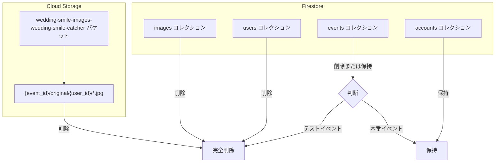
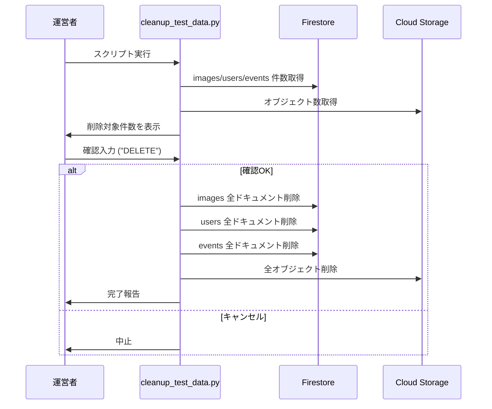

# テストデータ削除 設計書

最終更新: 2026-01-29

---

## Overview

開発・テスト中に蓄積されたFirestoreドキュメントおよびCloud Storageオブジェクトを削除し、リリース前にクリーンな状態にする。

---

## Purpose

### なぜこの作業が必要か

1. **リリース前の環境整備**: 開発中のダミーデータ・テストデータを残さない
2. **コスト最適化**: 不要なCloud Storageオブジェクトを削除してストレージコスト削減
3. **統計データの正確性**: 管理画面の統計情報が本番データのみを反映するように
4. **セキュリティ**: テスト中に使用した個人情報（テスト用写真など）を完全に削除

### 対象環境

- **本番環境**: `wedding-smile-catcher` プロジェクト
- ステージング環境は存在しない（本番のみ）

---

## What to Do

### 削除対象



| リソース | コレクション/パス | 削除方針 |
|----------|------------------|----------|
| Firestore | `images` | **全削除** |
| Firestore | `users` | **全削除** |
| Firestore | `events` | **全削除**（または`status != active`のみ削除） |
| Firestore | `accounts` | **保持**（運営者アカウント） |
| Cloud Storage | `wedding-smile-images-wedding-smile-catcher/{event_id}/**` | **全削除** |

### 削除しないもの

| リソース | 理由 |
|----------|------|
| `accounts` コレクション | 運営者アカウントは残す |
| Terraform管理リソース | インフラ設定は削除対象外 |
| Cloud Functions | デプロイ済み関数は削除対象外 |
| Secret Manager | シークレットは削除対象外 |

---

## How to Do It

### 前提条件

- Python 3.9+ がインストール済み
- `gcloud` CLI がインストール済み・認証済み（`gcloud auth application-default login`）
- プロジェクト `wedding-smile-catcher` への書き込み権限
- 必要なPythonパッケージ: `google-cloud-firestore`, `google-cloud-storage`

### 実行フロー



### 実行手順

#### 1スクリプトで全削除

```bash
# スクリプト実行（Firestore + Cloud Storage を一括削除）
python scripts/cleanup_test_data.py
```

**スクリプトの動作:**

1. Firestore の `images`, `users`, `events` コレクションのドキュメント数を表示
2. Cloud Storage の `wedding-smile-images-wedding-smile-catcher` バケット内のオブジェクト数を表示
3. `DELETE` と入力すると削除開始
4. 各コレクション・ストレージを順次削除
5. 完了メッセージを表示

**出力例:**

```
============================================================
  Test Data Cleanup Script
============================================================

Project: wedding-smile-catcher
Storage Bucket: wedding-smile-images-wedding-smile-catcher
Collections to delete: images, users, events
Collections to preserve: accounts

Counting documents and objects...

  Firestore/images: 42 documents
  Firestore/users: 8 documents
  Firestore/events: 3 documents
  Cloud Storage/wedding-smile-images-wedding-smile-catcher: 42 objects

------------------------------------------------------------
Total: 53 Firestore documents + 42 Storage objects
------------------------------------------------------------

WARNING: This action cannot be undone!

Type 'DELETE' to confirm deletion: DELETE

Starting deletion...

Deleting images collection...
  Deleted 42 documents from images...
  ✅ images: 42 documents deleted
Deleting users collection...
  Deleted 8 documents from users...
  ✅ users: 8 documents deleted
Deleting events collection...
  Deleted 3 documents from events...
  ✅ events: 3 documents deleted
Deleting Cloud Storage objects...
  Deleted 42 objects from Cloud Storage...
  ✅ Cloud Storage: 42 objects deleted

============================================================
  Cleanup completed successfully!
============================================================
```

### 削除完了の確認

```bash
# 再度スクリプトを実行して 0 件であることを確認
python scripts/cleanup_test_data.py

# または管理画面で統計が 0 になっていることを確認
# https://wedding-smile-catcher.web.app/admin.html
```

---

## What We Won't Do

| 除外項目 | 理由 |
|----------|------|
| `accounts` コレクションの削除 | 運営者アカウントは保持 |
| バックアップの取得 | テストデータは復元不要 |
| Cloud Functions の再デプロイ | 関数コードに影響なし |
| 自動化（CI/CD組み込み） | 一回限りの作業 |

---

## Concerns

### リスクと対策

| リスク | 影響度 | 対策 |
|--------|--------|------|
| 誤って本番データを削除 | 高 | 現時点で本番データは存在しないため影響なし。将来的には `status: active` のイベントは除外するロジックを追加 |
| accounts コレクションの誤削除 | 中 | スクリプトで明示的に除外。手動実行時は注意 |
| Cloud Storage の課金継続 | 低 | 削除後にバケット内容を確認 |

### 確認事項

- [ ] 削除前に Firestore Console で対象件数を確認
- [ ] 削除前に Cloud Storage Console でオブジェクト数を確認
- [ ] 削除後に管理画面で統計が0になっていることを確認

---

## Reference Materials/Information

- [Firebase CLI firestore:delete](https://firebase.google.com/docs/firestore/manage-data/delete-data)
- [gsutil rm](https://cloud.google.com/storage/docs/gsutil/commands/rm)
- 管理画面: <https://wedding-smile-catcher.web.app/admin.html>
- Firebase Console: <https://console.firebase.google.com/project/wedding-smile-catcher/firestore>
- Cloud Storage Console: <https://console.cloud.google.com/storage/browser/wedding-smile-images-wedding-smile-catcher>

---

## 実行チェックリスト

```
□ 1. python scripts/cleanup_test_data.py を実行
□ 2. 削除対象件数を確認し、"DELETE" を入力
□ 3. 完了メッセージを確認
□ 4. 管理画面で統計が 0 になっていることを確認
```

---

## 実装ファイル

| ファイル | 説明 |
|----------|------|
| `scripts/cleanup_test_data.py` | 一括削除スクリプト |
