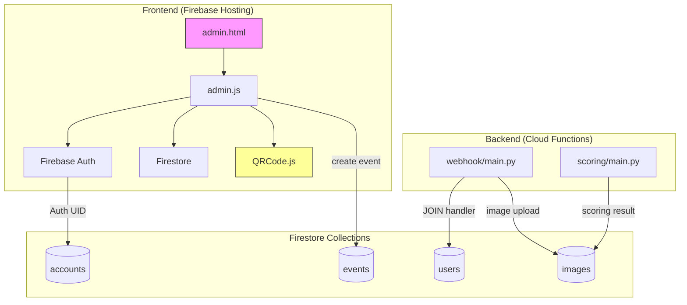
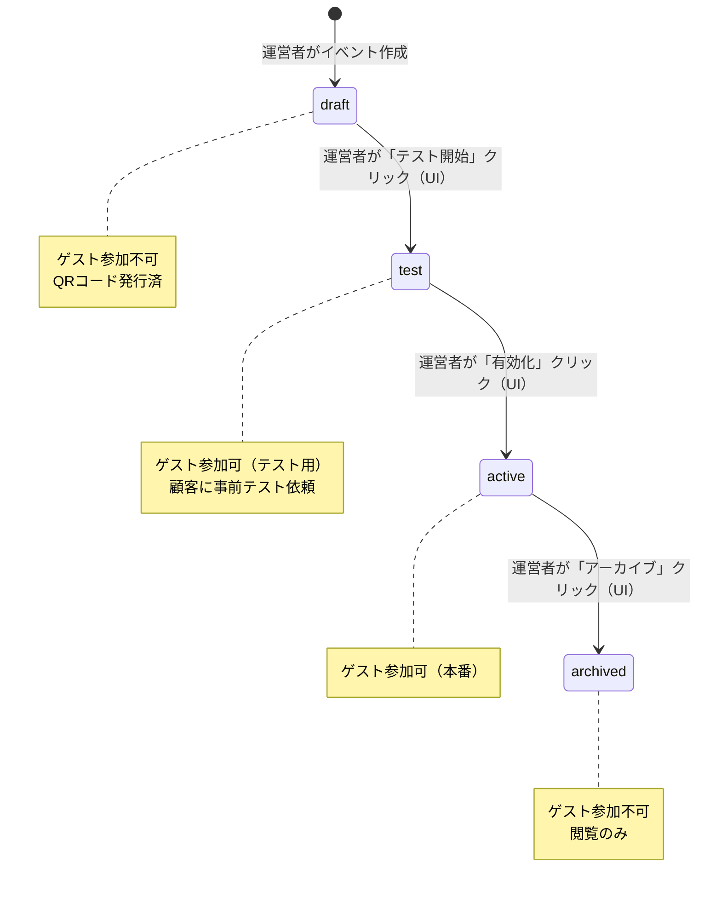
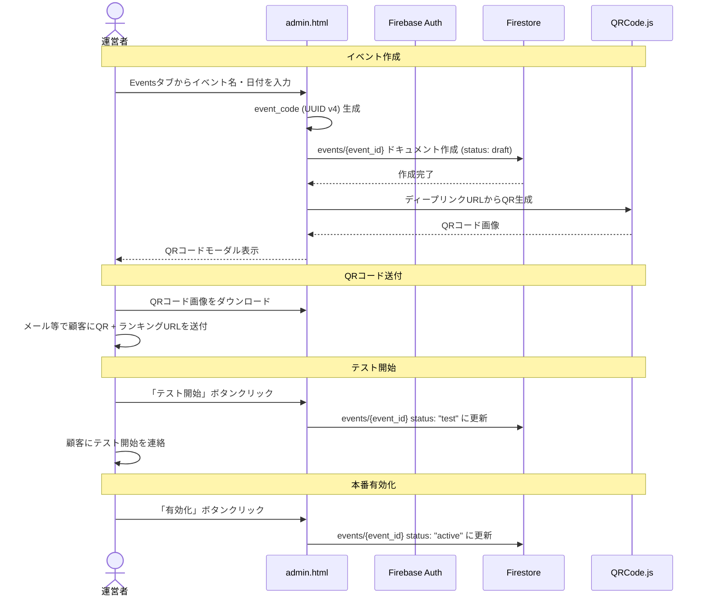
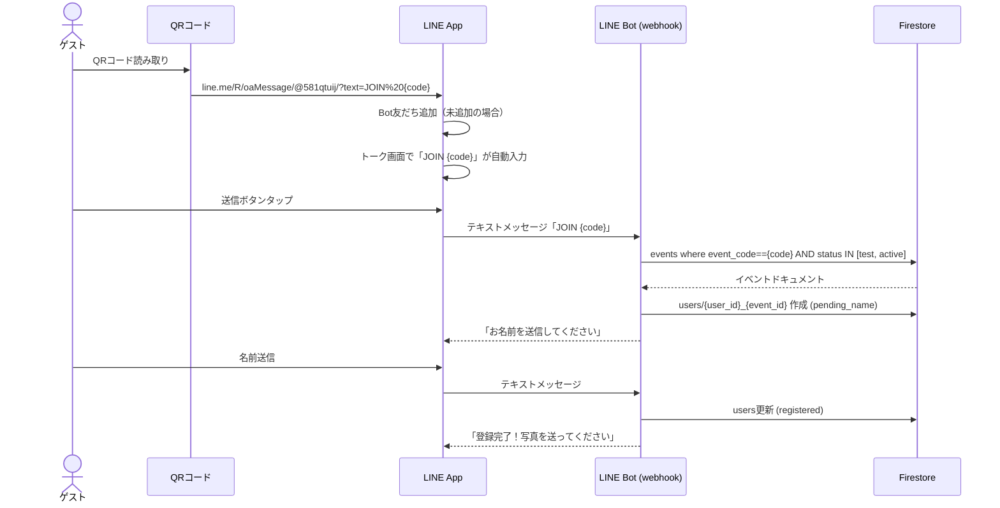
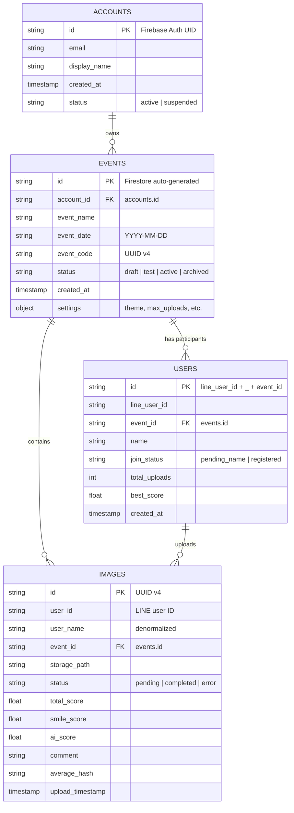
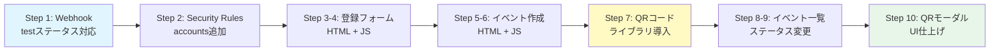

# Phase 1-b: 運営管理ツール + テストフロー 設計書

最終更新: 2026-01-27

---

## 概要

運営者が管理画面（admin.html）からイベント作成・QRコード発行・ステータス管理を行い、顧客にQRコード画像を送付する運用フローを構築する。顧客は受け取ったQRコードで事前テストを行う。

当面は顧客数がスケールする見込みが少ないため、セルフサービスではなく運営者操作を前提とした設計とする。将来的に顧客数が増えた場合に、顧客セルフサービスへ拡張可能な基盤を残す。

Phase 1-b は2段階に分割する:
- **Phase 1-b-1**: イベント作成UI・QRコード発行・ステータス管理・webhook test対応・アカウント登録
- **Phase 1-b-2**: 顧客ダッシュボード強化・事前テストフロー

本設計書は Phase 1-b-1 を主対象とし、Phase 1-b-2 の概要も記載する。

---

## 目的

### なぜこの開発が必要か

1. **運営効率化**: 現在CLIスクリプト（`scripts/create_event.py`）でしかイベント作成できない。管理画面UIから作成できるようにし、運営者のオペレーションを効率化する
2. **QRコード発行**: ゲストがイベントに参加するための唯一の手段。管理画面からQRコード画像をダウンロードし、顧客に送付する
3. **テストフロー**: 顧客がQRコードを受け取った後、自分で事前テストを実行できるようにする（`test` ステータス対応）
4. **将来のスケール対応**: アカウント登録機能を用意しておくことで、将来顧客セルフサービスへの移行を容易にする

### 運営フロー

```
顧客からココナラ経由で受注
    ↓
運営者が管理画面でイベント作成（draft）
    ↓
運営者がQRコード画像をダウンロード
    ↓
運営者がQRコード + ランキングURLを顧客にメール等で送付
    ↓
運営者がステータスを test に変更
    ↓
顧客が事前テスト（QR読み取り→写真送信→スコア確認）
    ↓
テスト完了後、運営者がステータスを active に変更
    ↓
本番当日：ゲストがQRコード読み取りで参加
```

### 代替案の検討

| 方式 | メリット | デメリット | 判定 |
|------|---------|-----------|------|
| 管理画面UI（本案） | 運営者が簡単操作、QRダウンロード可能 | フロントエンド開発コスト | 採用 |
| CLIスクリプトのみ | 開発不要 | QRコード生成不可、毎回ターミナル操作 | 不採用 |
| Google Forms + 手動QR作成 | 低コスト | 手順が煩雑、ミスリスク | 不採用 |

---

## やること（機能要件）

### Phase 1-b-1 タスク一覧

| # | タスク | 誰が使う | 説明 |
|---|--------|---------|------|
| 1 | Webhook `test`ステータス対応 | ゲスト/顧客 | JOINハンドラーで`status == "test"`も許可 |
| 2 | Firestore Security Rules更新 | - | `accounts`コレクション追加、`events` create/update ルール追加 |
| 3 | アカウント登録フォーム | 運営者/将来:顧客 | admin.htmlのログイン画面に「新規登録」フォーム追加 |
| 4 | イベント作成フォーム | 運営者 | 管理画面のEventsタブに作成フォーム追加 |
| 5 | QRコード生成+ダウンロード | 運営者 | クライアントサイドでQRコード画像を生成・ダウンロード |
| 6 | イベント一覧+ステータス管理 | 運営者 | ステータスバッジ表示、遷移ボタン |
| 7 | QRコードモーダルUI | 運営者 | QRコード・URL表示・ダウンロード・コピー |

### Phase 1-b-2 タスク一覧（概要のみ）

| # | タスク | 説明 |
|---|--------|------|
| 3.4 | 顧客ダッシュボード強化 | イベント統計サマリー、テスト状況表示 |
| 4.1 | テスト投稿機能 | 顧客がQR読み取り→テスト投稿→結果確認 |
| 4.2 | テスト完了チェックUI | ダッシュボードにテスト成否を表示 |
| 4.3 | テストデータ一括削除 | 管理画面から1クリックでテストデータ削除 |

### 非機能要件

- QRコード生成はクライアントサイド（サーバーサイド不要）
- 既存のvanilla JS + Firebase SDKパターンを踏襲
- モバイル対応（レスポンシブ）は不要（管理画面はPC前提）
- Firebase Hosting のみでデプロイ可能な構成

---

## やらないこと

| 項目 | 理由 |
|------|------|
| 顧客セルフサービスのイベント作成 | 当面は運営者が代行。顧客数がスケールしてから |
| 決済連携（Stripe等） | ココナラ経由で受注。決済は外部 |
| 利用規約・プライバシーポリシーページ | Phase 1-c で実装 |
| メール通知（アカウント作成確認等） | MVP不要。Firebase Authのデフォルト挙動のみ |
| カスタムドメイン | Phase 3 |
| 顧客プロフィール編集 | MVP不要 |
| イベント設定のカスタマイズ（テーマ変更等） | MVP不要。デフォルトテーマ固定 |
| 署名付きURL対応 | Phase 1-c のセキュリティ強化で実装 |
| スーパー管理者用ダッシュボード | 当面はFirebase Console + CLIで運用 |

---

## どうやるか（実装設計）

### 全体アーキテクチャ



### イベントステータス遷移



### 運営フロー（メイン）



### ゲスト参加フロー（QRコード経由）



---

### データ設計

#### ER図



#### 新規コレクション: `accounts`

```json
{
  "id": "Firebase Auth UID (ドキュメントID)",
  "email": "customer@example.com",
  "display_name": "田中太郎 & 花子",
  "created_at": "SERVER_TIMESTAMP",
  "status": "active"
}
```

#### `events` コレクション変更: なし

既存のスキーマで対応可能。`status` フィールドに `"draft"` を初期値として使用する。
（現在 `create_event.py` のデフォルトは `"active"` だが、管理画面からの作成では `"draft"` にする）

---

### 画面設計

#### 1. ログイン/登録画面（admin.html 変更）

```
+----------------------------------+
|       Wedding Smile Catcher      |
|         Admin Panel              |
|                                  |
|  [ログイン] [新規登録]             |  <- タブ切替
|                                  |
|  【ログインタブ】                  |
|  Email:    [____________]        |
|  Password: [____________]        |
|  [     ログイン     ]             |
|                                  |
|  【新規登録タブ】                  |
|  Email:    [____________]        |
|  Password: [____________]        |
|  表示名:   [____________]        |
|  [ ] 利用規約に同意する           |
|  [   アカウント作成   ]            |
|                                  |
+----------------------------------+
```

#### 2. Eventsタブ（イベント作成 + 一覧）

```
+--------------------------------------------------+
| [Images] [Users] [Events] [Statistics]  [Logout]  |
+--------------------------------------------------+
|                                                    |
|  +----------------------------------+              |
|  | + 新しいイベントを作成             |              |  <- 折りたたみ可能
|  |                                  |              |
|  | イベント名: [________________]    |              |
|  | イベント日:  [____-__-__]        |              |
|  |                                  |              |
|  | [     作成     ]                 |              |
|  +----------------------------------+              |
|                                                    |
|  -- イベント一覧 ----------------                  |
|                                                    |
|  +--------------------------------------------+   |
|  | [yellow] 田中太郎 & 花子 結婚式  [draft]     |   |
|  | 日付: 2026-03-15                            |   |
|  | コード: fde25512-7df4-...                   |   |
|  |                                             |   |
|  | [QRコード表示] [ランキングURL] [テスト開始]    |   |
|  +--------------------------------------------+   |
|                                                    |
|  +--------------------------------------------+   |
|  | [blue] 佐藤一郎 & 美咲 結婚式  [test]       |   |
|  | 日付: 2026-04-20                            |   |
|  | コード: 2d12ba28-4e36-...                   |   |
|  |                                             |   |
|  | [QRコード表示] [ランキングURL] [有効化]       |   |
|  +--------------------------------------------+   |
|                                                    |
|  +--------------------------------------------+   |
|  | [green] 山田一郎 & 恵 結婚式  [active]       |   |
|  | 日付: 2026-05-10                            |   |
|  | コード: 9a3bc1d2-ef56-...                   |   |
|  |                                             |   |
|  | [QRコード表示] [ランキングURL] [アーカイブ]    |   |
|  +--------------------------------------------+   |
|                                                    |
+--------------------------------------------------+
```

#### 3. QRコード表示モーダル

```
+----------------------------------+
|         QRコード              [x] |
|                                  |
|    +--------------------+        |
|    |                    |        |
|    |    [QR CODE IMG]   |        |
|    |                    |        |
|    +--------------------+        |
|                                  |
|  ディープリンクURL:               |
|  https://line.me/R/oaMessage/    |
|  @581qtuij/?text=JOIN%20...      |
|                                  |
|  ランキング画面URL:               |
|  https://wedding-smile-           |
|  catcher.web.app?event_id=...    |
|                                  |
|  [QRコード画像をダウンロード]      |
|  [URLをコピー]                    |
|                                  |
+----------------------------------+
```

---

### ファイル変更一覧

#### 変更するファイル

| ファイル | 変更内容 |
|---------|---------|
| `src/frontend/admin.html` | 登録フォーム追加、イベント作成フォーム追加、QRモーダル追加、ステータス変更UI |
| `src/frontend/js/admin.js` | 登録ロジック、イベント作成ロジック、QRコード生成、ステータス変更 |
| `src/frontend/css/admin.css` | 登録フォーム・QRモーダル・ステータスバッジのスタイル |
| `src/frontend/js/config.js` | LINE Bot ID (`@581qtuij`) 追加 |
| `src/functions/webhook/main.py` | JOINハンドラーで `status == "test"` を許可 |
| `firestore.rules` | `accounts` コレクションのルール追加、`events` の create/update ルール追加 |
| `firestore.indexes.json` | 必要に応じてインデックス追加 |
| `tests/unit/test_webhook.py` | `test` ステータスのJOINテスト追加 |

#### 新規ファイル: なし

全て既存ファイルの修正で対応。QRコードライブラリはCDNから読み込み。

---

### 実装詳細

#### Step 1: Webhook -- `test` ステータス対応

**ファイル**: `src/functions/webhook/main.py`

変更箇所: `handle_join_event()` 関数内のFirestoreクエリ

```python
# Before (現状)
q = events_ref.where("event_code", "==", event_code).where("status", "==", "active").limit(1)

# After
q = events_ref.where("event_code", "==", event_code).where("status", "in", ["active", "test"]).limit(1)
```

Firestoreの `in` クエリは既存のインデックス（`event_code ASC, status ASC`）で対応可能。

#### Step 2: Firestore Security Rules -- `accounts` コレクション追加

**ファイル**: `firestore.rules`

```javascript
match /accounts/{accountId} {
  allow read: if request.auth != null && request.auth.uid == accountId;
  allow create: if request.auth != null && request.auth.uid == accountId;
  allow update: if request.auth != null && request.auth.uid == accountId;
  allow delete: if false;  // アカウント削除は管理者のみ（Firebase Console）
}
```

#### Step 3: admin.html -- 登録フォーム追加

**ファイル**: `src/frontend/admin.html`

ログイン画面（`#loginScreen`）にタブ切替を追加:

- ログインタブ: 既存のメール + パスワードフォーム
- 新規登録タブ: メール + パスワード + 表示名 + 利用規約チェックボックス
- タブ切替は CSS + JS で実装（ライブラリ不要）

#### Step 4: admin.js -- アカウント登録ロジック

**ファイル**: `src/frontend/js/admin.js`

新規インポート:
```javascript
import { createUserWithEmailAndPassword } from "https://www.gstatic.com/firebasejs/10.7.1/firebase-auth.js";
import { setDoc } from "https://www.gstatic.com/firebasejs/10.7.1/firebase-firestore.js";
```

登録フロー:
1. `createUserWithEmailAndPassword(auth, email, password)` でFirebase Authアカウント作成
2. `setDoc(doc(db, "accounts", user.uid), { email, display_name, created_at, status: "active" })` でaccountsドキュメント作成
3. `onAuthStateChanged` で自動的にログイン状態に遷移

バリデーション:
- パスワード: 8文字以上（Firebase Auth標準）
- 表示名: 1-50文字
- 利用規約チェック: 必須（「利用規約」リンククリックでドラフト内容をモーダル表示）

#### Step 5: admin.html -- イベント作成フォーム追加

**ファイル**: `src/frontend/admin.html`

Eventsタブ（`#eventsTab`）の先頭にイベント作成セクションを追加:
- イベント名（テキスト入力、必須、1-100文字）
- イベント日（date input、必須）
- 作成ボタン
- 折りたたみ可能（デフォルトは閉じた状態）

#### Step 6: admin.js -- イベント作成ロジック

**ファイル**: `src/frontend/js/admin.js`

新規インポート:
```javascript
import { addDoc, serverTimestamp } from "https://www.gstatic.com/firebasejs/10.7.1/firebase-firestore.js";
```

イベント作成フロー:
1. `event_code` をクライアントサイドで生成: `crypto.randomUUID()`
2. `event_id` はFirestore自動生成（`addDoc()` 使用、一意性保証）
3. Firestore `events` コレクションにドキュメント作成:

   ```javascript
   const eventData = {
     event_name: eventName,
     event_date: eventDate,
     event_code: crypto.randomUUID(),
     account_id: currentUser.uid,
     status: "draft",
     created_at: serverTimestamp(),
     settings: {
       theme: "笑顔（Smile For You）",
       max_uploads_per_user: 10,
       similarity_threshold: 8,
       similarity_penalty: 0.33,
     },
   };
   const docRef = await addDoc(collection(db, "events"), eventData);
   // docRef.id がFirestore自動生成のevent_id
   ```

4. 作成後、イベント一覧を再読み込み
5. 作成成功メッセージ + QRコードモーダルを自動表示

#### Step 7: QRコード生成（クライアントサイド）

**ライブラリ**: [qrcode.js](https://github.com/davidshimjs/qrcodejs) (CDN)

```html
<script src="https://cdn.jsdelivr.net/npm/qrcodejs@1.0.0/qrcode.min.js"></script>
```

ディープリンクURL形式:
```
https://line.me/R/oaMessage/@581qtuij/?text=JOIN%20{event_code}
```

QRコード生成:
```javascript
function generateQRCode(elementId, eventCode) {
  const deepLinkUrl = `https://line.me/R/oaMessage/${LINE_BOT_ID}/?text=JOIN%20${eventCode}`;
  new QRCode(document.getElementById(elementId), {
    text: deepLinkUrl,
    width: 256,
    height: 256,
    colorDark: "#000000",
    colorLight: "#ffffff",
    correctLevel: QRCode.CorrectLevel.M,
  });
}
```

ダウンロード機能（運営者がQR画像をダウンロードして顧客に送付）:
```javascript
function downloadQRCode() {
  const canvas = document.querySelector("#qrCodeContainer canvas");
  const link = document.createElement("a");
  link.download = `qrcode_${eventCode}.png`;
  link.href = canvas.toDataURL("image/png");
  link.click();
}
```

LINE Bot ID (`@581qtuij`) は `config.js` に追加:
```javascript
window.LINE_BOT_ID = "@581qtuij";
```

#### Step 8: イベント一覧表示の強化

**ファイル**: `src/frontend/js/admin.js`

現在の `loadEvents()` を強化:
- ステータスバッジ表示（色分け）:
  - `draft`: 黄色「下書き」
  - `test`: 青色「テスト中」
  - `active`: 緑色「有効」
  - `archived`: グレー「アーカイブ」
- 各イベントにアクションボタン（ステータスに応じて表示）:
  - `draft` -> 「テスト開始」ボタン（`status: "test"` に変更）
  - `test` -> 「有効化」ボタン（`status: "active"` に変更）
  - `active` -> 「アーカイブ」ボタン（`status: "archived"` に変更）
- 「QRコード表示」ボタン -> モーダル表示
- 「ランキングURL」ボタン -> クリップボードにコピー

#### Step 9: ステータス変更ロジック

**ファイル**: `src/frontend/js/admin.js`

```javascript
async function updateEventStatus(eventId, newStatus) {
  const confirmMsg = {
    test: "テストモードに変更しますか？ゲストがQRコードからテスト参加できるようになります。",
    active: "有効化しますか？本番運用が開始されます。",
    archived: "アーカイブしますか？ゲストは参加できなくなります。",
  };
  if (!confirm(confirmMsg[newStatus])) return;

  await updateDoc(doc(db, "events", eventId), { status: newStatus });
  loadEvents(); // 再読み込み
}
```

ステータス遷移（全て運営者が管理画面から操作）:
- `draft -> test`: 運営者が「テスト開始」ボタンで実行
- `test -> active`: 運営者が「有効化」ボタンで実行
- `active -> archived`: 運営者が「アーカイブ」ボタンで実行
- 逆方向の遷移は不可（UI上ボタンを表示しない）

#### Step 10: QRコードモーダルUI

**ファイル**: `src/frontend/admin.html`, `src/frontend/css/admin.css`

モーダル構成:
- QRコード画像（256x256）
- ディープリンクURL（テキスト表示 + コピーボタン）
- ランキング画面URL（テキスト表示 + コピーボタン）
- QRコードダウンロードボタン（運営者が画像をダウンロードして顧客に送付）
- 閉じるボタン

---

### Firestore Security Rules 変更

```javascript
rules_version = '2';
service cloud.firestore {
  match /databases/{database}/documents {
    // Default deny
    match /{document=**} {
      allow read, write: if false;
    }

    // Accounts: owner only
    match /accounts/{accountId} {
      allow read: if request.auth != null && request.auth.uid == accountId;
      allow create: if request.auth != null && request.auth.uid == accountId;
      allow update: if request.auth != null && request.auth.uid == accountId;
      allow delete: if false;
    }

    // Events: owner write, authenticated read
    match /events/{eventId} {
      allow read: if request.auth != null;
      allow create: if request.auth != null
        && request.resource.data.account_id == request.auth.uid;
      allow update, delete: if request.auth != null
        && resource.data.account_id == request.auth.uid;
    }

    // Users: public read, server write
    match /users/{userId} {
      allow read: if true;
      allow create, update: if false;
      allow delete: if request.auth != null;
    }

    // Images: public read, server write
    match /images/{imageId} {
      allow read: if true;
      allow create, update: if false;
      allow delete: if request.auth != null;
    }
  }
}
```

---

### 実装順序



1. **Step 1**: Webhook変更（バックエンド、デプロイ必要）
2. **Step 2**: Security Rules（firebase deploy --only firestore:rules）
3. **Step 3-4**: 登録フォーム（フロントエンド）
4. **Step 5-6**: イベント作成（フロントエンド）
5. **Step 7**: QRコードライブラリ導入
6. **Step 8-9**: イベント一覧 + ステータス変更
7. **Step 10**: QRモーダルUI

Step 1-2 はバックエンド変更のため先行。Step 3以降はフロントエンドのみ。

---

### テスト計画

#### ユニットテスト

| テスト | 対象 | 内容 |
|--------|------|------|
| JOIN `test` ステータス | `test_webhook.py` | `status == "test"` のイベントにJOINできること |
| JOIN `draft` 拒否 | `test_webhook.py` | `status == "draft"` のイベントにJOINできないこと |
| JOIN `archived` 拒否 | `test_webhook.py` | `status == "archived"` のイベントにJOINできないこと |

#### E2Eテスト（手動）

1. **アカウント登録**: admin画面から新規登録 -> ログイン確認
2. **イベント作成**: Eventsタブからイベント作成 -> Firestoreにドキュメント確認
3. **QRコード表示**: QRコードモーダル表示 -> ダウンロード -> スマホで読み取り
4. **テスト開始**: 「テスト開始」ボタン -> ステータス変更確認
5. **LINE Bot JOIN**: QRコード読み取り -> LINE Bot追加 -> JOIN成功（testステータス）
6. **有効化**: 「有効化」ボタン -> activeステータスでJOIN可能確認
7. **アーカイブ**: 「アーカイブ」ボタン -> JOIN不可確認

#### Firebase Security Rules テスト

- 認証なしで`accounts`読み取り -> 拒否
- 他人のアカウント読み取り -> 拒否
- 自分のアカウント作成・読み取り -> 許可
- 他人のイベント更新 -> 拒否

---

## 懸念事項

### 1. QRコードライブラリの選定

**懸念**: `qrcode.js` はメンテナンスが停滞気味（最終更新2016年）。

**対策**: 機能がシンプル（QR生成のみ）で、安定しており壊れるリスクは低い。必要に応じて `qr-code-styling` 等の新しいライブラリに置換可能。CDN経由なのでバンドルサイズへの影響もない。

### 2. `event_id` の生成方式

**決定**: Firestoreの `addDoc()` で自動生成。一意性はFirestoreが保証するため、衝突リスクなし。

### 3. `in` クエリとFirestoreインデックス

**懸念**: `where("status", "in", ["active", "test"])` が既存の複合インデックス（`event_code ASC, status ASC`）で動作するか。

**対策**: Firestore の `in` クエリは複合インデックスで対応可能。`in` は内部的に複数の `==` クエリに展開される。既存インデックスで動作する。

### 4. LINE Bot IDのハードコード

**懸念**: `@581qtuij` を `config.js` にハードコードすると、Bot変更時にフロントエンドの再デプロイが必要。

**対策**: MVPではハードコードで問題なし。将来的にはFirestoreの `config` コレクションから動的に取得する方式に変更可能。

### 5. 利用規約ページが未実装

**懸念**: 登録フォームに「利用規約に同意する」チェックボックスを置くが、リンク先のページがPhase 1-cまで未実装。

**決定**: チェックボックスを設置し、リンククリック時に `docs/planning/terms-of-service.md` のドラフト内容をモーダルで簡易表示する。Phase 1-cで正式ページ実装後にリンクを更新。

### 6. 将来のセルフサービス移行

**懸念**: 運営者操作前提で構築するが、将来顧客数が増えた場合にセルフサービスへ移行する必要がある。

**対策**: アカウント登録機能を今回実装しておくことで、将来顧客が自分でログイン→イベント管理できるよう基盤を残す。`account_id` によるイベント所有者フィルタリングは既に実装済みのため、追加のアクセス制御は不要。

---

## 参考資料

| 資料 | パス / URL |
|------|-----------|
| マルチテナント設計書 | `docs/planning/multi-tenant-design.md` |
| MVP機能定義 | `docs/planning/mvp-features.md` |
| セキュリティ要件 | `docs/planning/security-requirements.md` |
| 利用規約ドラフト | `docs/planning/terms-of-service.md` |
| リリースTODO | `docs/planning/release-todo.md` |
| LINE ディープリンク仕様 | <https://developers.line.biz/en/docs/messaging-api/using-line-url-scheme/> |
| qrcode.js | <https://github.com/davidshimjs/qrcodejs> |
| Firebase Auth Web API | <https://firebase.google.com/docs/auth/web/password-auth> |
| Firestore Security Rules | <https://firebase.google.com/docs/firestore/security/get-started> |
| 既存イベント作成スクリプト | `scripts/create_event.py` |
