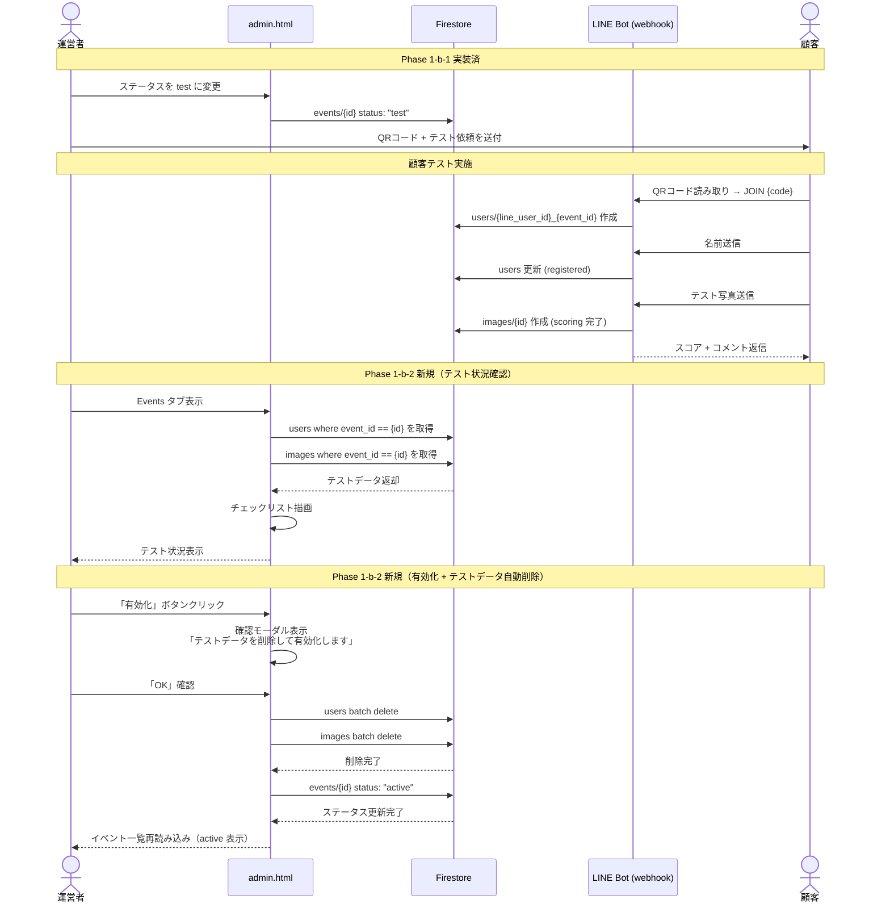
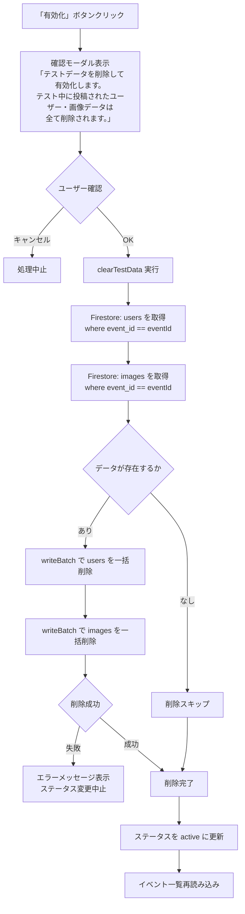
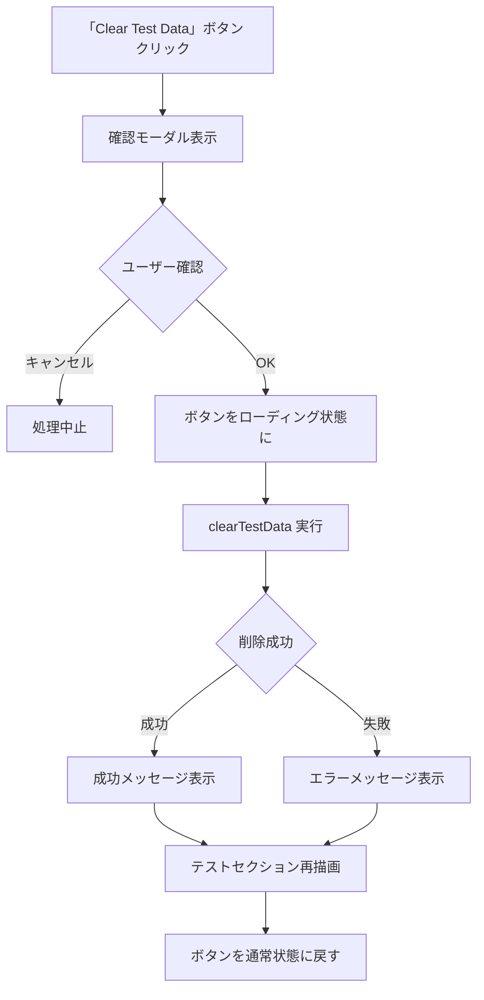
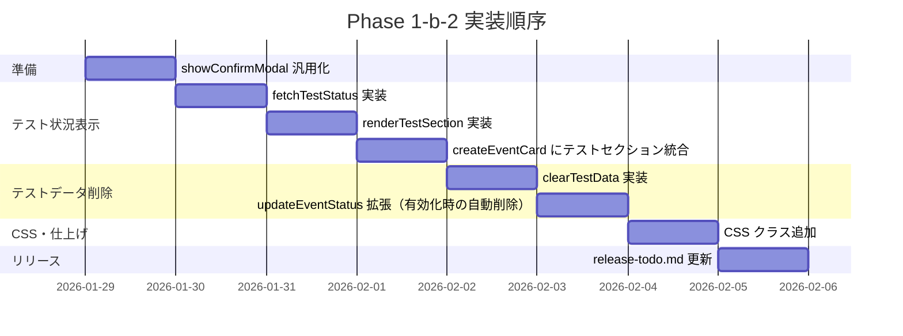
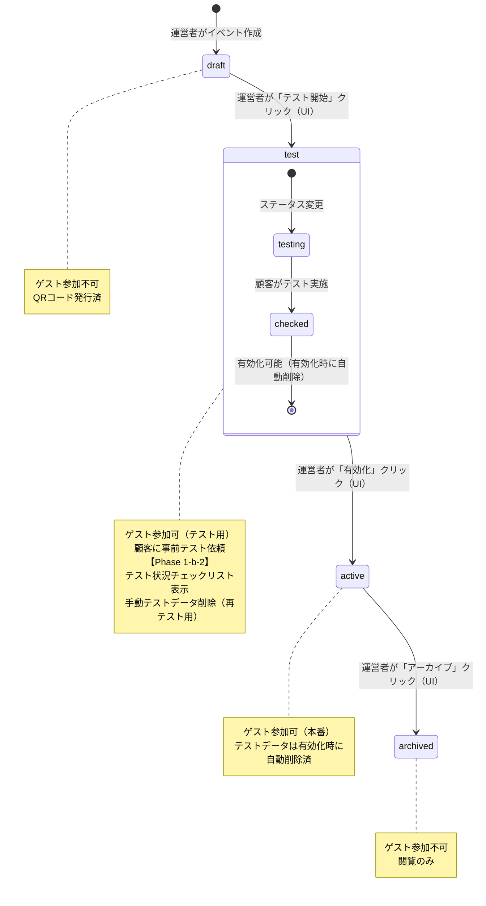

# Phase 1-b-2: 事前テストフロー設計書

最終更新: 2026-01-28

---

## 概要

Phase 1-b-1 で構築した管理画面（admin.html）に、**テスト状況の可視化**（チェックリスト）と**テストデータ自動削除**機能を追加する。

運営者がイベントを `test` ステータスに変更した後、顧客がQRコードから事前テストを実施し、その結果を管理画面から確認できるようにする。有効化（`test → active`）時にテストデータを自動削除し、クリーンな状態で本番に移行するフローを実現する。再テスト用の手動削除ボタンも提供する。

Phase 1-b-1 で webhook は `test` ステータスに対応済みのため、バックエンド変更は不要。フロントエンド（admin.js）の変更のみで完結する。

---

## 目的

### なぜこの開発が必要か

1. **テスト可視化**: 現状、顧客がテストを実施したかどうかを確認する手段がない。管理画面にチェックリストを表示することで、運営者が一目でテスト状況を把握できる
2. **データクリーンアップ**: テスト中に作成された users / images データが本番に残ると、ランキングが汚染される。一括削除機能で確実にクリーンアップする
3. **運営フローの完結**: Phase 1-b-1 で `draft → test → active` のステータス遷移を実装したが、`test → active` 移行時のデータクリーンアップが欠落している

### 運営フロー（Phase 1-b-2 対象部分）

```
運営者がステータスを test に変更（Phase 1-b-1 実装済）
    ↓
運営者が顧客にQRコード + テスト依頼を送付
    ↓
顧客がQRコード読み取り → LINE Bot登録 → テスト写真送信
    ↓
運営者が管理画面でテスト状況を確認  ← Phase 1-b-2
    - ✅ ユーザー登録あり
    - ✅ 写真投稿あり
    - ✅ スコアリング成功
    ↓
運営者がステータスを active に変更  ← Phase 1-b-2 拡張
    → 確認ダイアログ「テストデータを削除して有効化しますか？」
    → OK → テストデータ自動削除 → ステータス active に変更
```

### 代替案の検討

| 方式 | メリット | デメリット | 判定 |
|------|---------|-----------|------|
| 管理画面にテストセクション追加（本案） | 運営者が一画面で完結、直感的 | admin.js の変更量がやや多い | 採用 |
| Firebase Console で手動確認 + 手動削除 | 開発不要 | 毎回手動操作、ミスリスク大、運営スケールしない | 不採用 |
| CLI スクリプトで削除 | 開発が軽い | 運営者がターミナル操作、テスト状況確認は別途必要 | 不採用 |

---

## やること（機能要件）

### タスク一覧

| # | タスク | 誰が使う | 説明 |
|---|--------|---------|------|
| 1 | テスト状況チェックリスト表示 | 運営者 | `test` ステータスのイベントカードにテスト結果（ユーザー登録・写真投稿・スコアリング成功）を表示 |
| 2 | 有効化時のテストデータ自動削除 | 運営者 | `test → active` 遷移時にテストデータ（users / images）を自動削除。確認ダイアログでその旨を明示 |
| 3 | テストデータ手動削除ボタン | 運営者 | 再テスト用に `test` ステータスのままテストデータを削除できるボタン |
| 4 | 確認モーダルの汎用化 | - | 既存の `showConfirmModal` を柔軟なメッセージ対応に拡張 |

### release-todo.md 対応

| release-todo.md タスク | Phase 1-b-2 タスク |
|------------------------|-------------------|
| 4.1 テスト投稿機能 | Phase 1-b-1 で webhook 対応済（`test` ステータスで JOIN + 写真送信可能） |
| 4.2 テスト完了チェック（テスト成功の確認UI） | タスク #1: テスト状況チェックリスト |
| 4.3 テストデータ一括削除機能 | タスク #2: 有効化時の自動削除 + タスク #3: 手動削除ボタン |

### 非機能要件

- 既存の vanilla JS + Firebase SDK パターンを踏襲
- admin.html の変更なし（全て動的 DOM 生成）
- バックエンド（Cloud Functions）変更なし
- モバイル対応不要（管理画面は PC 前提）

---

## やらないこと

| 項目 | 理由 |
|------|------|
| テスト自動実行（Bot がテスト写真を自動送信） | 過剰。手動テストで十分 |
| テスト結果の詳細レポート | MVP 不要。チェックリスト（3項目）で十分 |
| テストデータの部分削除 | 操作が複雑化。一括削除のみ |
| Cloud Storage 画像の削除 | Firestore ドキュメントの削除のみ。画像ファイル自体は Storage ライフサイクルポリシーで管理 |

---

## どうやるか（実装設計）

### テストフロー全体シーケンス



### 有効化 + テストデータ自動削除フロー



### clearTestData 処理フロー（手動削除）



### 実装順序



### イベントステータス遷移（テスト部分を強調）



### UI ワイヤフレーム

#### テストセクション（`test` ステータスのイベントカード内）

```
+--------------------------------------------+
| [blue] 田中太郎 & 花子 結婚式  [テスト中]     |
| 日付: 2026-03-15                            |
| コード: fde25512-7df4-...                   |
|                                             |
| --- テスト状況 ---                            |
| ✅ ユーザー登録: 1名                         |
| ✅ 写真投稿: 2枚                             |
| ✅ スコアリング成功: 2枚                      |
|                                             |
| [テストデータ削除]                            |  <- btn-danger btn-sm（再テスト用）
|                                             |
| [QR Code] [Ranking URL] [Activate]          |
+--------------------------------------------+
```

テストデータがない場合:

```
+--------------------------------------------+
| [blue] 佐藤一郎 & 美咲 結婚式  [テスト中]     |
| 日付: 2026-04-20                            |
| コード: 2d12ba28-4e36-...                   |
|                                             |
| --- テスト状況 ---                            |
| ⬜ ユーザー登録: 0名                         |
| ⬜ 写真投稿: 0枚                             |
| ⬜ スコアリング成功: 0枚                      |
|                                             |
| [QR Code] [Ranking URL] [Activate]          |
+--------------------------------------------+
```

### 関数設計

#### 新規関数

##### 1. `fetchTestStatus(eventId)`

テスト状況を Firestore から取得する。

```javascript
/**
 * Fetch test status data for the given event.
 * @param {string} eventId - Firestore event document ID
 * @returns {Promise<{userCount: number, imageCount: number, scoredCount: number}>}
 */
async function fetchTestStatus(eventId) {
  const usersQuery = query(
    collection(db, "users"),
    where("event_id", "==", eventId)
  );
  const imagesQuery = query(
    collection(db, "images"),
    where("event_id", "==", eventId)
  );

  const [usersSnap, imagesSnap] = await Promise.all([
    getDocs(usersQuery),
    getDocs(imagesQuery),
  ]);

  const scoredCount = imagesSnap.docs.filter(
    (doc) => doc.data().status === "completed"
  ).length;

  return {
    userCount: usersSnap.size,
    imageCount: imagesSnap.size,
    scoredCount,
  };
}
```

##### 2. `renderTestSection(eventId, status)`

テストセクションの DOM 要素を生成する。`status` は `fetchTestStatus` の返り値。

```javascript
/**
 * Render the test status checklist as a DOM element.
 * @param {string} eventId
 * @param {{userCount: number, imageCount: number, scoredCount: number}} status
 * @returns {HTMLElement}
 */
function renderTestSection(eventId, status) {
  const section = document.createElement("div");
  section.className = "test-section";
  section.id = `test-section-${eventId}`;

  const title = document.createElement("div");
  title.className = "test-section-title";
  title.textContent = "Test Status";
  section.appendChild(title);

  const checklist = document.createElement("div");
  checklist.className = "test-checklist";

  const items = [
    { label: "User registered", count: status.userCount, unit: "" },
    { label: "Photos uploaded", count: status.imageCount, unit: "" },
    { label: "Scoring completed", count: status.scoredCount, unit: "" },
  ];

  items.forEach(({ label, count }) => {
    const item = document.createElement("div");
    item.className = "test-checklist-item";
    const icon = count > 0 ? "\u2705" : "\u2B1C";
    item.textContent = `${icon} ${label}: ${count}`;
    checklist.appendChild(item);
  });

  section.appendChild(checklist);

  // Show delete button only if there is data to delete
  if (status.userCount > 0 || status.imageCount > 0) {
    const deleteBtn = document.createElement("button");
    deleteBtn.className = "btn-danger btn-sm test-delete-btn";
    deleteBtn.textContent = "Clear Test Data";
    deleteBtn.addEventListener("click", () => handleClearTestData(eventId));
    section.appendChild(deleteBtn);
  }

  return section;
}
```

##### 3. `clearTestData(eventId)`

テストデータ（users + images）を一括削除する。有効化フローと手動削除の両方から呼び出される共通関数。

```javascript
/**
 * Delete all test data (users and images) for the given event.
 * @param {string} eventId - Firestore event document ID
 * @returns {Promise<{deletedUsers: number, deletedImages: number}>}
 * @throws {Error} if deletion fails
 */
async function clearTestData(eventId) {
  const usersQuery = query(
    collection(db, "users"),
    where("event_id", "==", eventId)
  );
  const imagesQuery = query(
    collection(db, "images"),
    where("event_id", "==", eventId)
  );

  const [usersSnap, imagesSnap] = await Promise.all([
    getDocs(usersQuery),
    getDocs(imagesQuery),
  ]);

  const allDocs = [...usersSnap.docs, ...imagesSnap.docs];
  if (allDocs.length === 0) {
    return { deletedUsers: 0, deletedImages: 0 };
  }

  // Firestore batch limit is 500 operations
  const batchSize = 500;
  for (let i = 0; i < allDocs.length; i += batchSize) {
    const batch = writeBatch(db);
    const chunk = allDocs.slice(i, i + batchSize);
    chunk.forEach((docSnap) => batch.delete(docSnap.ref));
    await batch.commit();
  }

  return { deletedUsers: usersSnap.size, deletedImages: imagesSnap.size };
}
```

この関数は確認ダイアログを持たない。呼び出し元（有効化フロー / 手動削除ボタン）がそれぞれ適切な確認を行う。

##### 4. 手動削除ボタンのハンドラ

`renderTestSection` 内の削除ボタンから呼び出される。再テスト用途。

```javascript
async function handleClearTestData(eventId) {
  const confirmed = await showConfirmModal(
    "test-data",
    "All test users and images for this event will be permanently deleted."
  );
  if (!confirmed) return;

  const btn = document.querySelector(
    `#test-section-${eventId} .test-delete-btn`
  );
  if (btn) {
    btn.disabled = true;
    btn.textContent = "Deleting...";
  }

  try {
    const result = await clearTestData(eventId);
    if (result.deletedUsers === 0 && result.deletedImages === 0) {
      alert("No test data to delete.");
    } else {
      alert(
        `Deleted ${result.deletedUsers} user(s) and ${result.deletedImages} image(s).`
      );
    }
    // Re-render test section
    const section = document.getElementById(`test-section-${eventId}`);
    if (section) {
      const newStatus = { userCount: 0, imageCount: 0, scoredCount: 0 };
      section.replaceWith(renderTestSection(eventId, newStatus));
    }
  } catch (err) {
    console.error("Failed to clear test data:", err);
    alert("Failed to delete test data. Please try again.");
  } finally {
    if (btn) {
      btn.disabled = false;
      btn.textContent = "Clear Test Data";
    }
  }
}
```

#### 既存関数の変更

##### 1. `showConfirmModal` の汎用化

**現在の実装**: 削除専用（`type` と `count` を受け取る固定メッセージ）

```javascript
// Before
function showConfirmModal(type, count) {
  const modal = document.getElementById("confirmModal");
  const message = document.getElementById("confirmMessage");
  message.innerHTML = `Are you sure you want to delete <strong>${count}</strong> ${type}?<br><br>This action cannot be undone.`;
  modal.classList.add("show");
  return new Promise((resolve) => {
    pendingDeleteAction = resolve;
  });
}
```

**変更後**: `type` に応じてメッセージを分岐。`"test-data"` / `"status-change"` の場合はカスタムメッセージ。

```javascript
// After
function showConfirmModal(type, countOrMessage) {
  const modal = document.getElementById("confirmModal");
  const message = document.getElementById("confirmMessage");

  if (type === "test-data" || type === "status-change") {
    // countOrMessage is a custom message string
    message.innerHTML = countOrMessage.replace(/\n/g, "<br>");
  } else {
    // countOrMessage is a number (item count for bulk delete)
    message.innerHTML =
      `Are you sure you want to delete <strong>${countOrMessage}</strong> ${type}?<br><br>This action cannot be undone.`;
  }

  modal.classList.add("show");
  return new Promise((resolve) => {
    pendingDeleteAction = resolve;
  });
}
```

既存の呼び出し元（`deleteSelected`）は `showConfirmModal(type, count)` のまま変更不要。新規の呼び出し元（`updateEventStatus`, `handleClearTestData`）はカスタムメッセージを渡す。

##### 2. `updateEventStatus` の拡張（有効化時のテストデータ自動削除）

**現在の実装**: `test` / `archived` 遷移のみ対応。`test → active` は UI 上ボタンなし（"Contact us to activate" 通知のみ）。

```javascript
// Before
async function updateEventStatus(eventId, newStatus) {
  const confirmMsg = {
    test: "Switch to test mode? Guests can join via QR code for testing.",
    archived:
      "Archive this event? Guests will no longer be able to join.",
  };
  if (!confirm(confirmMsg[newStatus])) return;

  try {
    await updateDoc(doc(db, "events", eventId), { status: newStatus });
    await loadEvents();
    await loadStats();
  } catch (error) {
    console.error("Error updating event status:", error);
    alert("Failed to update status: " + error.message);
  }
}
```

**変更後**: `active` 遷移を追加。`test → active` 時に `clearTestData` を呼び出す。`confirm()` の代わりに `showConfirmModal` を使用し、テストデータ削除の旨を明示。

```javascript
// After
async function updateEventStatus(eventId, newStatus) {
  const confirmMsg = {
    test: "Switch to test mode?\nGuests can join via QR code for testing.",
    active:
      "Activate this event?\n\nAll test data (users and images) will be permanently deleted.\nThis action cannot be undone.",
    archived:
      "Archive this event?\nGuests will no longer be able to join.",
  };

  const confirmed = await showConfirmModal("status-change", confirmMsg[newStatus]);
  if (!confirmed) return;

  try {
    // Delete test data before activating
    if (newStatus === "active") {
      await clearTestData(eventId);
    }

    await updateDoc(doc(db, "events", eventId), { status: newStatus });
    await loadEvents();
    await loadStats();
  } catch (error) {
    console.error("Error updating event status:", error);
    alert("Failed to update status: " + error.message);
  }
}
```

**追加変更**: `createEventCard` 内で `status === "test"` の場合に "Contact us to activate" 通知を「Activate」ボタンに置換。

```javascript
// Before (createEventCard 内)
} else if (status === "test") {
    const notice = document.createElement("span");
    notice.className = "event-card-notice";
    notice.textContent = "Contact us to activate";
    actions.appendChild(notice);
}

// After
} else if (status === "test") {
    const activateBtn = document.createElement("button");
    activateBtn.className = "btn-primary btn-sm";
    activateBtn.textContent = "Activate";
    activateBtn.addEventListener("click", () =>
      updateEventStatus(docId, "active")
    );
    actions.appendChild(activateBtn);
}
```

##### 3. `createEventCard` にテストセクション追加

**変更内容**: `status === "test"` の場合にテストセクションを挿入。

```javascript
// createEventCard 内、actions セクションの前に追加
// (info と actions の間にテストセクションを配置)

if (status === "test") {
  fetchTestStatus(docId).then((testStatus) => {
    const testSection = renderTestSection(docId, testStatus);
    card.insertBefore(testSection, actions);
  });
}
```

テストセクションは非同期で取得・描画するため、カードの初期表示を遅延させない。

### CSS 設計

追加する CSS クラス（`src/frontend/css/admin.css`）:

```css
/* Test Section */
.test-section {
  padding: 12px 16px;
  border-top: 1px solid var(--border-color);
  background: var(--bg-secondary);
}

.test-section-title {
  font-size: 0.85rem;
  font-weight: 600;
  color: var(--text-secondary);
  margin-bottom: 8px;
  text-transform: uppercase;
  letter-spacing: 0.5px;
}

.test-checklist {
  display: flex;
  flex-direction: column;
  gap: 4px;
  margin-bottom: 12px;
}

.test-checklist-item {
  font-size: 0.9rem;
  color: var(--text-primary);
}

.test-delete-btn {
  margin-top: 4px;
}

.test-section + .event-card-actions {
  border-top: 1px solid var(--border-color);
}
```

### ファイル変更一覧

#### 変更するファイル

| ファイル | 変更内容 |
|---------|---------|
| `src/frontend/js/admin.js` | `fetchTestStatus`, `renderTestSection`, `clearTestData`, `handleClearTestData` 追加。`showConfirmModal` 汎用化。`updateEventStatus` 拡張（有効化時の自動削除）。`createEventCard` にテストセクション統合 + "Contact us" を "Activate" ボタンに置換 |
| `src/frontend/css/admin.css` | `.test-section`, `.test-section-title`, `.test-checklist`, `.test-checklist-item`, `.test-delete-btn`, `.test-section + .event-card-actions` 追加 |
| `docs/planning/release-todo.md` | タスク 4.1〜4.3 のステータスを更新 |

#### 新規ファイル: なし

全て既存ファイルの修正で対応。

#### admin.html: 変更なし

テストセクションは `createEventCard` 内で動的に DOM 生成するため、HTML テンプレートの変更は不要。

#### バックエンド: 変更なし

webhook は Phase 1-b-1 で `test` ステータスに対応済み。Firestore Security Rules も変更不要（`users` / `images` の delete は認証済みユーザーに許可済み）。

### 実装順序（ステップ）

1. **Step 1**: `showConfirmModal` を汎用化（`"test-data"` / `"status-change"` タイプ対応）
2. **Step 2**: `fetchTestStatus` 関数を追加
3. **Step 3**: `renderTestSection` 関数を追加
4. **Step 4**: `createEventCard` にテストセクション統合（`status === "test"` 分岐追加）
5. **Step 5**: `clearTestData` 関数を追加（確認なし共通関数）
6. **Step 6**: `updateEventStatus` を拡張（`test → active` 遷移時に `clearTestData` 呼び出し）
7. **Step 7**: `handleClearTestData` 追加（手動削除ボタン用ハンドラ）
8. **Step 8**: CSS クラス追加（`admin.css`）
9. **Step 9**: `release-todo.md` 更新（4.1〜4.3 のステータス変更）

Step 1 は既存関数の変更のため最初に実施。Step 2〜4 はテスト状況表示。Step 5〜7 はデータ削除（有効化時自動 + 手動）。Step 8〜9 は仕上げ。

---

## 懸念事項

### 1. Firestore クエリ回数

**懸念**: `test` ステータスのイベントカードごとに `users` と `images` の2クエリが発生する。イベント数が多い場合にクエリ回数が増加する。

**対策**: `test` ステータスのイベントのみクエリを発行するため、通常は1〜2件程度。運営者が同時にテスト中のイベントを大量に持つことは想定外。Firestore の無料枠（50,000 reads/day）を超えるリスクは低い。

### 2. テストデータ削除の安全性

**懸念**: 有効化時にテストデータが自動削除されることで、意図しないデータ損失が発生するリスク。

**対策**:
- 有効化の確認ダイアログに「テスト中に投稿されたユーザー・画像データは全て削除されます」と明示
- `clearTestData` は `test` ステータスからの遷移時のみ呼ばれる（`active` や `archived` からは呼ばれない）
- 手動削除ボタンは `status === "test"` の場合のみ表示
- テストデータ削除に失敗した場合、ステータス変更も中止する（データが残ったまま `active` にならない）

### 3. Cloud Storage の画像ファイル残留

**懸念**: Firestore の `images` ドキュメントを削除しても、Cloud Storage 上の画像ファイルは残る。

**対策**: Phase 1-b-2 では Firestore ドキュメントの削除のみを対象とする。Cloud Storage のクリーンアップは以下の理由から別途対応:
- Storage ライフサイクルポリシーで自動削除が可能
- クライアントサイド JS から Storage 削除を行うには追加の権限設定が必要
- ランキング画面が `images` コレクションを参照するため、ドキュメント削除で実質的に非表示になる

### 4. Firestore batch 制限

**懸念**: Firestore の `writeBatch` は1回あたり500オペレーションの制限がある。テストデータが500件を超える場合に失敗する可能性がある。

**対策**: `clearTestData` 内で500件ごとに batch を分割する実装とする（既存の `deleteSelected` と同じパターン）。テスト段階で500件を超えることは通常ないが、念のため対応。

### 5. showConfirmModal の引数変更

**懸念**: 第2引数の意味が `type` によって変わる（数値 or 文字列）ため、可読性が低下する可能性。

**対策**: 呼び出し箇所が3箇所（`deleteSelected`, `handleClearTestData`, `updateEventStatus`）で、関数本体も短いため許容範囲。`type` による分岐は `"test-data"` / `"status-change"` をカスタムメッセージ、それ以外を数値（件数）として扱う明確なルール。将来的に呼び出し箇所が増えた場合はオプションオブジェクトに変更を検討する。

---

## テスト計画

### E2E テスト（手動）

| # | テストケース | 手順 | 期待結果 |
|---|------------|------|---------|
| 1 | テスト状況表示（データなし） | `test` ステータスのイベントカードを表示 | 3項目全て `⬜ ... : 0` で表示 |
| 2 | テスト状況表示（データあり） | LINE Bot からテスト参加 + 写真送信後、管理画面を表示 | `✅ User registered: 1` `✅ Photos uploaded: 1` `✅ Scoring completed: 1` |
| 3 | 有効化時の自動テストデータ削除 | テストデータがある状態で「有効化」→ 確認ダイアログに「テストデータを削除して有効化」の旨が表示される → OK | テストデータが削除され、ステータスが `active` に変更。ランキング画面にテストデータが表示されない |
| 4 | 有効化（キャンセル） | 「有効化」→ 確認ダイアログ → Cancel | データもステータスも変更なし |
| 5 | 有効化（テストデータなし） | テストデータがない状態で「有効化」→ OK | エラーなくステータスが `active` に変更 |
| 6 | 手動テストデータ削除 | 「Clear Test Data」ボタン → 確認モーダル → OK | users / images が削除され、チェックリストが全てリセット。ステータスは `test` のまま |
| 7 | 手動テストデータ削除（キャンセル） | 「Clear Test Data」ボタン → 確認モーダル → Cancel | データが残り、チェックリストは変化なし |
| 8 | テスト状況は test ステータスのみ表示 | `draft` / `active` / `archived` のイベントカードを確認 | テストセクションが表示されない |
| 9 | 削除ボタンはデータ存在時のみ表示 | テストデータがない `test` イベントを確認 | 「Clear Test Data」ボタンが表示されない |

### 既存機能への影響確認

| # | 確認項目 | 確認方法 |
|---|---------|---------|
| 1 | 既存の一括削除機能が正常動作 | Events / Images / Users タブで選択 → 削除 → 確認モーダル → OK |
| 2 | ステータス遷移が正常動作 | draft → test → active → archived の全遷移を確認 |
| 3 | QR コードモーダルが正常動作 | イベントカードの「QR Code」ボタンをクリック |

---

## release-todo.md 更新方針

実装完了後、以下のタスクのステータスを更新する:

```markdown
## 4. 事前テストフロー（P1）

| # | タスク | 状態 | 備考 |
|---|--------|------|------|
| 4.1 | テスト投稿機能（顧客自身がBotからテスト可能） | ✅ | Phase 1-b-1 で webhook 対応済 |
| 4.2 | テスト完了チェック（テスト成功の確認UI） | ✅ | admin.js テストセクション |
| 4.3 | テストデータ一括削除機能 | ✅ | 有効化時の自動削除 + 手動削除ボタン |
| 4.4 | 利用ガイドに事前テスト手順を記載 | 🔲 | |
```

また、Phase 1-b のセクション更新:

```markdown
Phase 1-b: セルフサービス
  ├── 1.10 QRコード生成 ✅
  ├── 3.1〜3.4 顧客向けUI ✅
  └── 4.1〜4.3 事前テストフロー ✅
```

---

## 参考資料

| 資料 | パス / URL |
|------|-----------|
| Phase 1-b-1 設計書 | `docs/planning/phase-1b-self-service-design.md` |
| Phase 1-b-1 E2E テスト計画 | `docs/testing/phase-1b1-manual-e2e.md` |
| リリースTODO | `docs/planning/release-todo.md` |
| 管理画面 JS | `src/frontend/js/admin.js` |
| 管理画面 CSS | `src/frontend/css/admin.css` |
| Firestore Security Rules | `firestore.rules` |
| Firebase writeBatch ドキュメント | <https://firebase.google.com/docs/firestore/manage-data/transactions#batched-writes> |
